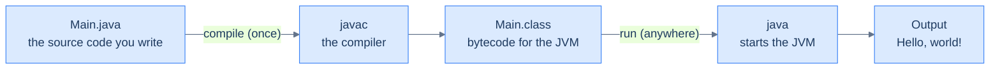

# What Java Is & Running Code — Your First Program

Java is a **compiled** language, and that one fact shapes everything you are about to do.

- You write **source code**: plain text, like the program below.
- A tool called the **compiler** reads the *whole* file and checks it for mistakes.
- If the file passes, the compiler translates it into **bytecode**. Bytecode is a set of instructions for an imaginary computer, the **Java Virtual Machine** (the **JVM**).
- The JVM is a real program on your machine. It reads the bytecode and carries it out.

So running Java is always two steps: **compile, then run**. The payoff is portability. Bytecode targets the *virtual* machine, not your laptop, so the same compiled program runs unchanged on Windows, macOS or Linux <abbr title="The Java Virtual Machine Specification, Java SE 21, §1.2">[4]</abbr>.

<div style="border-left:4px solid #195045;background:rgba(25,80,69,0.08);padding:0.6rem 1rem;border-radius:0 0.5rem 0.5rem 0;margin:1.25rem 0">

💡 **The core idea.**

- You write **source code**; a **compiler** translates the whole file into **bytecode**.
- The **JVM** runs that bytecode — so running Java is always **compile, then run**.
- Because bytecode targets a *virtual* machine, the same program runs unchanged anywhere.

</div>

This chapter gets you running real Java. It shows both halves of the loop, including what each half looks like when it says *no* — because Java says no in two very different ways.

You need nothing installed. Every block with a ▶ Run button compiles and runs in a sandboxed **Java 21** environment. Every `Output:` block below was produced by compiling and running its code.

**You'll be able to:** predict whether a broken program prints anything, from where its mistake is; compile and run a program from a terminal, naming the class and not the file; name the mistake in a `main` declaration from the JVM's launch message; predict the lines a mix of `print` and `println` produces; explain why a commented-out line never runs, and why one block comment cannot hold another.

<div style="border-left:4px solid #15448e;background:rgba(21,68,142,0.08);padding:0.6rem 1rem;border-radius:0 0.5rem 0.5rem 0;margin:1.25rem 0">

📘 **How to read the Intuition boxes.** Each one is built in three moves:

1. **The mechanism** — what the compiler and the JVM *do*.
2. **A concrete bite** — a specific, runnable failure (often a real compiler error), shown so the trap is visible.
3. **The earned rule** — the decision heuristic, now justified rather than asserted, plus its cost.

</div>

---

## Table of contents

1. [A first Java program](#1-a-first-java-program)
2. [Compile, then run: `javac`, bytecode, and the JVM](#2-compile-then-run-javac-bytecode-and-the-jvm)
3. [Reading `public static void main(String[] args)`](#3-reading-public-static-void-mainstring-args)
4. [`System.out.println` — how a program talks back](#4-systemoutprintln--how-a-program-talks-back)
5. [Comments — notes for humans](#5-comments--notes-for-humans)
6. [Mental-model summary](#6-mental-model-summary)
7. [Gotcha checklist](#7-gotcha-checklist)
8. [Check yourself](#-check-yourself)
9. [Sources](#-sources)

---

## 1. A first Java program

A **program** is a list of **instructions**, also called **statements**, carried out in order. In Java, every statement must live inside a **method**: a named block of statements. Every method lives inside a **class**: a named container.

That is more scaffolding than some languages ask for, and §3 explains every word of it. For now, here is the smallest complete Java program. Run it.

```java run
public class Main {
    public static void main(String[] args) {
        System.out.println("Hello, world!");
    }
}
```

**Output:**
```
Hello, world!
```

**Analysis.** The program is three nested parts:

- The outer `public class Main { ... }` is the **class**: a container named `Main`.
- Inside it, `public static void main(String[] args) { ... }` is the **method** named `main`. The JVM runs it first.
- Inside *that* sits one statement, `System.out.println("Hello, world!");`, which prints a line of text.

The text between the double quotes is shown literally; the quotes themselves are not printed. The `;` ends the statement, the way a period ends a sentence.

**Intuition.**
*Mechanism.* Running this is two phases, not one. First the **compiler** (`javac`) reads the entire file and translates it to bytecode. Only if that succeeds does the **JVM** start executing `main`, one statement at a time, top to bottom. The compiler's job is to check *before* anything runs.

*Concrete bite.* Because compiling is a gate, one missing `;` means the program never runs at all. There is no partial output, only a compiler complaint pointing at the spot. Click Run and see for yourself:

```java run
public class Main {
    public static void main(String[] args) {
        System.out.println("Hello, world!")
    }
}
```

**Compiler error:**
```
Main.java:3: error: ';' expected
        System.out.println("Hello, world!")
                                           ^
1 error
```

The compiler read the whole file and found that the statement on line 3 had no `;`. It refused to produce bytecode. Nothing ran, so `Hello, world!` appears nowhere.

*Non-example: a mistake the compiler cannot see.* Some mistakes pass the compiler and fail only while the program runs. Dividing a whole number by zero is one: the compiler accepts `10 / 0`, and the JVM refuses to compute it.

```java run
public class Main {
    public static void main(String[] args) {
        System.out.println("before");
        System.out.println(10 / 0);
        System.out.println("after");
    }
}
```

**Output** *(prints `before`, then a thrown exception):*
```
before
Exception in thread "main" java.lang.ArithmeticException: / by zero
```

This time `before` *did* print. The program compiled, so the JVM started running it, line by line. It stopped at the line it could not carry out, and `after` never printed.

- That is a **run-time** failure: the JVM refused while carrying the program out.
- The missing `;` was a **compile-time** failure: `javac` refused while checking the file.

<div style="border-left:4px solid #195045;background:rgba(25,80,69,0.08);padding:0.6rem 1rem;border-radius:0 0.5rem 0.5rem 0;margin:1.25rem 0">

💡 **Earned rule.** Java checks first and runs second. So a program that doesn't compile produces **no** output, not even the lines before the mistake. A run-time failure is different: every line before it has already run.

The cost is up-front strictness: you must satisfy the compiler before you see anything happen. The benefit compounds with every chapter. A whole category of mistakes is caught *before* your program touches real data — the compiler is a proof-checker you run for free.

</div>

---

## 2. Compile, then run: `javac`, bytecode, and the JVM

You met the two phases as error messages; now meet them as commands. When you install Java, you install the **JDK** (Java Development Kit), a toolbox. Two of its tools matter here: `javac`, the **compiler**, and `java`, the **launcher** that starts the JVM.



You type these commands in a **terminal**: a window where you type a command, press Enter, and read its text reply. macOS calls it Terminal; Windows has PowerShell. On a terminal the loop is explicit, two commands:

```
javac Main.java   # compile: reads Main.java, writes Main.class (bytecode)
java Main          # run: starts the JVM, which executes Main.class
```

`javac` turns your `Main.java` into a new file, `Main.class`, holding bytecode. `java Main` hands that bytecode to the JVM, which runs it. Note `java Main`, not `java Main.class`: you name the **class**, not the file <abbr title="The java command, JDK 21 documentation">[5]</abbr>. Name the file, and the JVM looks for a class called `Main.class`, which does not exist:

```
$ java Main.class
Error: Could not find or load main class Main.class
Caused by: java.lang.ClassNotFoundException: Main.class
```

The Run buttons here do the same two steps for you: they compile your code as `Main.java` with `javac`, then start it with `java`. Since Java 11 there is also a one-step shortcut for a single file. `java Main.java` compiles the file in memory and runs it, and leaves no `.class` file behind <abbr title="JEP 330: Launch Single-File Source-Code Programs (JDK 11)">[6]</abbr>.

```java run
public class Main {
    public static void main(String[] args) {
        System.out.println("compiled to bytecode,");
        System.out.println("then run by the JVM.");
    }
}
```

**Output:**
```
compiled to bytecode,
then run by the JVM.
```

**Analysis.** Behind the Run button, two things happened in order. `javac` checked both statements and translated them into bytecode. Then the JVM executed them top to bottom: first line, then second. On a terminal you would type `javac Main.java` and then `java Main` to get the same two lines.

**Intuition.**
*Mechanism.* `java` does not run your *source*; it runs the *bytecode* the compiler produced. The JVM knows nothing of the Java language, only of the class-file format <abbr title="The Java Virtual Machine Specification, Java SE 21, §1.2">[4]</abbr>. By the time the launcher loads a class, the `.java` text is irrelevant.

*Concrete bite.* Ask the JVM to run a class that was never compiled, and it has nothing to load:

```
java Ghost
```
```
Error: Could not find or load main class Ghost
Caused by: java.lang.ClassNotFoundException: Ghost
```

There is no `Ghost.class`, so the JVM stops before running a single instruction. This is a *run-time* failure — the JVM complaining — not a *compile-time* one.

<div style="border-left:4px solid #195045;background:rgba(25,80,69,0.08);padding:0.6rem 1rem;border-radius:0 0.5rem 0.5rem 0;margin:1.25rem 0">

💡 **Earned rule.** Compiling and running are separate steps with separate failures. `javac` rejects bad *source* (compile time); the JVM rejects missing or broken *bytecode* (run time).

The cost of two steps is the ceremony of compiling before running. The benefit is **portability**: `Main.class` is plain bytecode, so the same file runs on any machine with a JVM. That is why a program built on a developer's Mac runs unchanged on a Linux server.

</div>

**The file name is not free.** `javac` requires a `public` class to sit in a file with the same name plus `.java` <abbr title="The Java Language Specification, Java SE 21, §7.6">[2]</abbr>. So `public class Main` belongs in `Main.java`. Put `public class Hello` in a file named `Main.java` on your own machine, and `javac` refuses:

```
$ javac Main.java
Main.java:1: error: class Hello is public, should be declared in a file named Hello.java
public class Hello {
       ^
1 error
```

Here the file was `Main.java` and the class was `Hello`. Rename one to match the other. (The Run buttons hide this rule: they rename the first class to `Main` before compiling.)

For quick experiments there is a third tool, **jshell**. It is a Java REPL (Read–Eval–Print Loop): it evaluates one expression at a time, with no class and no `main`.

```
jshell> 1 + 1
$1 ==> 2
jshell> "Java" + "!"
$2 ==> "Java!"
```

Type an expression, press Enter, and jshell shows the result. The names `$1` and `$2` are ones it invents for the results. It is the fastest way to answer "what does this do?" Real programs are compiled classes, though, and that is what the rest of this book writes.

---

## 3. Reading `public static void main(String[] args)`

That line is the one piece of ceremony every Java program repeats. It is worth understanding rather than copying on faith. Each word tells the JVM *how* to start, and none of it is decoration. Here is a sketch of each part; later chapters return to most of them:

- `public` — an **access level**: this method can be called from outside the class. The JVM starts your program from *outside* it, so the entry point must be reachable. *([Access levels](/synapse/programming-languages/java/classes-and-objects/encapsulation-and-access-modifiers) come later.)*
- `static` — this method belongs to the **class itself**, not to an **object** built from it. The JVM calls `main` *before* your program has created any objects, so `main` cannot require one. *([Objects](/synapse/programming-languages/java/classes-and-objects/classes-and-objects) come later.)*
- `void` — the **return type**: `main` hands no value back when it finishes. *([Methods and return types](/synapse/programming-languages/java/control-flow/methods).)*
- `main` — the **name** the JVM looks for, spelled exactly `main`. Java is **case-sensitive**, so `Main` (the class) and `main` (the method) are different names. The class is the container; the method is the starting point.
- `String[] args` — a **parameter**: a slot for **command-line arguments**, the extra words typed after `java Main`. They arrive as a list of text values. You rarely need them at first, but the JVM always passes them. *([Arrays](/synapse/programming-languages/java/control-flow/arrays).)*

Read as a whole, the line describes a public, class-level method named `main`. It returns nothing and takes a list of text arguments. The JVM is built to find exactly that and call it <abbr title="The Java Language Specification, Java SE 21, §12.1.4">[1]</abbr>. Two details are yours to choose: the parameter's name (`args` is only a convention), and `String... args` in place of `String[] args`.

```java run
public class Main {
    public static void main(String[] args) {
        System.out.println("The JVM called main.");
    }
}
```

**Output:**
```
The JVM called main.
```

**Analysis.** The JVM loaded `Main`, found a method with the shape `public static void main(String[] args)`, and called it. The modifiers, the return type, the name and the parameter type all had to match for the call to happen.

**Intuition.**
*Mechanism.* The JVM does not run "the class". It looks for a method named `main` with this declaration and calls *that*. The name and shape are a contract. Miss any part, and there is nothing for the JVM to call.

*Concrete bite.* Rename `main` to `greet`. The class still **compiles** — it is a perfectly legal class — but at run time the JVM cannot find its entry point:

```java run
public class Main {
    public static void greet(String[] args) {
        System.out.println("never printed");
    }
}
```

**Output** *(a launch error — the JVM finds no `main`, so nothing runs):*
```
Error: Main method not found in class Main, please define the main method as:
   public static void main(String[] args)
or a JavaFX application class must extend javafx.application.Application
```

It compiled, because the method is valid Java. It never ran `greet`, because the JVM only ever calls `main`. The error even reminds you of the shape it wants.

Each wrong part of the declaration gets its own launch message. All four versions below compile; Java 21's launcher rejects each one:

| You wrote | The JVM says |
|---|---|
| `public static void greet(String[] args)` | `Main method not found in class Main` |
| `static void main(String[] args)` (no `public`) | `Main method not found in class Main` |
| `public void main(String[] args)` (no `static`) | `Main method is not static in class Main` |
| `public static int main(String[] args)` | `Main method must return a value of type void in class Main` |

<div style="border-left:4px solid #195045;background:rgba(25,80,69,0.08);padding:0.6rem 1rem;border-radius:0 0.5rem 0.5rem 0;margin:1.25rem 0">

💡 **Earned rule.** The entry point must be `public static void main(String[] args)`, and the JVM checks every part. The cost: a mistake in the *declaration* gives you no compile error, only a launch error, because the method you wrote is legal. It is not the one the JVM calls. When a program compiles but won't start, read the launch message: it names the part that is wrong.

</div>

**A note on newer Java.** JDK 25 lets you write a simpler entry point: `void main()`, with no `public`, no `static`, no `String[] args`, and no surrounding class <abbr title="JEP 512: Compact Source Files and Instance Main Methods (JDK 25; first previewed in JDK 21 as JEP 445)">[7]</abbr>.

This book teaches **JDK 21**. JDK 21 is a long-term-support release <abbr title="OpenJDK, JDK 21 project page">[9]</abbr>, and the version the Run buttons use; JDK 25, released in September 2025, is the newer one <abbr title="OpenJDK, JDK 25 project page">[8]</abbr>. The classic `public static void main(String[] args)` is what nearly all existing code uses, and it runs on every version. When you meet the short form later, you will know what it leaves out.

---

## 4. `System.out.println` — how a program talks back

A program that cannot show anything is useless, and `System.out.println` is the statement that prints. Read it in pieces:

- `System.out` is the program's standard text **output**: the console.
- `println` is an action you ask of it: "print this, then move to the next line."
- The value you want printed goes inside the parentheses.

```java run
public class Main {
    public static void main(String[] args) {
        System.out.println("first line");
        System.out.println("second line");
    }
}
```

**Output:**
```
first line
second line
```

**Analysis.** Two `println` calls produced two lines. Each printed its text and then ended the line, so the second call started fresh below the first. We never wrote anything about a line break. The "ln" in `println` *is* that automatic newline.

**Intuition.**
*Mechanism.* There are two related actions. `println` prints its argument **and** ends the line. `print` (no "ln") prints its argument and **stops there**, leaving whatever comes next on the same line.

*Concrete bite.* Mix them and the difference is visible — `print` keeps the cursor on the line, `println` breaks it:

```java run
public class Main {
    public static void main(String[] args) {
        System.out.print("a");
        System.out.print("b");
        System.out.println("c");
        System.out.println("d");
    }
}
```

**Output:**
```
abc
d
```

The `a`, `b` and `c` all landed on one line (`abc`), because only the `println` at `c` ended it. Then `d` printed on the next line. Swap an earlier `print` for a `println`, and the line splits sooner.

<div style="border-left:4px solid #195045;background:rgba(25,80,69,0.08);padding:0.6rem 1rem;border-radius:0 0.5rem 0.5rem 0;margin:1.25rem 0">

💡 **Earned rule.** Use `println` when you want each piece on its own line, and `print` when you build a line in parts. Confusing them is cosmetic but common. A row of `print` calls runs your output together (`abc`), and a stray `println` breaks a line you meant to keep whole. When in doubt, `println` is the safe default: most output is line-at-a-time.

</div>

---

## 5. Comments — notes for humans

Not every line in a file is for the computer. A **comment** is a note for the people reading the code, and the compiler skips it entirely. Java has two forms <abbr title="The Java Language Specification, Java SE 21, §3.7">[3]</abbr>:

- `//` ignores the rest of *that line*.
- `/* ... */` ignores everything between the markers, across as many lines as you like.

```java run
public class Main {
    public static void main(String[] args) {
        // This whole line is a comment — the compiler ignores it
        System.out.println("code runs");  // an inline comment, ignored too
        /* a block comment
           spanning two lines, also ignored */
        // System.out.println("this line is commented out, so it never runs");
    }
}
```

**Output:**
```
code runs
```

**Analysis.** Four of the lines inside `main` are comments, and only one statement printed anything:

- The `//` line did nothing.
- The inline `// ...` after the working statement was ignored, while the statement itself ran.
- The `/* ... */` block vanished across both its lines.
- The last line is a real `println` with `//` in front, so it never ran.

Putting `//` before a line to disable it is called **commenting out**.

**Intuition.**
*Mechanism.* While reading your source, the compiler discards `//` to the end of the line, and everything between `/*` and `*/`. It does this before anything else. Commented text never becomes bytecode, so it cannot run.

*Concrete bite.* The missing line is the proof: the output is only `code runs`. The commented-out `println` was legal code, but it sat behind `//`. The compiler never saw it as a statement, so it produced nothing.

*Non-example: a block comment inside a block comment.* Comments do not nest <abbr title="The Java Language Specification, Java SE 21, §3.7">[3]</abbr>. A `/* ... */` comment ends at the **first** `*/`, wherever that is. Wrap a line that already carries a block comment, and the outer comment ends too early:

```java run
public class Main {
    public static void main(String[] args) {
        System.out.println("start");
        /* switch off the next line:
        System.out.println("hidden"); /* old note */
        */
    }
}
```

**Compiler error:**
```
Main.java:6: error: illegal start of expression
        */
        ^
```

The comment that opened on line 4 closed at `old note */` on line 5. The lone `*/` on line 6 was left over as code, and `*/` is not Java. To switch off lines that hold block comments, put `//` in front of each line.

<div style="border-left:4px solid #195045;background:rgba(25,80,69,0.08);padding:0.6rem 1rem;border-radius:0 0.5rem 0.5rem 0;margin:1.25rem 0">

💡 **Earned rule.** Comment to explain **why**, not to restate **what** the code plainly does. "Comment out" a line with `//` to disable it while you experiment.

The cost is that comments are never checked against the code. The compiler ignores them, so a comment gone stale states a falsehood with total confidence. Keep them honest, or delete them.

</div>

---

## 6. Mental-model summary

| Principle | Consequence |
|---|---|
| Java runs in two phases: compile (`javac`), then run (the JVM) | A program that doesn't compile produces no output at all |
| A run-time failure stops the program where it happens | Every line before it has already run and printed |
| `javac` turns source into portable **bytecode** (`.class`); the JVM runs the bytecode | The same compiled class runs on any machine with a JVM — "write once, run anywhere" |
| `java` takes a **class** name; a `public` class lives in a file of the same name | `java Main`, not `java Main.class`; `public class Main` goes in `Main.java` |
| Every statement lives in a method, inside a class; statements run top to bottom | The `class`/`main` wrapper is required, not decoration |
| The JVM calls `public static void main(String[] args)` | A wrong declaration compiles but won't start, and the launch message names the wrong part |
| `println` ends the line; `print` does not | A row of `print`s runs together; `println` is the line-at-a-time default |
| `//` and `/* */` are ignored by the compiler; block comments do not nest | Comments are for humans; "commenting out" disables code; stale comments can lie |

## 7. Gotcha checklist

<div style="border-left:4px solid #da5233;background:rgba(218,82,51,0.08);padding:0.6rem 1rem;border-radius:0 0.5rem 0.5rem 0;margin:1.25rem 0">

| Symptom | Likely cause | Fix |
|---|---|---|
| `error: ';' expected`, and nothing printed | a statement is missing its `;` | add it where the caret `^` points |
| Some lines printed, then `Exception in thread "main"` | a run-time failure: the program compiled, then stopped at one line | read the exception's name, then the `at Main.main(Main.java:N)` line under it: line N failed |
| `Could not find or load main class X` | there is no `X.class`: you didn't compile, mistyped the name, or typed `java X.class` | run `javac X.java`, then `java X` — the class name, not the file |
| `class X is public, should be declared in a file named X.java` | the file name and the `public` class name differ | rename the file or the class so they match |
| `Main method not found in class Main` | the method isn't named `main`, isn't `public`, or its parameter isn't `String[]` | declare it as `public static void main(String[] args)` |
| `Main method is not static in class Main` | `static` is missing | add `static` |
| `Main method must return a value of type void` | the return type isn't `void` | make it `void` |
| Output runs together on one line | `print` where you meant `println` | use `println`; the "ln" is the line break |
| A line you expected to run did nothing | it is behind `//` or inside `/* */` | remove the comment markers |
| `illegal start of expression` at a lone `*/` | a block comment inside a block comment | disable the lines with `//` instead |
| Edited the code, but the output didn't change (on a terminal) | you re-ran `java` without re-running `javac`, so the old `.class` ran | recompile after every edit (the Run button recompiles for you) |

</div>

---

## ✅ Check yourself

One check per objective. Answer before you open anything.

```quiz
{"prompt": "A program's first statement prints \"one\". Its second statement is missing its semicolon. What does running it print?", "options": ["one", "one, then an error", "Nothing: javac rejects the file, so no statement runs"], "answer": "Nothing: javac rejects the file, so no statement runs"}
```

```quiz
{"prompt": "You compiled Main.java into Main.class. Which command runs it?", "options": ["java Main.class", "java Main", "javac Main"], "answer": "java Main"}
```

```quiz
{"prompt": "A program compiles, but the launcher says: Main method is not static in class Main. What is wrong with the main declaration?", "options": ["The method is misspelled", "The keyword static is missing", "The return type is not void"], "answer": "The keyword static is missing"}
```

```quiz
{"prompt": "What does this print?  System.out.print(\"x\"); System.out.println(\"y\"); System.out.print(\"z\");", "options": ["x, y and z on three lines", "xyz on one line", "xy on one line, then z on the next"], "answer": "xy on one line, then z on the next"}
```

<details>
<summary>What does <code>System.out.println("// not a comment");</code> print, and why? Then: why does wrapping <code>/* old note */</code> in another <code>/* ... */</code> break the build?</summary>

It prints `// not a comment`. Inside the double quotes, `//` is two characters of text; comments do not occur inside string literals <abbr title="The Java Language Specification, Java SE 21, §3.7">[3]</abbr>.

A block comment ends at the first `*/`. The inner `old note */` closes the outer comment, and the outer `*/` is left over as code, which javac rejects.

</details>

---

## 📚 Sources

1. *The Java Language Specification, Java SE 21*, §12.1.4 "Invoke `Test.main`" — <https://docs.oracle.com/javase/specs/jls/se21/html/jls-12.html#jls-12.1.4>
2. *The Java Language Specification, Java SE 21*, §7.6 "Top Level Class and Interface Declarations" — <https://docs.oracle.com/javase/specs/jls/se21/html/jls-7.html#jls-7.6>
3. *The Java Language Specification, Java SE 21*, §3.7 "Comments" — <https://docs.oracle.com/javase/specs/jls/se21/html/jls-3.html#jls-3.7>
4. *The Java Virtual Machine Specification, Java SE 21*, §1.2 "The Java Virtual Machine" — <https://docs.oracle.com/javase/specs/jvms/se21/html/jvms-1.html#jvms-1.2>
5. The `java` command, JDK 21 documentation — <https://docs.oracle.com/en/java/javase/21/docs/specs/man/java.html>
6. JEP 330: Launch Single-File Source-Code Programs (JDK 11) — <https://openjdk.org/jeps/330>
7. JEP 512: Compact Source Files and Instance Main Methods (JDK 25) — <https://openjdk.org/jeps/512>
8. OpenJDK, JDK 25 (general availability 16 September 2025; "a long-term support (LTS) release from most vendors") — <https://openjdk.org/projects/jdk/25/>
9. OpenJDK, JDK 21 (general availability 19 September 2023; "a long-term support (LTS) release from most vendors") — <https://openjdk.org/projects/jdk/21/>

---

<div style="border-left:4px solid #6d28d9;background:rgba(109,40,217,0.08);padding:0.6rem 1rem;border-radius:0 0.5rem 0.5rem 0;margin:1.25rem 0">

🧪 **Predict, then check.** Look again at the §3 program whose method is named `greet` instead of `main`. Before re-running it, answer two questions: does it **compile**? And does it **run**? Then fix it by renaming `greet` to `main`, and predict the output before clicking Run. 

If you can explain why the broken version compiles but won't start, you have the most important idea in this chapter. **Java checks your program at compile time and again at run time, and the two stages fail in different ways.**

</div>

## Your Turn

Before you move on, check your understanding with the coach — explain the idea, apply it, weigh the trade-offs, then defend your reasoning.

<div class="concept-coach"></div>
