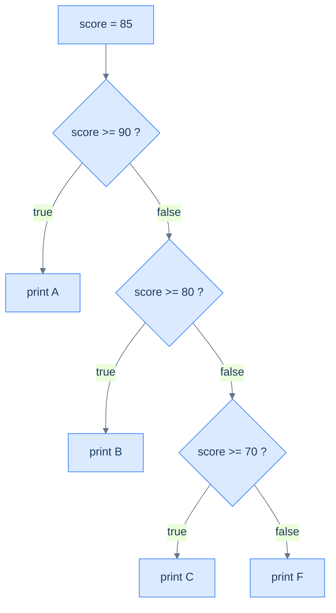

# Conditionals — Choosing a Path

A program that always does the same thing is a calculator with one button. **Conditionals** let it choose: run this code when a condition holds, that code otherwise. Every choice rests on a `boolean`, the [yes/no type from the last chapter](/synapse/programming-languages/java/control-flow/booleans-and-logic). Java offers four shapes for branching:

- `if`/`else` for one decision;
- `else if` chains for many;
- `switch` for selecting among constant values;
- the ternary `?:` for a choice that *produces a value*.

The newest shape, the `switch` **expression**, fixes the oldest `switch` trap by design.

<div style="border-left:4px solid #195045;background:rgba(25,80,69,0.08);padding:0.6rem 1rem;border-radius:0 0.5rem 0.5rem 0;margin:1.25rem 0">

💡 **The core idea.**

- **Conditionals** let a program choose which code to run.
- Every choice rests on a `boolean`.
- Java offers four shapes: `if`/`else`, `else if` chains, `switch`, and the ternary `?:`.

</div>

Every output below was produced by compiling and running the code.

**You'll be able to:** predict which branch of an `if`/`else if` chain runs, and order a chain so the narrow test comes first; name the statement that a braceless `if`, a stray semicolon or a dangling `else` controls, and fix it with braces; predict what a `switch` statement prints with and without `break`, and name the types a `switch` accepts; write a `switch` expression with several labels per case and a `yield`, and explain why it must cover every value; pick `?:` to choose a value, and predict its type when the two branches differ.

<div style="border-left:4px solid #15448e;background:rgba(21,68,142,0.08);padding:0.6rem 1rem;border-radius:0 0.5rem 0.5rem 0;margin:1.25rem 0">

📘 **How to read the Intuition boxes.** Each one is built in three moves:

1. **The mechanism** — what the compiler and the JVM *do*.
2. **A concrete bite** — a specific, runnable failure (often a real compiler error), shown so the trap is visible.
3. **The earned rule** — the decision heuristic, now justified rather than asserted, plus its cost.

</div>

---

## Table of contents

1. [`if` and `else`](#1-if-and-else)
2. [`else if` chains](#2-else-if-chains)
3. [The `switch` statement](#3-the-switch-statement)
4. [`switch` expressions](#4-switch-expressions)
5. [The ternary operator `?:`](#5-the-ternary-operator-)
6. [Mental-model summary](#6-mental-model-summary)
7. [Gotcha checklist](#7-gotcha-checklist)
8. [Check yourself](#-check-yourself)
9. [Sources](#-sources)

---

## 1. `if` and `else`

An `if` runs its block only when a `boolean` condition is `true`. An optional `else` runs when it is `false`.

```java run
public class Main {
    public static void main(String[] args) {
        int temp = 5;
        if (temp < 10) {
            System.out.println("cold");
        } else {
            System.out.println("warm");
        }
    }
}
```

**Output:**
```
cold
```

**Analysis.** `temp < 10` is `true`, so the `if` block ran and the `else` block was skipped. Exactly one of the two blocks runs, never both.

The condition must be a `boolean` <abbr title="The Java Language Specification, Java SE 21, §14.9">[1]</abbr>. [Booleans & Logic](/synapse/programming-languages/java/control-flow/booleans-and-logic) promised that a number is refused, and here is the refusal:

```java run
public class Main {
    public static void main(String[] args) {
        int count = 3;
        if (count) {
            System.out.println("some");
        }
    }
}
```

**Compiler error:**
```
Main.java:4: error: incompatible types: int cannot be converted to boolean
        if (count) {
            ^
1 error
```

Write the question out: `if (count != 0)`.

**Intuition.**
*Mechanism.* `if (cond) { … }` guards a **block**: everything inside the braces. Without braces, `if (cond) stmt;` guards only the *single statement* that immediately follows it. The next statement is not part of the `if` at all, no matter how it is indented.

*Concrete bite.* That single-statement rule, plus misleading indentation, is a classic trap:

```java run
public class Main {
    public static void main(String[] args) {
        boolean cold = false;
        if (cold) System.out.println("wear a coat");
            System.out.println("leave the house");
    }
}
```

**Output:**
```
leave the house
```

`cold` is `false`, so `wear a coat` is correctly skipped, but `leave the house` printed anyway. The indentation suggests both lines are guarded; in fact only the first is. The braceless `if` controls exactly one statement, and the second runs unconditionally.

*Non-example: a stray semicolon.* A `;` on its own is a statement too: the **empty statement**, which does nothing <abbr title="The Java Language Specification, Java SE 21, §14.6">[3]</abbr>. Put one after the condition, and the `if` guards that nothing:

```java run
public class Main {
    public static void main(String[] args) {
        int temp = 25;
        if (temp < 10); {
            System.out.println("cold");
        }
    }
}
```

**Output:**
```
cold
```

`25 < 10` is `false`, and `cold` printed anyway. The `if` ended at the `;`. The braces after it form an ordinary block that always runs.

*The dangling `else`.* With two braceless `if`s, an `else` belongs to the **nearest** `if`, whatever the indentation says <abbr title="The Java Language Specification, Java SE 21, §14.5">[2]</abbr>:

```java run
public class Main {
    public static void main(String[] args) {
        boolean member = false;
        boolean sale = true;
        if (member)
            if (sale) System.out.println("member sale price");
        else
            System.out.println("full price");
        System.out.println("done");
    }
}
```

**Output:**
```
done
```

The indentation says a non-member pays `full price`. But the `else` belongs to `if (sale)`, and that inner `if` sits inside `if (member)`. `member` is `false`, so neither line ran. Braces put the `else` where the indentation meant it:

```java run
public class Main {
    public static void main(String[] args) {
        boolean member = false;
        boolean sale = true;
        if (member) {
            if (sale) System.out.println("member sale price");
        } else {
            System.out.println("full price");
        }
    }
}
```

**Output:**
```
full price
```

<div style="border-left:4px solid #195045;background:rgba(25,80,69,0.08);padding:0.6rem 1rem;border-radius:0 0.5rem 0.5rem 0;margin:1.25rem 0">

💡 **Earned rule.** Always use braces, even for a one-line body: `if (cond) { … }`. The cost is two extra characters.

The benefit: "what does this `if` control?" has one answer, the block. Without braces, the answer depends on where the semicolons fall and which `if` is nearest. That is how a guarded line and an always-run line end up looking identical.

</div>

---

## 2. `else if` chains

To choose among more than two paths, chain `else if`. Java tests each condition in order and runs the **first** block whose condition is `true`, skipping the rest.

`else if` is not a keyword of its own. It is an `else` whose one statement is another `if` <abbr title="The Java Language Specification, Java SE 21, §14.9">[1]</abbr>. A chain is `if`s nested inside `else`s, written flat.

```java run
public class Main {
    public static void main(String[] args) {
        int score = 85;
        if (score >= 90) System.out.println("A");
        else if (score >= 80) System.out.println("B");
        else if (score >= 70) System.out.println("C");
        else System.out.println("F");
    }
}
```

**Output:**
```
B
```



**Analysis.** `score` is `85`. The chain checks `>= 90` (false), then `>= 80` (true), so it prints `B`. It skips the remaining tests, including `>= 70`, which would also have been true. First match wins; the rest never run.

This chain leaves out the braces so each branch fits on one line. Every branch is a single statement, so nothing can dangle. Add a second statement to any branch, and the braces become necessary.

**Intuition.**
*Mechanism.* The chain is evaluated top to bottom, and the first true condition's block executes. Once one matches, the entire chain is done. So a later condition is reached only when every earlier one was false: order encodes priority.

*Concrete bite.* Put a broad condition before a narrow one and the narrow one becomes unreachable:

```java run
public class Main {
    public static void main(String[] args) {
        int score = 95;
        if (score >= 70) System.out.println("C");
        else if (score >= 90) System.out.println("A");
        else System.out.println("F");
    }
}
```

**Output:**
```
C
```

`95` deserves an `A`, but `score >= 70` is checked first and matches. So it prints `C` and never reaches `>= 90`. The compiler sees nothing wrong: the logic is legal, only ordered backwards.

*Non-example: a chain with no final `else`.* A chain often sets a variable. Without an `else`, some values set nothing, and the compiler sees that path <abbr title="The Java Language Specification, Java SE 21, Chapter 16">[10]</abbr>:

```java run
public class Main {
    public static void main(String[] args) {
        int score = 85;
        String grade;
        if (score >= 90) {
            grade = "A";
        } else if (score >= 80) {
            grade = "B";
        }
        System.out.println(grade);
    }
}
```

**Compiler error:**
```
Main.java:10: error: variable grade might not have been initialized
        System.out.println(grade);
                           ^
1 error
```

`score` is `85` here, so `grade` would be `"B"`. The compiler does not run the program, though. It checks every path, and a score below `80` passes through both tests with `grade` unset.

This is the rule from [Variables & Primitive Types](/synapse/programming-languages/java/first-steps/variables-and-primitive-types): a variable must have a value before it is read. A final `else { grade = "F"; }` closes the gap.

<div style="border-left:4px solid #195045;background:rgba(25,80,69,0.08);padding:0.6rem 1rem;border-radius:0 0.5rem 0.5rem 0;margin:1.25rem 0">

💡 **Earned rule.** In an `else if` chain, order conditions from most specific (narrowest) to least, because the first match wins. End a chain that sets a variable with an `else`.

The cost of a misordered chain is a *silent* misclassification, not an error. When ranges overlap, read the chain as "first true wins", and put the tightest test on top.

</div>

---

## 3. The `switch` statement

When you are choosing based on one value against several constants, a `switch` is clearer than a long chain.

- Each `case` labels a constant.
- `break` ends the chosen branch.
- `default` catches everything else.

```java run
public class Main {
    public static void main(String[] args) {
        int day = 3;
        switch (day) {
            case 1: System.out.println("Mon"); break;
            case 2: System.out.println("Tue"); break;
            case 3: System.out.println("Wed"); break;
            default: System.out.println("other");
        }
    }
}
```

**Output:**
```
Wed
```

**Analysis.** `day` is `3`, so execution jumped to `case 3`, printed `Wed`, and `break` ended the switch. The other cases were skipped entirely.

**Intuition.**
*Mechanism.* A `switch` statement *jumps* to the matching `case` label and then runs **straight down** until it hits a `break` (or the end) <abbr title="The Java Language Specification, Java SE 21, §14.11.3">[5]</abbr>. The `break` is not decoration. Without it, execution "falls through" into the next case's code, ignoring that case's label.

*Concrete bite.* Drop the `break`s and one match runs several cases:

```java run
public class Main {
    public static void main(String[] args) {
        int day = 1;
        switch (day) {
            case 1: System.out.println("Mon");
            case 2: System.out.println("Tue");
            case 3: System.out.println("Wed"); break;
            default: System.out.println("other");
        }
    }
}
```

**Output:**
```
Mon
Tue
Wed
```

`day` is `1`, so it entered `case 1` and printed `Mon`. Then, with no `break`, it fell through into `case 2` (`Tue`) and `case 3` (`Wed`), stopping only at the `break`. One value, three lines printed.

**What a `switch` can test.** The value in `switch ( … )` is the **selector**. It can be a `char`, `byte`, `short` or `int`, or an object such as a `String` <abbr title="The Java Language Specification, Java SE 21, §14.11">[4]</abbr>. A `String` case matches with `.equals`, so letter case counts:

```java run
public class Main {
    public static void main(String[] args) {
        String command = "stop";
        switch (command) {
            case "go": System.out.println("moving"); break;
            case "stop": System.out.println("halted"); break;
            default: System.out.println("unknown: " + command);
        }
        command = "Stop";
        switch (command) {
            case "go": System.out.println("moving"); break;
            case "stop": System.out.println("halted"); break;
            default: System.out.println("unknown: " + command);
        }
    }
}
```

**Output:**
```
halted
unknown: Stop
```

A `long`, `float`, `double` or `boolean` selector is refused:

```java run
public class Main {
    public static void main(String[] args) {
        long id = 3L;
        switch (id) {
            case 1: System.out.println("one"); break;
            default: System.out.println("other");
        }
    }
}
```

**Compiler error:**
```
Main.java:4: error: selector type long is not allowed
        switch (id) {
               ^
1 error
```

Each `case` label must also be a **constant**: a literal, or a `final` variable set from one <abbr title="The Java Language Specification, Java SE 21, §14.11">[4]</abbr>. An ordinary variable after `case` gives `constant expression required`.

<div style="border-left:4px solid #195045;background:rgba(25,80,69,0.08);padding:0.6rem 1rem;border-radius:0 0.5rem 0.5rem 0;margin:1.25rem 0">

💡 **Earned rule.** End every `case` of a `switch` *statement* with `break` (or `return`) unless you deliberately want fall-through.

The cost of the colon-and-`break` form is exactly this footgun. A forgotten `break` is silent and runs too much code. The arrow form in the next section removes it.

</div>

---

## 4. `switch` expressions

Since JDK 14, a `switch` can be an **expression** that produces a value, using `case … ->` arrows <abbr title="JEP 361: Switch Expressions (JDK 14)">[8]</abbr>. There is no fall-through, and you can assign the whole thing to a variable.

```java run
public class Main {
    public static void main(String[] args) {
        int day = 3;
        String name = switch (day) {
            case 1 -> "Mon";
            case 2 -> "Tue";
            case 3 -> "Wed";
            default -> "other";
        };
        System.out.println(name);
    }
}
```

**Output:**
```
Wed
```

**Analysis.** The `switch (day) { … }` evaluated to `"Wed"`, which was assigned to `name`. Each arrow case yields a value and *only* that case runs: no `break` needed, no fall-through possible. The trailing `;` ends the assignment statement.

One case can list several values, separated by commas. And the arrow form works in a plain `switch` statement too, one that produces no value:

```java run
public class Main {
    public static void main(String[] args) {
        int day = 6;
        String kind = switch (day) {
            case 1, 2, 3, 4, 5 -> "weekday";
            case 6, 7 -> "weekend";
            default -> "no such day";
        };
        System.out.println(kind);
        switch (day) {
            case 6, 7 -> System.out.println("sleep in");
            default -> System.out.println("alarm at 7");
        }
    }
}
```

**Output:**
```
weekend
sleep in
```

When a case needs more than one expression, give it a block in braces. The block hands its value back with **`yield`** <abbr title="The Java Language Specification, Java SE 21, §14.21">[7]</abbr>:

```java run
public class Main {
    public static void main(String[] args) {
        int day = 6;
        String plan = switch (day) {
            case 6, 7 -> {
                String base = "rest";
                yield base + " (weekend)";
            }
            default -> "work";
        };
        System.out.println(plan);
    }
}
```

**Output:**
```
rest (weekend)
```

Forget the `yield`, and the block ends with no value to hand back:

```java run
public class Main {
    public static void main(String[] args) {
        int day = 6;
        String plan = switch (day) {
            case 6, 7 -> {
                String base = "rest";
            }
            default -> "work";
        };
        System.out.println(plan);
    }
}
```

**Compiler error:**
```
Main.java:7: error: switch rule completes without providing a value
            }
            ^
  (switch rules in switch expressions must either provide a value or throw)
1 error
```

**Intuition.**
*Mechanism.* An arrow `case X -> value` runs only its right-hand side and produces a value for the whole `switch`. Because the result is *used* (assigned, returned, printed), the compiler insists the `switch` is **exhaustive**: every possible input must be covered, or it will not compile <abbr title="The Java Language Specification, Java SE 21, §15.28.1">[6]</abbr>.

*Concrete bite.* Leave a gap with no `default` and the compiler refuses:

```java run
public class Main {
    public static void main(String[] args) {
        int day = 3;
        String name = switch (day) {
            case 1 -> "Mon";
            case 2 -> "Tue";
        };
        System.out.println(name);
    }
}
```

**Compiler error:**
```
Main.java:4: error: the switch expression does not cover all possible input values
        String name = switch (day) {
                      ^
1 error
```

An `int` can be more than `1` or `2`, and a `switch` *expression* must always produce a value. So the missing cases are a compile error, not a run-time surprise. Add a `default ->` and it compiles.

<div style="border-left:4px solid #195045;background:rgba(25,80,69,0.08);padding:0.6rem 1rem;border-radius:0 0.5rem 0.5rem 0;margin:1.25rem 0">

💡 **Earned rule.** Prefer arrow `switch` expressions when you are computing a value from one of several cases. They cannot fall through, and exhaustiveness is checked at compile time.

The cost is that you must handle every case (or add a `default`). That is the point: the compiler turns "I forgot a branch" from a run-time bug into a build error. Java 21 extends this to `sealed` types and pattern matching <abbr title="JEP 441: Pattern Matching for switch (JDK 21)">[11]</abbr>, in [Sealed Classes & Pattern Matching](/synapse/programming-languages/java/robust-oop/sealed-classes-and-pattern-matching).

</div>

---

## 5. The ternary operator `?:`

For the smallest choice, picking one of two *values* based on a condition, use the ternary operator `cond ? a : b`. It is a conditional that is itself an expression: it evaluates to `a` when `cond` is true, else `b` <abbr title="The Java Language Specification, Java SE 21, §15.25">[9]</abbr>.

```java run
public class Main {
    public static void main(String[] args) {
        int age = 20;
        String status = age >= 18 ? "adult" : "minor";
        System.out.println(status);
        int a = 7, b = 3;
        System.out.println(a > b ? a : b);
    }
}
```

**Output:**
```
adult
7
```

**Analysis.** `age >= 18` is true, so the ternary produced `"adult"`. In the second, `a > b` is true, so it produced `a` (`7`): a one-line "max". The ternary *yields a value*, so it can sit on the right of `=` or inside a `println`.

When the two values are different numeric types, the result takes the wider type, as in [arithmetic](/synapse/programming-languages/java/first-steps/numbers-and-arithmetic) <abbr title="The Java Language Specification, Java SE 21, §15.25.2">[9]</abbr>. Even the branch that was chosen changes type:

```java run
public class Main {
    public static void main(String[] args) {
        boolean whole = true;
        System.out.println(whole ? 1 : 2.5);
    }
}
```

**Output:**
```
1.0
```

The condition chose `1`, and `1` became `1.0`, because the whole expression has one type, `double`.

**Intuition.**
*Mechanism.* `?:` is an **expression**: it has a value. `if` is a **statement**: it does not. That is why a ternary can be assigned or printed directly, and an `if` cannot.

*Concrete bite.* Try to use `if` where a value is required and it fails to compile, because a statement has no value to assign:

```java run
public class Main {
    public static void main(String[] args) {
        boolean cond = true;
        String s = if (cond) "yes" else "no";
        System.out.println(s);
    }
}
```

**Compiler error** *(first of several as the parser recovers):*
```
Main.java:4: error: illegal start of expression
        String s = if (cond) "yes" else "no";
                   ^
```

`if` cannot start an expression, so `String s = if …` is rejected. The ternary `String s = cond ? "yes" : "no";` is the expression form that works.

*Non-example: a ternary inside a `+` chain.* `?:` binds looser than `+` and every comparison. Without parentheses, the text joins the number first:

```java run
public class Main {
    public static void main(String[] args) {
        int age = 20;
        System.out.println("status: " + age >= 18 ? "adult" : "minor");
    }
}
```

**Compiler error:**
```
Main.java:4: error: bad operand types for binary operator '>='
        System.out.println("status: " + age >= 18 ? "adult" : "minor");
                                            ^
  first type:  String
  second type: int
1 error
```

`"status: " + age` became the text `"status: 20"`, and `>=` cannot compare text with `18`. Wrap the ternary: `"status: " + (age >= 18 ? "adult" : "minor")` prints `status: adult`.

<div style="border-left:4px solid #195045;background:rgba(25,80,69,0.08);padding:0.6rem 1rem;border-radius:0 0.5rem 0.5rem 0;margin:1.25rem 0">

💡 **Earned rule.** Reach for `?:` to choose between two *values* in one expression (`max = a > b ? a : b`), and `if` to choose between two *actions*. Put a ternary in parentheses whenever it sits inside a longer expression.

The cost of `?:` is readability. Nested ternaries (`a ? b : c ? d : e`) become unreadable fast. Keep each to a single, simple choice, and use `if`/`else` or a `switch` expression for anything branchier.

</div>

---

## 6. Mental-model summary

| Principle | Consequence |
|---|---|
| `if` guards a block; braceless `if` guards one statement | Always use braces, or an "indented" line runs unconditionally |
| `;` is a statement; `else` belongs to the nearest `if` | `if (c);` guards nothing; braces decide which `if` owns an `else` |
| An `else if` chain runs the first true branch, then stops | Order conditions narrowest-first; end with `else` when the chain sets a variable |
| A `switch` *statement* falls through without `break` | A forgotten `break` runs into the next case — end each with `break` |
| A `switch` tests `char`, `byte`, `short`, `int` or an object such as `String` | `long`, `double` and `boolean` selectors do not compile; `case` labels are constants |
| A `switch` *expression* (`->`) yields a value, no fall-through | It must be exhaustive; a block case hands its value back with `yield` |
| `?:` is an expression (has a value); `if` is a statement | Use `?:` to choose a value; its type is the wider of the two branches |

## 7. Gotcha checklist

<div style="border-left:4px solid #da5233;background:rgba(218,82,51,0.08);padding:0.6rem 1rem;border-radius:0 0.5rem 0.5rem 0;margin:1.25rem 0">

| Symptom | Likely cause | Fix |
|---|---|---|
| `incompatible types: int cannot be converted to boolean` on an `if` | a number as the condition, `if (count)` | `if (count != 0)` |
| A line runs even though the `if` was false | no braces: the `if` guarded only the statement before it | add `{ }` |
| A block runs whatever the condition | a `;` straight after `if ( … )` | delete the `;` |
| An `else` runs for the wrong case, or never | a dangling `else` attached to the nearest `if` | braces around the inner `if` |
| A value gets the wrong branch in an `else if` chain | a broader condition listed before a narrower one | reorder narrowest-first |
| `variable grade might not have been initialized` after a chain | some path through the chain sets nothing | add a final `else` that sets it |
| `cannot find symbol` for a variable set inside an `if` | it was declared inside the block, so it ends with the block | declare it before the `if` |
| A `switch` prints several cases for one value | missing `break`s caused fall-through | add `break`, or use the arrow form |
| A `String` case never matches | the text differs in letter case (`"Stop"` vs `"stop"`) | make the cases match the input exactly |
| `selector type long is not allowed` | a `long`, `double`, `float` or `boolean` selector | an `if` chain, or an `int` selector |
| `constant expression required` | a plain variable after `case` | a literal, or a `final` constant |
| `the switch expression does not cover all possible input values` | an arrow `switch` used as a value isn't exhaustive | add the missing cases or a `default ->` |
| `switch rule completes without providing a value` | a block case with no `yield` | end the block with `yield value;` |
| `illegal start of expression` on an `if` | `if` used where a value was needed | the ternary `cond ? a : b` |
| A ternary prints `1.0` where you expected `1` | the other branch is a `double`, so both are | make both branches the same type |

</div>

---

## ✅ Check yourself

One check per objective. Answer before you open anything.

```quiz
{"prompt": "The chain tests score >= 70 first (print C), then else if score >= 90 (print A), then else (print F). What does score = 85 print?", "options": ["A", "F", "C"], "answer": "C"}
```

```quiz
{"prompt": "int temp = 25; if (temp < 10); { System.out.println(\"cold\"); } — what does it print?", "options": ["Nothing", "cold", "It does not compile"], "answer": "cold"}
```

```quiz
{"prompt": "Which selector type does javac 21 reject in switch ( … )?", "options": ["String", "char", "long"], "answer": "long"}
```

```quiz
{"prompt": "A switch expression on an int has cases 1 -> \"Mon\" and 2 -> \"Tue\", and no default. What happens?", "options": ["It does not compile: the switch expression does not cover all possible input values", "It compiles, and returns null for other days", "It compiles, and throws for other days"], "answer": "It does not compile: the switch expression does not cover all possible input values"}
```

```quiz
{"prompt": "boolean whole = true; System.out.println(whole ? 1 : 2.5); — what does it print?", "options": ["1", "1.0", "2.5"], "answer": "1.0"}
```

<details>
<summary>The 🧪 box below: the grade chain for 90, 70 and 69; the §3 <code>switch</code> for <code>day = 2</code> with and without <code>break</code>; and the chain as a <code>switch</code> expression.</summary>

The chain prints `A` for 90, `C` for 70 and `F` for 69.

With every `break`, `day = 2` prints `Tue`. With every `break` removed, it falls through to the end: `Tue`, `Wed`, `other`.

A `case` needs a constant, not a range, so switch on the tens digit. `score / 10` is integer division, so 85 becomes `8`:

`String grade = switch (score / 10) { case 10, 9 -> "A"; case 8 -> "B"; case 7 -> "C"; default -> "F"; };`

It prints `A` for 100 and 90, `B` for 85, `C` for 70, and `F` for 69. The `default` is the fail grade, and it keeps the `switch` exhaustive. It also catches bad input: `-5` gives `F`.

</details>

---

## 📚 Sources

1. *The Java Language Specification, Java SE 21*, §14.9 "The `if` Statement" — <https://docs.oracle.com/javase/specs/jls/se21/html/jls-14.html#jls-14.9>
2. *The Java Language Specification, Java SE 21*, §14.5 "Statements" (the dangling `else`: "an `else` clause belongs to the innermost `if` to which it might possibly belong") — <https://docs.oracle.com/javase/specs/jls/se21/html/jls-14.html#jls-14.5>
3. *The Java Language Specification, Java SE 21*, §14.6 "The Empty Statement" — <https://docs.oracle.com/javase/specs/jls/se21/html/jls-14.html#jls-14.6>
4. *The Java Language Specification, Java SE 21*, §14.11 "The `switch` Statement" (selector types; case constants; `String` cases use `equals`) — <https://docs.oracle.com/javase/specs/jls/se21/html/jls-14.html#jls-14.11>
5. *The Java Language Specification, Java SE 21*, §14.11.3 "Execution of a `switch` Statement" (fall through) — <https://docs.oracle.com/javase/specs/jls/se21/html/jls-14.html#jls-14.11.3>
6. *The Java Language Specification, Java SE 21*, §15.28.1 "The Switch Block of a `switch` Expression" ("It is a compile-time error if a switch expression is not exhaustive") — <https://docs.oracle.com/javase/specs/jls/se21/html/jls-15.html#jls-15.28.1>
7. *The Java Language Specification, Java SE 21*, §14.21 "The `yield` Statement" — <https://docs.oracle.com/javase/specs/jls/se21/html/jls-14.html#jls-14.21>
8. JEP 361: Switch Expressions (JDK 14) — <https://openjdk.org/jeps/361>
9. *The Java Language Specification, Java SE 21*, §15.25 "Conditional Operator `? :`" and §15.25.2 "Numeric Conditional Expressions" — <https://docs.oracle.com/javase/specs/jls/se21/html/jls-15.html#jls-15.25>
10. *The Java Language Specification, Java SE 21*, Chapter 16 "Definite Assignment" — <https://docs.oracle.com/javase/specs/jls/se21/html/jls-16.html>
11. JEP 441: Pattern Matching for `switch` (JDK 21) — <https://openjdk.org/jeps/441>

---

<div style="border-left:4px solid #6d28d9;background:rgba(109,40,217,0.08);padding:0.6rem 1rem;border-radius:0 0.5rem 0.5rem 0;margin:1.25rem 0">

🧪 **Predict, then check.**

1. For the §2 grade chain, predict the printed letter for `score = 90`, then `score = 70`, then `score = 69`.
2. Take the §3 `switch` and predict the output for `day = 2` **with** the `break`s, and again **without** them.
3. Rewrite the grade chain as a `switch` expression that assigns the letter to a `String` and prints it. Decide what its `default` should be. Build it and confirm.

</div>

## Your Turn

Before you move on, check your understanding with the coach — explain the idea, apply it, weigh the trade-offs, then defend your reasoning.

<div class="concept-coach"></div>
