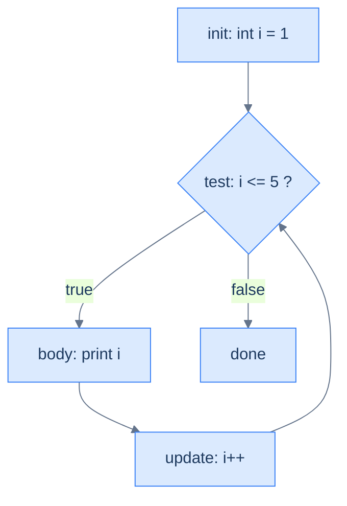

# Loops — Repeating Work

Computers are good at doing the same thing many times, and a **loop** is how you ask for that: repeat a block of code while a `boolean` condition stays true. Java gives you four loop shapes. They differ only in *when* the condition is checked and *what* drives the repetition:

- `while` checks before each pass;
- `do-while` checks after each pass;
- the classic `for` bundles a counter's setup, test and step onto one line;
- the enhanced `for` walks a collection of values directly.

Master the counter and the boundary, and every loop you meet is a variation on these.

<div style="border-left:4px solid #195045;background:rgba(25,80,69,0.08);padding:0.6rem 1rem;border-radius:0 0.5rem 0.5rem 0;margin:1.25rem 0">

💡 **The core idea.**

- A **loop** repeats a block while a `boolean` condition stays true.
- Java's four loop shapes differ only in *when* the condition is checked and *what* drives the repetition.
- Master the **counter and the boundary** and every loop is a variation on these.

</div>

This rests on [boolean conditions](/synapse/programming-languages/java/control-flow/booleans-and-logic): the same `<`, `==` and `&&` that drive an `if` drive a loop. Every output below was produced by compiling and running the code.

**You'll be able to:** predict how many times a `while`, `do-while` or `for` loop runs, from its start value and its boundary; rewrite a counting `while` as a `for`, and name where the `for` variable stops existing; find why a loop never ends, or runs its body when it should not; walk every element with the enhanced `for`, and explain why assigning to its variable changes nothing; explain why a `double` counter from `0.0` to `1.0` in steps of `0.1` runs 11 times, and count with an `int` instead.

<div style="border-left:4px solid #15448e;background:rgba(21,68,142,0.08);padding:0.6rem 1rem;border-radius:0 0.5rem 0.5rem 0;margin:1.25rem 0">

📘 **How to read the Intuition boxes.** Each one is built in three moves:

1. **The mechanism** — what the compiler and the JVM *do*.
2. **A concrete bite** — a specific, runnable failure (often a real compiler error), shown so the trap is visible.
3. **The earned rule** — the decision heuristic, now justified rather than asserted, plus its cost.

</div>

---

## Table of contents

1. [`while`: test before each pass](#1-while-test-before-each-pass)
2. [`do-while`: test after each pass](#2-do-while-test-after-each-pass)
3. [The classic `for`](#3-the-classic-for)
4. [The enhanced `for` (for-each)](#4-the-enhanced-for-for-each)
5. [Mental-model summary](#5-mental-model-summary)
6. [Gotcha checklist](#6-gotcha-checklist)
7. [Check yourself](#-check-yourself)
8. [Sources](#-sources)

---

## 1. `while`: test before each pass

A `while` loop checks its condition, and if it is `true`, runs the body. Then it checks again, and again, until the condition becomes `false` <abbr title="The Java Language Specification, Java SE 21, §14.12">[1]</abbr>. Something inside the body must move toward that end, or the loop never stops.

```java run
public class Main {
    public static void main(String[] args) {
        int i = 0;
        while (i < 5) {
            System.out.print(i + " ");
            i++;
        }
        System.out.println();
    }
}
```

**Output:**
```
0 1 2 3 4 
```

**Analysis.** `i` starts at `0`. The loop printed `0`, incremented to `1`, checked `1 < 5` (true), and so on, printing `0 1 2 3 4`. When `i` reached `5`, the test `5 < 5` was `false`, so the loop stopped *before* printing `5`. The `i++` is what advanced the counter toward the exit.

**Intuition.**
*Mechanism.* `while (cond)` evaluates `cond` *before* each pass; the body runs only while it is true. If the body never changes what `cond` depends on, the condition stays true forever. That is an **infinite loop**.

*Non-example: the missing update.* Leave out the `i++`, and nothing ever makes `i < 3` false:

```java run
// expects-hang: the body never changes i, so i < 3 stays true forever
public class Main {
    public static void main(String[] args) {
        int i = 0;
        int total = 0;
        System.out.println("before the loop");
        while (i < 3) {
            total += i;
        }
        System.out.println("after the loop: " + total);
    }
}
```

**Output** *(prints one line, then runs until it is stopped; the sandbox stops it at its time limit):*
```
before the loop
```

There is no error message. The program keeps running, and `after the loop` never prints. On a terminal, stop a runaway program with Ctrl+C.

*Concrete bite.* The boundary is where loops go wrong. Change `<` to `<=` and the loop runs one extra time:

```java run
public class Main {
    public static void main(String[] args) {
        int i = 0;
        while (i <= 5) {
            System.out.print(i + " ");
            i++;
        }
        System.out.println();
    }
}
```

**Output:**
```
0 1 2 3 4 5 
```

The same loop with `<=` prints `0` through `5`: six numbers, not five. "Count five things starting at zero" means `i < 5` (indices `0..4`); `i <= 5` is the **off-by-one** that does one too many.

<div style="border-left:4px solid #195045;background:rgba(25,80,69,0.08);padding:0.6rem 1rem;border-radius:0 0.5rem 0.5rem 0;margin:1.25rem 0">

💡 **Earned rule.** Write the condition so the body advances toward making it false, and pin down the boundary deliberately: `i < n` counts `n` times from `0`.

The cost of a loose boundary is an off-by-one: one pass too many or too few. The cost of *no* advance is an infinite loop. It produces no wrong output and no error, only a program that never returns.

</div>

---

## 2. `do-while`: test after each pass

A `do-while` runs the body **first**, then checks the condition <abbr title="The Java Language Specification, Java SE 21, §14.13">[2]</abbr>. So the body always executes at least once, even if the condition is false from the start.

```java run
public class Main {
    public static void main(String[] args) {
        int n = 10;
        while (n < 5) { System.out.println("while body"); n++; }
        System.out.println("while done");

        int m = 10;
        do { System.out.println("do body"); m++; } while (m < 5);
        System.out.println("do done");
    }
}
```

**Output:**
```
while done
do body
do done
```

**Analysis.** Both loops start with their variable at `10` and a condition `< 5` that is already false.

- The `while` checked first, found `10 < 5` false, and ran its body **zero** times: `while body` never printed.
- The `do-while` ran its body **once** before checking, so `do body` printed. Then `11 < 5` was false and it stopped.

Note the `;` after `while (m < 5)`. A `do-while` ends with one, and javac reports `';' expected` without it.

**Intuition.**
*Mechanism.* The only difference is the order of test and body. `while` is test-then-body (zero or more passes); `do-while` is body-then-test (one or more passes).

*Concrete bite.* A variable declared *inside* the `do` body ends with the body's closing brace. The condition sits after that brace, so it cannot see the variable:

```java run
public class Main {
    public static void main(String[] args) {
        do {
            int tries = 1;
            System.out.println("try " + tries);
        } while (tries < 3);
    }
}
```

**Compiler error:**
```
Main.java:6: error: cannot find symbol
        } while (tries < 3);
                 ^
  symbol:   variable tries
  location: class Main
1 error
```

A variable lives from its declaration to the end of the block that holds it <abbr title="The Java Language Specification, Java SE 21, §6.3">[5]</abbr>. Declare `tries` before the `do`, and the condition can read it.

<div style="border-left:4px solid #195045;background:rgba(25,80,69,0.08);padding:0.6rem 1rem;border-radius:0 0.5rem 0.5rem 0;margin:1.25rem 0">

💡 **Earned rule.** Use `do-while` only when the body *must* run once before any test makes sense: prompting for input you then validate, for instance.

The cost of reaching for it by habit is a body that runs even when it shouldn't. `while` (or `for`) is the right default, because most loops should be able to run zero times.

</div>

---

## 3. The classic `for`

Counting loops have three moving parts: a starting value, a continue-condition, and a step. The `for` loop puts all three on one line: `for (init; test; update)` <abbr title="The Java Language Specification, Java SE 21, §14.14.1">[3]</abbr>. It is the same logic as the `while` in §1, gathered in one place.

```java run
public class Main {
    public static void main(String[] args) {
        for (int i = 1; i <= 5; i++) {
            System.out.print(i + " ");
        }
        System.out.println();
    }
}
```

**Output:**
```
1 2 3 4 5 
```



**Analysis.** `int i = 1` ran once at the start. Then the cycle: test `i <= 5`; if true, run the body; then `i++`; then test again. This time the boundary is `<= 5` *because* the count starts at `1`, printing `1 2 3 4 5`. The init, test and update sit together, which makes the loop's intent easy to read at a glance.

Each part can hold more than one thing, separated by commas. Here two counters walk toward each other:

```java run
public class Main {
    public static void main(String[] args) {
        for (int i = 0, j = 5; i < j; i++, j--) {
            System.out.println(i + " " + j);
        }
    }
}
```

**Output:**
```
0 5
1 4
2 3
```

After the third pass, `i` is `3` and `j` is `2`, so `i < j` fails. Each part is also optional: `for (;;)` has no test at all, and runs until something inside it leaves the loop. [Loop Control & Patterns](/synapse/programming-languages/java/control-flow/loop-control-and-patterns) shows how.

**Intuition.**
*Mechanism.* The `init` runs once; then `test`, `body`, `update`, `test`, … until `test` is false. The loop variable declared in `init` lives **only inside the loop**: its scope is the `for` and its body, nothing after <abbr title="The Java Language Specification, Java SE 21, §6.3">[5]</abbr>.

*Concrete bite.* Use the loop variable after the loop and the compiler can't find it:

```java run
public class Main {
    public static void main(String[] args) {
        for (int i = 0; i < 3; i++) {
            System.out.println(i);
        }
        System.out.println(i);
    }
}
```

**Compiler error:**
```
Main.java:6: error: cannot find symbol
        System.out.println(i);
                           ^
  symbol:   variable i
  location: class Main
1 error
```

`i` exists only within the `for`; after the closing brace it is gone, so referencing it is a compile error. If you need the final value afterward, declare the variable *before* the loop:

```java run
public class Main {
    public static void main(String[] args) {
        int i;
        for (i = 0; i < 3; i++) {
            System.out.println(i);
        }
        System.out.println("after: " + i);
    }
}
```

**Output:**
```
0
1
2
after: 3
```

The last value is `3`, not `2`: the loop stops only when the test fails, and it fails at `3`.

*Non-example: a stray semicolon.* As with `if` in [Conditionals](/synapse/programming-languages/java/control-flow/conditionals), a `;` after the header is the whole body:

```java run
public class Main {
    public static void main(String[] args) {
        for (int i = 0; i < 3; i++); {
            System.out.println("hi");
        }
    }
}
```

**Output:**
```
hi
```

The loop ran three times with an empty body. Then the block after it ran once, on its own. (A `while (i < 3);` is worse: its empty body never changes `i`, so it never ends.)

*Non-example: a `double` counter.* A counter that steps by `0.1` inherits the rounding from [Numbers & Arithmetic](/synapse/programming-languages/java/first-steps/numbers-and-arithmetic):

```java run
public class Main {
    public static void main(String[] args) {
        int passes = 0;
        for (double x = 0.0; x < 1.0; x += 0.1) {
            passes++;
        }
        System.out.println(passes);
    }
}
```

**Output:**
```
11
```

Ten steps of `0.1` should reach `1.0`. The sum lands a hair below it, at `0.9999999999999999`, so `x < 1.0` passes an eleventh time. Count with an `int`, and compute the `double` from it:

```java run
public class Main {
    public static void main(String[] args) {
        int passes = 0;
        for (int tenths = 0; tenths < 10; tenths++) {
            double x = tenths / 10.0;
            passes++;
        }
        System.out.println(passes);
    }
}
```

**Output:**
```
10
```

<div style="border-left:4px solid #195045;background:rgba(25,80,69,0.08);padding:0.6rem 1rem;border-radius:0 0.5rem 0.5rem 0;margin:1.25rem 0">

💡 **Earned rule.** Use a `for` when you know the counting structure up front (a fixed range, a step), and let its declared variable stay scoped to the loop. Count with an `int`, never a `double`.

The cost of that tidy scoping is that the counter vanishes at the loop's end. The benefit: you cannot accidentally read a stale loop counter later, and two adjacent loops can both use `i` without colliding.

</div>

---

## 4. The enhanced `for` (for-each)

When you want *each element* of a collection, use the enhanced `for` <abbr title="The Java Language Specification, Java SE 21, §14.14.2">[4]</abbr>. Read `for (T x : items)` as "for each `x` in `items`". It hands you the elements one at a time, with no counter and no index to manage.

Here we iterate an **array**, a fixed list of values. Arrays get their full treatment in [Arrays](/synapse/programming-languages/java/control-flow/arrays); for now, read `int[] nums = {2, 4, 6}` as "a list of numbers".

```java run
public class Main {
    public static void main(String[] args) {
        int[] nums = {2, 4, 6};
        int sum = 0;
        for (int n : nums) {
            sum += n;
        }
        System.out.println(sum);
    }
}
```

**Output:**
```
12
```

**Analysis.** The loop ran once per element: `n` was `2`, then `4`, then `6`, adding each to `sum` (`0 → 2 → 6 → 12`). No index, no boundary to get wrong: the loop visits every element exactly once and stops. This is the safest loop when "every element, in order" is all you need.

*Non-example: a `String` is not a list here.* A `String` holds characters, but the enhanced `for` accepts only an array or an `Iterable`, the type behind Java's collections:

```java run
public class Main {
    public static void main(String[] args) {
        String word = "abc";
        for (char c : word) {
            System.out.println(c);
        }
    }
}
```

**Compiler error:**
```
Main.java:4: error: for-each not applicable to expression type
        for (char c : word) {
                      ^
  required: array or java.lang.Iterable
  found:    String
1 error
```

`word.toCharArray()` gives the characters as an array, and the loop accepts that:

```java run
public class Main {
    public static void main(String[] args) {
        String word = "abc";
        for (char c : word.toCharArray()) {
            System.out.print(c + "-");
        }
        System.out.println();
    }
}
```

**Output:**
```
a-b-c-
```

**Intuition.**
*Mechanism.* Each pass copies the next element into the loop variable <abbr title="The Java Language Specification, Java SE 21, §14.14.2">[4]</abbr>. That variable is a **copy** of the element, not the slot it came from. So assigning to it changes the copy, never the array.

*Concrete bite.* Trying to modify elements through the loop variable does nothing:

```java run
public class Main {
    public static void main(String[] args) {
        int[] nums = {1, 2, 3};
        for (int n : nums) {
            n = n * 10;   // changes the copy, not the array
        }
        int sum = 0;
        for (int n : nums) {
            sum += n;
        }
        System.out.println(sum);
    }
}
```

**Output:**
```
6
```

The first loop "multiplied each element by 10", yet the second loop sums to `6` (`1 + 2 + 3`), not `60`. That is proof the array was never touched. `n = n * 10` updated a throwaway copy each pass.

<div style="border-left:4px solid #195045;background:rgba(25,80,69,0.08);padding:0.6rem 1rem;border-radius:0 0.5rem 0.5rem 0;margin:1.25rem 0">

💡 **Earned rule.** Reach for the enhanced `for` whenever you need each element and nothing more. It removes the index, and with it the off-by-one bugs.

The cost is exactly what it hides:

- you get no index, so you cannot say "the 3rd element" or compare neighbours;
- you cannot write *back* into the array through the loop variable.

When you need the position, or want to modify elements in place, use the classic `for` with `nums[i]`.

</div>

---

## 5. Mental-model summary

| Principle | Consequence |
|---|---|
| `while` tests before the body | It can run zero times; the body must advance toward the exit, or it loops forever |
| `do-while` tests after the body | It always runs at least once; its condition cannot see variables declared in the body |
| `for` bundles init/test/update; its variable is loop-scoped | Tidy counting in one line; the counter doesn't exist after the loop |
| The boundary (`<` vs `<=`) sets the count | `i < n` from `0` runs `n` times; `<=` is the classic off-by-one |
| A `;` after a loop header is the whole body | The block after it runs once, after the loop; `while (…);` can hang |
| A `double` counter drifts | Count with an `int`; compute the `double` from it |
| The enhanced `for` gives each element as a copy | No index, and assigning to the loop variable doesn't change the array; a `String` needs `toCharArray()` |

## 6. Gotcha checklist

<div style="border-left:4px solid #da5233;background:rgba(218,82,51,0.08);padding:0.6rem 1rem;border-radius:0 0.5rem 0.5rem 0;margin:1.25rem 0">

| Symptom | Likely cause | Fix |
|---|---|---|
| The loop runs one time too many or too few | off-by-one at the boundary | `i < n` from `0` counts `n` times |
| The program hangs and prints nothing more | an infinite loop: the body never changes what the condition depends on | make the body advance the counter; stop the program with Ctrl+C |
| A loop body runs once, whatever the condition | a `;` straight after `for ( … )` | delete the `;` |
| `cannot find symbol` using the counter after the loop | a `for`-declared variable is scoped to the loop | declare it before the loop |
| `cannot find symbol` in a `do-while` condition | the variable was declared inside the `do` body | declare it before the `do` |
| `';' expected` after `while ( … )` | a `do-while` is missing its closing `;` | `} while (cond);` |
| A body that should sometimes be skipped always runs once | you used `do-while` | switch to `while` or `for`, so zero passes is possible |
| A `double` loop runs one extra time | the counter drifted below the limit | count with an `int` |
| `for-each not applicable to expression type` | a `String` (or a number) after the `:` | loop over `word.toCharArray()` |
| Modifying elements in a for-each has no effect | the loop variable is a copy | the classic `for` with `nums[i]` |

</div>

---

## ✅ Check yourself

One check per objective. Answer before you open anything.

```quiz
{"prompt": "int i = 1; while (i < 20) { i *= 3; } System.out.println(i); — what does it print?", "options": ["9", "27", "81"], "answer": "27"}
```

```quiz
{"prompt": "for (int i = 0; i < 3; i++) { } System.out.println(i); — what happens?", "options": ["It prints 3", "It prints 2", "It does not compile: cannot find symbol i"], "answer": "It does not compile: cannot find symbol i"}
```

```quiz
{"prompt": "for (int i = 0; i < 3; i++); { System.out.println(\"hi\"); } — how many times does hi print?", "options": ["Once", "Three times", "Never"], "answer": "Once"}
```

```quiz
{"prompt": "int[] nums = {1, 2, 3}; for (int n : nums) { n = 0; } — then the same array is summed. What is the sum?", "options": ["0", "6", "It does not compile"], "answer": "6"}
```

```quiz
{"prompt": "for (double x = 0.0; x < 1.0; x += 0.1) passes++; — starting from passes = 0, what is passes afterwards?", "options": ["10", "11", "The loop never ends"], "answer": "11"}
```

<details>
<summary>The 🧪 box below: the countdown, the two loops that start at 3, and the §1 loop as a <code>for</code>.</summary>

`for (int i = 10; i > 0; i -= 2)` prints five numbers: `10 8 6 4 2`. At `0`, the test `0 > 0` fails.

With the variable at `3` and the condition `< 3`, the `while` body runs **0** times and the `do-while` body runs **1** time.

The §1 loop as a `for`:

`for (int i = 0; i < 5; i++) { System.out.print(i + " "); }`

It prints `0 1 2 3 4`, the same line.

</details>

---

## 📚 Sources

1. *The Java Language Specification, Java SE 21*, §14.12 "The `while` Statement" — <https://docs.oracle.com/javase/specs/jls/se21/html/jls-14.html#jls-14.12>
2. *The Java Language Specification, Java SE 21*, §14.13 "The `do` Statement" — <https://docs.oracle.com/javase/specs/jls/se21/html/jls-14.html#jls-14.13>
3. *The Java Language Specification, Java SE 21*, §14.14.1 "The basic `for` Statement" — <https://docs.oracle.com/javase/specs/jls/se21/html/jls-14.html#jls-14.14.1>
4. *The Java Language Specification, Java SE 21*, §14.14.2 "The enhanced `for` statement" (an array, or an `Iterable`) — <https://docs.oracle.com/javase/specs/jls/se21/html/jls-14.html#jls-14.14.2>
5. *The Java Language Specification, Java SE 21*, §6.3 "Scope of a Declaration" — <https://docs.oracle.com/javase/specs/jls/se21/html/jls-6.html#jls-6.3>

---

<div style="border-left:4px solid #6d28d9;background:rgba(109,40,217,0.08);padding:0.6rem 1rem;border-radius:0 0.5rem 0.5rem 0;margin:1.25rem 0">

🧪 **Predict, then check.**

1. Predict the exact output of `for (int i = 10; i > 0; i -= 2) System.out.print(i + " ");`: how many numbers, and which?
2. Predict how many times each loop body runs when the variable starts at `3` and the condition is `< 3`: a `while`, then a `do-while`.
3. Rewrite the §1 `while` (printing `0 1 2 3 4`) as a `for` loop, and confirm it prints the same line.

</div>

## Your Turn

Before you move on, check your understanding with the coach — explain the idea, apply it, weigh the trade-offs, then defend your reasoning.

<div class="concept-coach"></div>
