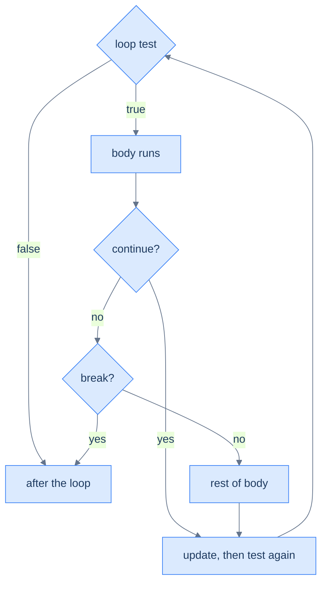

# Loop Control & Patterns — Steering the Repetition

A plain loop runs its body start to finish, every pass. Real loops need to *steer*: stop as soon as you've found what you're looking for, skip the passes that don't apply, or break out of a nested search entirely. Java gives you three controls:

- `break` leaves the loop now;
- `continue` skips to the next pass;
- a **labeled** `break` or `continue` acts on an *outer* loop.

One quiet rule governs all of them: each affects only the **innermost** loop unless you name another. On top of these sit the handful of **accumulation patterns** that almost every loop turns out to be: sum, count, max, "found it?".

<div style="border-left:4px solid #195045;background:rgba(25,80,69,0.08);padding:0.6rem 1rem;border-radius:0 0.5rem 0.5rem 0;margin:1.25rem 0">

💡 **The core idea.**

- Real loops need to **steer**: `break` leaves now, `continue` skips to the next pass, a **labeled** `break` leaves an *outer* loop.
- Each control affects only the **innermost** loop unless you name another.
- Most loops are built from a few **accumulation patterns** — sum, count, max, "found it?".

</div>

This builds on [loops](/synapse/programming-languages/java/control-flow/loops) and the [boolean conditions](/synapse/programming-languages/java/control-flow/booleans-and-logic) that gate them. Every output below was produced by compiling and running the code.

**You'll be able to:** predict what a loop prints when `break` or `continue` runs inside it, with nested loops and a `switch` included; leave or skip an outer loop with a labeled `break` or `continue`; place a `while` loop's update so that a `continue` cannot skip it; write sum, count, max, min and found-it loops, each seeded with the right starting value; compute an average with a fraction, and guard it against empty input.

<div style="border-left:4px solid #15448e;background:rgba(21,68,142,0.08);padding:0.6rem 1rem;border-radius:0 0.5rem 0.5rem 0;margin:1.25rem 0">

📘 **How to read the Intuition boxes.** Each one is built in three moves:

1. **The mechanism** — what the compiler and the JVM *do*.
2. **A concrete bite** — a specific, runnable failure (often a real compiler error), shown so the trap is visible.
3. **The earned rule** — the decision heuristic, now justified rather than asserted, plus its cost.

</div>

---

## Table of contents

1. [`break`: leave the loop now](#1-break-leave-the-loop-now)
2. [`continue`: skip to the next pass](#2-continue-skip-to-the-next-pass)
3. [Labeled `break` and `continue`: nested loops](#3-labeled-break-and-continue-nested-loops)
4. [Accumulation patterns](#4-accumulation-patterns)
5. [Mental-model summary](#5-mental-model-summary)
6. [Gotcha checklist](#6-gotcha-checklist)
7. [Check yourself](#-check-yourself)
8. [Sources](#-sources)

---

## 1. `break`: leave the loop now

`break` stops a loop immediately and jumps to the code after it <abbr title="The Java Language Specification, Java SE 21, §14.15">[1]</abbr>. It is how you search: scan until you find a match, then stop. There is no point continuing.

```java run
public class Main {
    public static void main(String[] args) {
        int found = -1;
        for (int i = 21; i < 100; i++) {
            if (i % 7 == 0) {
                found = i;
                break;
            }
        }
        System.out.println(found);
    }
}
```

**Output:**
```
21
```

**Analysis.** The loop checked `21` first; `21 % 7 == 0` is true, so it stored `21` in `found`. `break` ended the loop on the spot: it never tested `22`, `23`, or any later number. `break` turns "look at everything" into "look until you find it".

`found` starts at `-1`, a value no search can produce. If the loop ends without a match, `-1` says so. A value used this way, to mean "nothing", is a **sentinel**.

A statement straight after `break`, in the same block, can never run, and javac rejects it with `unreachable statement` <abbr title="The Java Language Specification, Java SE 21, §14.22">[5]</abbr>. A `break` outside any loop or `switch` fails too: `break outside switch or loop`.

A loop inside another loop is a **nested loop**. The inner loop runs all of its passes for *each* pass of the outer one:

```java run
public class Main {
    public static void main(String[] args) {
        for (int i = 1; i <= 2; i++) {
            for (int j = 1; j <= 3; j++) {
                System.out.print(i + "," + j + "  ");
            }
            System.out.println();
        }
    }
}
```

**Output:**
```
1,1  1,2  1,3  
2,1  2,2  2,3  
```

Two outer passes times three inner passes makes six pairs. The `println` after the inner loop ends each row.

**Intuition.**
*Mechanism.* `break` exits the **innermost** statement that encloses it and that it can leave: a loop, or a `switch` <abbr title="The Java Language Specification, Java SE 21, §14.15">[1]</abbr>. It does not exit the method, and in nested loops it does not exit the outer loop.

*Concrete bite.* Put a `break` in an inner loop and the outer loop keeps right on going:

```java run
public class Main {
    public static void main(String[] args) {
        for (int i = 1; i <= 3; i++) {
            for (int j = 1; j <= 3; j++) {
                if (j == 2) break;
                System.out.println(i + "," + j);
            }
        }
    }
}
```

**Output:**
```
1,1
2,1
3,1
```

For each `i`, the inner loop printed `j = 1`, then hit `break` at `j == 2`. But that `break` only ended the *inner* loop. The outer loop dutifully moved to the next `i` and started a fresh inner loop, three times over. `break` stopped the inner search, not the whole thing.

*Non-example: `break` inside a `switch`.* A colon-style `switch` from [Conditionals](/synapse/programming-languages/java/control-flow/conditionals) uses `break` to end each case. Inside a loop, that `break` leaves the `switch`, not the loop:

```java run
public class Main {
    public static void main(String[] args) {
        for (int i = 1; i <= 4; i++) {
            switch (i) {
                case 2: System.out.println("found 2"); break;
                default: System.out.println("checked " + i);
            }
        }
    }
}
```

**Output:**
```
checked 1
found 2
checked 3
checked 4
```

The search found `2` and kept going. The `break` was the `switch`'s, so the loop never saw it. A labeled `break`, next in §3, reaches the loop.

<div style="border-left:4px solid #195045;background:rgba(25,80,69,0.08);padding:0.6rem 1rem;border-radius:0 0.5rem 0.5rem 0;margin:1.25rem 0">

💡 **Earned rule.** Use `break` to stop a scan the moment its job is done. Remember that it leaves only the innermost loop or `switch`.

The cost of that scoping: a `break` meant to abandon a *nested* search stops only the inner loop, and silently lets the outer one continue. The labeled `break` in §3 fixes exactly that.

</div>

---

## 2. `continue`: skip to the next pass

`continue` abandons the *rest of the current pass* and jumps straight to the loop's next step: the update and test <abbr title="The Java Language Specification, Java SE 21, §14.16">[2]</abbr>. It is how you filter: skip the elements that don't qualify, keep looping for the ones that do.

```java run
public class Main {
    public static void main(String[] args) {
        for (int i = 0; i < 5; i++) {
            if (i == 2) continue;
            System.out.print(i + " ");
        }
        System.out.println();
    }
}
```

**Output:**
```
0 1 3 4 
```



**Analysis.** When `i` was `2`, `continue` skipped the `print` and went to the next pass. So `2` is missing, but the loop did **not** stop: it printed `3` and `4` afterward. The diagram shows why: `continue` routes back to the update/test, while `break` routes out of the loop entirely.

**Intuition.**
*Mechanism.* `continue` jumps over everything *below* it in the body and proceeds to the loop's update-and-test.

- In a `for`, that update (`i++`) still runs, so the loop always advances.
- In a `while`, the increment is part of the body, so a `continue` placed *before* it skips it.

*Concrete bite.* "The rest of the body is skipped" is the whole behavior. The lines after `continue` run only on passes that don't `continue`:

```java run
public class Main {
    public static void main(String[] args) {
        for (int i = 0; i < 4; i++) {
            System.out.println("checking " + i);
            if (i % 2 == 0) continue;
            System.out.println("  " + i + " is odd");
        }
    }
}
```

**Output:**
```
checking 0
checking 1
  1 is odd
checking 2
checking 3
  3 is odd
```

`checking i` prints every pass (it is *above* the `continue`). `i is odd` prints only for odd `i`, because for even `i` the `continue` skipped it. The `continue` cut the body short without ending the loop.

*Non-example: `continue` in a `while`, above the update.* Here the `i++` sits below the `continue`:

```java run
// expects-hang: continue skips the i++, so i stays 2 and the loop never ends
public class Main {
    public static void main(String[] args) {
        int i = 0;
        while (i < 5) {
            if (i == 2) continue;
            System.out.println(i);
            i++;
        }
    }
}
```

**Output** *(prints two lines, then runs until it is stopped; the sandbox stops it at its time limit):*
```
0
1
```

At `i == 2`, `continue` jumped back to the test and skipped `i++`. `i` stayed `2`, so the same `continue` ran again, forever. Move the update above the `continue`:

```java run
public class Main {
    public static void main(String[] args) {
        int i = 0;
        while (i < 5) {
            i++;
            if (i == 3) continue;
            System.out.print(i + " ");
        }
        System.out.println();
    }
}
```

**Output:**
```
1 2 4 5 
```

The counter now advances on every pass, so the loop skips `3` and still ends.

<div style="border-left:4px solid #195045;background:rgba(25,80,69,0.08);padding:0.6rem 1rem;border-radius:0 0.5rem 0.5rem 0;margin:1.25rem 0">

💡 **Earned rule.** Use `continue` to skip the passes that don't apply, and keep the body flat instead of wrapping it all in an `if`.

The cost is the `for`-vs-`while` asymmetry. A `for` always runs its update. A `while` whose increment sits below a `continue` skips the increment and spins forever. So in a `while`, advance the counter *before* any `continue`.

</div>

---

## 3. Labeled `break` and `continue`: nested loops

When a `break` needs to leave more than the innermost loop, give the outer loop a **label**: a name followed by `:` <abbr title="The Java Language Specification, Java SE 21, §14.7">[3]</abbr>. Then write `break label`. That exits the named loop and everything inside it.

```java run
public class Main {
    public static void main(String[] args) {
        outer:
        for (int i = 1; i <= 3; i++) {
            for (int j = 1; j <= 3; j++) {
                if (i * j == 4) {
                    System.out.println("stop at " + i + "," + j);
                    break outer;
                }
                System.out.println(i + "," + j);
            }
        }
        System.out.println("done");
    }
}
```

**Output:**
```
1,1
1,2
1,3
2,1
stop at 2,2
done
```

**Analysis.** The loops ran until `i * j == 4` (at `i = 2, j = 2`). Then `break outer` left **both** loops at once: execution jumped past the outer loop to `done`. A plain `break` there would have ended only the inner loop and let the outer one continue to `i = 3`. The label is what made it abandon the whole nested search.

The same label fixes the §1 `switch` non-example. Name the loop, and `break search` leaves the loop from inside the `switch`:

```java run
public class Main {
    public static void main(String[] args) {
        search:
        for (int i = 1; i <= 4; i++) {
            switch (i) {
                case 2: System.out.println("found 2"); break search;
                default: System.out.println("checked " + i);
            }
        }
    }
}
```

**Output:**
```
checked 1
found 2
```

`continue` takes a label too. `continue rows` ends the current pass of the loop named `rows` and starts its next pass <abbr title="The Java Language Specification, Java SE 21, §14.16">[2]</abbr>. Here each row prints only the pairs where `j` is not bigger than `i`:

```java run
public class Main {
    public static void main(String[] args) {
        rows:
        for (int i = 1; i <= 3; i++) {
            for (int j = 1; j <= 3; j++) {
                if (j > i) continue rows;
                System.out.print(i + "," + j + "  ");
            }
        }
        System.out.println();
    }
}
```

**Output:**
```
1,1  2,1  2,2  3,1  3,2  3,3  
```

For `i = 1`, the pair `1,2` fails the test, so `continue rows` abandoned the inner loop and moved `i` on to `2`. A plain `continue` would have skipped only `1,2`, then tried `1,3` for nothing.

**Intuition.**
*Mechanism.* A label names a statement; `break label` exits *that* statement, and `continue label` starts that loop's next pass. The label must sit on an **enclosing** loop: you cannot break to a label that isn't above you in the nesting.

*Concrete bite.* Reference a label that doesn't enclose the `break` and it won't compile:

```java run
public class Main {
    public static void main(String[] args) {
        outer:
        for (int i = 0; i < 2; i++) {
            for (int j = 0; j < 2; j++) {
                break inner;
            }
        }
    }
}
```

**Compiler error:**
```
Main.java:6: error: undefined label: inner
                break inner;
                ^
1 error
```

There is no label `inner` on any enclosing loop (the only label is `outer`), so the compiler rejects it. Labels are checked at compile time, so a mistyped one is caught immediately.

<div style="border-left:4px solid #195045;background:rgba(25,80,69,0.08);padding:0.6rem 1rem;border-radius:0 0.5rem 0.5rem 0;margin:1.25rem 0">

💡 **Earned rule.** Reach for a labeled `break` or `continue` only to leave or skip genuinely nested loops in one move. Name the label for what it leaves (`search:`, `rows:`).

The cost is that labels are rare enough to surprise the next reader. Overusing them recreates the tangled "goto" control flow that structured loops were meant to replace. Java has no `goto` statement at all <abbr title="The Java Language Specification, Java SE 21, §14.7">[3]</abbr>. So prefer extracting the nested search into its own [method](/synapse/programming-languages/java/control-flow/methods), and `return`ing from it once that tool is available.

</div>

---

## 4. Accumulation patterns

Most loops are one of a few shapes: build up a **sum**, keep a **count**, track a running **max** or **min**, or set a **flag** when something is found. The skeleton is always the same: initialize an **accumulator** (the variable that collects the result) before the loop, and update it each pass.

```java run viz=array:data
public class Main {
    public static void main(String[] args) {
        int[] data = {4, 8, 15, 16, 23, 42};
        int sum = 0, count = 0, max = Integer.MIN_VALUE;
        for (int x : data) {
            sum += x;
            count++;
            if (x > max) max = x;
        }
        System.out.println("sum=" + sum + " count=" + count + " max=" + max);
    }
}
```

**Output:**
```
sum=108 count=6 max=42
```

**Analysis.** Three accumulators, one pass:

- `sum` adds each value, ending at `108`;
- `count` ticks up once per element, ending at `6`;
- `max` keeps the largest seen so far, ending at `42`.

Each starts at a value that is correct for "nothing seen yet". `sum` and `count` start at `0`. `max` starts at `Integer.MIN_VALUE`, the smallest `int` <abbr title="Java SE 21 API, java.lang.Integer.MIN_VALUE">[4]</abbr>, so the very first element is guaranteed to beat it.

**An average** is `sum / count`, and both are `int`s. So the division truncates, as [Numbers & Arithmetic](/synapse/programming-languages/java/first-steps/numbers-and-arithmetic) showed. Cast one side to keep the fraction:

```java run
public class Main {
    public static void main(String[] args) {
        int[] data = {7, 8};
        int sum = 0, count = 0;
        for (int x : data) {
            sum += x;
            count++;
        }
        System.out.println(sum / count);
        System.out.println((double) sum / count);
    }
}
```

**Output:**
```
7
7.5
```

**A flag** answers "is there any …?". It starts `false`, and the first match sets it and stops the scan:

```java run
public class Main {
    public static void main(String[] args) {
        int[] data = {4, 8, 15, 16, 23, 42};
        boolean hasOdd = false;
        for (int x : data) {
            if (x % 2 != 0) {
                hasOdd = true;
                break;
            }
        }
        System.out.println(hasOdd);
    }
}
```

**Output:**
```
true
```

`15` is the first odd value, so the loop never looked at `16`, `23` or `42`.

**Intuition.**
*Mechanism.* An accumulator's **initial value** must be the right answer for an empty sequence. `0` adds nothing to a sum, and the smallest possible `int` loses to any real value in a `max`. The loop then folds each element into that running result.

*Concrete bite.* Initialize a `max` to `0` and any all-negative data defeats it:

```java run viz=array:temps
public class Main {
    public static void main(String[] args) {
        int[] temps = {-5, -2, -9, -1};
        int max = 0;
        for (int t : temps) {
            if (t > max) max = t;
        }
        System.out.println(max);
    }
}
```

**Output:**
```
0
```

The real maximum is `-1`, but `0` was never in the data. It was a bad starting value that no negative element could beat, so the loop reported `0`, a value that isn't even in `temps`. The logic is right; the *seed* was wrong.

*Non-example: no data at all.* An empty list defeats the accumulators in a different way. The loop body never runs:

```java run
public class Main {
    public static void main(String[] args) {
        int[] data = {};
        int sum = 0, count = 0, max = Integer.MIN_VALUE;
        for (int x : data) {
            sum += x;
            count++;
            if (x > max) max = x;
        }
        System.out.println("count=" + count + " max=" + max);
        System.out.println(sum / count);
    }
}
```

**Output** *(prints a line, then a thrown exception):*
```
count=0 max=-2147483648
Exception in thread "main" java.lang.ArithmeticException: / by zero
```

`max` kept its seed, a number that is not in the data. `sum / count` divided by `0` and threw. Check `count > 0` before you report a max or divide by the count.

<div style="border-left:4px solid #195045;background:rgba(25,80,69,0.08);padding:0.6rem 1rem;border-radius:0 0.5rem 0.5rem 0;margin:1.25rem 0">

💡 **Earned rule.** Seed an accumulator with the right answer for "nothing seen yet":

- `0` for a sum or a count;
- `Integer.MIN_VALUE` (or the first element) for a max, and `Integer.MAX_VALUE` for a min;
- `false` for a found-it flag.

Never seed a max or min with a "convenient" `0` that happens to be a valid value. The cost of a wrong seed is a silent wrong answer. It survives every test with positive data, and breaks only on the negative or empty case you forgot.

</div>

---

## 5. Mental-model summary

| Principle | Consequence |
|---|---|
| `break` leaves the innermost loop or `switch` and jumps past it | A `break` in a nested loop stops only the inner one; in a `switch` inside a loop, it leaves only the `switch` |
| `continue` skips the rest of the body, then updates and tests | In a `for` the update still runs; in a `while`, advance before any `continue` |
| A labeled `break` leaves the named enclosing loop; a labeled `continue` starts its next pass | The one move that escapes or skips nested loops; an undefined label won't compile |
| Loops are accumulation: init before, update each pass | Sum, count, max, min, average and flag are the recurring shapes |
| The accumulator's seed must be correct for "nothing seen" | `max = 0` breaks on all-negative data; seed with `Integer.MIN_VALUE` |
| Empty input leaves every accumulator at its seed | Check `count > 0` before dividing or reporting a max |

## 6. Gotcha checklist

<div style="border-left:4px solid #da5233;background:rgba(218,82,51,0.08);padding:0.6rem 1rem;border-radius:0 0.5rem 0.5rem 0;margin:1.25rem 0">

| Symptom | Likely cause | Fix |
|---|---|---|
| A nested search keeps running after a match | a plain `break` left only the inner loop | a labeled `break`, or a method that `return`s |
| A loop keeps going after a `switch` case's `break` | that `break` left the `switch`, not the loop | label the loop and `break` the label |
| A `while` with `continue` hangs | the increment sits below the `continue` and gets skipped | advance the counter before any `continue` |
| `undefined label: inner` | the label isn't on an enclosing loop (a typo, or the wrong loop) | label the loop that encloses the `break` |
| `break outside switch or loop` / `continue outside of loop` | the statement is not inside any loop (or `switch`, for `break`) | move it into the loop, or use `return` in a method |
| `unreachable statement` | a statement sits straight after `break` or `continue` in the same block | move it above, or delete it |
| A max or min comes back as `0`, a value not in the data | the accumulator was seeded with `0` | `Integer.MIN_VALUE` / `Integer.MAX_VALUE`, or the first element |
| A max is `-2147483648` | the input was empty, so the seed was never replaced | check `count > 0` first |
| An average loses its fraction (`7` for 7 and 8) | `int / int` truncates | `(double) sum / count` |
| `ArithmeticException: / by zero` computing an average | `count` is `0`: the input was empty | check `count > 0` before dividing |
| `continue` skipped a line you expected to run | code below `continue` runs only on passes that don't continue | move it above, or invert the condition |

</div>

---

## ✅ Check yourself

One check per objective. Answer before you open anything.

```quiz
{"prompt": "for (int i = 1; i <= 4; i++) { switch (i) { case 2: System.out.println(\"found 2\"); break; default: System.out.println(\"checked \" + i); } } — how many lines does it print?", "options": ["2", "4", "1"], "answer": "4"}
```

```quiz
{"prompt": "rows: for (int i = 1; i <= 3; i++) { for (int j = 1; j <= 3; j++) { if (j > i) continue rows; print the pair } } — how many pairs print?", "options": ["3", "9", "6"], "answer": "6"}
```

```quiz
{"prompt": "int i = 0; while (i < 5) { if (i == 2) continue; System.out.println(i); i++; } — what happens?", "options": ["It prints 0, 1, 3 and 4", "It prints 0 and 1, then never ends", "It does not compile"], "answer": "It prints 0 and 1, then never ends"}
```

```quiz
{"prompt": "int[] v = {7, 3, 9}; int min = 0; for (int x : v) { if (x < min) min = x; } System.out.println(min); — what does it print?", "options": ["0", "3", "9"], "answer": "0"}
```

```quiz
{"prompt": "int sum = 15, count = 2; System.out.println(sum / count); — what does it print?", "options": ["7.5", "8", "7"], "answer": "7"}
```

<details>
<summary>The 🧪 box below: the nested loop with a plain <code>break</code> and with <code>break outer</code>; the <code>continue</code> loop; and the minimum.</summary>

With a plain `break`, the program prints `1,1  3,1  3,2  3,3`. For `i = 1` the `break` came at `j = 2`. For `i = 2` it came at `j = 1`, before any print. For `i = 3`, no pair sums to `3`.

With `break outer`, it prints only `1,1`: the first `break` ends both loops.

The `continue` loop prints `0 3`: every `i` not divisible by 3 is skipped.

Seed the minimum with `Integer.MAX_VALUE`, so any real value beats it:

`int min = Integer.MAX_VALUE; for (int x : v) { if (x < min) min = x; }`

It gives `2` for `{7, 3, 9, 2, 8}`, and `-11` for `{-4, -11, -6}`. A seed of `0` would report `0` for any all-positive data.

</details>

---

## 📚 Sources

1. *The Java Language Specification, Java SE 21*, §14.15 "The `break` Statement" ("the innermost enclosing `switch`, `while`, `do`, or `for` statement") — <https://docs.oracle.com/javase/specs/jls/se21/html/jls-14.html#jls-14.15>
2. *The Java Language Specification, Java SE 21*, §14.16 "The `continue` Statement" — <https://docs.oracle.com/javase/specs/jls/se21/html/jls-14.html#jls-14.16>
3. *The Java Language Specification, Java SE 21*, §14.7 "Labeled Statements" ("the Java programming language has no `goto` statement") — <https://docs.oracle.com/javase/specs/jls/se21/html/jls-14.html#jls-14.7>
4. Java SE 21 API, `java.lang.Integer` (`MIN_VALUE`, `MAX_VALUE`) — <https://docs.oracle.com/en/java/javase/21/docs/api/java.base/java/lang/Integer.html#MIN_VALUE>
5. *The Java Language Specification, Java SE 21*, §14.22 "Unreachable Statements" — <https://docs.oracle.com/javase/specs/jls/se21/html/jls-14.html#jls-14.22>

---

<div style="border-left:4px solid #6d28d9;background:rgba(109,40,217,0.08);padding:0.6rem 1rem;border-radius:0 0.5rem 0.5rem 0;margin:1.25rem 0">

🧪 **Predict, then check.**

1. Predict the output of this nested loop with a plain `break`, then with `break outer` instead (label the outer loop `outer:`): `for (int i = 1; i <= 3; i++) { for (int j = 1; j <= 3; j++) { if (i + j == 3) break; System.out.print(i + "," + j + "  "); } }`.
2. Predict what `for (int i = 0; i < 6; i++) { if (i % 3 != 0) continue; System.out.print(i + " "); }` prints.
3. Write a loop that finds the **minimum** of `{7, 3, 9, 2, 8}`. Decide what to seed the accumulator with, so it would still be correct for all-negative data.

</div>

## Your Turn

Before you move on, check your understanding with the coach — explain the idea, apply it, weigh the trade-offs, then defend your reasoning.

<div class="concept-coach"></div>
