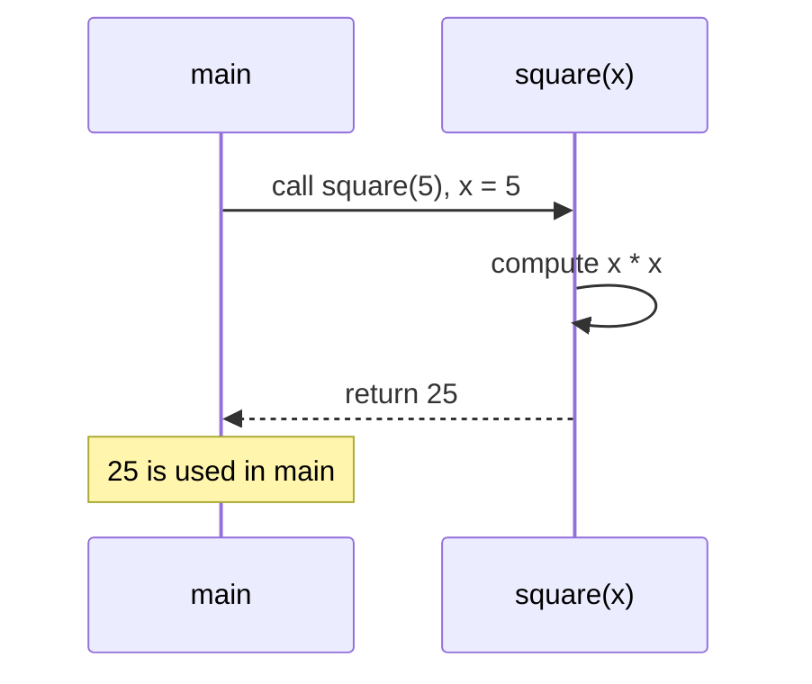

# Methods — Named, Reusable Blocks

You have been writing one method since the first chapter: `main`. A **method** is a named block of code with typed **parameters** (its inputs) and a **return type** (its output). Calling it runs that block with the **arguments** you supply, and hands back a result. Methods are how programs avoid repetition, and how they are built from small, testable pieces.

One rule governs every call and surprises nearly everyone: Java passes arguments **by value**. The method works on *copies*. That single fact, applied to object references, explains the difference between a method that can change your data and one that cannot.

<div style="border-left:4px solid #195045;background:rgba(25,80,69,0.08);padding:0.6rem 1rem;border-radius:0 0.5rem 0.5rem 0;margin:1.25rem 0">

💡 **The core idea.**

- A **method** is a named block with typed **parameters** and a **return type**.
- Java passes arguments **by value** — the method works on *copies*.
- Applied to object references, that one fact decides whether a method can change your data.

</div>

This pulls together [conditionals](/synapse/programming-languages/java/control-flow/conditionals) and [arrays](/synapse/programming-languages/java/control-flow/arrays) from this chapter. Every output below was produced by compiling and running the code.

**You'll be able to:** write a `static` method with parameters and a return type, and name where its parameters and local variables stop existing; fix `missing return statement`, `unexpected return value` and a `void` result used as a value; predict which overload a call picks, and explain why two methods that differ only in return type clash; write a varargs method, and call it with zero, one or many arguments; predict what the caller sees after a method changes a primitive parameter, an array's contents, or the parameter itself.

<div style="border-left:4px solid #15448e;background:rgba(21,68,142,0.08);padding:0.6rem 1rem;border-radius:0 0.5rem 0.5rem 0;margin:1.25rem 0">

📘 **How to read the Intuition boxes.** Each one is built in three moves:

1. **The mechanism** — what the compiler and the JVM *do*.
2. **A concrete bite** — a specific, runnable failure (often a real compiler error), shown so the trap is visible.
3. **The earned rule** — the decision heuristic, now justified rather than asserted, plus its cost.

</div>

---

## Table of contents

1. [Defining and calling a method](#1-defining-and-calling-a-method)
2. [`void` and early `return`](#2-void-and-early-return)
3. [Scope: where parameters and local variables live](#3-scope-where-parameters-and-local-variables-live)
4. [Overloading: one name, several signatures](#4-overloading-one-name-several-signatures)
5. [Varargs: any number of arguments](#5-varargs-any-number-of-arguments)
6. [Pass-by-value: primitives](#6-pass-by-value-primitives)
7. [Pass-by-value: object references](#7-pass-by-value-object-references)
8. [Mental-model summary](#8-mental-model-summary)
9. [Gotcha checklist](#9-gotcha-checklist)
10. [Check yourself](#-check-yourself)
11. [Sources](#-sources)

---

## 1. Defining and calling a method

A method declares a return type, a name, and a parenthesized list of typed parameters, then a body. `return` hands a value of the declared type back to the caller. Here `square` takes an `int` and returns an `int`:

```java run
public class Main {
    static int square(int x) {
        return x * x;
    }

    public static void main(String[] args) {
        System.out.println(square(5));
        System.out.println(square(square(2)));
    }
}
```

**Output:**
```
25
16
```



**Analysis.** `square(5)` ran the body with `x` bound to `5`, returned `25`, and `println` showed it. `square(square(2))` evaluated inside-out: `square(2)` returned `4`, which became the argument to the outer call, returning `16`.

The `static` keyword, which `main` also has, means the method belongs to the class itself. That is enough for now. [`static` vs Instance](/synapse/programming-languages/java/classes-and-objects/static-vs-instance) gives `static` its full treatment once objects exist. Leave it off here, and `main` cannot call the method: javac says `non-static method square(int) cannot be referenced from a static context`.

A call must match the parameter list: the same number of arguments, each of a fitting type. A mismatch is a compile error:

```java run
public class Main {
    static int square(int x) {
        return x * x;
    }

    public static void main(String[] args) {
        System.out.println(square(2, 3));
    }
}
```

**Compiler error:**
```
Main.java:7: error: method square in class Main cannot be applied to given types;
        System.out.println(square(2, 3));
                           ^
  required: int
  found:    int,int
  reason: actual and formal argument lists differ in length
1 error
```

`required` is the parameter list; `found` is what the call passed. A `double` argument such as `square(2.5)` fails too, with `possible lossy conversion from double to int`, the rule from [Numbers & Arithmetic](/synapse/programming-languages/java/first-steps/numbers-and-arithmetic).

**Intuition.**
*Mechanism.* A call suspends the caller and binds each argument to the matching parameter. It runs the body until a `return`, then resumes the caller with the returned value substituted in.

*Concrete bite.* A method that declares a non-`void` return type must return a value on every path, or it does not compile <abbr title="The Java Language Specification, Java SE 21, §8.4.7">[1]</abbr>. The compiler proves that you always return:

```java run
public class Main {
    static int sign(int x) {
        if (x > 0) return 1;
        if (x < 0) return -1;
    }

    public static void main(String[] args) {
        System.out.println(sign(5));
    }
}
```

**Compiler error:**
```
Main.java:5: error: missing return statement
    }
    ^
1 error
```

When `x` is `0`, neither `if` returns, so there is a path with no value to hand back. That is a compile error, not a run-time surprise. Adding a final `return 0;` makes every path return. A statement straight after a `return`, in the same block, is the opposite mistake: it can never run, and javac rejects it with `unreachable statement`.

<div style="border-left:4px solid #195045;background:rgba(25,80,69,0.08);padding:0.6rem 1rem;border-radius:0 0.5rem 0.5rem 0;margin:1.25rem 0">

💡 **Earned rule.** Give each method one clear job, name it for that job, and make sure every path through a value-returning method ends in a `return`.

The cost of the compiler's insistence is that you must handle the cases you would prefer to ignore (what *is* the sign of `0`?). The benefit: "this method forgot to return" cannot reach run time.

</div>

---

## 2. `void` and early `return`

A method that does something but produces no value declares the return type `void`. Inside any method, a bare `return;` exits early. It is useful for handling a special case up front and skipping the rest.

```java run
public class Main {
    static void greet(String name) {
        if (name.length() == 0) {
            System.out.println("(no name)");
            return;
        }
        System.out.println("Hello, " + name);
    }

    public static void main(String[] args) {
        greet("Ada");
        greet("");
    }
}
```

**Output:**
```
Hello, Ada
(no name)
```

**Analysis.** `greet("Ada")` skipped the early-exit branch and printed the greeting. `greet("")` found an empty name, printed `(no name)`, and `return;` ended the method right there: the greeting line never ran. A `void` method returns nothing, so `return;` carries no value; it only stops.

**Intuition.**
*Mechanism.* `void` means "no result", so calling a `void` method is a statement, not an expression: there is nothing to assign <abbr title="The Java Language Specification, Java SE 21, §14.17">[2]</abbr>. A `return;` in any method ends it immediately; `return value;` ends it *and* supplies the result.

*Concrete bite.* Because a `void` call has no value, trying to use it as one fails to compile:

```java run
public class Main {
    static void greet(String name) {
        System.out.println("Hello, " + name);
    }

    public static void main(String[] args) {
        String s = greet("Ada");
    }
}
```

**Compiler error:**
```
Main.java:7: error: incompatible types: void cannot be converted to String
        String s = greet("Ada");
                        ^
1 error
```

`greet` returns nothing to put in `s`. You met the same idea with the ternary and `if` in [Conditionals](/synapse/programming-languages/java/control-flow/conditionals): a thing that performs an action has no value to capture. The mirror mistake, `return 5;` inside a `void` method, gives `incompatible types: unexpected return value`.

<div style="border-left:4px solid #195045;background:rgba(25,80,69,0.08);padding:0.6rem 1rem;border-radius:0 0.5rem 0.5rem 0;margin:1.25rem 0">

💡 **Earned rule.** Use `void` for methods that act (print, change something) and a real return type for methods that compute. Reach for an early `return` to handle edge cases first and keep the main logic unindented.

The cost of early returns is that many scattered ones can obscure a method's flow. A guard or two at the top is clear. A dozen sprinkled throughout is harder to follow than a single structured path.

</div>

---

## 3. Scope: where parameters and local variables live

A parameter, and any variable declared inside a method body, is a **local variable**. It exists only while that call runs, and only inside the block that declares it <abbr title="The Java Language Specification, Java SE 21, §6.3">[3]</abbr>. When the method returns, its locals are gone. Another method cannot see them:

```java run
public class Main {
    static void setUp() {
        int count = 3;
    }

    public static void main(String[] args) {
        setUp();
        System.out.println(count);
    }
}
```

**Compiler error:**
```
Main.java:8: error: cannot find symbol
        System.out.println(count);
                           ^
  symbol:   variable count
  location: class Main
1 error
```

`count` belongs to `setUp`, and it ended when `setUp` returned. To get a value out of a method, `return` it, and store the result: `int count = setUp();`.

This is the same rule you met in [Loops](/synapse/programming-languages/java/control-flow/loops): a variable lives from its declaration to the end of the block that holds it. A method body is one more block.

*Non-example: reusing a name inside its own scope.* Inside that range, the name is taken. Declaring it again in an inner block is an error, not a new variable <abbr title="The Java Language Specification, Java SE 21, §6.4">[4]</abbr>:

```java run
public class Main {
    public static void main(String[] args) {
        int x = 1;
        {
            int x = 2;
        }
    }
}
```

**Compiler error:**
```
Main.java:5: error: variable x is already defined in method main(String[])
            int x = 2;
                ^
1 error
```

Two *different* methods may each use `x`, and two loops one after the other may each declare `i`. Their scopes do not overlap. (A local variable that hides a *field* of the class is legal; fields arrive in [Classes & Objects](/synapse/programming-languages/java/classes-and-objects/classes-and-objects).)

<div style="border-left:4px solid #195045;background:rgba(25,80,69,0.08);padding:0.6rem 1rem;border-radius:0 0.5rem 0.5rem 0;margin:1.25rem 0">

💡 **Earned rule.** Declare each variable in the smallest block that needs it, and pass values in through parameters and out through `return`.

The cost is that nothing leaks out of a method on its own. That is also the benefit: each method can be read alone, because nothing outside can touch its locals.

</div>

---

## 4. Overloading: one name, several signatures

Java lets several methods share a name as long as their **parameter lists** differ: different types, or a different number of parameters. This is **overloading** <abbr title="The Java Language Specification, Java SE 21, §8.4.9">[5]</abbr>. The compiler picks the right one from the argument types at the call site.

```java run
public class Main {
    static int triple(int x) { return x * 3; }
    static double triple(double x) { return x * 3; }
    static String triple(String s) { return s + s + s; }

    public static void main(String[] args) {
        System.out.println(triple(5));
        System.out.println(triple(2.5));
        System.out.println(triple("ab"));
    }
}
```

**Output:**
```
15
7.5
ababab
```

**Analysis.** Three methods named `triple`, distinguished by parameter type. `triple(5)` matched the `int` version (`15`), `triple(2.5)` the `double` version (`7.5`), and `triple("ab")` the `String` version (`ababab`). The compiler chose each based on the argument's type. The name alone is not enough to identify a method.

With no exact match, the compiler widens the argument, and picks the *closest* fit <abbr title="The Java Language Specification, Java SE 21, §15.12.2">[6]</abbr>:

```java run
public class Main {
    static void show(long v) { System.out.println("long " + v); }
    static void show(double v) { System.out.println("double " + v); }

    public static void main(String[] args) {
        show(5);
        show(5.0f);
    }
}
```

**Output:**
```
long 5
double 5.0
```

The `int` `5` fits both `long` and `double`, and `long` is the closer one. The `float` `5.0f` cannot become a `long`, so only `double` applies. When two overloads fit equally well, the compiler refuses to guess. With `pair(int, double)` and `pair(double, int)`, the call `pair(1, 2)` gives `reference to pair is ambiguous`.

**Intuition.**
*Mechanism.* A method is identified by its **signature**: name plus parameter types, not its return type <abbr title="The Java Language Specification, Java SE 21, §8.4.2">[7]</abbr>. The compiler resolves an overloaded call by matching the argument types to a signature, entirely at compile time.

*Concrete bite.* Because the return type is *not* part of the signature, two methods that differ only by return type are a duplicate definition:

```java run
public class Main {
    static int f() { return 1; }
    static double f() { return 2.0; }

    public static void main(String[] args) {
        System.out.println(f());
    }
}
```

**Compiler error:**
```
Main.java:3: error: method f() is already defined in class Main
    static double f() { return 2.0; }
                  ^
1 error
```

Both are `f()` with no parameters: identical signatures, so the second is "already defined". Changing the return type doesn't make a new method; only a different parameter list does.

<div style="border-left:4px solid #195045;background:rgba(25,80,69,0.08);padding:0.6rem 1rem;border-radius:0 0.5rem 0.5rem 0;margin:1.25rem 0">

💡 **Earned rule.** Overload a name only when the methods do the *same conceptual thing* to different input types (`print(int)`, `print(String)`). Distinguish them by parameter list, never by return type alone.

The cost of overloading is resolution surprises. With mixed argument types, the compiler may pick an overload you didn't expect, or refuse an ambiguous call. So keep overloads few, and their parameter types clearly distinct.

</div>

---

## 5. Varargs: any number of arguments

Some methods make sense for any number of arguments: a sum, a maximum. A **varargs** parameter, written with `...` after the type, accepts zero or more arguments <abbr title="The Java Language Specification, Java SE 21, §8.4.1">[8]</abbr>. Inside the method, it is an [array](/synapse/programming-languages/java/control-flow/arrays):

```java run
public class Main {
    static int sum(int... nums) {
        int total = 0;
        for (int n : nums) {
            total += n;
        }
        return total;
    }

    public static void main(String[] args) {
        System.out.println(sum());
        System.out.println(sum(4));
        System.out.println(sum(1, 2, 3));
        System.out.println(sum(new int[] {10, 20}));
    }
}
```

**Output:**
```
0
4
6
30
```

`sum()` passed an empty array, so the loop never ran and `total` stayed `0`. The last call passed an array directly; that works too. `main(String... args)` is a legal way to write `main`, for the same reason.

*Non-example: a varargs parameter that is not last.* The compiler matches arguments left to right, so the open-ended list must come at the end:

```java run
public class Main {
    static void log(int... codes, String label) {
    }

    public static void main(String[] args) {
    }
}
```

**Compiler error:**
```
Main.java:2: error: varargs parameter must be the last parameter
    static void log(int... codes, String label) {
                           ^
1 error
```

Write `log(String label, int... codes)`. A method may have at most one varargs parameter.

<div style="border-left:4px solid #195045;background:rgba(25,80,69,0.08);padding:0.6rem 1rem;border-radius:0 0.5rem 0.5rem 0;margin:1.25rem 0">

💡 **Earned rule.** Use varargs when callers naturally pass a short, variable list of values. Treat the parameter as an array inside, and handle the empty case: a caller may pass nothing.

The cost is that overload resolution tries varargs *last* <abbr title="The Java Language Specification, Java SE 21, §15.12.2">[6]</abbr>. A fixed-parameter overload with a fitting type always wins over it.

</div>

---

## 6. Pass-by-value: primitives

When you call a method, each argument is **copied** into the parameter <abbr title="The Java Language Specification, Java SE 21, §8.4.1">[8]</abbr>. For a primitive, that means the method gets its own copy of the number, and changing the parameter cannot touch the caller's variable.

```java run
public class Main {
    static void addOne(int n) {
        n = n + 1;
        System.out.println("inside: " + n);
    }

    public static void main(String[] args) {
        int x = 5;
        addOne(x);
        System.out.println("outside: " + x);
    }
}
```

**Output:**
```
inside: 6
outside: 5
```

**Analysis.** `addOne(x)` copied `x`'s value (`5`) into `n`. Incrementing `n` to `6` changed only that copy (`inside: 6`), while the caller's `x` stayed `5`, as `outside: 5` confirms. The method had no way to reach back and change `x`.

**Intuition.**
*Mechanism.* "Pass-by-value" means the argument's *value* is copied into the parameter. The parameter is a separate variable; assignments to it rewrite the copy, never the original. Java has no way to pass a primitive variable so the callee can change it.

*Concrete bite.* The classic `swap` shows it. The method swaps its two copies, and the caller's variables never move:

```java run
public class Main {
    static void swap(int a, int b) {
        int tmp = a;
        a = b;
        b = tmp;
    }

    public static void main(String[] args) {
        int x = 1, y = 2;
        swap(x, y);
        System.out.println(x + " " + y);
    }
}
```

**Output:**
```
1 2
```

To reflect a change, a method must *return* the new value, and the caller must store it. Calling a value-returning method and ignoring the result changes nothing:

```java run
public class Main {
    static int addOne(int n) {
        return n + 1;
    }

    public static void main(String[] args) {
        int x = 5;
        addOne(x);
        System.out.println(x);
        x = addOne(x);
        System.out.println(x);
    }
}
```

**Output:**
```
5
6
```

The first `addOne(x)` computed `6` and threw it away. Only `x = addOne(x);` put the result back into `x`.

<div style="border-left:4px solid #195045;background:rgba(25,80,69,0.08);padding:0.6rem 1rem;border-radius:0 0.5rem 0.5rem 0;margin:1.25rem 0">

💡 **Earned rule.** Treat primitive parameters as inputs only; to communicate a result, return it, and assign it at the call.

The cost is that a method cannot have a primitive "out-parameter" the way some languages do. The benefit is that a call can never secretly alter your local numbers. Reading `addOne(x)`, you know `x` is unchanged unless you assign the result.

</div>

---

## 7. Pass-by-value: object references

Java is pass-by-value *for object references too*. But the value being copied is the **reference** (the handle to the object), not the object itself.

- The caller's variable and the parameter then point at the **same** object, so the method can **change** that shared object.
- Reassigning the parameter only repoints its own copy.

```java run viz=array:a
public class Main {
    static void mutate(int[] arr) {
        arr[0] = 99;              // changes the shared array — visible to the caller
    }

    static void reassign(int[] arr) {
        arr = new int[]{7, 8, 9}; // repoints this copy of the reference — caller unaffected
    }

    public static void main(String[] args) {
        int[] a = {1, 2, 3};
        mutate(a);
        System.out.println(a[0]);
        reassign(a);
        System.out.println(a[0]);
    }
}
```

**Output:**
```
99
99
```

**Analysis.**

- `mutate(a)` received a *copy of the reference* that still points at the same array. So `arr[0] = 99` changed the one shared array, and the caller sees `a[0]` as `99`.
- `reassign(a)` also got a copy of the reference, but `arr = new int[]{…}` pointed *that copy* at a brand-new array. The caller's `a` still points at the original, so `a[0]` is **still** `99`, not `7`.

Mutation reached through to the shared object; reassignment did not.

**Intuition.**
*Mechanism.* The reference is copied, so caller and method hold two handles to the *same* object. Following a handle to change the object's contents (`arr[0] = …`) affects what both handles see. Overwriting the handle itself (`arr = …`) changes only that local copy. Java is *always* pass-by-value; for objects, the value is the reference.

*Concrete bite.* The two `99`s are the whole lesson: the mutation in `mutate` stuck, the reassignment in `reassign` did not. A method that "replaces your array" by assigning to its parameter silently does nothing to the caller, a real and common bug.

A `String` parameter behaves like the `reassign` case every time. [Strings](/synapse/programming-languages/java/first-steps/strings-the-basics) cannot be changed, so a method can only point its copy at a new one:

```java run
public class Main {
    static void shout(String s) {
        s = s.toUpperCase();
    }

    public static void main(String[] args) {
        String word = "hi";
        shout(word);
        System.out.println(word);
    }
}
```

**Output:**
```
hi
```

`s.toUpperCase()` built a new `"HI"`, and `s = …` pointed the method's copy at it. `word` still names `"hi"`. Return the new string, and assign it at the call: `word = shout(word);`.

<div style="border-left:4px solid #195045;background:rgba(25,80,69,0.08);padding:0.6rem 1rem;border-radius:0 0.5rem 0.5rem 0;margin:1.25rem 0">

💡 **Earned rule.** A method can change the *contents* of an object you pass, but cannot change *which* object your variable points to. To hand back a different object, `return` it.

The cost of this model is the very confusion shown here ("I reassigned it and nothing happened"). The benefit is one consistent rule: everything is passed by value. The reference/object distinction it forces you to see is the heart of [References, Equality & the Object Model](/synapse/programming-languages/java/classes-and-objects/references-equality-and-the-object-model).

</div>

---

## 8. Mental-model summary

| Principle | Consequence |
|---|---|
| A method has a signature (name + parameter types) and a return type | Calls bind arguments to parameters, run the body, return a value; a call must match the parameter list |
| A value-returning method must return on every path | A branch with no `return` is a `missing return statement` compile error |
| `void` methods act but yield no value | A `void` call is a statement; `String s = greet(…)` and `return 5;` in a `void` method don't compile |
| Parameters and locals live only inside their method's block | Another method can't see them (`cannot find symbol`); a name can't be redeclared inside its own scope |
| Overloads differ by parameter list, not return type | The closest fit wins; a tie is `ambiguous`; two methods differing only by return type are "already defined" |
| A varargs parameter (`int... nums`) is an array, and comes last | Callers pass zero or more values; handle the empty case |
| Arguments are passed by value — a copy | Changing a primitive parameter never changes the caller's variable; return and assign instead |
| For objects, the copied value is the reference | A method can change the shared object but can't repoint the caller's variable |

## 9. Gotcha checklist

<div style="border-left:4px solid #da5233;background:rgba(218,82,51,0.08);padding:0.6rem 1rem;border-radius:0 0.5rem 0.5rem 0;margin:1.25rem 0">

| Symptom | Likely cause | Fix |
|---|---|---|
| `missing return statement` | some path through a value-returning method doesn't `return` | add a final `return`, or cover every branch |
| `unreachable statement` after a `return` | code sits below a `return` in the same block | move it above, or delete it |
| `incompatible types: void cannot be converted to String` | a `void` method's call used as a value | give the method a return type, or call it as a statement |
| `incompatible types: unexpected return value` | `return value;` inside a `void` method | declare the return type, or use `return;` |
| `method square in class Main cannot be applied to given types` | wrong number of arguments; `required` and `found` differ | match the parameter list |
| `possible lossy conversion from double to int` at a call | a `double` argument for an `int` parameter | pass an `int`, cast deliberately, or overload for `double` |
| `non-static method … cannot be referenced from a static context` | `main` calls a method declared without `static` | add `static` (for now) |
| `cannot find symbol` for a variable set in another method | locals end with their method | `return` the value and store it |
| `variable x is already defined in method main(String[])` | a name declared again inside its own scope | pick a new name |
| `reference to pair is ambiguous` | two overloads fit the call equally well | pass arguments of the exact types, or rename one |
| `method f() is already defined` | two methods differ only by return type | change the parameter list or the name |
| `varargs parameter must be the last parameter` | `int...` before another parameter | move the varargs parameter to the end |
| A method "changed" a primitive, but the caller didn't see it | primitives pass by value; or the returned value was ignored | `x = f(x)` |
| A method "replaced" an object or `String` by assigning its parameter, with no effect | that repoints only the copy of the reference | `return` the new object and assign it |
| A method *did* change an array you passed | caller and method share the object | pass a copy (`Arrays.copyOf`) to protect the original |

</div>

---

## ✅ Check yourself

One check per objective. Answer before you open anything.

```quiz
{"prompt": "static void setUp() { int count = 3; } — then main calls setUp(); and prints count. What happens?", "options": ["It prints 3", "It prints 0", "It does not compile: cannot find symbol count"], "answer": "It does not compile: cannot find symbol count"}
```

```quiz
{"prompt": "static void greet(String name) { … } — what does javac say about String s = greet(\"Ada\");?", "options": ["incompatible types: void cannot be converted to String", "missing return statement", "Nothing: s is null"], "answer": "incompatible types: void cannot be converted to String"}
```

```quiz
{"prompt": "With show(long v) and show(double v) both declared, what does show(5) print?", "options": ["double 5.0", "long 5", "It does not compile: ambiguous"], "answer": "long 5"}
```

```quiz
{"prompt": "static int sum(int... nums) adds its arguments. What does sum() print?", "options": ["0", "It does not compile", "It throws an exception"], "answer": "0"}
```

```quiz
{"prompt": "static void swap(int a, int b) swaps a and b. int x = 1, y = 2; swap(x, y); System.out.println(x + \" \" + y); — what does it print?", "options": ["2 1", "1 2", "It does not compile"], "answer": "1 2"}
```

<details>
<summary>The 🧪 box below: <code>doubled(a)</code>, <code>addOne</code> from <code>0</code>, and the two <code>area</code> overloads.</summary>

`doubled(a)` then `a[0]` prints `2`. The method received a copy of the reference to the *same* array, and `in[i] *= 2` changed that array's contents. The returned array was ignored, and it did not matter: it is the same array.

With `x` at `0`, `addOne` prints `inside: 1`, then `outside: 0`. The method changed its copy only.

`area(4)` gives `16` and `area(3, 5)` gives `15`. The compiler tells them apart by the number of parameters: the signatures `area(int)` and `area(int, int)` differ.

</details>

---

## 📚 Sources

1. *The Java Language Specification, Java SE 21*, §8.4.7 "Method Body" (a body with a return type must not "complete normally") — <https://docs.oracle.com/javase/specs/jls/se21/html/jls-8.html#jls-8.4.7>
2. *The Java Language Specification, Java SE 21*, §14.17 "The `return` Statement" — <https://docs.oracle.com/javase/specs/jls/se21/html/jls-14.html#jls-14.17>
3. *The Java Language Specification, Java SE 21*, §6.3 "Scope of a Declaration" — <https://docs.oracle.com/javase/specs/jls/se21/html/jls-6.html#jls-6.3>
4. *The Java Language Specification, Java SE 21*, §6.4 "Shadowing and Obscuring" — <https://docs.oracle.com/javase/specs/jls/se21/html/jls-6.html#jls-6.4>
5. *The Java Language Specification, Java SE 21*, §8.4.9 "Overloading" — <https://docs.oracle.com/javase/specs/jls/se21/html/jls-8.html#jls-8.4.9>
6. *The Java Language Specification, Java SE 21*, §15.12.2 "Compile-Time Step 2: Determine Method Signature" (three phases; variable arity last) — <https://docs.oracle.com/javase/specs/jls/se21/html/jls-15.html#jls-15.12.2>
7. *The Java Language Specification, Java SE 21*, §8.4.2 "Method Signature" — <https://docs.oracle.com/javase/specs/jls/se21/html/jls-8.html#jls-8.4.2>
8. *The Java Language Specification, Java SE 21*, §8.4.1 "Formal Parameters" (argument values "initialize newly created parameter variables"; a variable arity parameter must be last) — <https://docs.oracle.com/javase/specs/jls/se21/html/jls-8.html#jls-8.4.1>

---

<div style="border-left:4px solid #6d28d9;background:rgba(109,40,217,0.08);padding:0.6rem 1rem;border-radius:0 0.5rem 0.5rem 0;margin:1.25rem 0">

🧪 **Predict, then check.**

1. A method `static int[] doubled(int[] in)` loops `in[i] *= 2` and returns `in`. It is called as `int[] a = {1,2,3}; doubled(a); System.out.println(a[0]);`. Does `a[0]` change, and why?
2. Predict what `addOne` (from §6) prints for `inside`/`outside` if `x` starts at `0`.
3. Write an overloaded `area(int side)` (square) and `area(int w, int h)` (rectangle). Decide why the compiler can tell them apart.

</div>

## Your Turn

Before you move on, check your understanding with the coach — explain the idea, apply it, weigh the trade-offs, then defend your reasoning.

<div class="concept-coach"></div>
