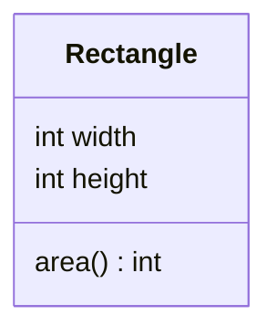

# Defining Classes & Creating Objects — Bundling Data with Behavior

Until now your programs have been `static` methods that pass primitives and arrays around. A **class** changes the unit of organization. It bundles **data** (its *fields*) with the **operations** on that data (its *methods*) into one named blueprint.

From that blueprint, `new` builds **objects** (also called *instances*). Each object is a self-contained bundle with its own copy of the fields. Code stops acting on loose data; the data carries the code that acts on it.

It rests on one idea you already met: an object variable holds a *reference*, so two variables can point at the same object.

<div style="border-left:4px solid #195045;background:rgba(25,80,69,0.08);padding:0.6rem 1rem;border-radius:0 0.5rem 0.5rem 0;margin:1.25rem 0">

💡 **The core idea.**

- A **class** bundles **data** (fields) with the **operations** on it (methods) into one blueprint.
- `new` builds **objects** from it, each with its own copy of the fields.
- An object variable holds a **reference**, so two variables can point at the same object.

</div>

This builds directly on [methods](/synapse/programming-languages/java/control-flow/methods), especially pass-by-value of references, and on the [arrays](/synapse/programming-languages/java/control-flow/arrays) that were our first objects. Every output below was produced by compiling and running the code.

**You'll be able to:** write a class with fields, a constructor and an instance method, and build objects from it with `new`; predict the value of a field that nothing assigned, from its type; fix `constructor … cannot be applied to given types`, including the one a stray `void` causes; trace `this.width = width` against `width = width`, and predict what `area()` returns; predict which variables see a change after `c = a`, and after a second `new`.

<div style="border-left:4px solid #15448e;background:rgba(21,68,142,0.08);padding:0.6rem 1rem;border-radius:0 0.5rem 0.5rem 0;margin:1.25rem 0">

📘 **How to read the Intuition boxes.** Each one is built in three moves:

1. **The mechanism** — what the compiler and the JVM *do*.
2. **A concrete bite** — a specific, runnable failure (often a real compiler error), shown so the trap is visible.
3. **The earned rule** — the decision heuristic, now justified rather than asserted, plus its cost.

</div>

---

## Table of contents

1. [A class bundles fields and methods](#1-a-class-bundles-fields-and-methods)
2. [Constructors: initializing a new object](#2-constructors-initializing-a-new-object)
3. [`this` and per-instance state](#3-this-and-per-instance-state)
4. [Independent instances and aliasing](#4-independent-instances-and-aliasing)
5. [Mental-model summary](#5-mental-model-summary)
6. [Gotcha checklist](#6-gotcha-checklist)
7. [Check yourself](#-check-yourself)
8. [Sources](#-sources)

---

## 1. A class bundles fields and methods

A class declares **fields** (the data each object holds) and **methods** (what each object can do). `new ClassName()` builds an object; you reach its fields and methods with a dot.

```java run
class Rectangle {
    int width;
    int height;
    int area() {
        return width * height;
    }
}

public class Main {
    public static void main(String[] args) {
        Rectangle r = new Rectangle();
        r.width = 3;
        r.height = 4;
        System.out.println(r.area());
    }
}
```

**Output:**
```
12
```



**Analysis.** `new Rectangle()` created an object with two `int` fields, each starting at `0`. We set `r.width` and `r.height`, then called `r.area()`.

`area()` read `width` and `height` *without parameters*. It is an **instance method**: it works on the object it was called on. The data and the operation live together.

The fields carry no access modifier, so any class in the same package can reach them. [Encapsulation & Access Modifiers](/synapse/programming-languages/java/classes-and-objects/encapsulation-and-access-modifiers) adds the control that usually hides them.

**Two classes, one file.** This file holds two top-level classes, `Rectangle` and `Main`. A file may hold several, but at most one of them may be `public` <abbr title="The Java Language Specification, Java SE 21, §7.6">[1]</abbr>.

- Here the `public` one is `Main`, which matches the file name `Main.java`.
- `javac` still writes one bytecode file per class: `Main.class` and `Rectangle.class`.
- Mark `Rectangle` `public` too, and javac says `class Rectangle is public, should be declared in a file named Rectangle.java`.

**Intuition.**
*Mechanism.* An instance method has an implicit **receiver**: the object before the dot. Its unqualified field names (`width`, `height`) refer to *that object's* fields. A `static` method (like `main`) has no receiver; it belongs to the class, not to any object.

*Concrete bite.* So an instance method cannot be called without an object — there is no implicit receiver to supply the fields:

```java run
class Rectangle {
    int width, height;
    int area() { return width * height; }
}

public class Main {
    public static void main(String[] args) {
        System.out.println(Rectangle.area());
    }
}
```

**Compiler error:**
```
Main.java:8: error: non-static method area() cannot be referenced from a static context
        System.out.println(Rectangle.area());
                                    ^
1 error
```

`Rectangle.area()` tries to call `area` on the *class*. But `area` needs an object's `width` and `height`, and there isn't one. That is the difference between `r.area()` (an object) and `Rectangle.area()` (the class).

### Fields start at a default value

A field that nothing assigns still holds a value. `new` sets every field to a **default value** that depends on its type <abbr title="The Java Language Specification, Java SE 21, §4.12.5">[2]</abbr>:

```java run
class Sample {
    int count;
    double price;
    boolean done;
    char letter;
    String name;
    int[] data;
}

public class Main {
    public static void main(String[] args) {
        Sample s = new Sample();
        System.out.println(s.count);
        System.out.println(s.price);
        System.out.println(s.done);
        System.out.println((int) s.letter);
        System.out.println(s.name);
        System.out.println(s.data);
    }
}
```

**Output:**
```
0
0.0
false
0
null
null
```

Number fields start at zero, `boolean` at `false`, and `char` at the character with code `0`. Every reference type (`String`, arrays, your own classes) starts at `null`: no object at all. A field may also declare its own start value, as in `int width = 1;` <abbr title="The Java Language Specification, Java SE 21, §8.3.2">[3]</abbr>.

*Non-example: a local variable gets no default.* The rule is for fields, not for the local variables of a method. An object variable declared without `new` is not a usable object:

```java run
class Rectangle {
    int width, height;
    int area() { return width * height; }
}

public class Main {
    public static void main(String[] args) {
        Rectangle r;
        System.out.println(r.area());
    }
}
```

**Compiler error:**
```
Main.java:9: error: variable r might not have been initialized
        System.out.println(r.area());
                           ^
1 error
```

`r` is a local variable, and [Variables & Primitive Types](/synapse/programming-languages/java/first-steps/variables-and-primitive-types) showed that a local must be assigned before it is read. Declaring `Rectangle r;` makes a variable, not an object. Only `new Rectangle()` makes the object.

**Printing an object.** `println(r)` does not print the fields. Unless the class says otherwise, it prints the class name, `@`, and a hexadecimal hash code <abbr title="java.lang.Object.toString(), Java SE 21 API">[4]</abbr>:

```java run
class Rectangle {
    int width, height;
}

public class Main {
    public static void main(String[] args) {
        Rectangle r = new Rectangle();
        System.out.println(r);
    }
}
```

**Output** *(illustrative — the part after `@` can differ):*
```
Rectangle@15db9742
```

To see the fields, print them: `r.width + " x " + r.height`. A later chapter shows how a class supplies its own text form.

<div style="border-left:4px solid #195045;background:rgba(25,80,69,0.08);padding:0.6rem 1rem;border-radius:0 0.5rem 0.5rem 0;margin:1.25rem 0">

💡 **Earned rule.** Group a piece of data with the methods that operate on it into a class, and call instance methods through an object (`r.area()`).

The cost of this bundling is the ceremony of creating objects before you can use their behavior. The benefit is that an object carries its own data, so a method never has to be handed the state it works on.

</div>

---

## 2. Constructors: initializing a new object

Setting fields one by one after `new` is verbose and easy to forget. A **constructor** runs at creation time to initialize the object, so you can build it fully formed in one step. It looks like a method with the class's name and no return type <abbr title="The Java Language Specification, Java SE 21, §8.8">[5]</abbr>.

```java run
class Rectangle {
    int width;
    int height;
    Rectangle(int w, int h) {
        width = w;
        height = h;
    }
    int area() { return width * height; }
}

public class Main {
    public static void main(String[] args) {
        Rectangle r = new Rectangle(3, 4);
        System.out.println(r.area());
    }
}
```

**Output:**
```
12
```

**Analysis.** `new Rectangle(3, 4)` called the constructor with `w = 3` and `h = 4`. The constructor set the fields before the object was handed back, so `r` arrives ready to use.

A constructor has no return type, not even `void`. Its job is to initialize; `new` is what returns the object. A constructor is not a method: you cannot call it by name. `new` runs it, and so can another constructor, as shown below.

**Intuition.**
*Mechanism.* `new` works in a fixed order <abbr title="The Java Language Specification, Java SE 21, §12.5">[6]</abbr>:

1. It allocates the object and sets every field to its default (§1).
2. It runs the field initializers, such as `int width = 1;`, and then the constructor body.
3. It returns the reference.

If you write **no** constructor, javac adds a **default constructor**: no parameters, and none of your code <abbr title="The Java Language Specification, Java SE 21, §8.8.9">[7]</abbr>. That is why `new Rectangle()` worked in §1. The moment you declare *any* constructor, javac stops adding it.

*Concrete bite.* So adding a constructor that takes arguments removes the ability to call `new Rectangle()`:

```java run
class Rectangle {
    int width, height;
    Rectangle(int w, int h) { width = w; height = h; }
}

public class Main {
    public static void main(String[] args) {
        Rectangle r = new Rectangle();
        System.out.println(r.width);
    }
}
```

**Compiler error:**
```
Main.java:8: error: constructor Rectangle in class Rectangle cannot be applied to given types;
        Rectangle r = new Rectangle();
                      ^
  required: int,int
```

Once `Rectangle(int, int)` exists, the default constructor is gone, so `new Rectangle()` has nothing to match. If you want both, declare both. Constructors overload exactly like methods <abbr title="The Java Language Specification, Java SE 21, §8.8.8">[8]</abbr>. One constructor can hand its work to another with `this(…)`:

```java run
class Rectangle {
    int width, height;
    Rectangle(int width, int height) {
        this.width = width;
        this.height = height;
    }
    Rectangle(int side) {
        this(side, side);
    }
    int area() { return width * height; }
}

public class Main {
    public static void main(String[] args) {
        System.out.println(new Rectangle(3, 4).area());
        System.out.println(new Rectangle(5).area());
    }
}
```

**Output:**
```
12
25
```

`new Rectangle(5)` picked the one-parameter constructor. It called `this(5, 5)`, so the two-parameter constructor did the real work.

In Java 21, `this(…)` must be the first statement of the constructor <abbr title="The Java Language Specification, Java SE 21, §8.8.7">[9]</abbr>. Put a `println` before it, and javac says `call to this must be first statement in constructor`. (JDK 25 relaxes this rule <abbr title="JEP 513: Flexible Constructor Bodies (JDK 25)">[10]</abbr>.)

*Non-example: a constructor with a return type.* Write `void` in front of a constructor, and it becomes an ordinary method that happens to share the class's name:

```java run
class Rectangle {
    int width, height;
    void Rectangle(int w, int h) {
        width = w;
        height = h;
    }
}

public class Main {
    public static void main(String[] args) {
        Rectangle r = new Rectangle(3, 4);
        System.out.println(r.width);
    }
}
```

**Compiler error:**
```
Main.java:11: error: constructor Rectangle in class Rectangle cannot be applied to given types;
        Rectangle r = new Rectangle(3, 4);
                      ^
  required: no arguments
  found:    int,int
  reason: actual and formal argument lists differ in length
1 error
```

The class now has no constructor of its own, so javac added the default one: `required: no arguments`. The error points at the call, not at the stray `void`. Delete the `void`.

<div style="border-left:4px solid #195045;background:rgba(25,80,69,0.08);padding:0.6rem 1rem;border-radius:0 0.5rem 0.5rem 0;margin:1.25rem 0">

💡 **Earned rule.** Use a constructor to guarantee every new object starts in a valid state, with its required fields supplied at creation.

The cost is that declaring one constructor removes the default one. If some callers still need `new T()`, declare that no-argument constructor yourself. The benefit is that "an object with `width` set but `height` forgotten" becomes impossible to create.

</div>

---

## 3. `this` and per-instance state

Constructor parameters often want the same names as the fields they set (`width`, `height`). When a parameter and a field share a name, the parameter **shadows** the field <abbr title="The Java Language Specification, Java SE 21, §6.4.1">[11]</abbr>. `this.field` says "the field of the current object", not the parameter.

```java run
class Rectangle {
    int width, height;
    Rectangle(int width, int height) {
        this.width = width;     // this.width = the field; width = the parameter
        this.height = height;
    }
    int area() { return width * height; }
}

public class Main {
    public static void main(String[] args) {
        Rectangle r = new Rectangle(3, 4);
        System.out.println(r.area());
    }
}
```

**Output:**
```
12
```

**Analysis.** Inside the constructor, the parameters are also named `width` and `height`, so a bare `width` means the *parameter*. `this.width` reaches past the parameter to the object's field, and `this.width = width` copies parameter into field.

`this` is the current object <abbr title="The Java Language Specification, Java SE 21, §15.8.3">[12]</abbr>. In a constructor it is the object being built. In an instance method it is the object the method was called on.

**Intuition.**
*Mechanism.* `this` is an implicit reference to the receiver object. When a local variable or parameter shares a field's name, the nearer (local) name wins for an unqualified mention. `this.name` selects the field.

*Concrete bite.* Forget the `this.` and the assignment does nothing useful. It assigns the parameter to itself, leaving the field at its default:

```java run
class Rectangle {
    int width, height;
    Rectangle(int width, int height) {
        width = width;
        height = height;
    }
    int area() { return width * height; }
}

public class Main {
    public static void main(String[] args) {
        Rectangle r = new Rectangle(3, 4);
        System.out.println(r.area());
    }
}
```

**Output:**
```
0
```

`width = width` reads the parameter and assigns it right back to the parameter. The *field* `width` is never touched, so it keeps its default `0`. With both fields still `0`, `area()` returns `0`, not `12`. The code compiled, ran, and gave a confidently wrong answer. javac gives no warning, even with `-Xlint:all`.

<div style="border-left:4px solid #195045;background:rgba(25,80,69,0.08);padding:0.6rem 1rem;border-radius:0 0.5rem 0.5rem 0;margin:1.25rem 0">

💡 **Earned rule.** When a parameter shadows a field, qualify the field with `this.`: `this.width = width`.

The cost of reusing the field's name for the parameter is exactly this trap: a self-assignment that leaves fields at their defaults. The language allows it and javac stays silent, so make `this.` a habit in constructors and setters.

</div>

---

## 4. Independent instances and aliasing

Every `new` produces a **separate** object with its own fields. Two objects of the same class share their *class* (the blueprint and its methods) but never their *state*.

```java run
class Counter {
    int count;
    void increment() { count++; }
}

public class Main {
    public static void main(String[] args) {
        Counter a = new Counter();
        Counter b = new Counter();
        a.increment();
        a.increment();
        b.increment();
        System.out.println("a=" + a.count + " b=" + b.count);
    }
}
```

**Output:**
```
a=2 b=1
```

```d2
direction: right

a: "a : Counter\ncount = 2" {
  shape: rectangle
}
b: "b : Counter\ncount = 1" {
  shape: rectangle
}
cls: "class Counter\nfield: count\nmethod: increment()" {
  shape: package
}

a -> cls: "instance of"
b -> cls: "instance of"
```

**Analysis.** `a` and `b` are two distinct `Counter` objects. Incrementing `a` twice and `b` once left `a.count` at `2` and `b.count` at `1`. They never interfered, because each holds its own `count`. The diagram shows two separate objects, both described by the one `Counter` class.

**Intuition.**
*Mechanism.* `new` allocates a fresh object with its own fields. An object variable holds a **reference** to one such object. Assigning one object variable to another (`c = a`) copies the *reference*, not the object, so both names point at the **same** object.

*Concrete bite.* That is **aliasing**: two variables, one object. Changes through either are visible through both:

```java run
class Counter {
    int count;
    void increment() { count++; }
}

public class Main {
    public static void main(String[] args) {
        Counter a = new Counter();
        Counter c = a;
        a.increment();
        c.increment();
        System.out.println(a.count);
    }
}
```

**Output:**
```
2
```

`Counter c = a` did **not** make a second counter; it made `c` another name for `a`'s object. So `a.increment()` and `c.increment()` both ticked the *same* `count`, ending at `2`. For a separate counter, call `new` again; `=` between object variables only copies the handle.

<div style="border-left:4px solid #195045;background:rgba(25,80,69,0.08);padding:0.6rem 1rem;border-radius:0 0.5rem 0.5rem 0;margin:1.25rem 0">

💡 **Earned rule.** Reach for `new` whenever you need a distinct object. Assigning object variables aliases them; it does not copy the object.

The cost of references is exactly this aliasing surprise: "I changed `c` and `a` changed too". It is the same pass-by-value-of-a-reference effect from [Methods](/synapse/programming-languages/java/control-flow/methods). [References, Equality & the Object Model](/synapse/programming-languages/java/classes-and-objects/references-equality-and-the-object-model) draws the full picture.

</div>

---

## 5. Mental-model summary

| Principle | Consequence |
|---|---|
| A class bundles fields (data) with methods (behavior) | An instance method operates on its object's own fields, no parameters needed |
| A file may hold several classes; at most one is `public` | `class Rectangle` sits beside `public class Main` in `Main.java`; each becomes its own `.class` |
| Fields start at a default: `0`, `0.0`, `false`, `'\u0000'`, or `null` | An unassigned field is readable; an unassigned local variable is a compile error |
| Instance methods need an instance; `static` belongs to the class | `Rectangle.area()` won't compile — `area` needs an object |
| A constructor initializes a new object at `new` time; it has no return type | Declaring any constructor removes the default one; `void Rectangle(…)` is a method, not a constructor |
| `this(…)` hands the work to another constructor | In Java 21 it must be the constructor's first statement |
| A parameter shadows a same-named field; `this.x` selects the field | `width = width` self-assigns; the field stays `0` — use `this.width = width` |
| `new` makes a distinct object; `=` copies the reference, not the object | Aliased variables (`c = a`) share one object — changes show through both |

## 6. Gotcha checklist

<div style="border-left:4px solid #da5233;background:rgba(218,82,51,0.08);padding:0.6rem 1rem;border-radius:0 0.5rem 0.5rem 0;margin:1.25rem 0">

| Symptom | Likely cause | Fix |
|---|---|---|
| `non-static method area() cannot be referenced from a static context` | an instance method called on the class | call it on an object: `r.area()`, not `Rectangle.area()` |
| `constructor Rectangle … cannot be applied to given types`, `required: int,int` | a constructor with parameters exists, so the default one is gone | pass the arguments, or declare a no-argument constructor too |
| The same error, but `required: no arguments` | `void` before the constructor turned it into a method | delete the `void` |
| `call to this must be first statement in constructor` | a statement before `this(…)` | move `this(…)` to the top |
| `variable r might not have been initialized` | a local object variable declared without `new` | `Rectangle r = new Rectangle(…);` |
| `class Rectangle is public, should be declared in a file named Rectangle.java` | two `public` classes in one file | drop `public` from the class that is not `Main` |
| Fields stay `0`/`null` after construction | `width = width` self-assignment (missing `this.`) | `this.width = width` |
| `println(r)` prints `Rectangle@15db9742` | the object has no text form of its own | print the fields: `r.width`, `r.height` |
| Two "different" objects change together | they are aliased (`c = a` copied the reference) | use `new` to make a separate object |
| An object came back with unset fields | no constructor enforced initialization | add a constructor that requires the needed fields |

</div>

---

## ✅ Check yourself

One check per objective. Answer before you open anything.

<details>
<summary>Write a class <code>Circle</code> with a <code>double radius</code> field, a constructor that sets it, and an <code>area()</code> method that returns <code>3.0 * radius * radius</code>. Build circles of radius <code>1.0</code> and <code>2.0</code>, and print both areas.</summary>

```java run
class Circle {
    double radius;

    Circle(double radius) {
        this.radius = radius;
    }

    double area() {
        return 3.0 * radius * radius;
    }
}

public class Main {
    public static void main(String[] args) {
        Circle small = new Circle(1.0);
        Circle big = new Circle(2.0);
        System.out.println(small.area());
        System.out.println(big.area());
    }
}
```

**Output:**
```
3.0
12.0
```

`area()` takes no parameters: it reads the `radius` of the object it was called on. The constructor uses `this.radius`, because the parameter shadows the field.

</details>

```quiz
{"prompt": "class Box { boolean open; String label; } — what does System.out.println(b.open + \" \" + b.label) print for Box b = new Box()?", "options": ["It does not compile: the fields are not initialized", "false null", "false "], "answer": "false null"}
```

```quiz
{"prompt": "A class declares void Rectangle(int w, int h) { … } and no other constructor. What does new Rectangle(3, 4) do?", "options": ["It builds a 3 by 4 rectangle", "It builds a rectangle with both fields 0", "It does not compile: the constructor requires no arguments"], "answer": "It does not compile: the constructor requires no arguments"}
```

```quiz
{"prompt": "A constructor Rectangle(int width, int height, String name) runs width = width; height = height; this.name = name;. For new Rectangle(3, 4, \"box\"), what are name and area()?", "options": ["box and 12", "null and 0", "box and 0"], "answer": "box and 0"}
```

```quiz
{"prompt": "Counter x = new Counter(); Counter y = new Counter(); Counter z = x; x.increment(); z.increment(); y.increment(); — what do x.count, y.count and z.count print?", "options": ["2 1 2", "1 1 1", "2 1 1"], "answer": "2 1 2"}
```

---

## 📚 Sources

1. *The Java Language Specification, Java SE 21*, §7.6 "Top Level Class and Interface Declarations" ("at most one such class or interface per compilation unit") — <https://docs.oracle.com/javase/specs/jls/se21/html/jls-7.html#jls-7.6>
2. *The Java Language Specification, Java SE 21*, §4.12.5 "Initial Values of Variables" — <https://docs.oracle.com/javase/specs/jls/se21/html/jls-4.html#jls-4.12.5>
3. *The Java Language Specification, Java SE 21*, §8.3.2 "Field Initialization" — <https://docs.oracle.com/javase/specs/jls/se21/html/jls-8.html#jls-8.3.2>
4. `java.lang.Object.toString()`, Java SE 21 API ("`getClass().getName() + '@' + Integer.toHexString(hashCode())`") — <https://docs.oracle.com/en/java/javase/21/docs/api/java.base/java/lang/Object.html#toString()>
5. *The Java Language Specification, Java SE 21*, §8.8 "Constructor Declarations" ("Constructor declarations are not members") — <https://docs.oracle.com/javase/specs/jls/se21/html/jls-8.html#jls-8.8>
6. *The Java Language Specification, Java SE 21*, §12.5 "Creation of New Class Instances" — <https://docs.oracle.com/javase/specs/jls/se21/html/jls-12.html#jls-12.5>
7. *The Java Language Specification, Java SE 21*, §8.8.9 "Default Constructor" — <https://docs.oracle.com/javase/specs/jls/se21/html/jls-8.html#jls-8.8.9>
8. *The Java Language Specification, Java SE 21*, §8.8.8 "Constructor Overloading" — <https://docs.oracle.com/javase/specs/jls/se21/html/jls-8.html#jls-8.8.8>
9. *The Java Language Specification, Java SE 21*, §8.8.7 "Constructor Body" ("The first statement of a constructor body may be an explicit invocation of another constructor") — <https://docs.oracle.com/javase/specs/jls/se21/html/jls-8.html#jls-8.8.7>
10. JEP 513: Flexible Constructor Bodies (delivered in JDK 25) — <https://openjdk.org/jeps/513>
11. *The Java Language Specification, Java SE 21*, §6.4.1 "Shadowing" — <https://docs.oracle.com/javase/specs/jls/se21/html/jls-6.html#jls-6.4.1>
12. *The Java Language Specification, Java SE 21*, §15.8.3 "`this`" — <https://docs.oracle.com/javase/specs/jls/se21/html/jls-15.html#jls-15.8.3>

---

<div style="border-left:4px solid #6d28d9;background:rgba(109,40,217,0.08);padding:0.6rem 1rem;border-radius:0 0.5rem 0.5rem 0;margin:1.25rem 0">

🧪 **Predict, then check.**

1. Add a `String name` field and a constructor `Rectangle(int width, int height, String name)` to the §3 class. Predict what `area()` returns if you write `width = width` but `this.name = name`.
2. Predict the output of `Counter x = new Counter(); Counter y = new Counter(); Counter z = x; x.increment(); z.increment(); y.increment();`, then printing `x.count`, `y.count` and `z.count`.
3. Explain why `area()` needs no parameters even though it uses `width` and `height`.

The quizzes above answer the first two; the `Circle` answer covers the third.

</div>

## Your Turn

Before you move on, check your understanding with the coach — explain the idea, apply it, weigh the trade-offs, then defend your reasoning.

<div class="concept-coach"></div>
