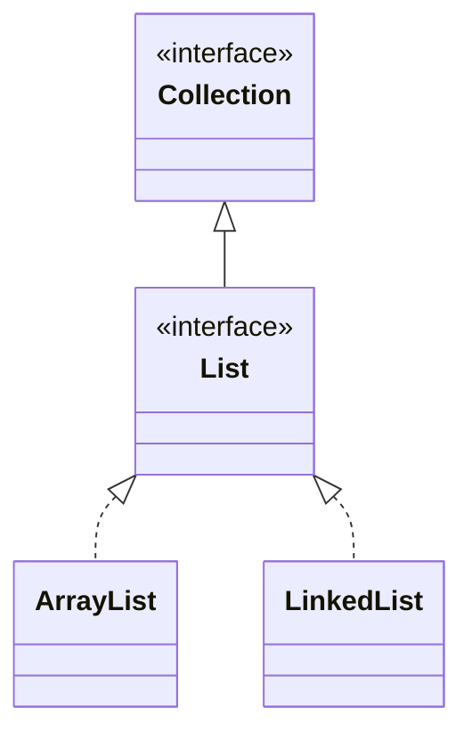

# The Collections Framework — Program to the Interface

[Arrays](/synapse/programming-languages/java/control-flow/arrays) were our first containers, but their fixed size is a real limit. The **Collections Framework** is Java's library of growable, feature-rich containers. Its central design idea is worth more than any single class:

- you program to an **interface** (`List`), a named set of operations;
- you *choose* an implementation (`ArrayList`, `LinkedList`) only at the moment you create the object.

Code written against `List` works with any list, so you can swap implementations for performance without changing a line that uses them. This lesson covers `List` and why it holds `Integer` rather than `int`. Then come the `Iterator` behind every for-each, sorting, the `Deque` as a stack and a queue, and how to choose an implementation.

<div style="border-left:4px solid #195045;background:rgba(25,80,69,0.08);padding:0.6rem 1rem;border-radius:0 0.5rem 0.5rem 0;margin:1.25rem 0">

💡 **The core idea.**

- Program to the **interface** (`List`), not the implementation (`ArrayList`/`LinkedList`).
- Declaring the interface lets you **swap implementations** freely.
- Collections hold objects, so an `int` travels as an `Integer`.
- The `Iterator` drives for-each and forbids modifying mid-loop.
- Implementation choice is a **performance** trade-off, not a correctness one.

</div>

This is the deep pass of [arrays](/synapse/programming-languages/java/control-flow/arrays). The `<Integer>` notation is a *generic* type, "a `List` of `Integer`". It gets its full treatment in [Generics](/synapse/programming-languages/java/core-libraries/generics); read it here as "this list holds `Integer`s". Every output below was produced by compiling and running the code on Java 21.

**You'll be able to:** add, read, replace and remove elements of a `List`, and predict what a `List.of` list allows; explain why a list holds `Integer`, not `int`, and predict what `remove(1)` removes from a `List<Integer>`; predict when changing a list inside a for-each throws, and remove safely with an `Iterator`; sort a list in natural, reverse and case-insensitive order, and make a class of your own sortable; use a `Deque` as a stack and as a queue, and pick between `ArrayList`, `LinkedList` and `ArrayDeque`.

<div style="border-left:4px solid #15448e;background:rgba(21,68,142,0.08);padding:0.6rem 1rem;border-radius:0 0.5rem 0.5rem 0;margin:1.25rem 0">

📘 **How to read the Intuition boxes.** Each one is built in three moves:

1. **The mechanism** — what the compiler and the JVM *do*.
2. **A concrete bite** — a specific, runnable failure (often a real compiler error), shown so the trap is visible.
3. **The earned rule** — the decision heuristic, now justified rather than asserted, plus its cost.

</div>

---

## Table of contents

1. [A `List` grows where an array can't](#1-a-list-grows-where-an-array-cant)
2. [`Integer`, not `int`: wrappers in collections](#2-integer-not-int-wrappers-in-collections)
3. [Program to the interface](#3-program-to-the-interface)
4. [Iteration, the `Iterator`, and the modification trap](#4-iteration-the-iterator-and-the-modification-trap)
5. [Sorting a list](#5-sorting-a-list)
6. [`Deque`: a stack and a queue](#6-deque-a-stack-and-a-queue)
7. [Choosing an implementation](#7-choosing-an-implementation)
8. [Mental-model summary](#8-mental-model-summary)
9. [Gotcha checklist](#9-gotcha-checklist)
10. [Check yourself](#-check-yourself)
11. [Sources](#-sources)

---

## 1. A `List` grows where an array can't

A `List` is an ordered, *resizable* sequence <abbr title="Java SE 21 API, java.util.List">[1]</abbr>:

- `add` appends;
- `get(i)` reads by index;
- `set(i, v)` replaces;
- `size()` reports the count.

Unlike an array, it grows as you add.

```java run viz=array:scores
import java.util.List;
import java.util.ArrayList;

public class Main {
    public static void main(String[] args) {
        List<Integer> scores = new ArrayList<>();
        scores.add(90);
        scores.add(85);
        scores.add(95);
        System.out.println(scores.size());
        System.out.println(scores.get(1));
        scores.set(1, 100);
        System.out.println(scores);
    }
}
```

**Output:**
```
3
85
[90, 100, 95]
```

**Analysis.** We never declared a size: `add` grew the list to three.

- `get(1)` returned the element at index 1 (`85`); indices start at `0`, as with arrays.
- `set(1, 100)` replaced it.
- Printing the list shows `[90, 100, 95]`. A `List` has a readable `toString`, unlike a bare array.

The empty `<>` after `ArrayList` is the **diamond** form <abbr title="The Java Language Specification, Java SE 21, §15.9">[19]</abbr>: the compiler fills in `Integer` from the variable's type.

**Intuition.**
*Mechanism.* `ArrayList` keeps its elements in an array. When the array fills, it allocates a bigger one and copies the elements over. The API leaves the growth policy unspecified "beyond the fact that adding an element has constant amortized time cost" <abbr title="Java SE 21 API, java.util.ArrayList">[2]</abbr>. `get` and `set` are direct array indexing underneath.

*Concrete bite.* Not every `List` grows. `List.of(...)` builds an **unmodifiable** list: any `add`, `remove` or `set` throws <abbr title="Java SE 21 API, java.util.List, Unmodifiable Lists">[1]</abbr>:

```java run
import java.util.List;

public class Main {
    public static void main(String[] args) {
        List<String> fixed = List.of("a", "b");
        System.out.println(fixed);
        fixed.add("c");
    }
}
```

**Output** *(prints one line, then a thrown exception):*
```
[a, b]
Exception in thread "main" java.lang.UnsupportedOperationException
```

`List.of` is handy for a fixed list of values. To get a list you can change, copy it into an `ArrayList`: `new ArrayList<>(List.of("a", "b"))` accepts `add("c")` and prints `[a, b, c]`.

<div style="border-left:4px solid #195045;background:rgba(25,80,69,0.08);padding:0.6rem 1rem;border-radius:0 0.5rem 0.5rem 0;margin:1.25rem 0">

💡 **Earned rule.** Reach for a `List` whenever the number of elements isn't fixed up front, which is most of the time. Keep a bare array only when the size is truly fixed and you need raw speed or primitives without boxing. Use `List.of` for values that never change, and `new ArrayList<>(…)` for a list you will edit.

The cost of a `List` is the boxing of primitives (next section) and a little overhead per element. The benefit is growth, a rich API, and a real `toString`.

</div>

---

## 2. `Integer`, not `int`: wrappers in collections

A collection holds **objects**, never primitives. The type inside `<…>` must be a reference type <abbr title="The Java Language Specification, Java SE 21, §4.5.1">[3]</abbr>, so `List<int>` does not compile:

```java run
import java.util.List;
import java.util.ArrayList;

public class Main {
    public static void main(String[] args) {
        List<int> nums = new ArrayList<>();
    }
}
```

**Compiler error:**
```
Main.java:6: error: unexpected type
        List<int> nums = new ArrayList<>();
             ^
  required: reference
  found:    int
```

The fix is the **wrapper class** from [References, Equality & the Object Model](/synapse/programming-languages/java/classes-and-objects/references-equality-and-the-object-model): `List<Integer>`. Java converts in both directions for you:

- **boxing** wraps an `int` into an `Integer` when you `add` it <abbr title="The Java Language Specification, Java SE 21, §5.1.7">[4]</abbr>;
- **unboxing** unwraps an `Integer` into an `int` when you assign it to an `int` <abbr title="The Java Language Specification, Java SE 21, §5.1.8">[5]</abbr>.

A list of `Integer` can also hold `null`, which no `int` can. Unboxing that `null` throws:

```java run
import java.util.List;
import java.util.ArrayList;

public class Main {
    public static void main(String[] args) {
        List<Integer> nums = new ArrayList<>();
        nums.add(7);                 // boxing: int 7 becomes an Integer
        int first = nums.get(0);     // unboxing: the Integer becomes an int
        System.out.println(first + 1);
        nums.add(null);              // a List<Integer> may hold null
        System.out.println(nums);
        int total = 0;
        for (int n : nums) {
            total += n;
        }
        System.out.println(total);
    }
}
```

**Output** *(prints two lines, then a thrown exception):*
```
8
[7, null]
Exception in thread "main" java.lang.NullPointerException: Cannot invoke "java.lang.Integer.intValue()" because the return value of "java.util.Iterator.next()" is null
```

**Analysis.** `add(7)` boxed and `get(0)` unboxed, so `first + 1` is `8`. The list printed `null` without complaint. The crash came in the loop: `for (int n : nums)` unboxes each element into `int n`, and the second element was `null`. The message names `Iterator.next()`, a first look at the machinery of §4.

**Intuition.**
*Mechanism.* Boxing is automatic, and so is its failure. A `List` method may take either an index (`int`) or an element (`Object`), and `List` declares both `remove(int index)` and `remove(Object o)` <abbr title="Java SE 21 API, java.util.List">[1]</abbr>. The compiler first looks for a method that fits *without* boxing <abbr title="The Java Language Specification, Java SE 21, §15.12.2">[6]</abbr>. With an `int` argument, `remove(int)` fits, so it wins.

*Concrete bite.* `remove(1)` on a `List<Integer>` removes the element at **index** 1, not the value `1`:

```java run viz=array:nums
import java.util.List;
import java.util.ArrayList;

public class Main {
    public static void main(String[] args) {
        List<Integer> nums = new ArrayList<>();
        nums.add(10); nums.add(20); nums.add(30);
        nums.remove(1);
        System.out.println(nums);
        nums.remove(Integer.valueOf(10));
        System.out.println(nums);
    }
}
```

**Output:**
```
[10, 30]
[30]
```

**Analysis.** `remove(1)` did **not** remove a value `1`. It removed the element at index `1` (the `20`), leaving `[10, 30]`. To remove by *value*, pass an `Integer` object: `remove(Integer.valueOf(10))` removed the value `10`.

<div style="border-left:4px solid #195045;background:rgba(25,80,69,0.08);padding:0.6rem 1rem;border-radius:0 0.5rem 0.5rem 0;margin:1.25rem 0">

💡 **Earned rule.** Write `List<Integer>`, and let boxing do the conversions. With a `List<Integer>`, remove by value with `remove(Integer.valueOf(x))` or `remove((Integer) x)`, never a bare `remove(x)`, which means *index*. Keep `null` out of a list you will unbox.

The cost is one object per number and one overload to remember. The benefit is every collection in the library, for numbers too.

</div>

---

## 3. Program to the interface

`List` is an *interface*: a contract of operations. `ArrayList` and `LinkedList` are two *implementations* of it. Declare your variables and parameters as `List`, and your code works with **any** implementation; the concrete class appears only at `new`.

```java run
import java.util.List;
import java.util.ArrayList;
import java.util.LinkedList;

public class Main {
    static int sum(List<Integer> nums) {   // accepts ANY List
        int total = 0;
        for (int n : nums) total += n;
        return total;
    }

    public static void main(String[] args) {
        List<Integer> a = new ArrayList<>();
        a.add(1); a.add(2); a.add(3);
        List<Integer> b = new LinkedList<>();
        b.add(10); b.add(20);
        System.out.println(sum(a));
        System.out.println(sum(b));
    }
}
```

**Output:**
```
6
30
```



**Analysis.** `sum` is written against `List`, so it summed both an `ArrayList` and a `LinkedList` with no change: they share the `List` contract. The diagram shows the relationship:

- `List` extends `Collection`, the root interface of the framework <abbr title="Java SE 21 API, java.util.Collection">[7]</abbr>;
- both concrete classes *implement* `List` (the dotted lines).

The variable type (`List`) is the contract; the `new` type is the implementation.

**Intuition.**
*Mechanism.* The compiler checks a call on a `List` variable against `List`'s declared methods only. So any object whose class implements `List` is acceptable. At run time the actual implementation's methods run; [Inheritance & Polymorphism](/synapse/programming-languages/java/robust-oop/inheritance-and-polymorphism) calls this dynamic dispatch. Your code depends on the interface, not the class.

*Concrete bite.* The payoff is swap-ability. Change `new ArrayList<>()` to `new LinkedList<>()` and nothing else breaks, because every caller spoke to `List`. Declare the variable as `ArrayList` instead, and the choice is welded in: callers can now use `ArrayList`-only methods, and swapping becomes a refactor.

<div style="border-left:4px solid #195045;background:rgba(25,80,69,0.08);padding:0.6rem 1rem;border-radius:0 0.5rem 0.5rem 0;margin:1.25rem 0">

💡 **Earned rule.** Declare variables, parameters, and return types with the **interface** (`List`, `Collection`), and name the implementation only at construction.

The cost is forgoing implementation-specific methods, which you rarely need. The benefit is that the implementation becomes a decision you can revisit for performance without touching the code that uses it.

</div>

---

## 4. Iteration, the `Iterator`, and the modification trap

Every collection is walked by an **`Iterator`**: an object with `hasNext()` and `next()` <abbr title="Java SE 21 API, java.util.Iterator">[8]</abbr>. The enhanced `for` over a collection is shorthand for a loop over its iterator <abbr title="The Java Language Specification, Java SE 21, §14.14.2">[9]</abbr>. That iterator enforces a rule: you may not structurally modify a collection while a for-each walks it.

```java run viz=array:nums
import java.util.List;
import java.util.ArrayList;

public class Main {
    public static void main(String[] args) {
        List<Integer> nums = new ArrayList<>();
        nums.add(1); nums.add(2); nums.add(3); nums.add(4);
        for (int n : nums) System.out.print(n + " ");
        System.out.println();
    }
}
```

**Output:**
```
1 2 3 4 
```

**Analysis.** The for-each obtained an `Iterator` from `nums` and called `hasNext()` and `next()` under the hood to visit each element. There is no index; the iterator tracks the position.

**Intuition.**
*Mechanism.* The list counts its structural changes. The iterator remembers the count it started with and checks it on each `next()`.

Suppose something *other* than the iterator adds or removes an element. The counts then differ, and `next()` throws `ConcurrentModificationException`. This is called **fail-fast**: it catches the bug instead of silently skipping or repeating elements <abbr title="Java SE 21 API, java.util.ArrayList">[2]</abbr>.

*Concrete bite.* Remove from the list inside a for-each, and it throws:

```java run viz=array:nums
import java.util.List;
import java.util.ArrayList;

public class Main {
    public static void main(String[] args) {
        List<Integer> nums = new ArrayList<>();
        nums.add(1); nums.add(2); nums.add(3); nums.add(4);
        for (int n : nums) {
            if (n % 2 == 0) nums.remove(Integer.valueOf(n));
        }
        System.out.println(nums);
    }
}
```

**Output** *(a thrown exception):*
```
Exception in thread "main" java.util.ConcurrentModificationException
```

`nums.remove(...)` changed the list behind the for-each's iterator, so the next `next()` detected the mismatch and threw. The check is only "best-effort" <abbr title="Java SE 21 API, java.util.ArrayList">[2]</abbr>. Remove the second-to-last element, and the loop ends before the next `next()`, with no exception, and an element never visited:

```java run
import java.util.List;
import java.util.ArrayList;

public class Main {
    public static void main(String[] args) {
        List<Integer> nums = new ArrayList<>();
        nums.add(1); nums.add(2); nums.add(3);
        for (int n : nums) {
            if (n == 2) nums.remove(Integer.valueOf(n));
        }
        System.out.println(nums);
    }
}
```

**Output:**
```
[1, 3]
```

The result looks right, but the loop never visited `3`: after the removal, `hasNext()` saw no more elements. The API warns that "it would be wrong to write a program that depended on this exception for its correctness" <abbr title="Java SE 21 API, java.util.ArrayList">[2]</abbr>. The fix is to remove **through the iterator**, whose own `remove()` keeps the counts in sync:

```java run viz=array:nums
import java.util.List;
import java.util.ArrayList;
import java.util.Iterator;

public class Main {
    public static void main(String[] args) {
        List<Integer> nums = new ArrayList<>();
        nums.add(1); nums.add(2); nums.add(3); nums.add(4);
        Iterator<Integer> it = nums.iterator();
        while (it.hasNext()) {
            int n = it.next();
            if (n % 2 == 0) it.remove();
        }
        System.out.println(nums);
    }
}
```

**Output:**
```
[1, 3]
```

<div style="border-left:4px solid #195045;background:rgba(25,80,69,0.08);padding:0.6rem 1rem;border-radius:0 0.5rem 0.5rem 0;margin:1.25rem 0">

💡 **Earned rule.** Never `add` or `remove` on a collection while a for-each is walking it, even when no exception appears. To delete during a pass, use an explicit `Iterator` and its `remove()`. Once you have [lambdas](/synapse/programming-languages/java/robust-oop/nested-and-anonymous-classes-and-lambdas), `removeIf` does the same in one call.

The cost of the fail-fast check is that the convenient for-each can't mutate. The benefit is that most "modified mid-iteration" bugs throw loudly instead of silently corrupting the traversal.

</div>

---

## 5. Sorting a list

A list is sorted in place, by `Collections.sort(list)` or `list.sort(order)`:

- with no order given, elements sort by their **natural ordering**: numbers ascending, strings by character code <abbr title="Java SE 21 API, java.lang.Comparable">[10]</abbr>;
- a **`Comparator`** is an object that supplies another order. The library has ready-made ones, such as `Comparator.reverseOrder()` and `String.CASE_INSENSITIVE_ORDER` <abbr title="Java SE 21 API, java.util.Comparator and String.CASE_INSENSITIVE_ORDER">[11]</abbr>.

Arrays have their own `Arrays.sort` <abbr title="Java SE 21 API, java.util.Arrays.sort">[12]</abbr>.

```java run
import java.util.Arrays;
import java.util.ArrayList;
import java.util.Collections;
import java.util.Comparator;
import java.util.List;

public class Main {
    public static void main(String[] args) {
        List<Integer> nums = new ArrayList<>(List.of(30, 10, 20));
        Collections.sort(nums);
        System.out.println(nums);
        nums.sort(Comparator.reverseOrder());
        System.out.println(nums);

        List<String> words = new ArrayList<>(List.of("banana", "Cherry", "apple"));
        Collections.sort(words);
        System.out.println(words);
        words.sort(String.CASE_INSENSITIVE_ORDER);
        System.out.println(words);

        int[] arr = {5, 2, 9, 1};
        Arrays.sort(arr);
        System.out.println(Arrays.toString(arr));
    }
}
```

**Output:**
```
[10, 20, 30]
[30, 20, 10]
[Cherry, apple, banana]
[apple, banana, Cherry]
[1, 2, 5, 9]
```

**Analysis.**

- The numbers sorted ascending, then descending with `reverseOrder()`.
- The natural order put `Cherry` first. `String` compares "the Unicode value of each character" <abbr title="Java SE 21 API, String.compareTo">[13]</abbr>, and the capitals `A`–`Z` come before the lowercase `a`–`z`.
- `CASE_INSENSITIVE_ORDER` ignored case and gave dictionary order.
- `Arrays.sort` sorted the `int[]` in place.

**Intuition.**
*Mechanism.* Natural ordering comes from the **`Comparable`** interface. A class that implements it has a `compareTo` method. It returns a negative number, zero, or a positive number: `this` is less than, equal to, or greater than the other object <abbr title="Java SE 21 API, java.lang.Comparable">[10]</abbr>.

`Integer` and `String` implement it. A class you write does not, until you say so.

*Concrete bite.* Sort a list of your own objects, and there is no order to use:

```java run
import java.util.ArrayList;
import java.util.Collections;
import java.util.List;

class Player {
    String name;
    int score;

    Player(String name, int score) {
        this.name = name;
        this.score = score;
    }
}

public class Main {
    public static void main(String[] args) {
        List<Player> players = new ArrayList<>();
        players.add(new Player("Ada", 90));
        players.add(new Player("Bo", 70));
        Collections.sort(players);
    }
}
```

**Compiler error:**
```
Main.java:20: error: no suitable method found for sort(List<Player>)
        Collections.sort(players);
                   ^
```

`Collections.sort(list)` accepts only a list of `Comparable` elements, so javac rejects it (the rest of the message is about [generics](/synapse/programming-languages/java/core-libraries/generics)). `players.sort(null)` compiles, but fails at run time with `ClassCastException: class Player cannot be cast to class java.lang.Comparable`. The fix is to give `Player` a natural ordering:

```java run
import java.util.ArrayList;
import java.util.List;

class Player implements Comparable<Player> {
    String name;
    int score;

    Player(String name, int score) {
        this.name = name;
        this.score = score;
    }

    public int compareTo(Player other) {
        return Integer.compare(score, other.score);   // negative, zero or positive
    }

    public String toString() {
        return name + "=" + score;
    }
}

public class Main {
    public static void main(String[] args) {
        List<Player> players = new ArrayList<>();
        players.add(new Player("Ada", 90));
        players.add(new Player("Bo", 70));
        players.add(new Player("Cy", 80));
        players.sort(null);
        System.out.println(players);
    }
}
```

**Output:**
```
[Bo=70, Cy=80, Ada=90]
```

**Analysis.**

- `implements Comparable<Player>` promises that `Player` has a `compareTo(Player)` method. Interfaces get their own lesson in [Abstract Classes & Interfaces](/synapse/programming-languages/java/robust-oop/abstract-classes-and-interfaces).
- `Integer.compare` returns the negative, zero or positive result that `compareTo` needs.
- `players.sort(null)` means "natural order" <abbr title="Java SE 21 API, List.sort">[14]</abbr>, so the players sorted by score.
- The class's own `toString` replaced the default `Player@…` text in the printout.

<div style="border-left:4px solid #195045;background:rgba(25,80,69,0.08);padding:0.6rem 1rem;border-radius:0 0.5rem 0.5rem 0;margin:1.25rem 0">

💡 **Earned rule.** Sort with `list.sort(…)` or `Collections.sort(…)`: natural order for numbers and strings, a `Comparator` for any other order. Give a class a natural ordering with `Comparable` when it has one obvious order.

The cost is that `String`'s natural order is not dictionary order: capitals sort first. For orders built on the fly, such as "by name, then by score", [lambdas](/synapse/programming-languages/java/robust-oop/nested-and-anonymous-classes-and-lambdas) make a `Comparator` in one line.

</div>

---

## 6. `Deque`: a stack and a queue

A **`Deque`** ("deck", a double-ended queue) is a sequence you add to and remove from at both ends <abbr title="Java SE 21 API, java.util.Deque">[15]</abbr>. It serves two classic shapes:

- a **stack** is last-in, first-out (LIFO): `push` adds to the front, `pop` removes from the front;
- a **queue** is first-in, first-out (FIFO): `offer` adds at the back, `poll` removes from the front.

`peek` looks at the front without removing it. `ArrayDeque` is the usual implementation.

```java run
import java.util.ArrayDeque;
import java.util.Deque;

public class Main {
    public static void main(String[] args) {
        Deque<String> stack = new ArrayDeque<>();
        stack.push("a");
        stack.push("b");
        stack.push("c");
        System.out.println(stack.peek());
        System.out.println(stack.pop());
        System.out.println(stack);

        Deque<String> queue = new ArrayDeque<>();
        queue.offer("a");
        queue.offer("b");
        queue.offer("c");
        System.out.println(queue.peek());
        System.out.println(queue.poll());
        System.out.println(queue);
    }
}
```

**Output:**
```
c
c
[b, a]
a
a
[b, c]
```

**Analysis.** The stack gave back `c`, the last element pushed. The queue gave back `a`, the first element offered. Printing a deque lists it from the front.

**Intuition.**
*Mechanism.* Each end has two families of methods <abbr title="Java SE 21 API, java.util.Deque">[15]</abbr>. One family throws an exception when the deque is empty: `pop`, `removeFirst`, `getFirst`. The other returns `null`: `poll`, `peek`. `ArrayDeque` also rejects `null` elements, so a `null` from `poll` always means "empty" <abbr title="Java SE 21 API, java.util.ArrayDeque">[16]</abbr>.

*Concrete bite.* On an empty deque, `poll` and `peek` are harmless, but `pop` throws:

```java run
import java.util.ArrayDeque;
import java.util.Deque;

public class Main {
    public static void main(String[] args) {
        Deque<String> queue = new ArrayDeque<>();
        System.out.println(queue.poll());
        System.out.println(queue.peek());
        queue.pop();
    }
}
```

**Output** *(prints two lines, then a thrown exception):*
```
null
null
Exception in thread "main" java.util.NoSuchElementException
```

<div style="border-left:4px solid #195045;background:rgba(25,80,69,0.08);padding:0.6rem 1rem;border-radius:0 0.5rem 0.5rem 0;margin:1.25rem 0">

💡 **Earned rule.** For a stack or a queue, declare a `Deque` and create an `ArrayDeque`. Use `poll` and `peek` when empty is normal, and check for `null`. Use `pop` when empty is a bug that should throw.

You may meet the old `Stack` class. Its API says a `Deque` "should be used in preference to this class" <abbr title="Java SE 21 API, java.util.Stack">[17]</abbr>.

</div>

---

## 7. Choosing an implementation

`ArrayList`, `LinkedList` and `ArrayDeque` differ in performance, because each stores its elements differently:

- `ArrayList` uses an array;
- `LinkedList` uses a chain of nodes, each linked to the next and the previous <abbr title="Java SE 21 API, java.util.LinkedList">[18]</abbr>;
- `ArrayDeque` uses a resizable array <abbr title="Java SE 21 API, java.util.ArrayDeque">[16]</abbr>.

The choice is about *cost*, not behavior.

| Operation | `ArrayList` | `LinkedList` | `ArrayDeque` |
|---|---|---|---|
| `get(i)` / `set(i)` by index | O(1) | O(n): walk the chain | not offered |
| add or remove at the end | O(1) amortized | O(1) | O(1) amortized |
| add or remove at the front | O(n): shift elements | O(1) | O(1) amortized |
| add or remove in the middle | O(n): shift elements | O(1) *at a node you hold* | not offered |
| memory per element | low (one array slot) | higher (a node and two links) | low (one array slot) |

`LinkedList` "will traverse the list from the beginning or the end, whichever is closer" to reach an index <abbr title="Java SE 21 API, java.util.LinkedList">[18]</abbr>. That is why `get(i)` is O(n). `ArrayDeque` "is likely to be … faster than `LinkedList` when used as a queue" <abbr title="Java SE 21 API, java.util.ArrayDeque">[16]</abbr>.

<div style="border-left:4px solid #195045;background:rgba(25,80,69,0.08);padding:0.6rem 1rem;border-radius:0 0.5rem 0.5rem 0;margin:1.25rem 0">

💡 **Earned rule.** Default to `ArrayList` for a list, and to `ArrayDeque` for a stack or a queue. Reach for `LinkedList` only when you insert and remove in the middle through an iterator, or need a queue that holds `null`.

The cost of a wrong choice is speed, never correctness: all three give the same results through their interfaces.

</div>

---

## 8. Mental-model summary

| Principle | Consequence |
|---|---|
| A `List` is a growable, ordered sequence | No fixed size; `add` expands it; it has a real `toString` |
| `List.of` builds an unmodifiable list | `add`, `remove` and `set` throw `UnsupportedOperationException`; copy into an `ArrayList` to edit |
| Collections hold objects, not primitives | `List<Integer>`, not `List<int>`; boxing and unboxing convert; unboxing `null` throws |
| `remove(int)` and `remove(Object)` are overloads | A bare `int` picks the index version |
| Program to the interface (`List`), choose the implementation at `new` | Code works with any `List`; you can swap implementations freely |
| A for-each runs on an `Iterator` and is fail-fast, best-effort | Modifying the collection mid-loop throws, or silently skips; delete through the iterator |
| Natural order comes from `Comparable`; other orders from a `Comparator` | `String` sorts capitals first; a class of your own needs `Comparable` to sort by itself |
| A `Deque` is a stack (`push`/`pop`) or a queue (`offer`/`poll`) | `pop` on empty throws; `poll` and `peek` return `null` |
| Implementation is a performance choice, same interface | `ArrayList` for lists, `ArrayDeque` for stacks and queues |

## 9. Gotcha checklist

<div style="border-left:4px solid #da5233;background:rgba(218,82,51,0.08);padding:0.6rem 1rem;border-radius:0 0.5rem 0.5rem 0;margin:1.25rem 0">

| Symptom | Likely cause | Fix |
|---|---|---|
| `UnsupportedOperationException` on `add` or `remove` | the list came from `List.of` | `new ArrayList<>(List.of(…))` |
| `unexpected type`, `required: reference`, `found: int` | a primitive inside `<…>` | `List<Integer>` |
| `Cannot invoke "java.lang.Integer.intValue()"` in a for-each | a `null` element unboxed into `int` | keep `null` out, or loop with `Integer` and check |
| `list.remove(x)` removed the wrong element | `remove(int)` is by index | `remove(Integer.valueOf(x))` |
| `ConcurrentModificationException` | `add` or `remove` during a for-each | an explicit `Iterator` and its `remove()`, or `removeIf` |
| An element was never visited after a removal in a for-each | fail-fast is best-effort; removing the second-to-last ends the loop | the same fix; never rely on the exception |
| `no suitable method found for sort(List<…>)` | the element class is not `Comparable` | implement `Comparable`, or pass a `Comparator` |
| `ClassCastException: … cannot be cast to class java.lang.Comparable` | `list.sort(null)` on a class with no natural order | the same fix |
| Sorted strings put `Zebra` before `apple` | natural order compares character codes | `String.CASE_INSENSITIVE_ORDER` |
| `NoSuchElementException` from `pop` | the deque was empty | check `isEmpty()`, or use `poll` and test for `null` |
| You declared `ArrayList` and now can't swap it | the variable names the implementation | declare it as `List` |
| Index access on a `LinkedList` is slow | `get(i)` walks the chain | `ArrayList` for index-heavy work |

</div>

---

## ✅ Check yourself

One check per objective. Answer before you open anything.

```quiz
{"prompt": "List<String> xs = List.of(\"a\", \"b\"); xs.add(\"c\"); — what happens?", "options": ["xs becomes [a, b, c]", "UnsupportedOperationException", "It does not compile"], "answer": "UnsupportedOperationException"}
```

```quiz
{"prompt": "List<Integer> xs = new ArrayList<>(List.of(5, 7, 9)); xs.remove(1); — what does System.out.println(xs) print?", "options": ["[7, 9]", "[5, 7, 9]", "[5, 9]"], "answer": "[5, 9]"}
```

```quiz
{"prompt": "A for-each over [1, 2, 3, 4] calls nums.remove(...) for each even number. What happens?", "options": ["It prints [1, 3]", "ConcurrentModificationException", "It does not compile"], "answer": "ConcurrentModificationException"}
```

```quiz
{"prompt": "List<String> words = new ArrayList<>(List.of(\"pear\", \"Apple\", \"fig\")); Collections.sort(words); — what is words?", "options": ["[Apple, fig, pear]", "[fig, pear, Apple]", "[pear, fig, Apple]"], "answer": "[Apple, fig, pear]"}
```

```quiz
{"prompt": "Deque<Integer> d = new ArrayDeque<>(); d.push(1); d.push(2); d.offer(3); — what does d.poll() return?", "options": ["1", "2", "3"], "answer": "2"}
```

<details>
<summary>The 🧪 box below: <code>set(0, "z")</code>, removing every <code>"b"</code> in a for-each, and <code>xs.remove(1)</code> against <code>xs.remove(Integer.valueOf(1))</code>.</summary>

- After `add("a")`, `add("b")`, `add("c")` and `set(0, "z")`, the list prints `[z, b, c]`.
- Removing every `"b"` from `["a", "b", "b", "c"]` inside a for-each throws `ConcurrentModificationException`: the second `"b"` is not the second-to-last element when the first is removed. The iterator version prints `[a, c]`:

```java run
import java.util.ArrayList;
import java.util.Iterator;
import java.util.List;

public class Main {
    public static void main(String[] args) {
        List<String> xs = new ArrayList<>(List.of("a", "b", "b", "c"));
        Iterator<String> it = xs.iterator();
        while (it.hasNext()) {
            if (it.next().equals("b")) it.remove();
        }
        System.out.println(xs);
    }
}
```

**Output:**
```
[a, c]
```

- `xs.remove(1)` on `[5, 7]` removes index 1 and leaves `[5]`. `xs.remove(Integer.valueOf(1))` looks for the value `1`, finds none, returns `false`, and leaves `[5, 7]`.

</details>

---

## 📚 Sources

1. `java.util.List`, Java SE 21 API ("Unmodifiable Lists"; `remove(int)` and `remove(Object)`) — <https://docs.oracle.com/en/java/javase/21/docs/api/java.base/java/util/List.html>
2. `java.util.ArrayList`, Java SE 21 API (growth policy; "fail-fast … on a best-effort basis") — <https://docs.oracle.com/en/java/javase/21/docs/api/java.base/java/util/ArrayList.html>
3. *The Java Language Specification, Java SE 21*, §4.5.1 "Type Arguments of Parameterized Types" ("Type arguments may be either reference types or wildcards") — <https://docs.oracle.com/javase/specs/jls/se21/html/jls-4.html#jls-4.5.1>
4. *The Java Language Specification, Java SE 21*, §5.1.7 "Boxing Conversion" — <https://docs.oracle.com/javase/specs/jls/se21/html/jls-5.html#jls-5.1.7>
5. *The Java Language Specification, Java SE 21*, §5.1.8 "Unboxing Conversion" — <https://docs.oracle.com/javase/specs/jls/se21/html/jls-5.html#jls-5.1.8>
6. *The Java Language Specification, Java SE 21*, §15.12.2 "Compile-Time Step 2: Determine Method Signature" (the first phase permits no boxing) — <https://docs.oracle.com/javase/specs/jls/se21/html/jls-15.html#jls-15.12.2>
7. `java.util.Collection`, Java SE 21 API ("The root interface in the collection hierarchy") — <https://docs.oracle.com/en/java/javase/21/docs/api/java.base/java/util/Collection.html>
8. `java.util.Iterator`, Java SE 21 API — <https://docs.oracle.com/en/java/javase/21/docs/api/java.base/java/util/Iterator.html>
9. *The Java Language Specification, Java SE 21*, §14.14.2 "The enhanced `for` statement" (translation to an `Iterator` loop) — <https://docs.oracle.com/javase/specs/jls/se21/html/jls-14.html#jls-14.14.2>
10. `java.lang.Comparable`, Java SE 21 API (natural ordering; `compareTo` returns "a negative integer, zero, or a positive integer") — <https://docs.oracle.com/en/java/javase/21/docs/api/java.base/java/lang/Comparable.html>
11. `java.util.Comparator.reverseOrder()` and `java.lang.String.CASE_INSENSITIVE_ORDER`, Java SE 21 API — <https://docs.oracle.com/en/java/javase/21/docs/api/java.base/java/util/Comparator.html#reverseOrder()>
12. `java.util.Arrays.sort(int[])`, Java SE 21 API — <https://docs.oracle.com/en/java/javase/21/docs/api/java.base/java/util/Arrays.html#sort(int%5B%5D)>
13. `java.lang.String.compareTo(String)`, Java SE 21 API ("based on the Unicode value of each character") — <https://docs.oracle.com/en/java/javase/21/docs/api/java.base/java/lang/String.html#compareTo(java.lang.String)>
14. `java.util.List.sort(Comparator)`, Java SE 21 API ("If the specified comparator is null then … the elements' natural ordering should be used") — <https://docs.oracle.com/en/java/javase/21/docs/api/java.base/java/util/List.html#sort(java.util.Comparator)>
15. `java.util.Deque`, Java SE 21 API (the two method families; stack and queue tables) — <https://docs.oracle.com/en/java/javase/21/docs/api/java.base/java/util/Deque.html>
16. `java.util.ArrayDeque`, Java SE 21 API ("Null elements are prohibited"; faster than `Stack` and `LinkedList`) — <https://docs.oracle.com/en/java/javase/21/docs/api/java.base/java/util/ArrayDeque.html>
17. `java.util.Stack`, Java SE 21 API — <https://docs.oracle.com/en/java/javase/21/docs/api/java.base/java/util/Stack.html>
18. `java.util.LinkedList`, Java SE 21 API ("Doubly-linked list"; index operations traverse) — <https://docs.oracle.com/en/java/javase/21/docs/api/java.base/java/util/LinkedList.html>
19. *The Java Language Specification, Java SE 21*, §15.9 "Class Instance Creation Expressions" (the diamond form `<>`) — <https://docs.oracle.com/javase/specs/jls/se21/html/jls-15.html#jls-15.9>

---

<div style="border-left:4px solid #6d28d9;background:rgba(109,40,217,0.08);padding:0.6rem 1rem;border-radius:0 0.5rem 0.5rem 0;margin:1.25rem 0">

🧪 **Predict, then check.**

1. Create a `List<String>`, `add("a")`, `add("b")`, `add("c")`, then `set(0, "z")`, and print it.
2. Predict whether removing every `"b"` from `["a", "b", "b", "c"]` inside a for-each throws, then rewrite it with an `Iterator`.
3. For `List<Integer> xs = new ArrayList<>(); xs.add(5); xs.add(7);`, predict what `xs.remove(1)` leaves, and what `xs.remove(Integer.valueOf(1))` would do instead.

</div>

## Your Turn

Before you move on, check your understanding with the coach — explain the idea, apply it, weigh the trade-offs, then defend your reasoning.

<div class="concept-coach"></div>
