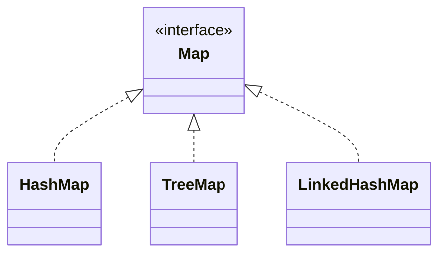

# Sets & Maps — Uniqueness and Lookup

A [`List`](/synapse/programming-languages/java/core-libraries/the-collections-framework) keeps things in order and allows duplicates. Two other shapes cover most of what's left:

- a **`Set`** stores *unique* elements and answers "is this in here?" in about constant time;
- a **`Map`** stores *key → value* associations and answers "what's the value for this key?" as fast.

Both come in three forms:

- hash-based, fast but unordered: `HashSet`, `HashMap`;
- tree-based, with keys sorted: `TreeSet`, `TreeMap`;
- linked, with insertion order kept: `LinkedHashSet`, `LinkedHashMap`.

The speed of the hash versions comes from **hashing** entries into buckets. That mechanism is why the next lesson's `hashCode` contract matters.

<div style="border-left:4px solid #195045;background:rgba(25,80,69,0.08);padding:0.6rem 1rem;border-radius:0 0.5rem 0.5rem 0;margin:1.25rem 0">

💡 **The core idea.**

- A **`Set`** stores unique elements; a **`Map`** stores key→value.
- Hash forms give about constant-time lookup by **hashing into buckets**, trading order for speed.
- `Tree*` keeps keys sorted; `LinkedHash*` keeps insertion order.

</div>

This builds on [the Collections Framework](/synapse/programming-languages/java/core-libraries/the-collections-framework) and the [`null`-unboxing](/synapse/programming-languages/java/classes-and-objects/references-equality-and-the-object-model) hazard. Every output below was produced by compiling and running the code on Java 21.

**You'll be able to:** predict a set's size and `contains` results after duplicate adds, and say when a duplicate throws instead; pick `HashSet`, `LinkedHashSet` or `TreeSet` by the iteration order you need, and explain why `HashSet` order is never a contract; store, update, remove and iterate a map's entries, and predict what `get` returns for a missing key; write the counting idiom, and explain why `get(k) + 1` throws on a new key.

<div style="border-left:4px solid #15448e;background:rgba(21,68,142,0.08);padding:0.6rem 1rem;border-radius:0 0.5rem 0.5rem 0;margin:1.25rem 0">

📘 **How to read the Intuition boxes.** Each one is built in three moves:

1. **The mechanism** — what the compiler and the JVM *do*.
2. **A concrete bite** — a specific, runnable failure (often a real compiler error), shown so the trap is visible.
3. **The earned rule** — the decision heuristic, now justified rather than asserted, plus its cost.

</div>

---

## Table of contents

1. [`Set`: unique elements](#1-set-unique-elements)
2. [Three flavors: hashed, sorted, insertion-ordered](#2-three-flavors-hashed-sorted-insertion-ordered)
3. [`Map`: key → value](#3-map-key--value)
4. [The counting idiom](#4-the-counting-idiom)
5. [Mental-model summary](#5-mental-model-summary)
6. [Gotcha checklist](#6-gotcha-checklist)
7. [Check yourself](#-check-yourself)
8. [Sources](#-sources)

---

## 1. `Set`: unique elements

A `Set` holds each element at most once <abbr title="Java SE 21 API, java.util.Set">[1]</abbr>. Adding a duplicate changes nothing, and `contains` answers membership in constant time on average.

```java run viz=hashmap:seen
import java.util.Set;
import java.util.HashSet;

public class Main {
    public static void main(String[] args) {
        Set<String> seen = new HashSet<>();
        seen.add("a");
        seen.add("b");
        seen.add("a");
        System.out.println(seen.size());
        System.out.println(seen.contains("a"));
        System.out.println(seen.contains("z"));
    }
}
```

**Output:**
```
2
true
false
```

```d2
direction: right

key: "element  \"a\"" {
  shape: oval
}
hashfn: "hashCode() % 4" {
  shape: rectangle
}
buckets: "HashSet buckets" {
  grid-rows: 4
  b0: "0:  (empty)"
  b1: "1:  \"a\""
  b2: "2:  \"b\""
  b3: "3:  (empty)"
}

key -> hashfn
hashfn -> buckets.b1: "97 % 4 = 1"
```

**Analysis.** Adding `"a"` twice left the size at `2`: the second `add` found `"a"` already present and did nothing. `contains` returned `true` for a member and `false` for a non-member, each without scanning the whole set.

The diagram shows why it is fast. An element's **hash code** is a number computed from its contents; `"a"` gives `97`, and `"b"` gives `98`. The hash code picks a **bucket**, so a membership check looks in one bucket, not at every element. (The diagram is simplified to 4 buckets; a new `HashSet` starts with 16 <abbr title="Java SE 21 API, java.util.HashSet">[2]</abbr>.)

**Intuition.**
*Mechanism.* A `HashSet` keeps an array of buckets <abbr title="Java SE 21 API, java.util.HashSet">[2]</abbr>. To add or look up an element, it computes the element's `hashCode`, maps that to a bucket index, and checks only that bucket.

- So `add` and `contains` take constant time, "assuming the hash function disperses the elements properly among the buckets" <abbr title="Java SE 21 API, java.util.HashSet">[2]</abbr>. A `List.contains` scans every element: O(n).
- Uniqueness falls out: an element that lands in an occupied bucket is compared with `.equals`, and dropped if an equal one is already there.

*Concrete bite.* Uniqueness does not always mean "a duplicate is ignored". `Set.of(...)` builds an unmodifiable set, and it **rejects** duplicates at creation <abbr title="Java SE 21 API, java.util.Set, Unmodifiable Sets">[1]</abbr>:

```java run
import java.util.Set;

public class Main {
    public static void main(String[] args) {
        Set<String> fixed = Set.of("a", "b");
        System.out.println(fixed.contains("a"));
        Set<String> twice = Set.of("a", "a");
    }
}
```

**Output** *(prints one line, then a thrown exception):*
```
true
Exception in thread "main" java.lang.IllegalArgumentException: duplicate element: a
```

`Map.of` does the same for a repeated key: `duplicate key: k`. Like `List.of`, both are unmodifiable, so `add` or `put` on them throws `UnsupportedOperationException`.

<div style="border-left:4px solid #195045;background:rgba(25,80,69,0.08);padding:0.6rem 1rem;border-radius:0 0.5rem 0.5rem 0;margin:1.25rem 0">

💡 **Earned rule.** Use a `Set` when you need uniqueness or fast membership tests: "have I seen this?", "is this allowed?". Reach for a `HashSet` by default. Use `Set.of` only for fixed values you know are distinct.

The cost is losing order and a small overhead per element. The benefit is membership in constant time instead of the O(n) scan a `List.contains` does.

</div>

A type stored in a `HashSet` must define `hashCode` and `equals` together, or equal objects land in different buckets. That contract is the subject of [equals & hashCode](/synapse/programming-languages/java/core-libraries/equals-and-hashcode).

---

## 2. Three flavors: hashed, sorted, insertion-ordered

The same `Set` interface has three implementations that differ in **iteration order**, the order a for-each visits the elements:

- `HashSet`: no promised order;
- `TreeSet`: sorted;
- `LinkedHashSet`: insertion order.

```java run
import java.util.*;

public class Main {
    public static void main(String[] args) {
        Set<Integer> hash = new HashSet<>();
        Set<Integer> tree = new TreeSet<>();
        Set<Integer> linked = new LinkedHashSet<>();
        for (int x : new int[]{3, 1, 2, 1}) {
            hash.add(x); tree.add(x); linked.add(x);
        }
        System.out.println("tree:   " + tree);
        System.out.println("linked: " + linked);
        System.out.println("hash:   " + hash);
    }
}
```

**Output:**
```
tree:   [1, 2, 3]
linked: [3, 1, 2]
hash:   [1, 2, 3]
```

**Analysis.** All three dropped the duplicate `1`, so each holds `{1, 2, 3}`, but the *order* differs:

- `TreeSet` printed sorted: `[1, 2, 3]`.
- `LinkedHashSet` printed insertion order: `[3, 1, 2]`.
- `HashSet` printed `[1, 2, 3]` **here**, by accident. An `Integer`'s hash code is its own value <abbr title="Java SE 21 API, Integer.hashCode()">[3]</abbr>, so small numbers land in buckets in numeric order.

The `java.util.*` import brings in every class of the package at once.

**Intuition.**
*Mechanism.* Each implementation stores its elements differently:

- `TreeSet` keeps elements in a sorted tree, with "guaranteed log(n) time cost" for `add`, `remove` and `contains` <abbr title="Java SE 21 API, java.util.TreeSet">[4]</abbr>.
- `LinkedHashSet` is a `HashSet` plus "a doubly-linked list running through all of its entries" in insertion order <abbr title="Java SE 21 API, java.util.LinkedHashSet">[5]</abbr>. It stays constant time.
- `HashSet` is the plain bucket array. Its API "makes no guarantees as to the iteration order", not even that the order stays the same over time <abbr title="Java SE 21 API, java.util.HashSet">[2]</abbr>.

*Concrete bite.* The `hash: [1, 2, 3]` line is a trap dressed as order. Use strings, and the order is neither sorted nor the insertion order:

```java run
import java.util.*;

public class Main {
    public static void main(String[] args) {
        Set<String> hash = new HashSet<>();
        Set<String> linked = new LinkedHashSet<>();
        for (String s : new String[]{"pear", "fig", "apple", "kiwi"}) {
            hash.add(s); linked.add(s);
        }
        System.out.println("linked: " + linked);
        System.out.println("hash:   " + hash);
    }
}
```

**Output:**
```
linked: [pear, fig, apple, kiwi]
hash:   [apple, pear, kiwi, fig]
```

The `HashSet` order comes from the strings' hash codes. This run on JDK 21 printed `apple, pear, kiwi, fig`; another JDK, or more elements, may print another order.

A `TreeSet` has its own trap: it must compare its elements. A class with no natural ordering fails on the first `add` <abbr title="Java SE 21 API, java.util.TreeSet">[4]</abbr>:

```java run
import java.util.Set;
import java.util.TreeSet;

class Player {
    String name;

    Player(String name) {
        this.name = name;
    }
}

public class Main {
    public static void main(String[] args) {
        Set<Player> players = new TreeSet<>();
        players.add(new Player("Ada"));
        System.out.println(players.size());
    }
}
```

**Output** *(a thrown exception):*
```
Exception in thread "main" java.lang.ClassCastException: class Player cannot be cast to class java.lang.Comparable (Player is in unnamed module of loader 'app'; java.lang.Comparable is in module java.base of loader 'bootstrap')
```

The fix is the one from [sorting a list](/synapse/programming-languages/java/core-libraries/the-collections-framework): implement `Comparable`, or pass a `Comparator` to the `TreeSet` constructor.

<div style="border-left:4px solid #195045;background:rgba(25,80,69,0.08);padding:0.6rem 1rem;border-radius:0 0.5rem 0.5rem 0;margin:1.25rem 0">

💡 **Earned rule.** Pick the implementation by the order you need:

- `HashSet` when order doesn't matter (fastest);
- `TreeSet` when you need sorted iteration (O(log n), and the elements must be comparable);
- `LinkedHashSet` when you need insertion order (a little more memory).

The cost of `Tree` or `Linked` is speed or memory. The cost of assuming `HashSet` is ordered is a bug that hides until the data changes.

</div>

---

## 3. `Map`: key → value

A `Map` associates each unique **key** with a **value**; "each key can map to at most one value" <abbr title="Java SE 21 API, java.util.Map">[6]</abbr>. Its main methods:

- `put` stores a value under a key;
- `get` retrieves the value for a key;
- `containsKey` tests whether a key is present;
- `getOrDefault` retrieves, with a fallback for an absent key.

The same hashed, sorted and linked trio applies: `HashMap`, `TreeMap`, `LinkedHashMap`.

```java run viz=hashmap:ages
import java.util.Map;
import java.util.HashMap;

public class Main {
    public static void main(String[] args) {
        Map<String, Integer> ages = new HashMap<>();
        ages.put("Ada", 36);
        ages.put("Linus", 54);
        System.out.println(ages.get("Ada"));
        System.out.println(ages.getOrDefault("Zoe", 0));
        System.out.println(ages.containsKey("Linus"));
        System.out.println(ages.get("Zoe"));
    }
}
```

**Output:**
```
36
0
true
null
```



**Analysis.**

- `get("Ada")` returned the stored `36`.
- `getOrDefault("Zoe", 0)` returned the fallback `0`, because `"Zoe"` is absent.
- `containsKey("Linus")` is `true`.
- The last line is the one to watch: `get("Zoe")` for a **missing key returns `null`**, not a default.

A `Map` finds a value by hashing the key into a bucket, exactly as a `Set` hashes its elements. `Map<String, Integer>` names two types: the keys' type, then the values' type.

A map also updates, removes, and lets you walk its entries. A `Map` is not itself a collection, but it offers three views that are <abbr title="Java SE 21 API, java.util.Map">[6]</abbr>:

- `keySet()`, the set of keys;
- `values()`, the collection of values;
- `entrySet()`, the set of key-value pairs, each a `Map.Entry` with `getKey()` and `getValue()`.

```java run
import java.util.Map;
import java.util.TreeMap;

public class Main {
    public static void main(String[] args) {
        Map<String, Integer> stock = new TreeMap<>();
        stock.put("pear", 4);
        stock.put("apple", 7);
        System.out.println(stock.put("pear", 9));
        System.out.println(stock.remove("apple"));
        stock.put("fig", 2);
        for (Map.Entry<String, Integer> e : stock.entrySet()) {
            System.out.println(e.getKey() + " -> " + e.getValue());
        }
        System.out.println(stock.keySet());
        System.out.println(stock.values());
    }
}
```

**Output:**
```
4
7
fig -> 2
pear -> 9
[fig, pear]
[2, 9]
```

**Analysis.**

- `put("pear", 9)` on an existing key **replaced** the value, and returned the previous one, `4` <abbr title="Java SE 21 API, Map.put">[7]</abbr>.
- `remove("apple")` deleted the entry and returned its value, `7`.
- The for-each over `entrySet()` visited every pair. A `TreeMap` visits keys in sorted order <abbr title="Java SE 21 API, java.util.TreeMap">[8]</abbr>, so `fig` came before `pear`.

**Intuition.**
*Mechanism.* `get` returns the value for the key, or `null` if the key is absent. A `HashMap` may also store `null` as a value, so "a return value of null does not necessarily indicate that the map contains no mapping for the key" <abbr title="Java SE 21 API, Map.get">[9]</abbr>. `getOrDefault` and `containsKey` exist to handle absence explicitly.

*Concrete bite.* Because a missing key gives `null`, assigning `get`'s result straight into a primitive unboxes `null` and throws:

```java run
import java.util.Map;
import java.util.HashMap;

public class Main {
    public static void main(String[] args) {
        Map<String, Integer> m = new HashMap<>();
        int age = m.get("missing");
        System.out.println(age);
    }
}
```

**Output** *(a thrown exception):*
```
Exception in thread "main" java.lang.NullPointerException: Cannot invoke "java.lang.Integer.intValue()" because the return value of "java.util.Map.get(Object)" is null
```

`m.get("missing")` returned `null`, because there is no such key. Assigning it to an `int` tried to unbox `null`: the [null-unboxing `NullPointerException`](/synapse/programming-languages/java/classes-and-objects/references-equality-and-the-object-model) <abbr title="The Java Language Specification, Java SE 21, §5.1.8">[10]</abbr>. The map did not fail; the *hidden unboxing of a `null`* did.

<div style="border-left:4px solid #195045;background:rgba(25,80,69,0.08);padding:0.6rem 1rem;border-radius:0 0.5rem 0.5rem 0;margin:1.25rem 0">

💡 **Earned rule.** Treat `Map.get` as possibly returning `null`. Use `getOrDefault(key, fallback)` or `containsKey` when a key may be absent, and never assign `get`'s result straight into a primitive. Walk a map through `entrySet()` when you need both keys and values.

The cost is a fallback value or an extra check. The benefit is no surprise `NullPointerException` from a lookup that missed.

</div>

---

## 4. The counting idiom

The most common `Map` task is counting occurrences. It has a one-line shape with `getOrDefault`: read the current count (`0` for a new key), add one, and put it back.

```java run viz=hashmap:counts
import java.util.Map;
import java.util.HashMap;

public class Main {
    public static void main(String[] args) {
        String text = "a b a c b a";
        Map<String, Integer> counts = new HashMap<>();
        for (String word : text.split(" ")) {
            counts.put(word, counts.getOrDefault(word, 0) + 1);
        }
        System.out.println(counts.get("a"));
        System.out.println(counts.get("b"));
        System.out.println(counts.get("c"));
    }
}
```

**Output:**
```
3
2
1
```

**Analysis.** For each word, `getOrDefault(word, 0)` returned the running count (`0` the first time a word appeared). `+ 1` incremented it, and `put` stored it back over the old value. The result is a frequency table: `a` three times, `b` twice, `c` once.

**Intuition.**
*Mechanism.* `getOrDefault(k, d)` returns the mapped value, or `d` if `k` is absent <abbr title="Java SE 21 API, java.util.Map">[6]</abbr>. So the first occurrence reads `0`, and every later one reads the count so far. The idiom folds "start at zero on first sight" and "add one on later sights" into one expression.

*Concrete bite.* Drop the default and use `get`, and the *first* occurrence of each word reads `null`, unboxes, and throws:

```java run
import java.util.Map;
import java.util.HashMap;

public class Main {
    public static void main(String[] args) {
        Map<String, Integer> counts = new HashMap<>();
        for (String word : "a b a".split(" ")) {
            counts.put(word, counts.get(word) + 1);
        }
        System.out.println(counts);
    }
}
```

**Output** *(a thrown exception):*
```
Exception in thread "main" java.lang.NullPointerException: Cannot invoke "java.lang.Integer.intValue()" because the return value of "java.util.Map.get(Object)" is null
```

The `getOrDefault(..., 0)` is not decoration; it is the seed that makes the count work.

<div style="border-left:4px solid #195045;background:rgba(25,80,69,0.08);padding:0.6rem 1rem;border-radius:0 0.5rem 0.5rem 0;margin:1.25rem 0">

💡 **Earned rule.** Count with `map.put(k, map.getOrDefault(k, 0) + 1)`. Once you have the method references of [Lambdas](/synapse/programming-languages/java/robust-oop/nested-and-anonymous-classes-and-lambdas), `merge(k, 1, Integer::sum)` does the same in one call.

The cost of the `getOrDefault` form is a little length. The benefit is that it works with only what you know now, and it makes "the default for a new key" explicit.

</div>

---

## 5. Mental-model summary

| Principle | Consequence |
|---|---|
| A `Set` holds unique elements; a `Map` holds key→value | A duplicate `add` changes nothing; `put` on an existing key replaces its value |
| `Set.of` and `Map.of` are unmodifiable, and reject duplicates | A repeated element or key throws `IllegalArgumentException` at creation |
| Hashing into buckets gives constant-time membership and lookup | `HashSet` and `HashMap` are fast but **unordered**; never rely on their order |
| `Tree*` keep keys sorted; `LinkedHash*` keep insertion order | Choose by the order you need; `Tree*` needs comparable keys |
| A map offers `keySet()`, `values()` and `entrySet()` views | Walk `entrySet()` for keys and values together |
| `Map.get` returns `null` for an absent key | Use `getOrDefault` or `containsKey`; don't assign `get` into a primitive |
| Counting: `put(k, getOrDefault(k, 0) + 1)` | The `0` default seeds a new key; plain `get` throws on first sight |

## 6. Gotcha checklist

<div style="border-left:4px solid #da5233;background:rgba(218,82,51,0.08);padding:0.6rem 1rem;border-radius:0 0.5rem 0.5rem 0;margin:1.25rem 0">

| Symptom | Likely cause | Fix |
|---|---|---|
| `NullPointerException … the return value of "java.util.Map.get(Object)" is null` | the key was absent, and `get`'s `null` was unboxed | `getOrDefault`, or `containsKey` first; or keep the result an `Integer` |
| Counting throws on the first occurrence of a word | `get(k) + 1` on a new key | `getOrDefault(k, 0) + 1` |
| A `HashSet` or `HashMap` "lost" its order | it never had one | `LinkedHash*` for insertion order, `Tree*` for sorted |
| A test assumes `HashSet` iterates in sorted order | a coincidence for small `Integer`s | never depend on hash order |
| `ClassCastException: … cannot be cast to class java.lang.Comparable` on a `TreeSet` or `TreeMap` | the element or key class has no natural ordering | implement `Comparable`, or pass a `Comparator` |
| `IllegalArgumentException: duplicate element` or `duplicate key` | a repeated value in `Set.of` or `Map.of` | remove the repeat, or build a `HashSet` or `HashMap` |
| `UnsupportedOperationException` on `add` or `put` | the set or map came from `Set.of` or `Map.of` | copy it: `new HashSet<>(…)`, `new HashMap<>(…)` |
| A value changed without warning | `put` on an existing key replaces the old value | check `containsKey`, or use the value `put` returns |
| Duplicate elements "disappeared" from a `Set` | sets are unique by design | a `List`, or a `Map` of counts |

</div>

---

## ✅ Check yourself

One check per objective. Answer before you open anything.

```quiz
{"prompt": "A HashSet<String> gets add(\"x\"), add(\"y\"), add(\"x\"), add(\"z\"), add(\"y\"). What is its size?", "options": ["5", "3", "2"], "answer": "3"}
```

```quiz
{"prompt": "You need a set that iterates in the order elements were first added. Which implementation?", "options": ["LinkedHashSet", "HashSet", "TreeSet"], "answer": "LinkedHashSet"}
```

```quiz
{"prompt": "Map<String, Integer> m = new HashMap<>(); m.put(\"k\", 1); — what does m.put(\"k\", 2) return?", "options": ["null", "2", "1"], "answer": "1"}
```

```quiz
{"prompt": "Map<String, Integer> m = new HashMap<>(); — what does int n = m.get(\"a\"); do?", "options": ["n is 0", "It throws NullPointerException", "It does not compile"], "answer": "It throws NullPointerException"}
```

<details>
<summary>The 🧪 box below: the set size, the three sets of <code>5, 3, 5, 1</code>, <code>m.get("a")</code>, and the fixed counting loop.</summary>

- Adding `"x"`, `"y"`, `"x"`, `"z"`, `"y"` leaves size `3`.
- Adding `5, 3, 5, 1`: `TreeSet` prints `[1, 3, 5]`, `LinkedHashSet` prints `[5, 3, 1]`, and `HashSet` printed `[1, 3, 5]` on JDK 21, by the small-`Integer` accident of §2.
- `System.out.println(m.get("a"))` prints `null`. `int n = m.get("a");` throws `NullPointerException`: the `null` is unboxed.
- The fixed loop is `m.put(w, m.getOrDefault(w, 0) + 1);`.

</details>

---

## 📚 Sources

1. `java.util.Set`, Java SE 21 API ("Unmodifiable Sets": duplicates "result in IllegalArgumentException") — <https://docs.oracle.com/en/java/javase/21/docs/api/java.base/java/util/Set.html>
2. `java.util.HashSet`, Java SE 21 API (no iteration-order guarantee; constant time "assuming the hash function disperses the elements properly") — <https://docs.oracle.com/en/java/javase/21/docs/api/java.base/java/util/HashSet.html>
3. `java.lang.Integer.hashCode()`, Java SE 21 API ("equal to the primitive int value") — <https://docs.oracle.com/en/java/javase/21/docs/api/java.base/java/lang/Integer.html#hashCode()>
4. `java.util.TreeSet`, Java SE 21 API ("guaranteed log(n) time cost"; elements "must implement the Comparable interface") — <https://docs.oracle.com/en/java/javase/21/docs/api/java.base/java/util/TreeSet.html>
5. `java.util.LinkedHashSet`, Java SE 21 API — <https://docs.oracle.com/en/java/javase/21/docs/api/java.base/java/util/LinkedHashSet.html>
6. `java.util.Map`, Java SE 21 API (one value per key; the three collection views; `getOrDefault`; "Unmodifiable Maps") — <https://docs.oracle.com/en/java/javase/21/docs/api/java.base/java/util/Map.html>
7. `java.util.Map.put(K, V)`, Java SE 21 API ("Returns: the previous value associated with key") — <https://docs.oracle.com/en/java/javase/21/docs/api/java.base/java/util/Map.html#put(K,V)>
8. `java.util.TreeMap`, Java SE 21 API ("sorted according to the natural ordering of its keys") — <https://docs.oracle.com/en/java/javase/21/docs/api/java.base/java/util/TreeMap.html>
9. `java.util.Map.get(Object)`, Java SE 21 API — <https://docs.oracle.com/en/java/javase/21/docs/api/java.base/java/util/Map.html#get(java.lang.Object)>
10. *The Java Language Specification, Java SE 21*, §5.1.8 "Unboxing Conversion" — <https://docs.oracle.com/javase/specs/jls/se21/html/jls-5.html#jls-5.1.8>

---

<div style="border-left:4px solid #6d28d9;background:rgba(109,40,217,0.08);padding:0.6rem 1rem;border-radius:0 0.5rem 0.5rem 0;margin:1.25rem 0">

🧪 **Predict, then check.**

1. Predict the size of a `Set<String>` after adding `"x"`, `"y"`, `"x"`, `"z"`, `"y"`.
2. Predict the three lines printed by adding `5, 3, 5, 1` to a `TreeSet`, a `LinkedHashSet` and a `HashSet`, and printing each.
3. For `Map<String,Integer> m = new HashMap<>();`, predict what `System.out.println(m.get("a"));` prints, and what `int n = m.get("a");` does instead.
4. Fix the counting loop `m.put(w, m.get(w) + 1)` so it doesn't throw.

</div>

## Your Turn

Before you move on, check your understanding with the coach — explain the idea, apply it, weigh the trade-offs, then defend your reasoning.

<div class="concept-coach"></div>
