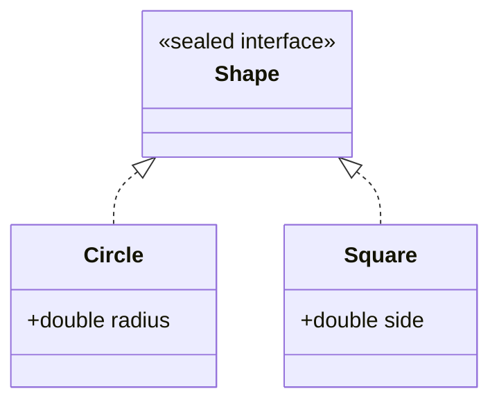

# Enums & Records — Modeling Data Precisely

Three modern features let you model data so precisely that whole categories of bug become impossible to write:

- An **enum** is a fixed set of named constants: a type whose every value you list up front, so an invalid one can't exist.
- A **record** (Java 16) is a data carrier. You declare its *components*, and Java generates the constructor, the accessors, and a correct [`equals`/`hashCode`](/synapse/programming-languages/java/core-libraries/equals-and-hashcode)/`toString` <abbr title="JEP 395: Records">[1]</abbr>.
- A **sealed** type (Java 17) names exactly which classes may implement it, so the set of subtypes is closed and known <abbr title="JEP 409: Sealed Classes">[2]</abbr>.

Together they replace piles of hand-written boilerplate, and the bugs that hide in it.

<div style="border-left:4px solid #195045;background:rgba(25,80,69,0.08);padding:0.6rem 1rem;border-radius:0 0.5rem 0.5rem 0;margin:1.25rem 0">

💡 **The core idea.**

- An **enum** is a fixed set of named constants — an invalid value can't exist.
- A **record** generates constructor, accessors, `equals`/`hashCode`/`toString` from its components.
- A **sealed** type names exactly which subtypes may exist — a closed, known set.
- Together they replace hand-written boilerplate and the bugs hiding in it.

</div>

Every output below was produced by compiling and running the code on Java 21.

**You'll be able to:** declare an enum, and predict `ordinal()`, `values()`, `valueOf` and an exhaustive `switch` over it; give enum constants fields, a constructor and methods; declare a record, predict its `toString`, accessors and `equals`, and validate it in a compact constructor; explain why a record holding a `List` is not fully immutable, and fix it; predict which classes may implement a sealed interface.

<div style="border-left:4px solid #15448e;background:rgba(21,68,142,0.08);padding:0.6rem 1rem;border-radius:0 0.5rem 0.5rem 0;margin:1.25rem 0">

📘 **How to read the Intuition boxes.** Each one is built in three moves:

1. **The mechanism** — what the compiler and the JVM *do*.
2. **A concrete bite** — a specific, runnable failure (often a real compiler error), shown so the trap is visible.
3. **The earned rule** — the decision heuristic, now justified rather than asserted, plus its cost.

</div>

---

## Table of contents

1. [Enums: a fixed set of constants](#1-enums-a-fixed-set-of-constants)
2. [Rich enums: fields and methods](#2-rich-enums-fields-and-methods)
3. [Records: immutable data carriers](#3-records-immutable-data-carriers)
4. [Sealed types: a first look](#4-sealed-types-a-first-look)
5. [Mental-model summary](#5-mental-model-summary)
6. [Gotcha checklist](#6-gotcha-checklist)
7. [Check yourself](#-check-yourself)
8. [Sources](#-sources)

---

## 1. Enums: a fixed set of constants

An `enum` declares a type whose only values are the named constants you list. Each constant is the one and only object of its kind. The type is safe (you can't pass a stray string), and a natural fit for a [`switch`](/synapse/programming-languages/java/control-flow/conditionals).

```java run
enum Day { MON, TUE, WED, THU, FRI, SAT, SUN }

public class Main {
    public static void main(String[] args) {
        Day d = Day.WED;
        System.out.println(d);
        System.out.println(d.ordinal());
        String kind = switch (d) {
            case SAT, SUN -> "weekend";
            default -> "weekday";
        };
        System.out.println(kind);
        System.out.println(Day.values().length);
    }
}
```

**Output:**
```
WED
2
weekday
7
```

**Analysis.**

- `Day.WED` prints its name.
- `ordinal()` is its position, counted from zero: `2` <abbr title="Java SE 21 API, java.lang.Enum">[3]</abbr>.
- The `switch` classified it as a `weekday`.
- `Day.values()` returns all seven constants.

A `Day` variable can hold *only* one of these seven, or `null`. There is no eighth day, and no way to assign a misspelled one, because the compiler checks every `Day` value against the declared set.

**Intuition.**
*Mechanism.* Each constant becomes an implicitly declared `public static final` field, holding an instance of the enum type <abbr title="The Java Language Specification, Java SE 21, §8.9.3">[4]</abbr>. The instances are created once, when the enum class is initialized. A variable of the enum type can reference only those instances, so the set of valid values is closed at compile time.

Because each constant is the only instance of its kind, `==` is safe for enums; the JLS permits it "in place of the `equals` method" <abbr title="The Java Language Specification, Java SE 21, §8.9.1">[5]</abbr>.

*Concrete bite.* That closed set lets a `switch` *expression* over an enum be checked for exhaustiveness — cover some constants but not all, with no `default`, and it won't compile:

```java run
enum Day { MON, TUE, WED, THU, FRI, SAT, SUN }

public class Main {
    public static void main(String[] args) {
        Day d = Day.WED;
        String s = switch (d) {
            case MON -> "monday";
            case TUE -> "tuesday";
        };
        System.out.println(s);
    }
}
```

**Compiler error:**
```
Main.java:6: error: the switch expression does not cover all possible input values
        String s = switch (d) {
                   ^
```

The `switch` handles only two of seven days and produces a value, so the compiler demands the rest (or a `default`). With an enum, "I forgot a case" becomes a build error.

Text from outside the program becomes an enum constant through `valueOf`. It matches the name exactly, case included:

```java run
enum Day { MON, TUE, WED, THU, FRI, SAT, SUN }

public class Main {
    public static void main(String[] args) {
        System.out.println(Day.valueOf("WED"));
        System.out.println(Day.valueOf("WED") == Day.WED);
        System.out.println(Day.valueOf("wed"));
    }
}
```

**Output** *(prints two lines, then a thrown exception):*
```
WED
true
Exception in thread "main" java.lang.IllegalArgumentException: No enum constant Day.wed
```

`valueOf("WED")` returned the existing constant, so `==` is `true`. `"wed"` matches no name exactly. Convert typed input first, for example with `toUpperCase()`, and be ready for the exception.

<div style="border-left:4px solid #195045;background:rgba(25,80,69,0.08);padding:0.6rem 1rem;border-radius:0 0.5rem 0.5rem 0;margin:1.25rem 0">

💡 **Earned rule.** Use an enum for any value that comes from a fixed, known set — states, directions, days, modes — instead of `int` codes or `String`s. The cost is declaring the type. The benefit is type safety (no invalid value), readable names, and a `switch` that flags a forgotten case at compile time.

</div>

---

## 2. Rich enums: fields and methods

Enum constants are real objects, so they can carry **data** and **behavior**. Give the enum a constructor and fields, pass each constant its values in parentheses, and add methods that use them.

```java run
enum Planet {
    EARTH(9.81), MARS(3.71), MOON(1.62);

    private final double gravity;
    Planet(double gravity) { this.gravity = gravity; }
    double weightOf(double mass) { return mass * gravity; }
}

public class Main {
    public static void main(String[] args) {
        for (Planet p : Planet.values()) {
            System.out.printf("%s: %.1f%n", p, p.weightOf(10));
        }
    }
}
```

**Output:**
```
EARTH: 98.1
MARS: 37.1
MOON: 16.2
```

**Analysis.** Each constant passed a `gravity` to the enum's constructor (`EARTH(9.81)`). The constructor stored it in a field, and `weightOf` used it. So `Planet` isn't only three names: it is three objects, each bundling a value and a method, iterated with `values()`.

The field is `final` by choice: nothing should change a planet's gravity. The JLS does not require it, and an enum with a non-`final` field compiles and lets any code change it. Keep enum fields `final`, since every part of the program shares the one instance.

**Intuition.**
*Mechanism.* `EARTH(9.81)` calls the enum's constructor when the constant is created, once, as the enum class is initialized <abbr title="The Java Language Specification, Java SE 21, §8.9.3">[4]</abbr>. The fields and methods make each constant a small, self-describing object: an enum is a class whose instances are fixed and named.

The constructor is private even with no modifier <abbr title="The Java Language Specification, Java SE 21, §8.9.2">[6]</abbr>, so no other code can make a new constant:

```java run
enum Planet {
    EARTH(9.81);

    private final double gravity;
    Planet(double gravity) { this.gravity = gravity; }
}

public class Main {
    public static void main(String[] args) {
        Planet p = new Planet(3.71);
    }
}
```

**Compiler error:**
```
Main.java:10: error: enum classes may not be instantiated
        Planet p = new Planet(3.71);
                   ^
```

*Concrete bite.* This replaces the fragile "parallel arrays" or `switch`-on-code style. Without it you would write a `double gravityFor(int planetCode)` with a `switch` to keep in sync. With it, the data lives *on* the constant, so adding a planet adds one line and nothing can fall out of step.

<div style="border-left:4px solid #195045;background:rgba(25,80,69,0.08);padding:0.6rem 1rem;border-radius:0 0.5rem 0.5rem 0;margin:1.25rem 0">

💡 **Earned rule.** Put per-constant data and behavior *in* the enum (fields, a constructor, methods) rather than in external `switch`es keyed on the constant. The cost is a richer enum declaration. The benefit is that each constant is self-contained: add or change one, and there is a single place to edit.

</div>

---

## 3. Records: immutable data carriers

A **record** is a class whose entire job is to hold data. You declare its **components**, and Java generates <abbr title="The Java Language Specification, Java SE 21, §8.10.3">[7]</abbr>:

- a `private final` field per component;
- a **canonical constructor** that takes every component, in order;
- an accessor method per component, named after it;
- `equals`, `hashCode` and `toString` over all the components.

```java run
record Point(int x, int y) {}

public class Main {
    public static void main(String[] args) {
        Point a = new Point(1, 2);
        Point b = new Point(1, 2);
        System.out.println(a);
        System.out.println(a.x() + "," + a.y());
        System.out.println(a.equals(b));
        System.out.println(a.hashCode() == b.hashCode());
    }
}
```

**Output:**
```
Point[x=1, y=2]
1,2
true
true
```

**Analysis.** One line, `record Point(int x, int y) {}`, gave us:

- a constructor: `new Point(1, 2)`;
- accessors: `a.x()` and `a.y()`, with parentheses;
- a readable `toString`: `Point[x=1, y=2]`;
- a **correct** `equals`/`hashCode` pair: `a.equals(b)` is `true`, and their hash codes match.

Recall from [equals & hashCode](/synapse/programming-languages/java/core-libraries/equals-and-hashcode) how much hand-written code that contract took. A record generates it from the components, the same way every time. (The `toString` format is not a contract: the API says it "is subject to change" <abbr title="Java SE 21 API, java.lang.Record">[8]</abbr>, so never parse it.)

**Intuition.**
*Mechanism.* A record class is implicitly `final`, and its superclass is always `java.lang.Record`, so it cannot `extend` another class <abbr title="The Java Language Specification, Java SE 21, §8.10">[9]</abbr>. The compiler derives the members from the component list. You can still add methods, and check the values in a **compact constructor**: a constructor with no parameter list, which runs before the fields are assigned <abbr title="The Java Language Specification, Java SE 21, §8.10.4.2">[10]</abbr>:

```java run
record Range(int low, int high) {
    Range {                                   // compact constructor: no parameter list
        if (low > high) {
            throw new IllegalArgumentException("low " + low + " > high " + high);
        }
    }

    int length() {
        return high - low;
    }
}

public class Main {
    public static void main(String[] args) {
        Range r = new Range(2, 5);
        System.out.println(r + " has length " + r.length());
        new Range(5, 2);
    }
}
```

**Output** *(prints one line, then a thrown exception):*
```
Range[low=2, high=5] has length 3
Exception in thread "main" java.lang.IllegalArgumentException: low 5 > high 2
```

The compact constructor rejected `(5, 2)`, so no invalid `Range` can exist. `length()` is an ordinary method added to the record.

*Concrete bite.* The immutability is real — record components are `final`, with no setters, so you can't change one after construction:

```java run
record Point(int x, int y) {}

public class Main {
    public static void main(String[] args) {
        Point p = new Point(1, 2);
        p.x = 5;
        System.out.println(p);
    }
}
```

**Compiler error:**
```
Main.java:6: error: x has private access in Point
        p.x = 5;
         ^
1 error
```

`p.x = 5` is rejected: the component field is `private` and `final`, readable only through the accessor `p.x()`. To "change" a point, you build a new one.

*Non-example: a mutable component.* `final` protects the field, not the object it refers to, as with the `final` array in [Encapsulation & Access Modifiers](/synapse/programming-languages/java/classes-and-objects/encapsulation-and-access-modifiers). A record holding a `List` shares that list:

```java run
import java.util.ArrayList;
import java.util.List;

record Team(String name, List<String> members) {}

public class Main {
    public static void main(String[] args) {
        List<String> people = new ArrayList<>(List.of("Ada"));
        Team t = new Team("core", people);
        people.add("Linus");
        t.members().add("Grace");
        System.out.println(t);
    }
}
```

**Output:**
```
Team[name=core, members=[Ada, Linus, Grace]]
```

The "immutable" `Team` changed twice: once through the caller's `people`, once through its own accessor. The fix is a defensive copy in the compact constructor. `List.copyOf` makes an unmodifiable copy:

```java run
import java.util.ArrayList;
import java.util.List;

record Team(String name, List<String> members) {
    Team {
        members = List.copyOf(members);       // defensive, unmodifiable copy
    }
}

public class Main {
    public static void main(String[] args) {
        List<String> people = new ArrayList<>(List.of("Ada"));
        Team t = new Team("core", people);
        people.add("Linus");
        System.out.println(t);
        t.members().add("Grace");
    }
}
```

**Output** *(prints one line, then a thrown exception):*
```
Team[name=core, members=[Ada]]
Exception in thread "main" java.lang.UnsupportedOperationException
```

The caller's later `add` no longer reached the record, and the accessor's list refused changes.

<div style="border-left:4px solid #195045;background:rgba(25,80,69,0.08);padding:0.6rem 1rem;border-radius:0 0.5rem 0.5rem 0;margin:1.25rem 0">

💡 **Earned rule.** Use a record for any group of values that should not change: coordinates, a name and email pair, a `Map` key. Validate in a compact constructor, and copy mutable components there.

The cost is that a record's fields can't change and it can't extend a class. The benefit is a correct, concise value type where a hand-written class would be dozens of lines of boilerplate.

</div>

---

## 4. Sealed types: a first look

A **sealed** interface or class names exactly which types may implement or extend it, with a `permits` clause. The subtype set is then *closed*: the compiler knows every possible implementation. That is the foundation for the exhaustive pattern matching of [Sealed Classes & Pattern Matching](/synapse/programming-languages/java/robust-oop/sealed-classes-and-pattern-matching).

```java run
sealed interface Shape permits Circle, Square {}
record Circle(double radius) implements Shape {}
record Square(double side) implements Shape {}

public class Main {
    public static void main(String[] args) {
        Shape s = new Circle(2.0);
        System.out.println(s);
    }
}
```

**Output:**
```
Circle[radius=2.0]
```



**Analysis.** `Shape` permits exactly `Circle` and `Square`, both records here: records and sealed types pair naturally. The diagram shows the closed family: a `Shape` is a `Circle` or a `Square`, and nothing else can claim to be one. A plain interface can't make that promise, because any class anywhere may implement it.

**Intuition.**
*Mechanism.* `sealed … permits A, B` writes the allowed subtypes into the type itself. The compiler lets only those types extend or implement it. Each of them must in turn say whether the family stays closed below it <abbr title="The Java Language Specification, Java SE 21, §8.1.1.2">[11]</abbr>:

- `final`: no subclasses (a record is implicitly `final`);
- `sealed`: its own `permits` list;
- `non-sealed`: open again to any subclass.

A plain class that forgets to choose is rejected: `class Square implements Shape {}` gives `error: sealed, non-sealed or final modifiers expected`.

*Concrete bite.* A type not in the `permits` clause cannot join the family:

```java run
sealed interface Shape permits Circle {}
record Circle(double radius) implements Shape {}
record Triangle(double base) implements Shape {}

public class Main {
    public static void main(String[] args) { }
}
```

**Compiler error:**
```
Main.java:3: error: class is not allowed to extend sealed class: Shape (as it is not listed in its 'permits' clause)
```

`Triangle` tried to implement `Shape` but isn't permitted, so it was rejected. The family stays exactly `{Circle}`: the seal holds.

<div style="border-left:4px solid #195045;background:rgba(25,80,69,0.08);padding:0.6rem 1rem;border-radius:0 0.5rem 0.5rem 0;margin:1.25rem 0">

💡 **Earned rule.** Seal an interface or class when its subtypes are meant to be *closed and known*: shapes, syntax-tree nodes, result variants. Pair it with records for the cases.

The cost is listing the permitted types, and updating the list to add one. The benefit is a closed family the compiler can reason about. It enables an exhaustive `switch` over the subtypes with no `default`, in [Sealed Classes & Pattern Matching](/synapse/programming-languages/java/robust-oop/sealed-classes-and-pattern-matching).

</div>

---

## 5. Mental-model summary

| Principle | Consequence |
|---|---|
| An enum is a fixed, type-safe set of named constant instances | No invalid value; exhaustive `switch` flags a forgotten case; `==` is safe |
| `valueOf` matches a constant's name exactly | `valueOf("wed")` throws `IllegalArgumentException` for `WED` |
| Enum constants can carry fields and methods; the constructor is private | Per-constant data lives on the constant; `new Planet(…)` does not compile |
| A record generates fields, constructor, accessors, `equals`/`hashCode`/`toString` | A value type in one line, with the contract correct for free |
| Record fields are `private final`, read via `x()` accessors | You can't assign them; "change" means build a new record |
| `final` protects the field, not the object it refers to | Copy mutable components in a compact constructor (`List.copyOf`) |
| A `sealed` type's `permits` clause closes its subtype set | Only listed types may implement it, each `final`, `sealed` or `non-sealed` |

## 6. Gotcha checklist

<div style="border-left:4px solid #da5233;background:rgba(218,82,51,0.08);padding:0.6rem 1rem;border-radius:0 0.5rem 0.5rem 0;margin:1.25rem 0">

| Symptom | Likely cause | Fix |
|---|---|---|
| `the switch expression does not cover all possible input values` on an enum | a constant is missing from the `switch` | add the missing constants, or a `default` |
| `IllegalArgumentException: No enum constant Day.wed` | `valueOf` is exact, case included | normalise the text first, and catch the exception for bad input |
| `enum classes may not be instantiated` | `new` on an enum | use a constant, or add one to the enum |
| `x has private access in Point` when assigning | record fields are `private final` | read with `x()`; build a new record to "change" it |
| A record's list changed after construction | `final` does not freeze the referenced object | `List.copyOf` in a compact constructor |
| `'{' expected` after `record … (…) extends` | a record cannot extend a class | implement an interface instead |
| `class is not allowed to extend sealed class` | the type is not in the `permits` clause | add it to `permits`, or leave it out of the family |
| `sealed, non-sealed or final modifiers expected` | a permitted class did not choose | declare it `final`, `sealed` or `non-sealed`, or make it a record |
| `int` or `String` codes for a fixed set of values | no enum | an enum, for type safety, names and `switch` checking |

</div>

---

## ✅ Check yourself

One check per objective. Answer before you open anything.

```quiz
{"prompt": "enum Day { MON, TUE, WED, THU, FRI, SAT, SUN } — what does Day.FRI.ordinal() return?", "options": ["5", "4", "It throws"], "answer": "4"}
```

```quiz
{"prompt": "enum Planet { EARTH(9.81); … Planet(double g) { … } } — what does new Planet(3.71) do?", "options": ["Creates a second planet", "It does not compile", "IllegalArgumentException at run time"], "answer": "It does not compile"}
```

```quiz
{"prompt": "record Money(int cents, String currency) {} — what does System.out.println(new Money(100, \"USD\")) print on JDK 21?", "options": ["Money@1b6d3586", "Money[cents=100, currency=USD]", "100 USD"], "answer": "Money[cents=100, currency=USD]"}
```

```quiz
{"prompt": "record Team(List<String> members) {} with no compact constructor. The caller keeps the list it passed in, and later adds to it. What does team.members() show?", "options": ["The added element too", "Only the original elements", "It throws UnsupportedOperationException"], "answer": "The added element too"}
```

```quiz
{"prompt": "sealed interface Shape permits Circle, Square {} — does record Rectangle(double w, double h) implements Shape {} compile?", "options": ["Yes, records are always allowed", "Yes, but only with non-sealed", "No, Rectangle is not in the permits clause"], "answer": "No, Rectangle is not in the permits clause"}
```

<details>
<summary>The 🧪 box below: <code>isWeekend()</code>, printing and comparing <code>Money</code>, and <code>Rectangle</code>.</summary>

```java run
enum Day {
    MON, TUE, WED, THU, FRI, SAT, SUN;

    boolean isWeekend() {
        return this == SAT || this == SUN;
    }
}

record Money(int cents, String currency) {}

public class Main {
    public static void main(String[] args) {
        System.out.println(Day.SAT.isWeekend());
        System.out.println(Day.MON.isWeekend());
        System.out.println(new Money(100, "USD"));
        System.out.println(new Money(100, "USD").equals(new Money(100, "USD")));
    }
}
```

**Output:**
```
true
false
Money[cents=100, currency=USD]
true
```

- `isWeekend()` compares with `==`, which is safe for enum constants.
- Two `Money` values with equal components are `equals`: the record generated the method.
- `record Rectangle(double w, double h) implements Shape {}` does not compile against `sealed interface Shape permits Circle, Square {}`: `class is not allowed to extend sealed class`. The one change is to add `Rectangle` to the `permits` clause.

</details>

---

## 📚 Sources

1. JEP 395: Records (Java 16) — <https://openjdk.org/jeps/395>
2. JEP 409: Sealed Classes (Java 17) — <https://openjdk.org/jeps/409>
3. `java.lang.Enum`, Java SE 21 API (`ordinal()`: "the initial constant is assigned an ordinal of zero"; `valueOf`) — <https://docs.oracle.com/en/java/javase/21/docs/api/java.base/java/lang/Enum.html>
4. *The Java Language Specification, Java SE 21*, §8.9.3 "Enum Members" (each constant is an implicitly declared `public static final` field) — <https://docs.oracle.com/javase/specs/jls/se21/html/jls-8.html#jls-8.9.3>
5. *The Java Language Specification, Java SE 21*, §8.9.1 "Enum Constants" (`==` "in place of the equals method") — <https://docs.oracle.com/javase/specs/jls/se21/html/jls-8.html#jls-8.9.1>
6. *The Java Language Specification, Java SE 21*, §8.9.2 "Enum Body Declarations" (a constructor with no access modifier is `private`) — <https://docs.oracle.com/javase/specs/jls/se21/html/jls-8.html#jls-8.9.2>
7. *The Java Language Specification, Java SE 21*, §8.10.3 "Record Members" (a component field "is private, final, and non-static") — <https://docs.oracle.com/javase/specs/jls/se21/html/jls-8.html#jls-8.10.3>
8. `java.lang.Record`, Java SE 21 API (the `toString` format "is subject to change") — <https://docs.oracle.com/en/java/javase/21/docs/api/java.base/java/lang/Record.html>
9. *The Java Language Specification, Java SE 21*, §8.10 "Record Classes" (implicitly `final`; the direct superclass is `Record`) — <https://docs.oracle.com/javase/specs/jls/se21/html/jls-8.html#jls-8.10>
10. *The Java Language Specification, Java SE 21*, §8.10.4.2 "Compact Canonical Constructors" — <https://docs.oracle.com/javase/specs/jls/se21/html/jls-8.html#jls-8.10.4.2>
11. *The Java Language Specification, Java SE 21*, §8.1.1.2 "`sealed`, `non-sealed`, and `final` Classes" — <https://docs.oracle.com/javase/specs/jls/se21/html/jls-8.html#jls-8.1.1.2>

---

<div style="border-left:4px solid #6d28d9;background:rgba(109,40,217,0.08);padding:0.6rem 1rem;border-radius:0 0.5rem 0.5rem 0;margin:1.25rem 0">

🧪 **Predict, then check.**

1. Give `Day` a `boolean isWeekend()` method, and predict what `Day.SAT.isWeekend()` and `Day.MON.isWeekend()` return.
2. For `record Money(int cents, String currency) {}`, predict the output of printing `new Money(100, "USD")`, and of comparing two equal `Money` values with `.equals`.
3. Predict whether `record Rectangle(double w, double h) implements Shape {}` compiles, given `sealed interface Shape permits Circle, Square {}`, and what one change makes it compile.

</div>

## Your Turn

Before you move on, check your understanding with the coach — explain the idea, apply it, weigh the trade-offs, then defend your reasoning.

<div class="concept-coach"></div>
