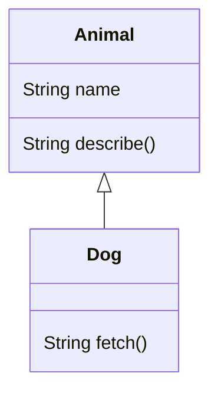
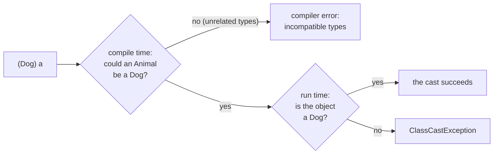

# Inheritance & Polymorphism — One Reference, Many Behaviors

[Classes](/synapse/programming-languages/java/classes-and-objects/classes-and-objects) let you model one type of thing. **Inheritance** lets one class build on another:

- A **subclass** `extends` a **superclass**. It inherits the superclass's fields and methods, and adds its own.
- It can **override** an inherited method: redeclare it, so its own version replaces the parent's.
- The real prize is **polymorphism**. Call an overridden method through a *superclass* reference, and Java runs the version of the object's *actual* runtime type.

A loop over an `Animal[]` holding a `Dog` and a `Cat` makes each speak in its own voice. That mechanism is **dynamic dispatch**. It lets code written against a general type drive specialized behavior it has never seen.

This lesson also draws the lines dispatch stops at: fields and `static` methods, casts back to the specific type, `final`, and the methods *every* object inherits from `Object`.

<div style="border-left:4px solid #195045;background:rgba(25,80,69,0.08);padding:0.6rem 1rem;border-radius:0 0.5rem 0.5rem 0;margin:1.25rem 0">

💡 **The core idea.**

- A subclass `extends` a superclass, **inheriting** and **overriding** its members.
- The prize is **polymorphism**: an overridden call through a superclass reference runs the object's runtime type's version.
- That mechanism is **dynamic dispatch** — general code drives specialized behavior.
- Its limits: fields don't dispatch, `final` shuts it off, every object inherits `Object`.

</div>

This is the deep pass of [classes & objects](/synapse/programming-languages/java/classes-and-objects/classes-and-objects). Every output below was produced by compiling and running the code on Java 21.

**You'll be able to:** trace the order in which a subclass's constructors run, and fix a missing `super(...)` call; predict which version runs when an overridden method, a hidden field or a `static` method is reached through a superclass reference; predict whether a reference cast compiles, succeeds or throws `ClassCastException`, and guard it with `instanceof`; name the compiler error for a misspelled override, a narrowed access level and an override of a `final` method; pick inheritance or composition with the "is-a" test.

<div style="border-left:4px solid #15448e;background:rgba(21,68,142,0.08);padding:0.6rem 1rem;border-radius:0 0.5rem 0.5rem 0;margin:1.25rem 0">

📘 **How to read the Intuition boxes.** Each one is built in three moves:

1. **The mechanism** — what the compiler and the JVM *do*.
2. **A concrete bite** — a specific, runnable failure (often a real compiler error), shown so the trap is visible.
3. **The earned rule** — the decision heuristic, now justified rather than asserted, plus its cost.

</div>

---

## Table of contents

1. [`extends`: inheriting and adding](#1-extends-inheriting-and-adding)
2. [Overriding and `super`](#2-overriding-and-super)
3. [Dynamic dispatch: polymorphism](#3-dynamic-dispatch-polymorphism)
4. [Reference casting: `instanceof` and `ClassCastException`](#4-reference-casting-instanceof-and-classcastexception)
5. [`final` and the `Object` methods](#5-final-and-the-object-methods)
6. [Mental-model summary](#6-mental-model-summary)
7. [Gotcha checklist](#7-gotcha-checklist)
8. [Check yourself](#-check-yourself)
9. [Sources](#-sources)

---

## 1. `extends`: inheriting and adding

A subclass declares `extends Superclass` and automatically has the superclass's fields and methods. Its constructor calls the superclass constructor with `super(...)`, then it can add members of its own.

```java run
class Animal {
    String name;
    Animal(String name) { this.name = name; }
    String describe() { return name + " is an animal"; }
}

class Dog extends Animal {
    Dog(String name) { super(name); }
    String fetch() { return name + " fetches the ball"; }
}

public class Main {
    public static void main(String[] args) {
        Dog d = new Dog("Rex");
        System.out.println(d.describe());
        System.out.println(d.fetch());
    }
}
```

**Output:**
```
Rex is an animal
Rex fetches the ball
```



**Analysis.**

- `Dog` inherited `name` and `describe()` from `Animal`: `d.describe()` worked without `Dog` defining it.
- `Dog` added its own `fetch()`.
- `Dog`'s constructor called `super(name)` to run `Animal`'s constructor, which sets `name`.
- The arrow in the diagram (`<|--`) reads "Dog *is an* Animal."

In Java 21, `super(...)` must be the constructor's first statement <abbr title="The Java Language Specification, Java SE 21, §8.8.7">[3]</abbr>. The superclass part of the object is set up before the subclass part. (JDK 25 relaxes this: statements that do not refer to the object under construction may come before `super(...)` <abbr title="JEP 513: Flexible Constructor Bodies (JDK 25)">[15]</abbr>.)

**Intuition.**
*Mechanism.* `new Dog("Rex")` makes **one** object. It has room for the fields declared in `Animal` as well as those declared in `Dog` <abbr title="The Java Language Specification, Java SE 21, §12.5">[17]</abbr>. Construction runs top-down: the `Animal` constructor initializes the inherited fields first, then the `Dog` constructor finishes.

What if you write no `super(...)` at all? Then javac inserts `super();`, a call to the superclass's no-argument constructor, as the first statement <abbr title="The Java Language Specification, Java SE 21, §8.8.7">[3]</abbr>. The order is visible when each constructor prints:

```java run
class Animal {
    Animal() { System.out.println("1. Animal's constructor"); }
}

class Dog extends Animal {
    Dog() { System.out.println("2. Dog's constructor"); }
}

public class Main {
    public static void main(String[] args) {
        new Dog();
    }
}
```

**Output:**
```
1. Animal's constructor
2. Dog's constructor
```

`Dog()` never mentions `Animal`, yet `Animal`'s constructor ran first: the inserted `super();` called it.

*Concrete bite.* The inserted call needs a no-argument constructor in the superclass. `Animal` below has only `Animal(String name)`, so the implicit `super();` has nothing to call:

```java run
class Animal {
    String name;
    Animal(String name) { this.name = name; }
}

class Dog extends Animal {
    Dog(String name) { }
}

public class Main {
    public static void main(String[] args) {
        System.out.println(new Dog("Rex").name);
    }
}
```

**Compiler error:**
```
Main.java:7: error: constructor Animal in class Animal cannot be applied to given types;
    Dog(String name) { }
                     ^
  required: String
  found:    no arguments
  reason: actual and formal argument lists differ in length
```

The caret points at `Dog`'s body, where the invisible `super();` sits. The fix is the first fence's `super(name);`. Constructors are not inherited either: `Dog` gets no `Dog(String)` unless it declares one <abbr title="The Java Language Specification, Java SE 21, §8.2">[2]</abbr>.

*Non-example: a `private` field is not inherited.* Members declared `private` are not inherited by subclasses <abbr title="The Java Language Specification, Java SE 21, §8.2">[2]</abbr>. The field still exists inside a `Dog` object, but `Dog`'s code cannot name it:

```java run
class Animal {
    private String secret = "hidden";
}

class Dog extends Animal {
    String reveal() { return secret; }
}

public class Main {
    public static void main(String[] args) {
        System.out.println(new Dog().reveal());
    }
}
```

**Compiler error:**
```
Main.java:6: error: secret has private access in Animal
    String reveal() { return secret; }
                             ^
1 error
```

Give the superclass a method that returns the value, or mark the field `protected` for subclasses ([access levels](/synapse/programming-languages/java/classes-and-objects/encapsulation-and-access-modifiers)).

*Non-example: inheriting only to reuse code.* The "is-a" relationship is the test for whether to inherit. A `Dog` genuinely *is an* `Animal`. The JDK's own `java.util.Stack` fails the test: it `extends Vector`, a growable list <abbr title="java.util.Stack, Java SE 21 API">[14]</abbr>. So every list method comes with it, including insert-at-any-position, which breaks "last in, first out":

```java run
import java.util.Stack;

public class Main {
    public static void main(String[] args) {
        Stack<String> stack = new Stack<>();
        stack.push("first");
        stack.push("second");
        stack.add(0, "sneaked in");
        System.out.println(stack);
        System.out.println(stack.pop());
        System.out.println(stack.get(0));
    }
}
```

**Output:**
```
[sneaked in, first, second]
second
sneaked in
```

`add(0, …)` put an element *under* the stack, and `get(0)` read the bottom. A stack should allow neither. Its own API page recommends the `Deque` interface in preference <abbr title="java.util.Stack, Java SE 21 API">[14]</abbr>. A stack *has* a list; it is not one. Holding the list in a `private` field is **composition**: only the operations you choose to write are exposed.

<div style="border-left:4px solid #195045;background:rgba(25,80,69,0.08);padding:0.6rem 1rem;border-radius:0 0.5rem 0.5rem 0;margin:1.25rem 0">

💡 **Earned rule.** Use `extends` only for a true "is-a" specialization, and call `super(...)` to initialize the inherited state.

- The cost of inheritance is tight coupling: the subclass depends on the superclass's internals and inherits its whole API.
- The benefit is genuine specialization, and the polymorphism that follows.
- So prefer it for "is-a", and favor composition ("has-a") otherwise.

</div>

---

## 2. Overriding and `super`

A subclass **overrides** an inherited method by redeclaring it with the same signature — its version replaces the superclass's for objects of that subclass. `super.method()` still reaches the superclass's version when you need both.

```java run
class Animal {
    String speak() { return "..."; }
}

class Dog extends Animal {
    @Override
    String speak() { return "Woof"; }
    String both() { return super.speak() + " / " + speak(); }
}

public class Main {
    public static void main(String[] args) {
        Dog d = new Dog();
        System.out.println(d.speak());
        System.out.println(d.both());
    }
}
```

**Output:**
```
Woof
... / Woof
```

**Analysis.**

- `Dog.speak()` overrode `Animal.speak()`, so `d.speak()` is `"Woof"`.
- Inside `both()`, `super.speak()` called `Animal`'s version (`"..."`), and a plain `speak()` called `Dog`'s (`"Woof"`). Together they give `"... / Woof"`.

`super` is the escape hatch to the parent's behavior. It is often used to *extend* that behavior: "do what the parent does, plus this."

**Intuition.**
*Mechanism.* An override must have the same **signature** as the inherited method: the same name and the same parameter types <abbr title="The Java Language Specification, Java SE 21, §8.4.2">[4]</abbr>. The `@Override` annotation asks the compiler to verify that. If the method overrides nothing, it is an error <abbr title="The Java Language Specification, Java SE 21, §9.6.4.4">[5]</abbr>, which catches typos and signature mismatches.

*Concrete bite.* Misspell the method (or get the parameters wrong) and you've written a *new* method, not an override — `@Override` turns that silent mistake into a compile error:

```java run
class Animal { String speak() { return "..."; } }

class Dog extends Animal {
    @Override
    String speakk() { return "Woof"; }
}

public class Main {
    public static void main(String[] args) { }
}
```

**Compiler error:**
```
Main.java:4: error: method does not override or implement a method from a supertype
    @Override
    ^
```

`speakk` (typo) overrides nothing, so `@Override` flags it. Without the annotation this would compile as a brand-new, never-called method, and `speak()` would silently keep the parent's behavior.

*Non-example: an override that narrows access.* An override must give at least as much access as the method it replaces <abbr title="The Java Language Specification, Java SE 21, §8.4.8.3">[6]</abbr>. `Object.toString()` is `public`. Leave `public` off, and the name and parameters match, but the override is rejected:

```java run
class Animal {
    @Override
    String toString() { return "an animal"; }
}

public class Main {
    public static void main(String[] args) {
        System.out.println(new Animal());
    }
}
```

**Compiler error:**
```
Main.java:3: error: toString() in Animal cannot override toString() in Object
    String toString() { return "an animal"; }
           ^
  attempting to assign weaker access privileges; was public
1 error
```

Declare it `public String toString()`, as §5 does. The return type has one freedom: an override may return a *subtype* of the original's return type <abbr title="The Java Language Specification, Java SE 21, §8.4.8.3">[6]</abbr>.

<div style="border-left:4px solid #195045;background:rgba(25,80,69,0.08);padding:0.6rem 1rem;border-radius:0 0.5rem 0.5rem 0;margin:1.25rem 0">

💡 **Earned rule.** Always annotate overrides with `@Override`, and use `super.method()` when you need to build on the parent's behavior. The cost is one annotation. The benefit: a misspelled or mis-signed "override" would otherwise silently do nothing, and now it is a compile error you fix immediately.

</div>

---

## 3. Dynamic dispatch: polymorphism

Here is the payoff. A variable's *declared* type can be a superclass while the object it points to is a subclass.

- Assigning a `Dog` to an `Animal` variable is an **upcast**. It needs no cast syntax, because every `Dog` is an `Animal`.
- When you call an overridden method, Java runs the version for the object's **actual runtime type** — not the declared type. This is **dynamic dispatch**.

```java run viz=array:animals
class Animal {
    String name;
    Animal(String name) { this.name = name; }
    String speak() { return "..."; }
}
class Dog extends Animal {
    Dog(String name) { super(name); }
    @Override String speak() { return "Woof"; }
}
class Cat extends Animal {
    Cat(String name) { super(name); }
    @Override String speak() { return "Meow"; }
}

public class Main {
    public static void main(String[] args) {
        Animal[] animals = { new Dog("Rex"), new Cat("Felix"), new Animal("Thing") };
        for (Animal a : animals) {
            System.out.println(a.name + ": " + a.speak());
        }
    }
}
```

**Output:**
```
Rex: Woof
Felix: Meow
Thing: ...
```

**Analysis.** Every element is declared `Animal`, yet each `a.speak()` ran the *object's* version: `Dog`'s `Woof`, `Cat`'s `Meow`, `Animal`'s `...`. The loop is written against `Animal` and knows nothing about `Dog` or `Cat`, but it drives their specialized behavior. This is polymorphism: one interface (`speak()` on `Animal`), many implementations, selected at run time by the actual type.

**Intuition.**
*Mechanism.* Two types are in play at every call, and each decides one thing:

- The **declared** type decides, at compile time, which methods you may call at all.
- For an instance method, the **object's class** decides, at run time, which override runs <abbr title="The Java Language Specification, Java SE 21, §15.12.4.4">[7]</abbr>.

That is why the loop's `Animal` reference can invoke `Dog.speak()`. The first rule has a bite of its own. `Dog`'s extra method is out of reach through an `Animal` variable, even when the object is a `Dog`:

```java run
class Animal {
    String speak() { return "..."; }
}

class Dog extends Animal {
    @Override String speak() { return "Woof"; }
    String fetch() { return "fetches the ball"; }
}

public class Main {
    public static void main(String[] args) {
        Animal a = new Dog();
        System.out.println(a.speak());
        System.out.println(a.fetch());
    }
}
```

**Compiler error:**
```
Main.java:14: error: cannot find symbol
        System.out.println(a.fetch());
                            ^
  symbol:   method fetch()
  location: variable a of type Animal
1 error
```

The compiler looked for `fetch()` in `Animal`, the declared type, and found none. §4 shows how to reach it.

*Concrete bite.* The dynamic rule applies to **methods**, not **fields** — a field access is resolved by the *declared* type at compile time:

```java run
class Animal { String kind = "animal"; String speak() { return "generic"; } }
class Dog extends Animal { String kind = "dog"; @Override String speak() { return "Woof"; } }

public class Main {
    public static void main(String[] args) {
        Animal a = new Dog();
        System.out.println(a.speak());
        System.out.println(a.kind);
    }
}
```

**Output:**
```
Woof
animal
```

`a.speak()` dispatched dynamically to `Dog` (`"Woof"`), but `a.kind` read `Animal`'s field (`"animal"`). Only the declared type is used to pick the field, never the object's class <abbr title="The Java Language Specification, Java SE 21, §15.11.1">[8]</abbr>.

`Dog`'s `kind` **hides** `Animal`'s: both fields exist in the object. Hiding a field like this is a code smell precisely because of this confusion. Override *methods*; don't hide fields.

*Non-example: a `static` method does not dispatch.* A `static` method belongs to the class, not to an object. A subclass's `static` method with the same signature **hides** the parent's instead of overriding it <abbr title="The Java Language Specification, Java SE 21, §8.4.8.2">[9]</abbr>. Like a field, it is picked by the declared type:

```java run
class Animal {
    static String kind() { return "animal"; }
    String speak() { return "..."; }
}

class Dog extends Animal {
    static String kind() { return "dog"; }
    @Override String speak() { return "Woof"; }
}

public class Main {
    public static void main(String[] args) {
        Animal a = new Dog();
        System.out.println(a.speak());
        System.out.println(a.kind());
    }
}
```

**Output:**
```
Woof
animal
```

`a.kind()` compiled, but it ran `Animal.kind()`. Call a `static` method through its class name (`Dog.kind()`), and the code says what it does.

<div style="border-left:4px solid #195045;background:rgba(25,80,69,0.08);padding:0.6rem 1rem;border-radius:0 0.5rem 0.5rem 0;margin:1.25rem 0">

💡 **Earned rule.** Program against the general (super)type, and let overridden *methods* dispatch to the right behavior. That is how polymorphic code stays open to new subclasses without changing.

- The cost is an asymmetry: fields and `static` methods bind to the declared type, so never rely on "overriding" them.
- The benefit is code that works for subclasses written long after it, as long as they override the methods it calls.

</div>

---

## 4. Reference casting: `instanceof` and `ClassCastException`

You met casts on numbers in [Numbers & Arithmetic](/synapse/programming-languages/java/first-steps/numbers-and-arithmetic), and `instanceof` with a cast in [equals & hashCode](/synapse/programming-languages/java/core-libraries/equals-and-hashcode). On references, a cast changes only the **declared** type. It never changes the object.

- An **upcast** (`Dog` to `Animal`) is always safe, so it is automatic.
- A **downcast** (`Animal` to `Dog`) needs the cast syntax, `(Dog) a`. It is a promise that the object is a `Dog`, and the JVM checks that promise at run time <abbr title="The Java Language Specification, Java SE 21, §5.1.6">[10]</abbr>.
- `a instanceof Dog` asks the same question without the risk. It is `true` when the object could be cast to `Dog`, and `false` for `null` <abbr title="The Java Language Specification, Java SE 21, §15.20.2">[12]</abbr>.



Guard the downcast with `instanceof`, and `fetch()` is back in reach:

```java run
class Animal {
    String speak() { return "..."; }
}

class Dog extends Animal {
    @Override String speak() { return "Woof"; }
    String fetch() { return "fetches the ball"; }
}

class Cat extends Animal {
    @Override String speak() { return "Meow"; }
}

public class Main {
    public static void main(String[] args) {
        Animal[] animals = { new Dog(), new Cat() };
        for (Animal a : animals) {
            if (a instanceof Dog) {
                Dog d = (Dog) a;
                System.out.println(a.speak() + ", then " + d.fetch());
            } else {
                System.out.println(a.speak() + ", and no fetch");
            }
        }
    }
}
```

**Output:**
```
Woof, then fetches the ball
Meow, and no fetch
```

**Analysis.** The `Dog` passed the `instanceof` test, so the cast was safe, and `d.fetch()` compiled because `d` is declared `Dog`. The `Cat` failed the test, so the code never tried the cast. `a.speak()` dispatched as always; the cast was needed only for `fetch()`.

**Intuition.**
*Mechanism.* A downcast is checked twice. The compiler rejects a cast between types that no object could belong to both of. The JVM then checks the object's class at the moment of the cast. If the object is not a `Dog` (or a subclass of `Dog`), the cast throws a `ClassCastException` <abbr title="The Java Language Specification, Java SE 21, §15.16">[11]</abbr>.

*Concrete bite.* This cast compiles, because an `Animal` *could* be a `Dog`. This one is a `Cat`:

```java run
class Animal { }
class Dog extends Animal { }
class Cat extends Animal { }

public class Main {
    public static void main(String[] args) {
        Animal a = new Cat();
        System.out.println("about to cast");
        Dog d = (Dog) a;
        System.out.println("never printed");
    }
}
```

**Output** *(prints `about to cast`, then a thrown exception):*
```
about to cast
Exception in thread "main" java.lang.ClassCastException: class Cat cannot be cast to class Dog (Cat and Dog are in unnamed module of loader 'app')
```

The message names both classes: the object's (`Cat`) and the cast's target (`Dog`). The failure happens at run time, on line 9, far from the line that put a `Cat` in `a`.

*Non-example: a cast between unrelated types.* A `Dog` can never be a `String`. Both are classes, and neither extends the other, so the compiler refuses the cast outright:

```java run
class Animal { }
class Dog extends Animal { }

public class Main {
    public static void main(String[] args) {
        Dog d = new Dog();
        String s = (String) d;
    }
}
```

**Compiler error:**
```
Main.java:7: error: incompatible types: Dog cannot be converted to String
        String s = (String) d;
                            ^
1 error
```

A cast cannot turn an object into a different class of object. To get text from a `Dog`, call a method that builds it, such as `toString()`.

<div style="border-left:4px solid #195045;background:rgba(25,80,69,0.08);padding:0.6rem 1rem;border-radius:0 0.5rem 0.5rem 0;margin:1.25rem 0">

💡 **Earned rule.** Before a downcast, test with `instanceof`, or know the object's class for certain. Better still, avoid the downcast: move the behavior into an overridden method, and let dispatch pick it.

- The cost of a downcast is a run-time check that can fail far from the bug that caused it.
- `instanceof` turns that failure into an ordinary `if`.
- [Sealed Classes & Pattern Matching](/synapse/programming-languages/java/robust-oop/sealed-classes-and-pattern-matching) fuses the test and the cast into one step: `a instanceof Dog d`.

</div>

---

## 5. `final` and the `Object` methods

`final` on a method forbids overriding it — a subclass cannot change that behavior. And every class other than `Object` has a superclass: `Object` itself, when you write no `extends` <abbr title="The Java Language Specification, Java SE 21, §8.1.4">[1]</abbr>. So every object already has methods like `toString`, `equals`, and `hashCode`, which you override to give them meaning.

```java run
class Animal {
    String name;
    Animal(String name) { this.name = name; }
    @Override
    public String toString() { return "Animal(" + name + ")"; }
    final String species() { return "unknown"; }
}

public class Main {
    public static void main(String[] args) {
        Animal a = new Animal("Rex");
        System.out.println(a);
        System.out.println(a.species());
    }
}
```

**Output:**
```
Animal(Rex)
unknown
```

**Analysis.**

- `System.out.println(a)` called the overridden `toString()`, giving `Animal(Rex)`.
- `Object`'s default would print the class name, `@`, and the hash code in hexadecimal <abbr title="java.lang.Object, Java SE 21 API">[13]</abbr>: something like `Animal@1b6d3586`.
- `species()` is `final`: usable, but locked against overriding.

Overriding `toString`/`equals`/`hashCode` is how your types get readable printing and correct [value equality](/synapse/programming-languages/java/core-libraries/equals-and-hashcode). They're inherited from `Object` whether you ask or not.

**Intuition.**
*Mechanism.* `Object` is the root of every class hierarchy, so its methods are always available to override. A `final` method cannot be overridden or hidden: the compiler rejects any attempt <abbr title="The Java Language Specification, Java SE 21, §8.4.3.3">[16]</abbr>. So the behavior is fixed for the whole hierarchy.

*Concrete bite.* Try to override a `final` method and it won't compile:

```java run
class Animal { final String species() { return "unknown"; } }
class Dog extends Animal { @Override String species() { return "dog"; } }

public class Main {
    public static void main(String[] args) { }
}
```

**Compiler error:**
```
Main.java:2: error: species() in Dog cannot override species() in Animal
class Dog extends Animal { @Override String species() { return "dog"; } }
                                            ^
```

`Animal.species()` is `final`, so `Dog` cannot override it — the seal holds. javac's next line gives the reason: `overridden method is final`.

*Non-example: extending a `final` class.* `final` on a *class* forbids subclasses altogether <abbr title="The Java Language Specification, Java SE 21, §8.1.4">[1]</abbr>. `String` is a `final` class:

```java run
class Shout extends String { }

public class Main {
    public static void main(String[] args) { }
}
```

**Compiler error:**
```
Main.java:1: error: cannot inherit from final String
class Shout extends String { }
                    ^
1 error
```

To add behavior to text, write a class that *has* a `String` field (composition), or a `static` helper method.

<div style="border-left:4px solid #195045;background:rgba(25,80,69,0.08);padding:0.6rem 1rem;border-radius:0 0.5rem 0.5rem 0;margin:1.25rem 0">

💡 **Earned rule.** Override `Object`'s `toString`, and `equals`/`hashCode` for value types, to give your objects meaning. Mark a method `final` when subclasses must not change its behavior: a security or invariant guarantee.

- The cost of `final` is lost flexibility: no subclass can specialize that method.
- The benefit is a behavior you can rely on across the whole hierarchy.

</div>

---

## 6. Mental-model summary

| Principle | Consequence |
|---|---|
| A subclass `extends` a superclass and `super(...)`-initializes it | It inherits fields/methods; use inheritance only for a true "is-a" |
| With no `super(...)`, javac inserts `super();` | The superclass constructor runs first; with no no-argument constructor, it does not compile |
| `private` members and constructors are not inherited | A subclass reaches a `private` field through a method or a `protected` field |
| Overriding redeclares an inherited method; `super.m()` reaches the parent | Annotate with `@Override` so a typo'd "override" is a compile error; never narrow the access |
| The declared type decides which methods compile; the object's class decides which override runs | `a.fetch()` does not compile on an `Animal` variable, even when the object is a `Dog` |
| Fields and `static` methods bind to the *declared* type | `a.kind` and `a.kind()` use `Animal`'s — they hide, they don't override |
| A downcast is checked at run time | A wrong one throws `ClassCastException`; test with `instanceof` first |
| `final` forbids overriding (on a method) and subclassing (on a class); every class extends `Object` | Override `toString`/`equals` for meaning |

## 7. Gotcha checklist

<div style="border-left:4px solid #da5233;background:rgba(218,82,51,0.08);padding:0.6rem 1rem;border-radius:0 0.5rem 0.5rem 0;margin:1.25rem 0">

| Symptom | Likely cause | Fix |
|---|---|---|
| `constructor Animal in class Animal cannot be applied to given types`, at a subclass constructor | no `super(...)`, so javac inserted `super();`, and the superclass has no no-argument constructor | call `super(...)` with the arguments, as the first statement |
| `secret has private access in Animal`, in subclass code | `private` members are not inherited | add a method to the superclass, or make the field `protected` |
| An "override" is ignored; the parent method still runs | a typo or different parameter types made it a new method | add `@Override`, and the compiler catches it |
| `method does not override or implement a method from a supertype` | `@Override` on a method that overrides nothing | fix the name and the parameter types |
| `attempting to assign weaker access privileges; was public` | the override has narrower access, such as `toString()` without `public` | give it the same access or wider |
| `cannot find symbol … location: variable a of type Animal` | the method exists only in the subclass; the declared type decides what compiles | test `instanceof`, then downcast; or declare the method in the superclass |
| `ClassCastException: class Cat cannot be cast to class Dog` | a downcast to a class the object is not | test with `instanceof` before the cast |
| `incompatible types: Dog cannot be converted to String`, on a cast | the types are unrelated, so no object could be both | call a method that converts, such as `toString()` |
| A field read through a superclass variable gives the parent's value | fields are not polymorphic; the subclass field hides the parent's | override methods; don't redeclare fields |
| A `static` method call runs the superclass version | `static` methods hide; they do not override | call it through the class name |
| `cannot override …` then `overridden method is final` | the superclass method is `final` | leave it; the design forbids the change |
| `cannot inherit from final String` | the class is `final` | use composition: a field of that type |
| `println(obj)` prints `ClassName@1b6d3586` | the default `Object.toString` | override `public String toString()` |
| The class exposes methods that break its rules (`Stack.add(0, …)`) | "is-a" was not true; it inherited a whole list API | prefer composition: a `private` field |

</div>

---

## ✅ Check yourself

One check per objective. Answer before you open anything.

```quiz
{"prompt": "class Animal { Animal(String n) { } } and class Dog extends Animal { Dog() { } } — what happens?", "options": ["It compiles, and new Dog() skips Animal's constructor", "It does not compile: the implicit super() finds no Animal()", "It compiles, then fails at run time"], "answer": "It does not compile: the implicit super() finds no Animal()"}
```

```quiz
{"prompt": "Dog overrides speak() to return \"Woof\" and redeclares the field kind = \"dog\"; Animal has kind = \"animal\". For Animal a = new Dog(); what do a.speak() and a.kind give?", "options": ["Woof and dog", "... and animal", "Woof and animal"], "answer": "Woof and animal"}
```

```quiz
{"prompt": "Animal a = new Cat(); Dog d = (Dog) a; — Dog and Cat both extend Animal. What happens?", "options": ["It does not compile", "It compiles, then throws ClassCastException at run time", "It compiles, and d is null"], "answer": "It compiles, then throws ClassCastException at run time"}
```

```quiz
{"prompt": "A class declares @Override String toString() { … } with no access modifier. What does javac say?", "options": ["attempting to assign weaker access privileges; was public", "method does not override or implement a method from a supertype", "It compiles"], "answer": "attempting to assign weaker access privileges; was public"}
```

```quiz
{"prompt": "You need a Stack with push and pop only, backed by a list. Which design passes the is-a test?", "options": ["class Stack extends ArrayList", "class Stack with a private List field", "class Stack extends Object and makes the list public"], "answer": "class Stack with a private List field"}
```

<details>
<summary>The 🧪 box below: <code>Bird</code>, the hidden field, and overriding a <code>final</code> method.</summary>

```java run
class Animal {
    String kind = "animal";
    String speak() { return "..."; }
}
class Dog extends Animal {
    String kind = "dog";
    @Override String speak() { return "Woof"; }
}
class Cat extends Animal {
    @Override String speak() { return "Meow"; }
}
class Bird extends Animal {
    @Override String speak() { return "Tweet"; }
}

public class Main {
    public static void main(String[] args) {
        Animal[] animals = { new Dog(), new Cat(), new Bird() };
        for (Animal a : animals) {
            System.out.println(a.speak());
        }
        Animal a = new Dog();
        System.out.println(a.speak() + " / " + a.kind);
    }
}
```

**Output:**
```
Woof
Meow
Tweet
Woof / animal
```

- Each `speak()` ran the object's own override: dynamic dispatch.
- `a.speak()` is `Woof`, but `a.kind` is `animal`: the field is picked by the declared type, `Animal`.
- Overriding a `final` method does not compile: `species() in Dog cannot override species() in Animal`, then `overridden method is final`. Methods are chosen by the object's class at run time; fields by the declared type at compile time.

</details>

---

## 📚 Sources

1. *The Java Language Specification, Java SE 21*, §8.1.4 "Superclasses and Subclasses" (the default direct superclass is `Object`; a `final` class may not be named in `extends`) — <https://docs.oracle.com/javase/specs/jls/se21/html/jls-8.html#jls-8.1.4>
2. *The Java Language Specification, Java SE 21*, §8.2 "Class Members" ("Members of a class that are declared private are not inherited"; constructors are not members) — <https://docs.oracle.com/javase/specs/jls/se21/html/jls-8.html#jls-8.2>
3. *The Java Language Specification, Java SE 21*, §8.8.7 "Constructor Body" (the implicit `super();`; the explicit invocation must be first) — <https://docs.oracle.com/javase/specs/jls/se21/html/jls-8.html#jls-8.8.7>
4. *The Java Language Specification, Java SE 21*, §8.4.2 "Method Signature" — <https://docs.oracle.com/javase/specs/jls/se21/html/jls-8.html#jls-8.4.2>
5. *The Java Language Specification, Java SE 21*, §9.6.4.4 "`@Override`" — <https://docs.oracle.com/javase/specs/jls/se21/html/jls-9.html#jls-9.6.4.4>
6. *The Java Language Specification, Java SE 21*, §8.4.8.3 "Requirements in Overriding and Hiding" (return-type-substitutable; "at least as much access") — <https://docs.oracle.com/javase/specs/jls/se21/html/jls-8.html#jls-8.4.8.3>
7. *The Java Language Specification, Java SE 21*, §15.12.4.4 "Locate Method to Invoke" — <https://docs.oracle.com/javase/specs/jls/se21/html/jls-15.html#jls-15.12.4.4>
8. *The Java Language Specification, Java SE 21*, §15.11.1 "Field Access Using a Primary" ("only the type of the Primary expression … is used in determining which field to use") — <https://docs.oracle.com/javase/specs/jls/se21/html/jls-15.html#jls-15.11.1>
9. *The Java Language Specification, Java SE 21*, §8.4.8.2 "Hiding (by Class Methods)" — <https://docs.oracle.com/javase/specs/jls/se21/html/jls-8.html#jls-8.4.8.2>
10. *The Java Language Specification, Java SE 21*, §5.1.6 "Narrowing Reference Conversion" (may require a test at run time) — <https://docs.oracle.com/javase/specs/jls/se21/html/jls-5.html#jls-5.1.6>
11. *The Java Language Specification, Java SE 21*, §15.16 "Cast Expressions" (`ClassCastException` "if a cast is found to be impermissible at run time") — <https://docs.oracle.com/javase/specs/jls/se21/html/jls-15.html#jls-15.16>
12. *The Java Language Specification, Java SE 21*, §15.20.2 "The `instanceof` Operator" (the null reference gives `false`) — <https://docs.oracle.com/javase/specs/jls/se21/html/jls-15.html#jls-15.20.2>
13. `java.lang.Object`, Java SE 21 API (`toString`: `getClass().getName() + '@' + Integer.toHexString(hashCode())`) — <https://docs.oracle.com/en/java/javase/21/docs/api/java.base/java/lang/Object.html>
14. `java.util.Stack`, Java SE 21 API (`extends Vector`; `Deque` "should be used in preference to this class") — <https://docs.oracle.com/en/java/javase/21/docs/api/java.base/java/util/Stack.html>
15. JEP 513: Flexible Constructor Bodies (JDK 25) — <https://openjdk.org/jeps/513>
16. *The Java Language Specification, Java SE 21*, §8.4.3.3 "`final` Methods" — <https://docs.oracle.com/javase/specs/jls/se21/html/jls-8.html#jls-8.4.3.3>
17. *The Java Language Specification, Java SE 21*, §12.5 "Creation of New Class Instances" (room for "all the instance variables that may be hidden") — <https://docs.oracle.com/javase/specs/jls/se21/html/jls-12.html#jls-12.5>

---

<div style="border-left:4px solid #6d28d9;background:rgba(109,40,217,0.08);padding:0.6rem 1rem;border-radius:0 0.5rem 0.5rem 0;margin:1.25rem 0">

🧪 **Predict, then check.**

1. Add a `Bird extends Animal` overriding `speak()` to return `"Tweet"`. Put a `Dog`, `Cat`, and `Bird` in an `Animal[]`, and predict the three lines printed by calling `speak()` on each.
2. Predict what `a.speak()` and `a.kind` print for `Animal a = new Dog();`, given the §3 hidden field.
3. Predict the compiler's reaction to a subclass overriding a `final` method, and explain why fields and methods resolve differently.

</div>

## Your Turn

Before you move on, check your understanding with the coach — explain the idea, apply it, weigh the trade-offs, then defend your reasoning.

<div class="concept-coach"></div>
