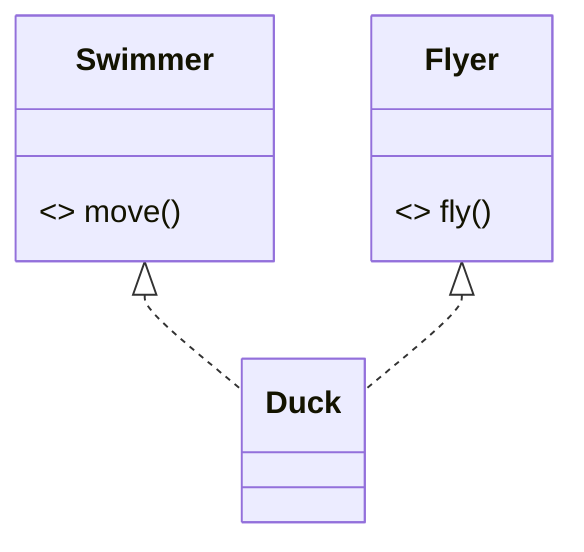

# Abstract Classes & Interfaces — Contracts and Partial Types

[Inheritance](/synapse/programming-languages/java/robust-oop/inheritance-and-polymorphism) let a subclass specialize a concrete superclass. Two more tools let you specify behavior a type *must* provide without saying how:

- An **abstract class** is a partial implementation. It can declare **abstract methods** (signatures with no body), and it cannot itself be instantiated. So every concrete subclass is forced to supply the missing pieces.
- An **interface** is a **contract**: methods that any class can `implement`, with no instance fields.

The crucial asymmetry: a class `extends` exactly **one** class but `implements` **many** interfaces. So interfaces give Java multiple inheritance of *type* (a class can be many things), with no multiple inheritance of *state*. This is the machinery behind "[program to the interface](/synapse/programming-languages/java/core-libraries/the-collections-framework)."

<div style="border-left:4px solid #195045;background:rgba(25,80,69,0.08);padding:0.6rem 1rem;border-radius:0 0.5rem 0.5rem 0;margin:1.25rem 0">

💡 **The core idea.**

- An **abstract class** is a partial type with body-less methods — it can't be instantiated.
- An **interface** is a contract a class `implements`, with no instance fields.
- A class `extends` **one** class but `implements` **many** interfaces.
- So interfaces give multiple inheritance of *type*, never of *state*.

</div>

Every output below was produced by compiling and running the code on Java 21.

**You'll be able to:** write an abstract class with a field, a constructor and a concrete method, and predict the error when it is instantiated or a subclass skips an abstract method; write an interface whose `default` methods share a `private` helper, and call its `static` method by the interface's name; predict whether an implementing method compiles, from its access level; resolve two inherited `default` methods that clash, with `X.super.m()`; pick an abstract class or an interface for a design.

<div style="border-left:4px solid #15448e;background:rgba(21,68,142,0.08);padding:0.6rem 1rem;border-radius:0 0.5rem 0.5rem 0;margin:1.25rem 0">

📘 **How to read the Intuition boxes.** Each one is built in three moves:

1. **The mechanism** — what the compiler and the JVM *do*.
2. **A concrete bite** — a specific, runnable failure (often a real compiler error), shown so the trap is visible.
3. **The earned rule** — the decision heuristic, now justified rather than asserted, plus its cost.

</div>

---

## Table of contents

1. [Abstract classes](#1-abstract-classes)
2. [Interfaces](#2-interfaces)
3. [`default` methods](#3-default-methods)
4. [`static` and `private` interface methods](#4-static-and-private-interface-methods)
5. [One class, many interfaces](#5-one-class-many-interfaces)
6. [Mental-model summary](#6-mental-model-summary)
7. [Gotcha checklist](#7-gotcha-checklist)
8. [Check yourself](#-check-yourself)
9. [Sources](#-sources)

---

## 1. Abstract classes

An `abstract` class can declare `abstract` methods: a signature with no body <abbr title="The Java Language Specification, Java SE 21, §8.4.3.1">[2]</abbr>. Each one says "every subclass must provide this." Because it has unfinished methods, an abstract class cannot be instantiated; only its concrete subclasses can.

```java run viz=array:shapes
abstract class Shape {
    abstract double area();
}

class Circle extends Shape {
    double radius;
    Circle(double radius) { this.radius = radius; }
    @Override double area() { return Math.PI * radius * radius; }
}

class Square extends Shape {
    double side;
    Square(double side) { this.side = side; }
    @Override double area() { return side * side; }
}

public class Main {
    public static void main(String[] args) {
        Shape[] shapes = { new Circle(2.0), new Square(3.0) };
        for (Shape s : shapes) {
            System.out.printf("%.2f%n", s.area());
        }
    }
}
```

**Output:**
```
12.57
9.00
```

**Analysis.** `Shape` declares `area()` with no body: it knows every shape *has* an area, but not how to compute it. `Circle` and `Square` each supply their own, and the polymorphic loop calls the right one (`12.57`, `9.00`). `Shape` provides the common type and contract; the subclasses provide the specifics.

An abstract class is still a class. Beside its abstract methods it can hold fields, constructors and ordinary methods. Its constructor runs whenever a subclass object is created <abbr title="The Java Language Specification, Java SE 21, §8.1.1.1">[1]</abbr>. The concrete `describe()` below calls the abstract `area()`, which dispatches to the subclass:

```java run
abstract class Shape {
    private final String name;
    Shape(String name) { this.name = name; }
    abstract double area();
    String describe() { return String.format("%s with area %.2f", name, area()); }
}

class Circle extends Shape {
    double radius;
    Circle(double radius) { super("circle"); this.radius = radius; }
    @Override double area() { return Math.PI * radius * radius; }
}

class Square extends Shape {
    double side;
    Square(double side) { super("square"); this.side = side; }
    @Override double area() { return side * side; }
}

public class Main {
    public static void main(String[] args) {
        System.out.println(new Circle(2.0).describe());
        System.out.println(new Square(3.0).describe());
    }
}
```

**Output:**
```
circle with area 12.57
square with area 9.00
```

`Shape` owns the shared state (`name`) and the shared sentence (`describe()`). Each subclass writes only the part that differs: `area()`.

**Intuition.**
*Mechanism.* An abstract method has no implementation. An object of the abstract class would have a "hole": a method with nothing to run. So the compiler forbids creating one <abbr title="The Java Language Specification, Java SE 21, §8.1.1.1">[1]</abbr>. It also requires every concrete subclass to override all inherited abstract methods.

*Concrete bite.* Try to instantiate the abstract class directly and it won't compile:

```java run
abstract class Shape { abstract double area(); }

public class Main {
    public static void main(String[] args) {
        Shape s = new Shape();
    }
}
```

**Compiler error:**
```
Main.java:5: error: Shape is abstract; cannot be instantiated
        Shape s = new Shape();
                  ^
```

`new Shape()` is rejected — `Shape.area()` has no body, so there's no complete object to make. You can hold a `Shape` reference (to a `Circle` or `Square`), but you can't create a bare `Shape`.

*Non-example: a subclass that forgets the abstract method.* A class that is not `abstract` may not have an abstract method, declared or inherited <abbr title="The Java Language Specification, Java SE 21, §8.1.1.1">[1]</abbr>. `Triangle` inherits `area()` without a body:

```java run
abstract class Shape { abstract double area(); }

class Triangle extends Shape {
    double base, height;
}

public class Main {
    public static void main(String[] args) { }
}
```

**Compiler error:**
```
Main.java:3: error: Triangle is not abstract and does not override abstract method area() in Shape
class Triangle extends Shape {
^
1 error
```

The message offers both fixes: override `area()`, or declare `Triangle` `abstract` too. The same message appears if you write `abstract double area();` inside a class you forgot to mark `abstract`: that class is told it does not override its own method.

<div style="border-left:4px solid #195045;background:rgba(25,80,69,0.08);padding:0.6rem 1rem;border-radius:0 0.5rem 0.5rem 0;margin:1.25rem 0">

💡 **Earned rule.** Use an abstract class when subtypes share both a common type *and* some implementation or state, but a key operation must differ per subtype (`area()`).

- The cost: a class can extend only one abstract class (single inheritance).
- The benefit: shared code plus an enforced contract. The compiler guarantees no subclass forgets to implement the abstract methods.

</div>

---

## 2. Interfaces

An **interface** is a contract: a set of method signatures, with no instance fields to inherit. A class `implements` an interface by providing all its methods. Code can then be written against the interface, working with any implementer.

```java run
interface Drawable {
    void draw();
}

class Circle implements Drawable {
    @Override public void draw() { System.out.println("drawing a circle"); }
}

public class Main {
    public static void main(String[] args) {
        Drawable d = new Circle();
        d.draw();
    }
}
```

**Output:**
```
drawing a circle
```

**Analysis.** `Drawable` declares `draw()` with no body; `Circle implements Drawable` and supplies it. A `Drawable` reference can point at any implementer and call the contracted method — the same "program to the interface" you used with `List`.

- An interface method with no body is implicitly `abstract` <abbr title="The Java Language Specification, Java SE 21, §9.4">[3]</abbr>.
- An interface method with no access modifier is implicitly `public` <abbr title="The Java Language Specification, Java SE 21, §9.4">[3]</abbr>. So the implementing method must be `public` too.

**Intuition.**
*Mechanism.* An interface defines a type and a method contract. It has no instance fields and no constructor: there's nothing to instantiate, only to implement. A field declared in an interface is implicitly `public static final`: a constant <abbr title="The Java Language Specification, Java SE 21, §9.3">[4]</abbr>. A class declaring `implements` promises to provide every abstract method; the compiler verifies it.

*Concrete bite.* Leave a contracted method unimplemented and the class won't compile:

```java run
interface Drawable { void draw(); }

class Circle implements Drawable { }

public class Main {
    public static void main(String[] args) { }
}
```

**Compiler error:**
```
Main.java:3: error: Circle is not abstract and does not override abstract method draw() in Drawable
class Circle implements Drawable { }
^
```

`Circle` claims to be `Drawable` but never provides `draw()`, so it's incomplete — either implement the method or declare `Circle` itself `abstract`. The contract is enforced at compile time.

*Non-example: an implementation without `public`.* `draw()` in the interface is `public`. Write the implementation with no modifier, and it narrows the access, which an override may not do <abbr title="The Java Language Specification, Java SE 21, §8.4.8.3">[8]</abbr>:

```java run
interface Drawable { void draw(); }

class Circle implements Drawable {
    @Override void draw() { System.out.println("drawing a circle"); }
}

public class Main {
    public static void main(String[] args) {
        new Circle().draw();
    }
}
```

**Compiler error:**
```
Main.java:4: error: draw() in Circle cannot implement draw() in Drawable
    @Override void draw() { System.out.println("drawing a circle"); }
                   ^
  attempting to assign weaker access privileges; was public
1 error
```

The interface never wrote `public`, yet `draw()` is `public`. Add `public` to the implementation.

<div style="border-left:4px solid #195045;background:rgba(25,80,69,0.08);padding:0.6rem 1rem;border-radius:0 0.5rem 0.5rem 0;margin:1.25rem 0">

💡 **Earned rule.** Define an interface to specify *what* a type can do without dictating *how* or sharing state, and program against it so any implementer fits.

- The cost: a plain interface carries no implementation (until `default` methods, next).
- The benefit: a contract decoupled from any class. It is the foundation for swappable implementations and for [lambdas](/synapse/programming-languages/java/robust-oop/nested-and-anonymous-classes-and-lambdas).

</div>

---

## 3. `default` methods

Since JDK 8, an interface method can have a body, marked `default` <abbr title="JEP 126: Lambda Expressions & Virtual Extension Methods (JDK 8)">[10]</abbr>. Implementers inherit it for free and may override it. This lets an interface ship behavior, not only signatures. It is how you add a method to an interface without breaking every existing implementer.

```java run
interface Greeter {
    String name();
    default String greet() { return "Hello, " + name(); }
}

class Person implements Greeter {
    String n;
    Person(String n) { this.n = n; }
    @Override public String name() { return n; }
}

public class Main {
    public static void main(String[] args) {
        Greeter g = new Person("Ada");
        System.out.println(g.greet());
    }
}
```

**Output:**
```
Hello, Ada
```

**Analysis.** `Person` implemented only `name()`; it inherited `greet()` from the interface's `default` body, which called `name()` polymorphically (`"Hello, Ada"`). A `default` method is concrete behavior built on the interface's abstract methods — the interface provides the *how* in terms of the implementer's *what*.

**Intuition.**
*Mechanism.* A `default` method has an implementation that lives in the interface; implementers inherit it unless they override <abbr title="The Java Language Specification, Java SE 21, §9.4">[3]</abbr>. It can call the interface's abstract methods (like `name()`), which dispatch to the implementing class. So the default's behavior specializes per implementer.

*Concrete bite.* Defaults are what let interfaces evolve. Before JDK 8, adding a method to a widely-implemented interface stopped every implementer from compiling: each one suddenly lacked it. A `default` method adds the capability with a fallback, so old implementers keep compiling. The cost surfaces only when a class inherits *two* defaults with the same signature. §5 shows that clash, and its fix.

<div style="border-left:4px solid #195045;background:rgba(25,80,69,0.08);padding:0.6rem 1rem;border-radius:0 0.5rem 0.5rem 0;margin:1.25rem 0">

💡 **Earned rule.** Use a `default` method to provide optional or derivable behavior on an interface (especially to extend an existing one compatibly), keeping the interface's core as abstract signatures.

- The cost: an interface with many defaults drifts toward an abstract class, still without state.
- The benefit: interfaces that carry useful behavior and can grow without breaking implementers.

</div>

---

## 4. `static` and `private` interface methods

An interface can hold two more kinds of method with a body <abbr title="The Java Language Specification, Java SE 21, §9.4">[3]</abbr>:

- A **`static` method** (JDK 8) belongs to the interface itself <abbr title="The Java Language Specification, Java SE 8 Edition, §9.4">[13]</abbr>. You call it as `Interface.method()`, without any object. It suits helpers that go with the type.
- A **`private` method** (JDK 9) is a helper for the interface's own bodies <abbr title="JEP 213: Milling Project Coin (JDK 9)">[11]</abbr>. Two `default` methods can share its code without making it part of the contract.

```java run
interface Temperature {
    double celsius();

    static double toFahrenheit(double c) { return c * 9 / 5 + 32; }

    default String report() { return label(celsius(), "C"); }
    default String reportF() { return label(toFahrenheit(celsius()), "F"); }

    private String label(double value, String unit) {
        return String.format("%.1f %s", value, unit);
    }
}

class Kettle implements Temperature {
    @Override public double celsius() { return 100; }
}

public class Main {
    public static void main(String[] args) {
        Temperature k = new Kettle();
        System.out.println(k.report());
        System.out.println(k.reportF());
        System.out.println(Temperature.toFahrenheit(37));
    }
}
```

**Output:**
```
100.0 C
212.0 F
98.6
```

**Analysis.**

- `Kettle` wrote only `celsius()`. It inherited `report()` and `reportF()`.
- Both defaults format through the one `private` helper, `label(...)`.
- `reportF()` calls the `static` `toFahrenheit` by its simple name, from inside the interface.
- `main` calls it as `Temperature.toFahrenheit(37)`: the interface's name, no object.

**Intuition.**
*Mechanism.* A class does not inherit `private` or `static` methods from its interfaces <abbr title="The Java Language Specification, Java SE 21, §8.4.8">[5]</abbr>. The `private` helper is invisible outside the interface. The `static` method stays attached to the interface, and is reached only through its name.

*Concrete bite.* Call the `static` method through an implementing class, and javac cannot find it:

```java run
interface Temperature {
    double celsius();
    static double toFahrenheit(double c) { return c * 9 / 5 + 32; }
}

class Kettle implements Temperature {
    @Override public double celsius() { return 100; }
}

public class Main {
    public static void main(String[] args) {
        System.out.println(Kettle.toFahrenheit(37));
    }
}
```

**Compiler error:**
```
Main.java:12: error: cannot find symbol
        System.out.println(Kettle.toFahrenheit(37));
                                 ^
  symbol:   method toFahrenheit(int)
  location: class Kettle
1 error
```

`Kettle` implements `Temperature`, but `toFahrenheit` is not a member of `Kettle`. Through a `Kettle` variable, `k.toFahrenheit(37)` fails the same way (`location: variable k of type Kettle`). This differs from a class's `static` method, which a subclass *does* inherit <abbr title="The Java Language Specification, Java SE 21, §8.4.8">[5]</abbr>.

*Non-example: calling the `private` helper from outside.*

```java run
interface Temperature {
    double celsius();
    private String label(double value, String unit) {
        return String.format("%.1f %s", value, unit);
    }
}

class Kettle implements Temperature {
    @Override public double celsius() { return 100; }
}

public class Main {
    public static void main(String[] args) {
        Temperature k = new Kettle();
        System.out.println(k.label(100, "C"));
    }
}
```

**Compiler error:**
```
Main.java:15: error: label(double,String) has private access in Temperature
        System.out.println(k.label(100, "C"));
                            ^
1 error
```

`label` is an implementation detail of `Temperature`. Callers get `report()` and `reportF()`; they never see the helper.

<div style="border-left:4px solid #195045;background:rgba(25,80,69,0.08);padding:0.6rem 1rem;border-radius:0 0.5rem 0.5rem 0;margin:1.25rem 0">

💡 **Earned rule.** Put a helper that belongs with the type in a `static` interface method, and call it by the interface's name. Put code shared by several `default` methods in a `private` method.

- The cost: a `static` interface method is never reached through an implementer, so callers must name the interface.
- The benefit: the contract stays small. Only the abstract and `default` methods are what implementers and callers see.

</div>

---

## 5. One class, many interfaces

The defining difference: a class `extends` **one** class but `implements` **many** interfaces <abbr title="The Java Language Specification, Java SE 21, §8.1.4">[9]</abbr>. So a type can *be* several things at once — an interface gives multiple inheritance of type, which a single superclass can't.

```java run
interface Swimmer { default String move() { return "swimming"; } }
interface Flyer { default String fly() { return "flying"; } }

class Duck implements Swimmer, Flyer {
    String describe() { return move() + " and " + fly(); }
}

public class Main {
    public static void main(String[] args) {
        Duck d = new Duck();
        System.out.println(d.describe());
    }
}
```

**Output:**
```
swimming and flying
```



**Analysis.** `Duck` implements *both* `Swimmer` and `Flyer`, inheriting `move()` and `fly()`. It is simultaneously a `Swimmer` and a `Flyer`, so a method taking either type accepts a `Duck`. The diagram shows the two `implements` arrows (`<|..`). No single superclass could give `Duck` both identities; interfaces can.

**Intuition.**
*Mechanism.* Interfaces carry no instance fields, so combining several raises no question about *state*: which constructor sets which field. That is one reason Java allows many interfaces but only one superclass <abbr title="The Java Tutorials, Multiple Inheritance of State, Implementation, and Type">[12]</abbr>. `default` methods do bring one form of multiple inheritance of *implementation* <abbr title="The Java Tutorials, Multiple Inheritance of State, Implementation, and Type">[12]</abbr>. When two of them collide, the compiler makes you choose.

*Concrete bite.* Try to extend two classes and it's a syntax error — single inheritance of implementation is a hard rule:

```java run
class A {}
class B {}
class C extends A, B {}

public class Main {
    public static void main(String[] args) { }
}
```

**Compiler error:**
```
Main.java:3: error: '{' expected
class C extends A, B {}
                 ^
```

`extends A, B` isn't even valid syntax — a class has at most one superclass. To be "both," `A` and `B` would need to be interfaces and `C` would `implement` them.

*Non-example: two defaults with the same signature.* Give `Swimmer` and a new `Walker` interface each a `default` `move()`. A class that implements both inherits two bodies for one method, which is a compile-time error <abbr title="The Java Language Specification, Java SE 21, §8.4.8.4">[6]</abbr>:

```java run
interface Swimmer { default String move() { return "swimming"; } }
interface Walker { default String move() { return "walking"; } }

class Duck implements Swimmer, Walker { }

public class Main {
    public static void main(String[] args) {
        System.out.println(new Duck().move());
    }
}
```

**Compiler error:**
```
Main.java:4: error: types Swimmer and Walker are incompatible;
class Duck implements Swimmer, Walker { }
^
  class Duck inherits unrelated defaults for move() from types Swimmer and Walker
1 error
```

The fix is to override `move()` in `Duck`. Inside it, `Swimmer.super.move()` calls one interface's default by name <abbr title="The Java Language Specification, Java SE 21, §15.12.1">[7]</abbr>:

```java run
interface Swimmer { default String move() { return "swimming"; } }
interface Walker { default String move() { return "walking"; } }

class Duck implements Swimmer, Walker {
    @Override
    public String move() { return Swimmer.super.move() + " and " + Walker.super.move(); }
}

public class Main {
    public static void main(String[] args) {
        System.out.println(new Duck().move());
    }
}
```

**Output:**
```
swimming and walking
```

`Duck` chose both, in its own order. It could equally pick one, or write something new. javac reports the clash when it compiles `Duck`, so it cannot slip by unnoticed.

<div style="border-left:4px solid #195045;background:rgba(25,80,69,0.08);padding:0.6rem 1rem;border-radius:0 0.5rem 0.5rem 0;margin:1.25rem 0">

💡 **Earned rule.** Reach for an interface (or several) when a type needs to play multiple roles, or you want maximum decoupling. Reach for an abstract class when subtypes share state and implementation.

- The cost of interfaces: they can't hold instance state.
- The benefit: a class can implement many, modeling "is-a-kind-of-capability" freely. That is why most Java APIs are built on interfaces, with abstract classes as an implementation convenience.

</div>

---

## 6. Mental-model summary

| Principle | Consequence |
|---|---|
| An abstract class has abstract methods and can't be instantiated | Subclasses must implement them; `new AbstractType()` won't compile |
| An abstract class can hold fields, constructors and concrete methods | Shared state and code live there; its constructor runs for every subclass object |
| An interface is a contract a class `implements`; its methods are implicitly `public` | An unimplemented method makes the class not compile (or be `abstract`); an implementation without `public` is rejected |
| Interface fields are implicitly `public static final` | An interface holds constants, never instance state |
| A `default` method gives an interface a method body | Implementers inherit it; interfaces can evolve without breaking them |
| A `static` interface method belongs to the interface; a `private` one is its helper | Call `Interface.m()`; neither is inherited by implementers |
| A class `extends` one class but `implements` many interfaces | Multiple inheritance of *type*, not state |
| Two inherited defaults with one signature | A compile error; override, and pick with `X.super.m()` |

## 7. Gotcha checklist

<div style="border-left:4px solid #da5233;background:rgba(218,82,51,0.08);padding:0.6rem 1rem;border-radius:0 0.5rem 0.5rem 0;margin:1.25rem 0">

| Symptom | Likely cause | Fix |
|---|---|---|
| `Shape is abstract; cannot be instantiated` | `new` on an abstract class (or on an interface) | instantiate a concrete subclass or implementer |
| `Triangle is not abstract and does not override abstract method area() in Shape` | a concrete subclass or implementer is missing an abstract method | implement it, or declare the class `abstract` |
| `Shape is not abstract and does not override abstract method area() in Shape` | an `abstract` method inside a class not marked `abstract` | add `abstract` to the class, or give the method a body |
| `draw() in Circle cannot implement draw() in Drawable` … `weaker access privileges; was public` | the implementation left off `public` | declare it `public` |
| `cannot find symbol … location: class Kettle` for an interface's `static` method | `static` interface methods are not inherited | call it as `Temperature.toFahrenheit(…)` |
| `label(double,String) has private access in Temperature` | a `private` interface method called from outside | call a `default` method that uses it |
| `cannot assign a value to static final variable MAX` | interface fields are constants | keep state in a class, not an interface |
| `'{' expected` at `extends A, B` | a class has one superclass | make `A`/`B` interfaces and `implement` them |
| `types Swimmer and Walker are incompatible` … `inherits unrelated defaults for move()` | two inherited `default` methods with one signature | override `move()`; call `Swimmer.super.move()` to reuse one |
| You can't decide interface vs abstract class | — | shared state or implementation: abstract class; a contract or several roles: interface(s) |

</div>

---

## ✅ Check yourself

One check per objective. Answer before you open anything.

```quiz
{"prompt": "abstract class Shape { Shape(String name) { … } abstract double area(); } and class Triangle extends Shape { Triangle() { super(\"triangle\"); } } — with no area() in Triangle. What happens?", "options": ["It compiles; area() returns 0", "It does not compile: Triangle is not abstract and does not override area()", "It compiles, then throws when area() is called"], "answer": "It does not compile: Triangle is not abstract and does not override area()"}
```

```quiz
{"prompt": "interface Temperature { static double toFahrenheit(double c) { … } } and class Kettle implements Temperature. Which call compiles?", "options": ["Kettle.toFahrenheit(37)", "new Kettle().toFahrenheit(37)", "Temperature.toFahrenheit(37)"], "answer": "Temperature.toFahrenheit(37)"}
```

```quiz
{"prompt": "interface Drawable { void draw(); } — class Circle implements Drawable { void draw() { … } }. Does it compile?", "options": ["Yes", "No: the implementation narrows public access", "No: draw() must be marked default"], "answer": "No: the implementation narrows public access"}
```

```quiz
{"prompt": "Swimmer and Walker each have default String move(). class Duck implements Swimmer, Walker declares no move(). What does javac say?", "options": ["Duck inherits unrelated defaults for move()", "Nothing: Swimmer's move() wins, being listed first", "Nothing: Walker's move() wins, being listed last"], "answer": "Duck inherits unrelated defaults for move()"}
```

```quiz
{"prompt": "Several shapes share a name field, a constructor that sets it, and a describe() method; only area() differs. Which fits?", "options": ["An interface with a default describe() and a name constant", "An abstract class with the field, the constructor, describe() and an abstract area()", "One concrete class with a switch on the shape"], "answer": "An abstract class with the field, the constructor, describe() and an abstract area()"}
```

<details>
<summary>The 🧪 box below: <code>Triangle</code>, <code>loudGreet()</code>, and <code>Robot</code>.</summary>

```java run
abstract class Shape { abstract double area(); }

class Circle extends Shape {
    double r;
    Circle(double r) { this.r = r; }
    @Override double area() { return Math.PI * r * r; }
}

class Square extends Shape {
    double side;
    Square(double side) { this.side = side; }
    @Override double area() { return side * side; }
}

class Triangle extends Shape {
    double base, height;
    Triangle(double base, double height) { this.base = base; this.height = height; }
    @Override double area() { return 0.5 * base * height; }
}

interface Greeter {
    String name();
    default String greet() { return "Hello, " + name(); }
    default String loudGreet() { return greet().toUpperCase(); }
}

class Person implements Greeter {
    String n;
    Person(String n) { this.n = n; }
    @Override public String name() { return n; }
}

interface Swimmer { default String move() { return "swimming"; } }
interface Flyer { default String fly() { return "flying"; } }

class Robot implements Swimmer, Flyer { }

public class Main {
    public static void main(String[] args) {
        Shape[] shapes = { new Circle(1), new Square(2), new Triangle(3, 4) };
        for (Shape s : shapes) {
            System.out.printf("%.2f%n", s.area());
        }
        System.out.println(new Person("Ada").loudGreet());
        Robot r = new Robot();
        System.out.println(r.move() + " and " + r.fly());
    }
}
```

**Output:**
```
3.14
4.00
6.00
HELLO, ADA
swimming and flying
```

- `Triangle(3, 4)` has area `0.5 * 3 * 4 = 6.00`.
- `loudGreet()` is a second `default` built on the first.
- `Robot` compiles with an empty body: both interfaces supply their methods as defaults, and the names differ. Two interfaces are fine because they bring no fields. Two classes are not, because a class has one superclass.

</details>

---

## 📚 Sources

1. *The Java Language Specification, Java SE 21*, §8.1.1.1 "`abstract` Classes" (no instance by `new`; a subclass object runs its constructor; no abstract method in a non-abstract class) — <https://docs.oracle.com/javase/specs/jls/se21/html/jls-8.html#jls-8.1.1.1>
2. *The Java Language Specification, Java SE 21*, §8.4.3.1 "`abstract` Methods" — <https://docs.oracle.com/javase/specs/jls/se21/html/jls-8.html#jls-8.4.3.1>
3. *The Java Language Specification, Java SE 21*, §9.4 "Method Declarations" (implicitly `public`; implicitly `abstract` without `private`, `default` or `static`; default, static and private methods) — <https://docs.oracle.com/javase/specs/jls/se21/html/jls-9.html#jls-9.4>
4. *The Java Language Specification, Java SE 21*, §9.3 "Field (Constant) Declarations" ("implicitly public, static, and final") — <https://docs.oracle.com/javase/specs/jls/se21/html/jls-9.html#jls-9.3>
5. *The Java Language Specification, Java SE 21*, §8.4.8 "Inheritance, Overriding, and Hiding" ("A class does not inherit private or static methods from its superinterface types") — <https://docs.oracle.com/javase/specs/jls/se21/html/jls-8.html#jls-8.4.8>
6. *The Java Language Specification, Java SE 21*, §8.4.8.4 "Inheriting Methods with Override-Equivalent Signatures" — <https://docs.oracle.com/javase/specs/jls/se21/html/jls-8.html#jls-8.4.8.4>
7. *The Java Language Specification, Java SE 21*, §15.12.1 "Compile-Time Step 1: Determine Type to Search" (`TypeName.super.m()`) — <https://docs.oracle.com/javase/specs/jls/se21/html/jls-15.html#jls-15.12.1>
8. *The Java Language Specification, Java SE 21*, §8.4.8.3 "Requirements in Overriding and Hiding" ("at least as much access") — <https://docs.oracle.com/javase/specs/jls/se21/html/jls-8.html#jls-8.4.8.3>
9. *The Java Language Specification, Java SE 21*, §8.1.4 "Superclasses and Subclasses" and §8.1.5 "Superinterfaces" — <https://docs.oracle.com/javase/specs/jls/se21/html/jls-8.html#jls-8.1.4>
10. JEP 126: Lambda Expressions & Virtual Extension Methods (JDK 8) — <https://openjdk.org/jeps/126>
11. JEP 213: Milling Project Coin (JDK 9; "support for private interface methods") — <https://openjdk.org/jeps/213>
12. The Java Tutorials, "Multiple Inheritance of State, Implementation, and Type" (Oracle) — <https://docs.oracle.com/javase/tutorial/java/IandI/multipleinheritance.html>
13. *The Java Language Specification, Java SE 8 Edition*, §9.4 "Method Declarations" ("An interface can declare static methods"; the SE 7 edition made a `static` interface method a compile-time error) — <https://docs.oracle.com/javase/specs/jls/se8/html/jls-9.html#jls-9.4>

---

<div style="border-left:4px solid #6d28d9;background:rgba(109,40,217,0.08);padding:0.6rem 1rem;border-radius:0 0.5rem 0.5rem 0;margin:1.25rem 0">

🧪 **Predict, then check.**

1. Add a `Triangle extends Shape` with `area()` returning `0.5 * base * height`. Predict the three areas printed for a `Circle(1)`, `Square(2)`, `Triangle(3, 4)`.
2. Give `Greeter` a second `default` method `loudGreet()` returning `greet().toUpperCase()`, and predict `new Person("Ada").loudGreet()`.
3. Predict whether `class Robot implements Swimmer, Flyer {}` compiles, and what `move()` and `fly()` return on a `Robot`. Explain why two interfaces are fine but two classes are not.

</div>

## Your Turn

Before you move on, check your understanding with the coach — explain the idea, apply it, weigh the trade-offs, then defend your reasoning.

<div class="concept-coach"></div>
