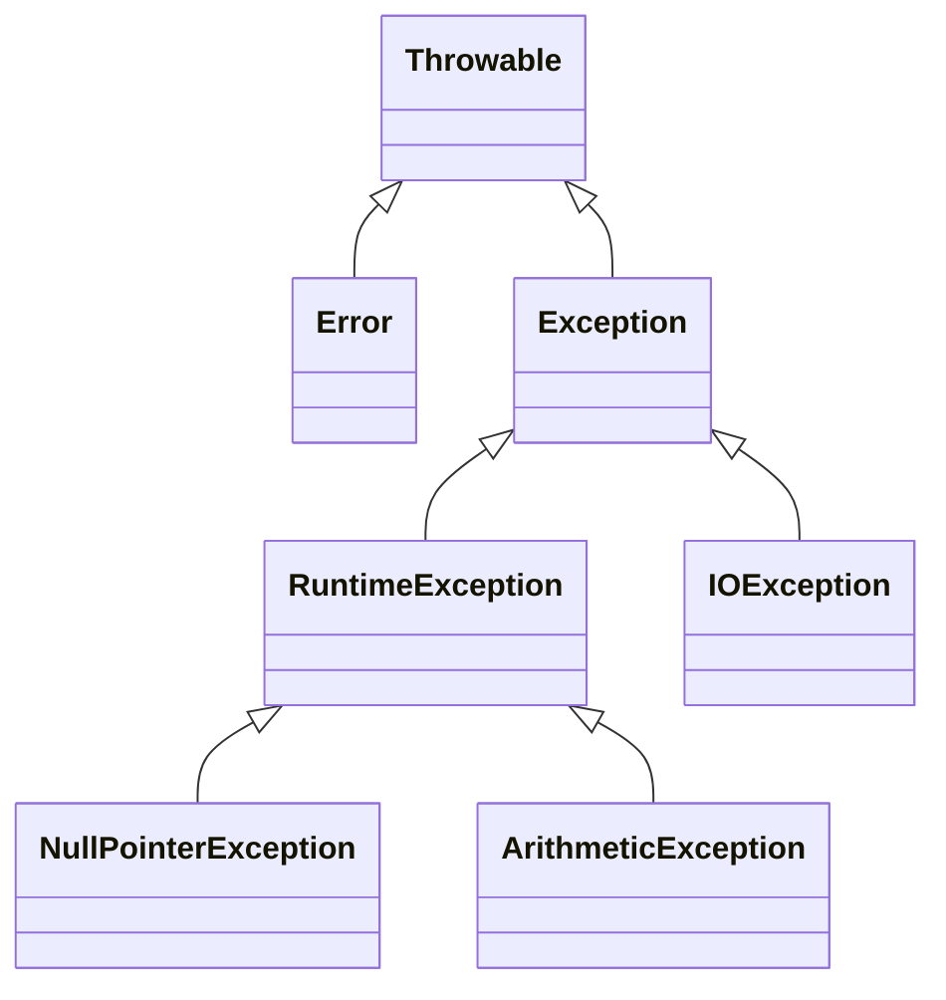

# Exceptions — Handling What Goes Wrong

You've already seen programs crash: a [NullPointerException](/synapse/programming-languages/java/classes-and-objects/references-equality-and-the-object-model), an [ArithmeticException](/synapse/programming-languages/java/first-steps/numbers-and-arithmetic), a bad [parse](/synapse/programming-languages/java/first-steps/input-and-output).

- An **exception** is Java's mechanism for signaling "something went wrong". It *transfers control* to code that can deal with it, instead of returning error codes that callers forget to check.
- The defining design choice is a split. **Checked** exceptions are recoverable conditions the *compiler forces* you to handle or declare. **Unchecked** ones (`RuntimeException`) signal programming bugs and carry no such requirement.
- Around that split sit `try`/`catch` to recover, `throw`/`throws` to raise and declare, `finally` to always clean up, and `try`-with-resources to close things automatically.

<div style="border-left:4px solid #195045;background:rgba(25,80,69,0.08);padding:0.6rem 1rem;border-radius:0 0.5rem 0.5rem 0;margin:1.25rem 0">

💡 **The core idea.**

- An **exception** signals "something went wrong" and **transfers control** to code that can handle it.
- The defining split: **checked** (compiler forces you to handle or declare) vs **unchecked** (`RuntimeException`, bugs).
- Around it sit `try`/`catch`, `throw`/`throws`, `finally`, and `try`-with-resources.

</div>

Every output below was produced by compiling and running the code on Java 21.

**You'll be able to:** trace which statements run when a `try` block throws, and read which method threw from a stack trace; predict whether a call compiles from whether its exception is checked, and fix `unreported exception` with `catch` or `throws`; write a custom exception, and catch two unrelated exception types in one multi-catch clause; predict the order of opening, closing and suppressed exceptions in `try`-with-resources; explain why a `return` inside `finally` loses an exception.

<div style="border-left:4px solid #15448e;background:rgba(21,68,142,0.08);padding:0.6rem 1rem;border-radius:0 0.5rem 0.5rem 0;margin:1.25rem 0">

📘 **How to read the Intuition boxes.** Each one is built in three moves:

1. **The mechanism** — what the compiler and the JVM *do*.
2. **A concrete bite** — a specific, runnable failure (often a real compiler error), shown so the trap is visible.
3. **The earned rule** — the decision heuristic, now justified rather than asserted, plus its cost.

</div>

---

## Table of contents

1. [`try`/`catch`: recover instead of crash](#1-trycatch-recover-instead-of-crash)
2. [The hierarchy: checked vs unchecked](#2-the-hierarchy-checked-vs-unchecked)
3. [Several `catch` clauses, and multi-catch](#3-several-catch-clauses-and-multi-catch)
4. [`throw`, `throws`, and custom exceptions](#4-throw-throws-and-custom-exceptions)
5. [`finally`: cleanup that always runs](#5-finally-cleanup-that-always-runs)
6. [`try`-with-resources](#6-try-with-resources)
7. [Mental-model summary](#7-mental-model-summary)
8. [Gotcha checklist](#8-gotcha-checklist)
9. [Check yourself](#-check-yourself)
10. [Sources](#-sources)

---

## 1. `try`/`catch`: recover instead of crash

Wrap risky code in a `try`; if it throws, control jumps to a matching `catch`, which handles the problem so the program continues instead of dying.

```java run viz=array:inputs
public class Main {
    public static void main(String[] args) {
        String[] inputs = { "42", "oops", "7" };
        for (String in : inputs) {
            try {
                int n = Integer.parseInt(in);
                System.out.println("parsed: " + n);
            } catch (NumberFormatException e) {
                System.out.println("bad input: " + in);
            }
        }
        System.out.println("done");
    }
}
```

**Output:**
```
parsed: 42
bad input: oops
parsed: 7
done
```

**Analysis.** `parseInt("oops")` threw a `NumberFormatException`. In [Input & Output](/synapse/programming-languages/java/first-steps/input-and-output) that crashed the program; here the `catch` handled it. It printed `bad input: oops`, and the loop carried on to `"7"`.

- The exception transferred control from the failing `parseInt` straight to the `catch`.
- It skipped the `println("parsed: ...")` for that iteration.
- One bad input no longer sinks the whole program.

**Intuition.**
*Mechanism.* When code in a `try` throws, the JVM abandons the rest of the `try` block. It looks for a `catch` whose type matches the exception (here `NumberFormatException`). If one matches, its body runs, and execution continues after the whole `try`/`catch`. The thrown object (`e`) carries details: a message and a stack trace.

*Concrete bite.* The win is targeted recovery: only the operations that can fail are guarded, and the handler decides what "recover" means (skip, retry, default). Catch too broadly (`catch (Exception e)`) and you may swallow bugs you need to see. Catch the *specific* type, and unexpected exceptions still propagate.

<div style="border-left:4px solid #195045;background:rgba(25,80,69,0.08);padding:0.6rem 1rem;border-radius:0 0.5rem 0.5rem 0;margin:1.25rem 0">

💡 **Earned rule.** Wrap exactly the operation that can fail in a `try`, and `catch` the *specific* exception you can handle.

- The cost is structure, and the temptation to over-catch.
- The benefit: anticipated failures become recoverable events instead of crashes. The `catch`'s scope documents which line was expected to fail.

</div>

---

## 2. The hierarchy: checked vs unchecked

Every exception is a `Throwable`. The tree splits into `Error` and `Exception` <abbr title="The Java Language Specification, Java SE 21, §11.1.1">[1]</abbr>:

- An `Error` indicates "serious problems that a reasonable application should not try to catch" <abbr title="java.lang.Error, Java SE 21 API">[10]</abbr>, such as running out of memory.
- Within `Exception`, the subclass `RuntimeException` and its descendants are **unchecked**, like every `Error`.
- Everything else under `Exception` is **checked**.

The difference is a compiler rule: checked exceptions *must* be caught or declared.



An **unchecked** exception (a `RuntimeException` like `ArithmeticException`) needs no declaration — code compiles and only fails at run time if it throws:

```java run
public class Main {
    static int divide(int a, int b) {
        return a / b;
    }
    public static void main(String[] args) {
        System.out.println(divide(10, 2));
        System.out.println(divide(10, 0));
    }
}
```

**Output** *(prints `5`, then crashes):*
```
5
Exception in thread "main" java.lang.ArithmeticException: / by zero
```

**Analysis.** `divide` can throw `ArithmeticException`. As an *unchecked* exception, it required no `throws` and no `try`. The code compiled freely, ran `divide(10, 2)` fine (`5`), then threw on `divide(10, 0)`. Unchecked exceptions represent bugs (a zero divisor, a null dereference, a bad index) the compiler doesn't force you to anticipate everywhere.

**Intuition.**
*Mechanism.* The compiler tracks *checked* exceptions: any code that can throw one must either `catch` it or declare it with `throws` <abbr title="The Java Language Specification, Java SE 21, §11.2">[2]</abbr>. `RuntimeException`s and `Error`s are exempt. They could occur almost anywhere, so requiring declarations would be unbearable.

*Concrete bite.* Call something that throws a *checked* exception without handling it and the compiler refuses:

```java run
import java.io.IOException;

public class Main {
    static void risky() throws IOException {
        throw new IOException("disk error");
    }
    public static void main(String[] args) {
        risky();
    }
}
```

**Compiler error:**
```
Main.java:8: error: unreported exception IOException; must be caught or declared to be thrown
        risky();
             ^
```

`IOException` is checked, so calling `risky()` without a `try`/`catch` (or a `throws` on `main`) won't compile. Wrapping the call fixes it: `try { risky(); } catch (IOException e) { … }`.

The rule also runs the other way. A `catch` for a checked exception that its `try` block can never throw is an error too <abbr title="The Java Language Specification, Java SE 21, §11.2.3">[3]</abbr>. `catch (IOException e)` around a `println` gives `exception IOException is never thrown in body of corresponding try statement`.

<div style="border-left:4px solid #195045;background:rgba(25,80,69,0.08);padding:0.6rem 1rem;border-radius:0 0.5rem 0.5rem 0;margin:1.25rem 0">

💡 **Earned rule.** Use checked exceptions for recoverable, expected conditions a caller should consciously handle (a missing file, a network timeout). Use unchecked (`RuntimeException`) for programming errors (null, bad argument, bad index): a bug to fix, not a case to handle.

- The cost is the famous friction of checked exceptions: they propagate up through every signature.
- The benefit is the compiler guaranteeing that anticipated failures are not silently ignored.

</div>

---

## 3. Several `catch` clauses, and multi-catch

A `try` may have several `catch` clauses. The JVM tries them in order, top to bottom, and runs the first one whose type matches. When two exceptions need the same handling, one **multi-catch** clause lists both types, separated by `|` <abbr title="The Java Language Specification, Java SE 21, §14.20">[4]</abbr>:

```java run
public class Main {
    static int parseAt(String[] parts, int i) {
        return Integer.parseInt(parts[i]);
    }
    public static void main(String[] args) {
        String[] parts = { "10", "ten" };
        for (int i = 0; i < 3; i++) {
            try {
                System.out.println("value: " + parseAt(parts, i));
            } catch (NumberFormatException | ArrayIndexOutOfBoundsException e) {
                System.out.println("skipped " + i + ": " + e.getClass().getSimpleName());
            }
        }
    }
}
```

**Output:**
```
value: 10
skipped 1: NumberFormatException
skipped 2: ArrayIndexOutOfBoundsException
```

**Analysis.** Index 1 held `"ten"`, so `parseInt` threw `NumberFormatException`. Index 2 is past the end of the two-element array, so `parts[i]` threw `ArrayIndexOutOfBoundsException`. One clause caught both, and `e.getClass()` reported which one arrived.

**Intuition.**
*Mechanism.* In a multi-catch, `e` has the closest common supertype of the listed types, so only the methods they share are callable. `e` is also implicitly `final`: the handler cannot assign to it <abbr title="The Java Language Specification, Java SE 21, §14.20">[4]</abbr>.

*Concrete bite.* The alternatives may not be related by subclassing <abbr title="The Java Language Specification, Java SE 21, §14.20">[4]</abbr>. `NumberFormatException` extends `IllegalArgumentException`, so listing both is redundant, and javac says so:

```java run
public class Main {
    public static void main(String[] args) {
        try {
            System.out.println(Integer.parseInt("ten"));
        } catch (NumberFormatException | IllegalArgumentException e) {
            System.out.println("bad number");
        }
    }
}
```

**Compiler error:**
```
Main.java:5: error: Alternatives in a multi-catch statement cannot be related by subclassing
        } catch (NumberFormatException | IllegalArgumentException e) {
                                         ^
  Alternative NumberFormatException is a subclass of alternative IllegalArgumentException
1 error
```

Keep only `IllegalArgumentException`: it already catches its subclass.

*Non-example: a general `catch` before a specific one.* Clauses are tried in order. A `catch (Exception e)` first would catch everything, so a later `catch (NumberFormatException e)` could never run. That is a compile-time error <abbr title="The Java Language Specification, Java SE 21, §11.2.3">[3]</abbr>:

```java run
public class Main {
    public static void main(String[] args) {
        try {
            System.out.println(Integer.parseInt("ten"));
        } catch (Exception e) {
            System.out.println("something failed");
        } catch (NumberFormatException e) {
            System.out.println("bad number");
        }
    }
}
```

**Compiler error:**
```
Main.java:7: error: exception NumberFormatException has already been caught
        } catch (NumberFormatException e) {
          ^
1 error
```

Put the specific clause first, and the general one last.

<div style="border-left:4px solid #195045;background:rgba(25,80,69,0.08);padding:0.6rem 1rem;border-radius:0 0.5rem 0.5rem 0;margin:1.25rem 0">

💡 **Earned rule.** Order `catch` clauses from specific to general. When two unrelated exceptions need the same handling, write one multi-catch clause instead of two identical bodies.

- The cost: inside a multi-catch, `e` offers only what the types share, and it cannot be reassigned.
- The benefit: one handler, no duplicated code, and the compiler rejects clauses that could never run.

</div>

---

## 4. `throw`, `throws`, and custom exceptions

Three tools raise and name failures:

- `throw` raises an exception <abbr title="The Java Language Specification, Java SE 21, §14.18">[8]</abbr>.
- `throws` declares that a method may raise a checked one <abbr title="The Java Language Specification, Java SE 21, §8.4.6">[9]</abbr>.
- Your own exception class extends `Exception` (checked) or `RuntimeException` (unchecked).

A custom type names the failure and carries its data.

```java run
class InsufficientFundsException extends Exception {
    InsufficientFundsException(String msg) { super(msg); }
}

class Account {
    int balance = 100;
    void withdraw(int amount) throws InsufficientFundsException {
        if (amount > balance) {
            throw new InsufficientFundsException("need " + amount + ", have " + balance);
        }
        balance -= amount;
    }
}

public class Main {
    public static void main(String[] args) {
        Account acct = new Account();
        try {
            acct.withdraw(50);
            System.out.println("balance: " + acct.balance);
            acct.withdraw(100);
        } catch (InsufficientFundsException e) {
            System.out.println("denied: " + e.getMessage());
        }
    }
}
```

**Output:**
```
balance: 50
denied: need 100, have 50
```

**Analysis.**

- `withdraw(50)` succeeded (balance `50`).
- `withdraw(100)` saw `amount > balance` and threw an `InsufficientFundsException`. It unwound out of `withdraw` to the `catch`, which printed the message it carried.
- `InsufficientFundsException extends Exception`, so it's *checked*. That's why `withdraw` declares `throws InsufficientFundsException`, and the caller must handle it.

The custom type makes the failure a named, catchable thing with its own data.

**Intuition.**
*Mechanism.* `throw` stops the current method and propagates the exception up the call stack. Each caller in turn is abandoned, until a matching `catch` is found. If none is found, the thread ends, and by default a **stack trace** is printed: the exception, then one `at` line per method it passed through, innermost first. `throws` declares that propagation in the signature.

Here no method catches, so the trace shows the whole path:

```java run
public class Main {
    static int checkAge(int age) {
        if (age < 0) {
            throw new IllegalArgumentException("negative age: " + age);
        }
        return age;
    }
    static int register(int age) {
        return checkAge(age) + 1000;
    }
    public static void main(String[] args) {
        System.out.println(register(30));
        System.out.println(register(-5));
        System.out.println("never printed");
    }
}
```

**Output** *(prints `1030`, then a thrown exception):*
```
1030
Exception in thread "main" java.lang.IllegalArgumentException: negative age: -5
	at Main.checkAge(Main.java:4)
	at Main.register(Main.java:9)
	at Main.main(Main.java:13)
```

Read it top down. The first `at` line is where the exception was thrown: `checkAge`, line 4. Each line below is the caller that was waiting: `register` at line 9, then `main` at line 13. The first line under the message is the one to open first.

*Concrete bite.* A custom exception beats a generic one (`throw new Exception("...")`). Callers can `catch (InsufficientFundsException e)` specifically, and tell it apart from other failures. The type itself documents the condition. The message (`super(msg)`) and any extra fields travel with it to the handler.

<div style="border-left:4px solid #195045;background:rgba(25,80,69,0.08);padding:0.6rem 1rem;border-radius:0 0.5rem 0.5rem 0;margin:1.25rem 0">

💡 **Earned rule.** `throw` a *specific* exception type (custom when no standard one fits), and declare checked ones with `throws`. Extend `Exception` for conditions callers should handle, and `RuntimeException` for misuse and bugs.

- The cost is a class per condition, and `throws` plumbing.
- The benefit: failures that are named, catchable by type, and self-documenting — far better than error codes or a bare boolean return.

</div>

---

## 5. `finally`: cleanup that always runs

A `finally` block attached to a `try` runs **no matter how the `try` exits** — normal completion, a caught exception, or even a `return`. It's where cleanup that must always happen goes.

```java run
public class Main {
    static String process() {
        try {
            return "from try";
        } finally {
            System.out.println("finally ran");
        }
    }
    public static void main(String[] args) {
        System.out.println(process());
    }
}
```

**Output:**
```
finally ran
from try
```

**Analysis.** Read the order. `process()` hit `return "from try"`, but the `finally` ran *before* the method returned. So `finally ran` printed first, then the returned value.

`finally` intercepts every exit path, including a `return` in the middle of the `try`. That's what makes it reliable for cleanup.

**Intuition.**
*Mechanism.* Whatever ends the `try` — completion, an exception, or `return` — the `finally` block runs on the way out <abbr title="The Java Language Specification, Java SE 21, §14.20.2">[5]</abbr>. For a `return`, the value is computed, then `finally` runs, then control leaves. It is skipped only if the `try` never ends, or the JVM stops first: `System.exit` never returns <abbr title="java.lang.Runtime, Java SE 21 API (exit)">[11]</abbr>.

```java run
public class Main {
    public static void main(String[] args) {
        try {
            System.out.println("in try");
            System.exit(0);
        } finally {
            System.out.println("finally ran");
        }
    }
}
```

**Output:**
```
in try
```

The JVM stopped inside the `try`, so no `finally ran`.

*Concrete bite.* The `finally ran`-before-`from try` order is the surprise: people expect a `return` to leave immediately. It doesn't. `finally` always gets its turn first, which is the whole point: release the lock, close the file, even if you bailed early.

*Non-example: a `return` inside `finally`.* If `finally` itself ends abruptly, by `return` or `throw`, that outcome replaces the `try`'s. The original exception is discarded <abbr title="The Java Language Specification, Java SE 21, §14.20.2">[5]</abbr>:

```java run
public class Main {
    static String process() {
        try {
            throw new IllegalStateException("the real problem");
        } finally {
            return "from finally";
        }
    }
    public static void main(String[] args) {
        System.out.println(process());
    }
}
```

**Output:**
```
from finally
```

The `IllegalStateException` vanished: no crash, no trace, only an ordinary return value. javac compiles this without a word. Only with the `-Xlint:finally` option does it warn: `finally clause cannot complete normally`.

<div style="border-left:4px solid #195045;background:rgba(25,80,69,0.08);padding:0.6rem 1rem;border-radius:0 0.5rem 0.5rem 0;margin:1.25rem 0">

💡 **Earned rule.** Put must-always-run cleanup in `finally`, and never `return` (or `throw`) from inside it.

- The cost: `finally` runs on every path, so a misused one can mask the `try`'s outcome.
- The benefit: cleanup that's guaranteed regardless of how the block exits. For *resources*, the next section's tool is cleaner still.

</div>

---

## 6. `try`-with-resources

Closing resources by hand in `finally` is verbose and easy to get wrong. **`try`-with-resources** declares a resource in parentheses after `try`. Any object implementing `AutoCloseable` is **closed automatically** when the block exits, in reverse order of opening <abbr title="The Java Language Specification, Java SE 21, §14.20.3">[6]</abbr>.

```java run
class Resource implements AutoCloseable {
    String name;
    Resource(String name) { this.name = name; System.out.println("open " + name); }
    void use() { System.out.println("use " + name); }
    @Override public void close() { System.out.println("close " + name); }
}

public class Main {
    public static void main(String[] args) {
        try (Resource r = new Resource("file")) {
            r.use();
        }
        System.out.println("after");
    }
}
```

**Output:**
```
open file
use file
close file
after
```

**Analysis.** The resource opened and was used. Then `close()` ran *automatically* as the `try` block exited, before `after` printed, with no explicit `finally`. Had `use()` thrown, `close()` would still have run. `try`-with-resources is `finally`-based cleanup specialized for anything `AutoCloseable` (files, streams, connections, locks), generated correctly for you.

**Intuition.**
*Mechanism.* The compiler expands `try (R r = ...)` into a `try`/`finally` that calls `r.close()` on exit <abbr title="The Java Language Specification, Java SE 21, §14.20.3.1">[7]</abbr>. It handles the edge cases: it closes even if the body throws. If the body threw and `close()` throws too, the `close()` exception is **suppressed**. It is attached to the body's exception, which is the one you catch <abbr title="The Java Language Specification, Java SE 21, §14.20.3">[6]</abbr>:

```java run
class Resource implements AutoCloseable {
    String name;
    Resource(String name) { this.name = name; System.out.println("open " + name); }
    @Override public void close() {
        System.out.println("close " + name);
        throw new IllegalStateException("close of " + name + " failed");
    }
}

public class Main {
    public static void main(String[] args) {
        try (Resource r = new Resource("file")) {
            throw new IllegalArgumentException("body failed");
        } catch (IllegalArgumentException e) {
            System.out.println("caught: " + e.getMessage());
            for (Throwable s : e.getSuppressed()) {
                System.out.println("suppressed: " + s.getMessage());
            }
        }
    }
}
```

**Output:**
```
open file
close file
caught: body failed
suppressed: close of file failed
```

**Analysis.** The resource was closed before the `catch` ran. The body's `body failed` is the exception that arrived, so the real cause is not lost. The `close()` failure rode along, and `getSuppressed()` <abbr title="java.lang.Throwable, Java SE 21 API (getSuppressed)">[12]</abbr> returned it.

*Concrete bite.* The alternative, a manual `finally { r.close(); }`, is where leaks hide. Forget it, get the ordering wrong, or let `close()` itself throw and mask the real error, and a file handle or connection leaks. `try`-with-resources removes that whole class of bug by construction. The close is not optional, and not yours to forget.

<div style="border-left:4px solid #195045;background:rgba(25,80,69,0.08);padding:0.6rem 1rem;border-radius:0 0.5rem 0.5rem 0;margin:1.25rem 0">

💡 **Earned rule.** Use `try`-with-resources for anything you must close — files, streams, sockets, connections, locks. Reserve a bare `finally` for cleanup that isn't an `AutoCloseable`.

- The cost: your resource type must implement `AutoCloseable`.
- The benefit: guaranteed, correctly ordered, exception-safe cleanup, with none of the manual `finally` boilerplate. [I/O, Files & NIO.2](/synapse/programming-languages/java/advanced/io-files-and-nio2) uses it for real file I/O.

</div>

---

## 7. Mental-model summary

| Principle | Consequence |
|---|---|
| `try`/`catch` transfers control to a handler on a throw | An anticipated failure becomes recoverable, not a crash |
| Checked exceptions must be caught or declared; unchecked need not | A checked call without handling won't compile; a `RuntimeException` only fails at run time |
| `catch` clauses are tried in order; multi-catch joins unrelated types with `\|` | Specific before general; related alternatives or an unreachable clause won't compile |
| `throw` raises, `throws` declares, custom types name the failure | Callers can `catch` a specific type and read its data |
| An uncaught exception unwinds every caller | The stack trace lists the thrower first, then each waiting caller |
| `finally` runs on every exit path, even a `return` | Reliable cleanup — but a `return`/`throw` inside it discards the `try`'s exception |
| `try`-with-resources auto-closes any `AutoCloseable`, last opened first | Guaranteed, ordered close; a failing `close()` is kept as a suppressed exception |

## 8. Gotcha checklist

<div style="border-left:4px solid #da5233;background:rgba(218,82,51,0.08);padding:0.6rem 1rem;border-radius:0 0.5rem 0.5rem 0;margin:1.25rem 0">

| Symptom | Likely cause | Fix |
|---|---|---|
| `unreported exception IOException; must be caught or declared to be thrown` | a checked exception isn't handled | wrap it in `try`/`catch`, or add `throws` to the method |
| `exception IOException is never thrown in body of corresponding try statement` | a `catch` for a checked exception the `try` cannot throw | remove the `catch`, or catch what the code does throw |
| `exception NumberFormatException has already been caught` | a general `catch` sits above a specific one | put the specific clause first |
| `Alternatives in a multi-catch statement cannot be related by subclassing` | one listed type extends another | keep only the supertype |
| An exception crashes despite a `catch` | the `catch` type doesn't match the thrown one | catch the actual type (the trace's first line names it) |
| `Exception in thread "main"` and a list of `at` lines | an exception no method caught | the first `at` line is where it was thrown; the first line naming your own code is where to look |
| Cleanup didn't run on an early `return` | it was not in `finally` | put it in `finally`, or use `try`-with-resources |
| An exception "disappeared" | a `return` or `throw` inside `finally` replaced it | never exit from `finally`; compile with `-Xlint:finally` to be warned |
| `finally` didn't run | `System.exit` stopped the JVM inside the `try` | don't call `System.exit` where cleanup is pending |
| A `close()` failure seems lost | it was suppressed behind the body's exception | read `e.getSuppressed()` |
| A file/stream/connection leaked | it was closed by hand, or not at all | use `try`-with-resources so `close()` is guaranteed |

</div>

---

## ✅ Check yourself

One check per objective. Answer before you open anything.

```quiz
{"prompt": "A loop parses {\"1\", \"x\", \"3\"} with Integer.parseInt inside try, adds each to total, and prints \"skipped \" + s in catch (NumberFormatException e). After the loop it prints \"total: \" + total. What is printed?", "options": ["skipped x, then total: 4", "total: 4 only", "a NumberFormatException stack trace"], "answer": "skipped x, then total: 4"}
```

```quiz
{"prompt": "static void read() throws IOException { } is called from main as read(); with no try and no throws on main. What happens?", "options": ["It compiles, and runs fine because read() never throws", "It compiles, then crashes at run time", "unreported exception IOException; must be caught or declared to be thrown"], "answer": "unreported exception IOException; must be caught or declared to be thrown"}
```

```quiz
{"prompt": "Does catch (NumberFormatException | IllegalArgumentException e) compile?", "options": ["Yes", "No: the alternatives are related by subclassing", "No: a multi-catch needs checked exceptions"], "answer": "No: the alternatives are related by subclassing"}
```

```quiz
{"prompt": "try (Resource a = new Resource(\"A\"); Resource b = new Resource(\"B\")) { System.out.println(\"use both\"); } — each Resource prints on open and on close. In what order?", "options": ["open A, open B, use both, close A, close B", "open A, open B, use both, close B, close A", "open A, use both, close A, open B, close B"], "answer": "open A, open B, use both, close B, close A"}
```

```quiz
{"prompt": "The try block throws IllegalStateException, and the finally block says return \"from finally\";. What does the caller see?", "options": ["The IllegalStateException", "Both: the value, then the exception", "The value \"from finally\"; the exception is lost"], "answer": "The value \"from finally\"; the exception is lost"}
```

<details>
<summary>The 🧪 box below: the <code>{"1", "x", "3"}</code> total, <code>read()</code> without a <code>try</code>, and two resources.</summary>

```java run
class Resource implements AutoCloseable {
    String name;
    Resource(String name) { this.name = name; System.out.println("open " + name); }
    @Override public void close() { System.out.println("close " + name); }
}

public class Main {
    public static void main(String[] args) {
        try (Resource a = new Resource("A"); Resource b = new Resource("B")) {
            System.out.println("use both");
        }
        int total = 0;
        for (String s : new String[] { "1", "x", "3" }) {
            try {
                total += Integer.parseInt(s);
            } catch (NumberFormatException e) {
                System.out.println("skipped " + s);
            }
        }
        System.out.println("total: " + total);
    }
}
```

**Output:**
```
open A
open B
use both
close B
close A
skipped x
total: 4
```

- `B` closes before `A`: resources close in the reverse order of opening. A resource opened later may use an earlier one (a reader built on a file), so it is closed while the earlier one still works.
- `"x"` was skipped, so the total is `1 + 3 = 4`.
- Calling `void read() throws IOException` from `main` without a `try` does not compile: `unreported exception IOException; must be caught or declared to be thrown`. Add `throws IOException` to `main`, or wrap the call.

</details>

---

## 📚 Sources

1. *The Java Language Specification, Java SE 21*, §11.1.1 "The Kinds of Exceptions" (the checked and unchecked exception classes) — <https://docs.oracle.com/javase/specs/jls/se21/html/jls-11.html#jls-11.1.1>
2. *The Java Language Specification, Java SE 21*, §11.2 "Compile-Time Checking of Exceptions" — <https://docs.oracle.com/javase/specs/jls/se21/html/jls-11.html#jls-11.2>
3. *The Java Language Specification, Java SE 21*, §11.2.3 "Exception Checking" (a `catch` the `try` cannot reach; a `catch` a preceding clause already covers) — <https://docs.oracle.com/javase/specs/jls/se21/html/jls-11.html#jls-11.2.3>
4. *The Java Language Specification, Java SE 21*, §14.20 "The `try` statement" (multi-catch; alternatives may not be subtypes; the parameter is implicitly `final`) — <https://docs.oracle.com/javase/specs/jls/se21/html/jls-14.html#jls-14.20>
5. *The Java Language Specification, Java SE 21*, §14.20.2 "Execution of `try`-`finally` and `try`-`catch`-`finally`" (an abrupt `finally` discards the earlier reason) — <https://docs.oracle.com/javase/specs/jls/se21/html/jls-14.html#jls-14.20.2>
6. *The Java Language Specification, Java SE 21*, §14.20.3 "`try`-with-resources" ("closed in the reverse order"; a later exception "is suppressed") — <https://docs.oracle.com/javase/specs/jls/se21/html/jls-14.html#jls-14.20.3>
7. *The Java Language Specification, Java SE 21*, §14.20.3.1 "Basic `try`-with-resources" (the translation to `try`/`finally`) — <https://docs.oracle.com/javase/specs/jls/se21/html/jls-14.html#jls-14.20.3.1>
8. *The Java Language Specification, Java SE 21*, §14.18 "The `throw` Statement" — <https://docs.oracle.com/javase/specs/jls/se21/html/jls-14.html#jls-14.18>
9. *The Java Language Specification, Java SE 21*, §8.4.6 "Method Throws" — <https://docs.oracle.com/javase/specs/jls/se21/html/jls-8.html#jls-8.4.6>
10. `java.lang.Error`, Java SE 21 API ("serious problems that a reasonable application should not try to catch") — <https://docs.oracle.com/en/java/javase/21/docs/api/java.base/java/lang/Error.html>
11. `java.lang.Runtime`, Java SE 21 API (`exit`: "An invocation of this method never returns normally") — <https://docs.oracle.com/en/java/javase/21/docs/api/java.base/java/lang/Runtime.html>
12. `java.lang.Throwable`, Java SE 21 API (`getSuppressed`: exceptions "suppressed, typically by the try-with-resources statement") — <https://docs.oracle.com/en/java/javase/21/docs/api/java.base/java/lang/Throwable.html>

---

<div style="border-left:4px solid #6d28d9;background:rgba(109,40,217,0.08);padding:0.6rem 1rem;border-radius:0 0.5rem 0.5rem 0;margin:1.25rem 0">

🧪 **Predict, then check.**

1. Predict the output of a loop that `parseInt`s `{"1", "x", "3"}` inside a `try`/`catch`, summing the valid ones and printing the total.
2. Predict whether a method `void read() throws IOException` can be called from `main` without a `try`, and what error you get if not.
3. Predict the exact line order printed by a `try`-with-resources opening two resources `A` then `B` (each printing on open and close). Explain why `B` closes before `A`.

</div>

## Your Turn

Before you move on, check your understanding with the coach — explain the idea, apply it, weigh the trade-offs, then defend your reasoning.

<div class="concept-coach"></div>
