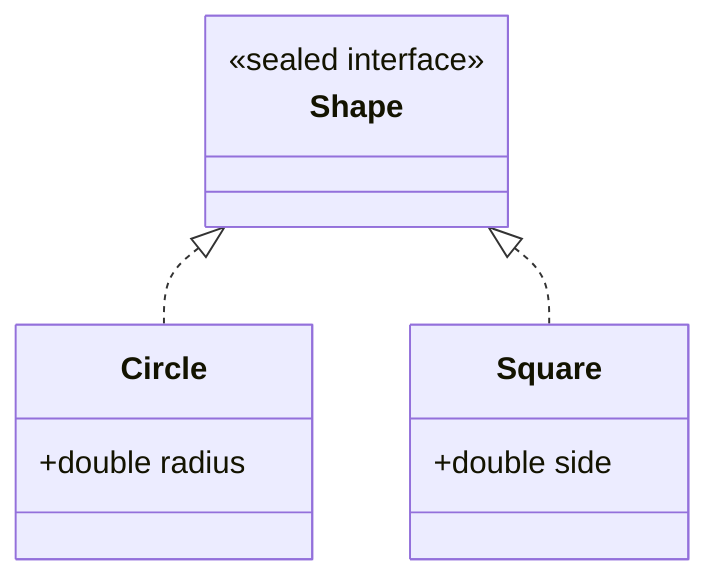

# Sealed Classes & Pattern Matching — A Closed Set of Cases

[Enums & Records](/synapse/programming-languages/java/core-libraries/enums-and-records) introduced `sealed` (a closed set of subtypes) and `record` (a data carrier). This lesson makes them pay off:

- **Pattern matching** tests a value's type *and* binds it to a variable in one move. `o instanceof Circle c` replaces the test-then-cast you wrote for [`equals`](/synapse/programming-languages/java/core-libraries/equals-and-hashcode) and in [Inheritance & Polymorphism](/synapse/programming-languages/java/robust-oop/inheritance-and-polymorphism).
- **Switch pattern matching** (JDK 21) extends the [`switch`](/synapse/programming-languages/java/control-flow/conditionals) to dispatch on type. **Record patterns** deconstruct a record's components inline.
- The keystone: over a **sealed** hierarchy the compiler knows every possible subtype. A `switch` covering them all needs **no `default`**. Add a subtype the `switch` doesn't handle, and it's a compile error, not a silent fall-through.

That combination — `sealed` + `record` + pattern `switch` — is Java's answer to data-oriented programming.

<div style="border-left:4px solid #195045;background:rgba(25,80,69,0.08);padding:0.6rem 1rem;border-radius:0 0.5rem 0.5rem 0;margin:1.25rem 0">

💡 **The core idea.**

- **Pattern matching** tests a type and binds it in one move — `o instanceof Circle c`.
- **Switch pattern matching** dispatches on type; **record patterns** deconstruct components inline.
- Over a **sealed** hierarchy the `switch` is **exhaustive with no `default`** — a forgotten case is a compile error.
- Together `sealed` + `record` + pattern `switch` is Java's data-oriented design.

</div>

Every output below was produced by compiling and running the code on Java 21.

**You'll be able to:** rewrite a test-then-cast as `instanceof` with a binding, and predict where the binding is in scope; write a pattern `switch` with a `when` guard and a `case null`, and predict which case runs; predict whether a `switch` over a sealed type compiles without `default`, and name the error when a case is missing or dominated; deconstruct a nested record with record patterns.

<div style="border-left:4px solid #15448e;background:rgba(21,68,142,0.08);padding:0.6rem 1rem;border-radius:0 0.5rem 0.5rem 0;margin:1.25rem 0">

📘 **How to read the Intuition boxes.** Each one is built in three moves:

1. **The mechanism** — what the compiler and the JVM *do*.
2. **A concrete bite** — a specific, runnable failure (often a real compiler error), shown so the trap is visible.
3. **The earned rule** — the decision heuristic, now justified rather than asserted, plus its cost.

</div>

---

## Table of contents

1. [Pattern matching for `instanceof`](#1-pattern-matching-for-instanceof)
2. [Switch pattern matching](#2-switch-pattern-matching)
3. [Exhaustiveness over a sealed hierarchy](#3-exhaustiveness-over-a-sealed-hierarchy)
4. [Record patterns](#4-record-patterns)
5. [Mental-model summary](#5-mental-model-summary)
6. [Gotcha checklist](#6-gotcha-checklist)
7. [Check yourself](#-check-yourself)
8. [Sources](#-sources)

---

## 1. Pattern matching for `instanceof`

A **type pattern** — `o instanceof Type var` — tests whether `o` is a `Type` and, if so, binds it to `var` already cast. It has been standard since Java 16 <abbr title="JEP 394: Pattern Matching for instanceof (JDK 16)">[1]</abbr>. The binding is in scope wherever the test is known to be true, so the test-and-cast becomes one step.

```java run
public class Main {
    static String describe(Object o) {
        if (o instanceof String s) {
            return "string of length " + s.length();
        } else if (o instanceof Integer i) {
            return "int doubled = " + (i * 2);
        }
        return "unknown";
    }
    public static void main(String[] args) {
        System.out.println(describe("hello"));
        System.out.println(describe(21));
        System.out.println(describe(3.14));
    }
}
```

**Output:**
```
string of length 5
int doubled = 42
unknown
```

**Analysis.** `o instanceof String s` did three things at once: checked the type, cast it, and bound `s`. So the branch could call `s.length()` with no explicit `(String) o`. Likewise `i` was a ready-to-use `Integer`. Compare the old style from [`equals`](/synapse/programming-languages/java/core-libraries/equals-and-hashcode): `if (!(o instanceof Point)) return false; Point p = (Point) o;` The pattern collapses the redundant cast away.

**Intuition.**
*Mechanism.* The compiler introduces the binding variable only where the pattern is provably true <abbr title="The Java Language Specification, Java SE 21, §6.3.1">[5]</abbr>. The cast is implicit and guaranteed safe, so a `ClassCastException` from a mismatched manual cast can't happen.

"Provably true" includes the code *after* a negated test that returns. The early-exit style works:

```java run
public class Main {
    static int length(Object o) {
        if (!(o instanceof String s)) {
            return -1;
        }
        return s.length();
    }
    public static void main(String[] args) {
        System.out.println(length("hello"));
        System.out.println(length(42));
    }
}
```

**Output:**
```
5
-1
```

The `if` returns whenever `o` is not a `String`. So on the line after it, `o` must be a `String`, and `s` is in scope there <abbr title="The Java Language Specification, Java SE 21, §6.3.2.2">[10]</abbr>.

*Concrete bite.* The redundancy it removes is real: the classic `instanceof` + cast names the type twice and risks them drifting apart. The pattern names it once and binds the result, so there's no second cast to get wrong.

*Non-example: a binding where the test may have failed.* With `||`, the right side runs only when the left side is `false`, which is exactly when `s` was never bound:

```java run
public class Main {
    public static void main(String[] args) {
        Object o = "hello";
        if (o instanceof String s || s.isEmpty()) {
            System.out.println("?");
        }
    }
}
```

**Compiler error:**
```
Main.java:4: error: cannot find symbol
        if (o instanceof String s || s.isEmpty()) {
                                     ^
  symbol:   variable s
  location: class Main
1 error
```

With `&&` the same code compiles: the right side runs only when the test succeeded. `o instanceof String s && s.isEmpty()` is the usual form.

<div style="border-left:4px solid #195045;background:rgba(25,80,69,0.08);padding:0.6rem 1rem;border-radius:0 0.5rem 0.5rem 0;margin:1.25rem 0">

💡 **Earned rule.** Use `o instanceof Type var` instead of a separate test and cast wherever you check a type and then use it.

- The cost is close to none: it's strictly less code.
- The benefit: no redundant cast, no chance of a mismatched one, and a binding scoped exactly to where it's valid. It's also the building block for the switch patterns next.

</div>

---

## 2. Switch pattern matching

A `switch` can match on **type patterns** (JDK 21) <abbr title="JEP 441: Pattern Matching for switch (JDK 21)">[3]</abbr>: each `case Type var ->` handles values of that type, binding the variable. This turns a chain of `instanceof`/`else if` into a clean multi-way dispatch.

```java run
public class Main {
    static String describe(Object o) {
        return switch (o) {
            case String s -> "string: " + s;
            case Integer i -> "int: " + i;
            default -> "other";
        };
    }
    public static void main(String[] args) {
        System.out.println(describe("hi"));
        System.out.println(describe(42));
        System.out.println(describe(3.14));
    }
}
```

**Output:**
```
string: hi
int: 42
other
```

**Analysis.** The `switch` matched each value against type patterns: a `String` took the first case (binding `s`), an `Integer` the second, and the `Double` fell to `default`. This is the [arrow `switch` expression](/synapse/programming-languages/java/control-flow/conditionals) generalized from constants to *types*. Each case both tests the type and binds a usable variable, producing a value.

**Intuition.**
*Mechanism.* The `switch` evaluates the selector once and tries each `case` pattern top to bottom, running the first that matches and binding its variable. A pattern `switch` must be **exhaustive**: some case must match every possible value <abbr title="The Java Language Specification, Java SE 21, §14.11.1.1">[7]</abbr>. That holds for a `switch` *statement* with patterns too, not only for an expression. With `Object` as the selector type there are unboundedly many types, so it needs a `default`.

Two more tools refine the cases <abbr title="The Java Language Specification, Java SE 21, §14.11.1">[6]</abbr>:

- A **guard**, `when condition`, adds a test after the type matches.
- `case null` handles a `null` selector, which otherwise matches no case.

```java run
public class Main {
    static String classify(Object o) {
        return switch (o) {
            case null -> "nothing";
            case String s when s.isEmpty() -> "empty string";
            case String s when s.length() > 5 -> "long string: " + s;
            case String s -> "short string: " + s;
            case Integer i when i < 0 -> "negative int";
            case Integer i -> "int: " + i;
            default -> "other: " + o;
        };
    }
    public static void main(String[] args) {
        System.out.println(classify(""));
        System.out.println(classify("pattern"));
        System.out.println(classify("hi"));
        System.out.println(classify(-3));
        System.out.println(classify(7));
        System.out.println(classify(null));
        System.out.println(classify(2.5));
    }
}
```

**Output:**
```
empty string
long string: pattern
short string: hi
negative int
int: 7
nothing
other: 2.5
```

**Analysis.** `"hi"` matched `String s` three times, but the first two guards were `false`, so it reached the unguarded `case String s`. `null` went to `case null`. `2.5` is a `Double`, which no case names, so it fell to `default`.

*Concrete bite.* This replaces the verbose `if (o instanceof A a) … else if (o instanceof B b) …` ladder with a flat, value-producing form. The `default` is required *only* because the selector type (`Object`) is open. Close the type set with `sealed`, and the next section removes even that.

*Non-example: a `null` selector without `case null`.* `default` does not match `null`. With no `case null`, a `null` selector throws `NullPointerException` <abbr title="The Java Language Specification, Java SE 21, §14.11.3">[8]</abbr>:

```java run
public class Main {
    static String describe(Object o) {
        return switch (o) {
            case String s -> "string: " + s;
            case Integer i -> "int: " + i;
            default -> "other";
        };
    }
    public static void main(String[] args) {
        System.out.println(describe("hi"));
        System.out.println(describe(null));
    }
}
```

**Output** *(prints `string: hi`, then a thrown exception):*
```
string: hi
Exception in thread "main" java.lang.NullPointerException
```

Add `case null ->`, or check for `null` before the `switch`.

*Non-example: a general case before a specific one.* Cases are tried in order. A `case CharSequence cs` first would take every `String`, so a later `case String s` could never run. javac calls that case **dominated**, and rejects it <abbr title="The Java Language Specification, Java SE 21, §14.11.1">[6]</abbr>:

```java run
public class Main {
    static String describe(Object o) {
        return switch (o) {
            case CharSequence cs -> "text: " + cs;
            case String s -> "string: " + s;
            default -> "other";
        };
    }
    public static void main(String[] args) {
        System.out.println(describe("hi"));
    }
}
```

**Compiler error:**
```
Main.java:5: error: this case label is dominated by a preceding case label
            case String s -> "string: " + s;
                 ^
1 error
```

Put `case String s` first. A *guarded* case does not dominate, which is why `classify` could list `case String s when …` before `case String s`.

<div style="border-left:4px solid #195045;background:rgba(25,80,69,0.08);padding:0.6rem 1rem;border-radius:0 0.5rem 0.5rem 0;margin:1.25rem 0">

💡 **Earned rule.** Use a pattern `switch` to dispatch on a value's type when you'd otherwise write an `instanceof` chain. It's flatter, binds each case, and yields a value.

- The cost: a `default` for open types, `case null` when `null` can arrive, and ordering care (specific before general).
- The benefit: readable type-based dispatch, which becomes exhaustive and `default`-free over a sealed hierarchy.

</div>

---

## 3. Exhaustiveness over a sealed hierarchy

When the selector is a [`sealed`](/synapse/programming-languages/java/core-libraries/enums-and-records) type, the compiler knows *every* permitted subtype. A `switch` that covers them all is **exhaustive with no `default`** — and if it misses one, that's a compile error.

```java run
sealed interface Shape permits Circle, Square {}
record Circle(double radius) implements Shape {}
record Square(double side) implements Shape {}

public class Main {
    static double area(Shape s) {
        return switch (s) {
            case Circle c -> Math.PI * c.radius() * c.radius();
            case Square sq -> sq.side() * sq.side();
        };
    }
    public static void main(String[] args) {
        System.out.printf("%.2f%n", area(new Circle(2.0)));
        System.out.printf("%.2f%n", area(new Square(3.0)));
    }
}
```

**Output:**
```
12.57
9.00
```



**Analysis.** `Shape` permits exactly `Circle` and `Square`, so the `switch` handling both is *complete*. No `default` was needed, and the compiler accepted it. Each case bound the matched shape and computed its area. This is the design's payoff: the type system guarantees the `switch` covers every case.

**Intuition.**
*Mechanism.* Because `sealed` closes the subtype set <abbr title="JEP 409: Sealed Classes (JDK 17)">[4]</abbr>, the compiler can verify a `switch` handles all of them <abbr title="The Java Language Specification, Java SE 21, §14.11.1.1">[7]</abbr>. Exhaustiveness is checked at compile time: completeness is *proven*, not assumed.

*Concrete bite.* Omit a permitted case and it won't compile:

```java run
sealed interface Shape permits Circle, Square {}
record Circle(double radius) implements Shape {}
record Square(double side) implements Shape {}

public class Main {
    static double area(Shape s) {
        return switch (s) {
            case Circle c -> Math.PI * c.radius() * c.radius();
        };
    }
    public static void main(String[] args) { }
}
```

**Compiler error:**
```
Main.java:7: error: the switch expression does not cover all possible input values
        return switch (s) {
```

`Square` is missing, so the `switch` isn't exhaustive over `Shape`: a compile error. And here's the real win. Add a *third* permitted shape later, and *every* such `switch` stops compiling until you handle it. The compiler becomes a checklist of "places to update when the data model grows."

<div style="border-left:4px solid #195045;background:rgba(25,80,69,0.08);padding:0.6rem 1rem;border-radius:0 0.5rem 0.5rem 0;margin:1.25rem 0">

💡 **Earned rule.** Model a closed set of cases as a `sealed` hierarchy, and dispatch with a `default`-free `switch`, letting exhaustiveness be checked.

- The cost: keeping the `permits` list and the switches in step, which the compiler enforces.
- The benefit: adding a case can't silently slip through. A `default` would quietly swallow the new type at run time.

</div>

---

## 4. Record patterns

When the cases are [records](/synapse/programming-languages/java/core-libraries/enums-and-records), a **record pattern** deconstructs them <abbr title="JEP 440: Record Patterns (JDK 21)">[2]</abbr>. `case Circle(double r) ->` matches a `Circle` *and* binds its component `r` directly, skipping the accessor call.

```java run
sealed interface Shape permits Circle, Rect {}
record Circle(double radius) implements Shape {}
record Rect(double w, double h) implements Shape {}

public class Main {
    static double area(Shape s) {
        return switch (s) {
            case Circle(double r) -> Math.PI * r * r;
            case Rect(double w, double h) -> w * h;
        };
    }
    public static void main(String[] args) {
        System.out.printf("%.2f%n", area(new Circle(2.0)));
        System.out.printf("%.2f%n", area(new Rect(3.0, 4.0)));
    }
}
```

**Output:**
```
12.57
12.00
```

**Analysis.** `case Circle(double r)` matched a `Circle` and bound its `radius` component to `r` in one step, with no `c.radius()` call. `Rect(double w, double h)` bound both components at once. The pattern mirrors the record's *shape*: you read its data by destructuring it, the inverse of constructing it.

**Intuition.**
*Mechanism.* A record pattern matches the record type, then gets each component by invoking its accessor method <abbr title="The Java Language Specification, Java SE 21, §14.30.2">[9]</abbr>. Record patterns nest, and `var` lets the compiler infer a component's type. So one case can match and destructure nested data, and a guard can test the parts:

```java run
record Point(int x, int y) {}
record Line(Point start, Point end) {}

public class Main {
    static String describe(Object o) {
        return switch (o) {
            case Line(Point(var x1, var y1), Point(var x2, var y2)) when x1 == x2 ->
                "vertical line at x = " + x1;
            case Line(Point(var x1, var y1), Point(var x2, var y2)) ->
                "line from (" + x1 + ", " + y1 + ") to (" + x2 + ", " + y2 + ")";
            default -> "not a line";
        };
    }
    public static void main(String[] args) {
        System.out.println(describe(new Line(new Point(2, 0), new Point(2, 9))));
        System.out.println(describe(new Line(new Point(0, 0), new Point(3, 4))));
        System.out.println(describe("text"));
    }
}
```

**Output:**
```
vertical line at x = 2
line from (0, 0) to (3, 4)
not a line
```

**Analysis.** The first `Line` has `x1 == x2`, so the guarded case took it. The second failed the guard and fell to the unguarded `Line` case. Four coordinates were bound in one `case`, with no accessor calls and no casts.

*Concrete bite.* This is the heart of data-oriented programming:

- `sealed` defines the set of shapes data can take.
- `record`s define each shape's fields.
- A pattern `switch` consumes them by destructuring, exhaustively.

The behavior lives *outside* the data (in the `switch`), the opposite of the polymorphism in [inheritance](/synapse/programming-languages/java/robust-oop/inheritance-and-polymorphism). It is a better fit when the operations vary more than the data.

<div style="border-left:4px solid #195045;background:rgba(25,80,69,0.08);padding:0.6rem 1rem;border-radius:0 0.5rem 0.5rem 0;margin:1.25rem 0">

💡 **Earned rule.** Combine `sealed` + `record` + record-pattern `switch` to model and process closed sets of structured data: results, expressions, events, shapes.

- The cost: choosing this style over class polymorphism. Use polymorphism when *behavior* travels with each type and subtypes are open. Use sealed types and patterns when the type set is *closed* and operations are added from outside.
- The benefit: concise, exhaustive, destructuring code the compiler keeps complete.

</div>

---

## 5. Mental-model summary

| Principle | Consequence |
|---|---|
| `o instanceof Type var` tests and binds in one step | Replaces test-then-cast; the binding is scoped to where it's true |
| A binding exists only where its test is known to be true | After `!(o instanceof T t)` that returns, `t` is usable; on the right of `\|\|`, it is not |
| A pattern `switch` dispatches on type, binding each case | Flattens an `instanceof`/`else if` chain into a value-producing form |
| A pattern `switch` must be exhaustive, statement or expression | An open selector type needs `default` |
| `when` guards refine a case; `case null` handles `null` | Without `case null`, a `null` selector throws `NullPointerException`, `default` or not |
| A case that an earlier unguarded case covers is dominated | Specific cases before general ones, or javac rejects the switch |
| Over a `sealed` type, a covering `switch` needs no `default` | The compiler proves exhaustiveness; a missing case won't compile |
| Record patterns deconstruct components, and nest | `case Line(Point(var x1, var y1), Point p2)` binds parts directly |

## 6. Gotcha checklist

<div style="border-left:4px solid #da5233;background:rgba(218,82,51,0.08);padding:0.6rem 1rem;border-radius:0 0.5rem 0.5rem 0;margin:1.25rem 0">

| Symptom | Likely cause | Fix |
|---|---|---|
| Still writing `(Type) o` after an `instanceof` | the old test-then-cast | use `o instanceof Type var` to bind the cast result once |
| `cannot find symbol … variable s` after an `instanceof String s` | the binding is used where the test may have failed (the right of `\|\|`, an `else`) | use `&&`, or the negated early-return form |
| `the switch statement does not cover all possible input values` | a pattern `switch` statement over an open type with no `default` | add `default`, or make the type `sealed` |
| `the switch expression does not cover all possible input values`, over a sealed type | a permitted subtype is unhandled | add its case (don't reach for `default`) |
| `this case label is dominated by a preceding case label` | a general case sits above a specific one | put the specific case first |
| `NullPointerException` from a `switch` that has a `default` | `default` does not match `null` | add `case null ->` |
| Adding a subtype silently does the wrong thing | a `default` swallows it | drop the `default` over a sealed type, so the compiler flags every switch |
| Calling accessors in every case | — | use a record pattern (`case Rect(double w, double h)`) to bind components directly |

</div>

---

## ✅ Check yourself

One check per objective. Answer before you open anything.

```quiz
{"prompt": "Object o = \"hello\"; if (o instanceof String s || s.isEmpty()) { … } — does it compile?", "options": ["Yes", "No: cannot find symbol s, because s is unbound when the left side is false", "Yes, but it throws NullPointerException"], "answer": "No: cannot find symbol s, because s is unbound when the left side is false"}
```

```quiz
{"prompt": "A pattern switch on Object has case String s, case Integer i and default, but no case null. What does passing null do?", "options": ["It throws NullPointerException", "It runs the default case", "It does not compile"], "answer": "It throws NullPointerException"}
```

```quiz
{"prompt": "sealed interface Json permits JNull, JNum, JStr {} — a switch expression handles only JNum and JStr, with no default. What happens?", "options": ["It compiles; JNull falls through", "It compiles; JNull throws at run time", "the switch expression does not cover all possible input values"], "answer": "the switch expression does not cover all possible input values"}
```

```quiz
{"prompt": "record Point(int x, int y) {} and record Line(Point start, Point end) {}. With the §4 describe, what does describe(new Line(new Point(2, 0), new Point(2, 9))) print?", "options": ["line from (2, 0) to (2, 9)", "vertical line at x = 2", "not a line"], "answer": "vertical line at x = 2"}
```

<details>
<summary>The 🧪 box below: <code>describe</code> as a <code>switch</code>, the <code>Json</code> switch, and <code>area(new Rect(2, 5))</code>.</summary>

```java run
sealed interface Shape permits Circle, Rect {}
record Circle(double radius) implements Shape {}
record Rect(double w, double h) implements Shape {}

public class Main {
    static String describe(Object o) {
        return switch (o) {
            case String s -> "string of length " + s.length();
            case Integer i -> "int doubled = " + (i * 2);
            default -> "unknown";
        };
    }
    static double area(Shape s) {
        return switch (s) {
            case Circle(double r) -> Math.PI * r * r;
            case Rect(double w, double h) -> w * h;
        };
    }
    public static void main(String[] args) {
        System.out.println(describe("hello"));
        System.out.println(describe(21));
        System.out.println(describe(3.14));
        System.out.printf("%.2f%n", area(new Rect(2, 5)));
    }
}
```

**Output:**
```
string of length 5
int doubled = 42
unknown
10.00
```

- The `switch` version of `describe` prints the same three lines as the §1 `if` chain.
- A `Json` switch handling only `JNum` and `JStr` does not compile: `the switch expression does not cover all possible input values`. `JNull` is permitted, and unhandled.
- `area(new Rect(2, 5))` is `10.00`. No `default` is needed: `Shape` permits only `Circle` and `Rect`, and both have a case.

</details>

---

## 📚 Sources

1. JEP 394: Pattern Matching for `instanceof` (JDK 16) — <https://openjdk.org/jeps/394>
2. JEP 440: Record Patterns (JDK 21) — <https://openjdk.org/jeps/440>
3. JEP 441: Pattern Matching for `switch` (JDK 21) — <https://openjdk.org/jeps/441>
4. JEP 409: Sealed Classes (JDK 17) — <https://openjdk.org/jeps/409>
5. *The Java Language Specification, Java SE 21*, §6.3.1 "Scope for Pattern Variables in Expressions" — <https://docs.oracle.com/javase/specs/jls/se21/html/jls-6.html#jls-6.3.1>
6. *The Java Language Specification, Java SE 21*, §14.11.1 "Switch Blocks" (guards; `case null`; "It is a compile-time error if any switch label in a switch block is dominated") — <https://docs.oracle.com/javase/specs/jls/se21/html/jls-14.html#jls-14.11.1>
7. *The Java Language Specification, Java SE 21*, §14.11.1.1 "Exhaustive Switch Blocks" — <https://docs.oracle.com/javase/specs/jls/se21/html/jls-14.html#jls-14.11.1.1>
8. *The Java Language Specification, Java SE 21*, §14.11.3 "Execution of a `switch` Statement" (a `null` selector with no matching label throws `NullPointerException`) — <https://docs.oracle.com/javase/specs/jls/se21/html/jls-14.html#jls-14.11.3>
9. *The Java Language Specification, Java SE 21*, §14.30.2 "Pattern Matching" ("Each record component of v is determined by invoking the accessor method") — <https://docs.oracle.com/javase/specs/jls/se21/html/jls-14.html#jls-14.30.2>
10. *The Java Language Specification, Java SE 21*, §6.3.2.2 "`if` Statements" (a pattern variable introduced "when false" is in scope after an `if` whose body cannot complete normally) — <https://docs.oracle.com/javase/specs/jls/se21/html/jls-6.html#jls-6.3.2.2>

---

<div style="border-left:4px solid #6d28d9;background:rgba(109,40,217,0.08);padding:0.6rem 1rem;border-radius:0 0.5rem 0.5rem 0;margin:1.25rem 0">

🧪 **Predict, then check.**

1. Rewrite the §1 `describe` as a pattern `switch`, and predict its three outputs.
2. Take `sealed interface Json permits JNull, JNum, JStr {}`, with records `JNull()`, `JNum(double v)` and `JStr(String s)`. Predict whether a `switch` handling only `JNum` and `JStr` compiles, and the error if not.
3. Predict the area printed by `area(new Rect(2, 5))` using the §4 record pattern, and explain why no `default` is needed.

</div>

## Your Turn

Before you move on, check your understanding with the coach — explain the idea, apply it, weigh the trade-offs, then defend your reasoning.

<div class="concept-coach"></div>
