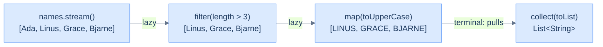

# Functional Java & the Streams API — Pipelines Over Data

[Lambdas](/synapse/programming-languages/java/robust-oop/nested-and-anonymous-classes-and-lambdas) made behavior a value. The **Streams API** uses that to transform sequences declaratively.

- A **stream** is a *pipeline* of operations over a source, such as `filter`, `map` and `reduce` chained together. It describes **what** to compute and leaves **how** to iterate to the library.
- Pipelines are **lazy**. Nothing runs until a *terminal* operation pulls the data through, so work is fused into one pass and can stop early.
- **`Optional`** turns "maybe absent" from a [`null` waiting to crash](/synapse/programming-languages/java/classes-and-objects/references-equality-and-the-object-model) into a type you must handle.
- **Parallel** streams split the work across processor cores. They are fast when the operations are stateless, and wrong when they share mutable state.

<div style="border-left:4px solid #195045;background:rgba(25,80,69,0.08);padding:0.6rem 1rem;border-radius:0 0.5rem 0.5rem 0;margin:1.25rem 0">

💡 **The core idea.**

- A **stream** is a pipeline (`filter`/`map`/`reduce`) describing **what** to compute, not how to iterate.
- Pipelines are **lazy** — nothing runs until a terminal operation pulls the data — and they compose.
- **`Optional`** turns "maybe absent" into a type you must handle.
- **Parallel** streams split work across cores — fast when stateless, dangerous when sharing mutable state.

</div>

This builds on [generics](/synapse/programming-languages/java/core-libraries/generics) and [lambdas](/synapse/programming-languages/java/robust-oop/nested-and-anonymous-classes-and-lambdas). Every output below was produced by compiling and running the code.

**You'll be able to:** write a pipeline that filters, maps, sorts, flattens and collects, and predict its result; pick `reduce`, a collector or a primitive stream for an aggregate, and name the error when a key repeats in `toMap`; trace which elements a lazy pipeline touches, and predict when `peek` prints nothing; consume an `Optional` without `get()`, and predict when `orElse` evaluates its argument; explain why a parallel stream that writes shared state gives a wrong count, and rewrite it as a reduction.

<div style="border-left:4px solid #15448e;background:rgba(21,68,142,0.08);padding:0.6rem 1rem;border-radius:0 0.5rem 0.5rem 0;margin:1.25rem 0">

📘 **How to read the Intuition boxes.** Each one is built in three moves:

1. **The mechanism** — what the compiler and the JVM *do*.
2. **A concrete bite** — a specific, runnable failure (often a real compiler error), shown so the trap is visible.
3. **The earned rule** — the decision heuristic, now justified rather than asserted, plus its cost.

</div>

---

## Table of contents

1. [A stream pipeline](#1-a-stream-pipeline)
2. [Sorting, flattening and joining streams](#2-sorting-flattening-and-joining-streams)
3. [`reduce`, collectors and primitive streams](#3-reduce-collectors-and-primitive-streams)
4. [Lazy evaluation](#4-lazy-evaluation)
5. [`Optional`](#5-optional)
6. [Parallel streams and their hazards](#6-parallel-streams-and-their-hazards)
7. [Mental-model summary](#7-mental-model-summary)
8. [Gotcha checklist](#8-gotcha-checklist)
9. [Check yourself](#-check-yourself)
10. [Sources](#-sources)

---

## 1. A stream pipeline

`collection.stream()` starts a pipeline <abbr title="Java SE 21 API, java.util.stream package summary, &quot;Stream operations and pipelines&quot;">[1]</abbr>:

- A **source** supplies the elements: a collection, an array, or a generator.
- **Intermediate** operations (`filter`, `map`) each return a new stream, so they chain.
- A **terminal** operation (`collect`) ends the pipeline and produces a result.

```java run viz=array:result
import java.util.List;
import java.util.stream.Collectors;

public class Main {
    public static void main(String[] args) {
        List<String> names = List.of("Ada", "Linus", "Grace", "Bjarne");
        List<String> result = names.stream()
            .filter(n -> n.length() > 3)
            .map(String::toUpperCase)
            .collect(Collectors.toList());
        System.out.println(result);
    }
}
```

**Output:**
```
[LINUS, GRACE, BJARNE]
```



**Analysis.** The pipeline has three steps:

- `filter` kept names longer than 3 characters, and dropped `"Ada"`.
- `map` upper-cased each name that was left.
- `collect(toList())` gathered them into a `List`.

The chain reads as a description: *keep the long names, upper-case them, collect*. There is no loop, no index and no intermediate variable. Each lambda or method reference is the behavior for one step.

Since Java 16 a stream also has `toList()` as a shorter terminal <abbr title="Java SE 21 API, java.util.stream.Stream.toList() (since 16)">[2]</abbr>. The two differ in one way that bites:

- `Stream.toList()` returns an **unmodifiable** list.
- `Collectors.toList()` makes "no guarantees on the type, mutability, serializability, or thread-safety" of its list <abbr title="Java SE 21 API, java.util.stream.Collectors.toList()">[3]</abbr>.

When you need to add to the result, ask for a list type by name, with `Collectors.toCollection(ArrayList::new)`:

```java run
import java.util.ArrayList;
import java.util.List;
import java.util.stream.Collectors;

public class Main {
    public static void main(String[] args) {
        List<Integer> editable = List.of(3, 1, 2).stream()
            .collect(Collectors.toCollection(ArrayList::new));
        editable.add(4);
        System.out.println("toCollection(ArrayList::new): " + editable);
        List<Integer> fixed = List.of(3, 1, 2).stream().toList();
        fixed.add(4);
    }
}
```

**Output** *(prints the first line, then a thrown exception):*
```
toCollection(ArrayList::new): [3, 1, 2, 4]
Exception in thread "main" java.lang.UnsupportedOperationException
```

**Intuition.**
*Mechanism.* `stream()` produces a stream object. Each intermediate operation wraps it in another stream that records the operation and does nothing yet. Only the terminal `collect` drives elements through the whole chain. The pipeline expresses *what*; the library owns the *how* (the iteration).

*Concrete bite.* A stream is single-use and not a collection. The API says a stream "should be operated on (invoking an intermediate or terminal stream operation) only once" <abbr title="Java SE 21 API, java.util.stream.Stream">[2]</abbr>. Use it a second time, and it throws:

```java run
import java.util.List;
import java.util.stream.Stream;

public class Main {
    public static void main(String[] args) {
        Stream<String> s = List.of("a", "b").stream();
        System.out.println(s.count());
        System.out.println(s.count());
    }
}
```

**Output** *(prints `2`, then a thrown exception):*
```
2
Exception in thread "main" java.lang.IllegalStateException: stream has already been operated upon or closed
```

The first `count()` consumed the stream. A stream is a *view of a computation*, not data you can revisit. Call `stream()` on the list again for a fresh pipeline.

<div style="border-left:4px solid #195045;background:rgba(25,80,69,0.08);padding:0.6rem 1rem;border-radius:0 0.5rem 0.5rem 0;margin:1.25rem 0">

💡 **Earned rule.** Use a stream pipeline when you transform or query a sequence (`filter`/`map`/`collect`). Keep an explicit loop for side-effecting iteration, or when a plain `for` is clearer.

The cost is a new mental model, and streams are one-shot. The benefit is declarative, composable data processing that reads as intent, and that the library can optimize.

</div>

---

## 2. Sorting, flattening and joining streams

Three more intermediate operations reshape a stream rather than filter or transform single elements <abbr title="Java SE 21 API, java.util.stream.Stream">[2]</abbr>:

- `sorted()` puts the elements in natural order; `sorted(comparator)` uses the [`Comparator`](/synapse/programming-languages/java/core-libraries/the-collections-framework) you pass.
- `flatMap(f)` replaces each element with the elements of the stream `f` returns, so nested lists become one flat stream.
- `Stream.concat(a, b)` is a static method that joins two streams: all of `a`, then all of `b`.

`Comparator.comparing(key)` builds a `Comparator` from a function that extracts a sort key. `Comparator.comparing(String::length)` orders strings by their length <abbr title="Java SE 21 API, java.util.Comparator.comparing(Function)">[4]</abbr>.

```java run
import java.util.Comparator;
import java.util.List;

public class Main {
    public static void main(String[] args) {
        List<String> names = List.of("Grace", "Ada", "Linus", "Bo");
        System.out.println(names.stream().sorted().toList());
        System.out.println(names.stream().sorted(Comparator.comparing(String::length)).toList());
        System.out.println(names.stream().sorted(Comparator.reverseOrder()).limit(2).toList());
        System.out.println(names);
    }
}
```

**Output:**
```
[Ada, Bo, Grace, Linus]
[Bo, Ada, Grace, Linus]
[Linus, Grace]
[Grace, Ada, Linus, Bo]
```

**Analysis.** Three sorts, and one untouched source:

- `sorted()` used `String`'s natural order.
- `sorted(Comparator.comparing(String::length))` ordered by length. `Grace` and `Linus` both have 5 letters, and kept their original order: this sort is *stable* for an ordered stream <abbr title="Java SE 21 API, java.util.stream.Stream.sorted(Comparator)">[2]</abbr>.
- `limit(2)` kept the first two elements of the reverse-sorted stream.
- The last line printed `names` itself, unchanged. A stream reads its source; it never reorders it.

`flatMap` is how a stream takes nested data apart. `map` gives one output element per input element, so a stream of lists stays a stream of lists. `flatMap` gives *zero or more* per input:

```java run
import java.util.List;
import java.util.stream.Stream;

public class Main {
    public static void main(String[] args) {
        List<List<Integer>> nested = List.of(List.of(1, 2), List.of(3), List.of());
        List<List<Integer>> mapped = nested.stream().map(l -> l).toList();
        List<Integer> flat = nested.stream().flatMap(List::stream).toList();
        System.out.println("map:     " + mapped);
        System.out.println("flatMap: " + flat);

        List<String> joined = Stream.concat(Stream.of("a", "b"), Stream.of("c")).toList();
        System.out.println("concat:  " + joined);
    }
}
```

**Output:**
```
map:     [[1, 2], [3], []]
flatMap: [1, 2, 3]
concat:  [a, b, c]
```

**Intuition.**
*Mechanism.* `flatMap(List::stream)` turned each inner list into a stream, and poured those streams into one. The empty list gave zero elements, so it vanished. `Stream.of(…)` makes a stream from the values you list, and `concat` ran one stream after the other.

*Concrete bite.* The `map` line is the non-example: it printed `[[1, 2], [3], []]`, still three lists. Asking `map` to flatten does nothing, because `map` never changes the number of elements.

<div style="border-left:4px solid #195045;background:rgba(25,80,69,0.08);padding:0.6rem 1rem;border-radius:0 0.5rem 0.5rem 0;margin:1.25rem 0">

💡 **Earned rule.** Sort inside a pipeline with `sorted(Comparator.comparing(key))`. Flatten nested data with `flatMap`, not `map`. Join two streams with `Stream.concat`.

The cost: `sorted` must see every element before it passes on the first one, which §4 shows. The benefit is that ordering and flattening become steps of the pipeline, not loops around it.

</div>

---

## 3. `reduce`, collectors and primitive streams

Terminal operations turn a stream into a result. `reduce` folds elements into a single value with a combining function. **Collectors** gather them into structures: a `List`, a joined `String`, a grouping `Map`.

```java run viz=hashmap:byParity
import java.util.List;
import java.util.Map;
import java.util.stream.Collectors;

public class Main {
    public static void main(String[] args) {
        List<Integer> nums = List.of(1, 2, 3, 4, 5);
        int sum = nums.stream().reduce(0, Integer::sum);
        String joined = nums.stream().map(String::valueOf).collect(Collectors.joining(", "));
        Map<String, List<Integer>> byParity =
            nums.stream().collect(Collectors.groupingBy(n -> n % 2 == 0 ? "even" : "odd"));
        System.out.println(sum);
        System.out.println(joined);
        System.out.println("odd=" + byParity.get("odd"));
        System.out.println("even=" + byParity.get("even"));
    }
}
```

**Output:**
```
15
1, 2, 3, 4, 5
odd=[1, 3, 5]
even=[2, 4]
```

**Analysis.** Three terminals over the same five numbers:

- `reduce(0, Integer::sum)` folded `1..5` into `15`. It started at `0` and combined each element with `sum`.
- `Collectors.joining(", ")` produced `"1, 2, 3, 4, 5"`.
- `Collectors.groupingBy(...)` built a `Map` from each element's group key (`"odd"`/`"even"`) to the list of elements in that group. It is the stream form of [the counting and grouping idioms](/synapse/programming-languages/java/core-libraries/sets-and-maps), in one expression.

**Intuition.**
*Mechanism.* `reduce(identity, accumulator)` applies the accumulator again and again, starting from the identity. The API requires that "the `identity` value must be an identity for the accumulator function" <abbr title="Java SE 21 API, java.util.stream.Stream.reduce(Object, BinaryOperator)">[2]</abbr>: `0` for a sum, `""` for concatenation. A `Collector` is a recipe for gathering elements into a container. `groupingBy`, `toList`, `joining`, `counting` and `partitioningBy` cover most needs <abbr title="Java SE 21 API, java.util.stream.Collectors">[3]</abbr>.

*Concrete bite.* Seed a sum with `1`, the identity for *multiplication*, and every result is off by one:

```java run
import java.util.List;

public class Main {
    public static void main(String[] args) {
        List<Integer> nums = List.of(1, 2, 3, 4, 5);
        System.out.println(nums.stream().reduce(0, Integer::sum));
        System.out.println(nums.stream().reduce(1, Integer::sum));
    }
}
```

**Output:**
```
15
16
```

The seed is part of the computation. It is the same lesson as the [accumulator-seed trap](/synapse/programming-languages/java/control-flow/loop-control-and-patterns).

**Partitioning** is grouping by a yes/no test. `partitioningBy(test)` always returns a map with the two keys `false` and `true`. A second collector, such as `counting()`, is applied inside each group:

```java run
import java.util.List;
import java.util.Map;
import java.util.stream.Collectors;

public class Main {
    public static void main(String[] args) {
        List<Integer> nums = List.of(1, 2, 3, 4, 5);
        Map<Boolean, List<Integer>> parts =
            nums.stream().collect(Collectors.partitioningBy(n -> n > 2));
        Map<Boolean, Long> counts =
            nums.stream().collect(Collectors.partitioningBy(n -> n > 2, Collectors.counting()));
        System.out.println(parts);
        System.out.println(counts);
    }
}
```

**Output:**
```
{false=[1, 2], true=[3, 4, 5]}
{false=2, true=3}
```

*Non-example: `toMap` with a repeated key.* `Collectors.toMap(keyFn, valueFn)` builds one entry per element. When two elements give the same key, it throws <abbr title="Java SE 21 API, java.util.stream.Collectors.toMap(Function, Function)">[3]</abbr>:

```java run
import java.util.List;
import java.util.Map;
import java.util.stream.Collectors;

public class Main {
    public static void main(String[] args) {
        List<String> names = List.of("Ada", "Bo", "Al");
        Map<Character, String> byInitial =
            names.stream().collect(Collectors.toMap(n -> n.charAt(0), n -> n));
        System.out.println(byInitial);
    }
}
```

**Output** *(a thrown exception):*
```
Exception in thread "main" java.lang.IllegalStateException: Duplicate key A (attempted merging values Ada and Al)
```

`"Ada"` and `"Al"` both map to `'A'`. Use `groupingBy` when a key can repeat, or pass `toMap` a third argument that merges two values.

**Primitive streams.** A `Stream<Integer>` holds boxed `Integer` objects. `IntStream`, `LongStream` and `DoubleStream` hold primitive values, and add arithmetic terminals such as `sum()` and `average()` <abbr title="Java SE 21 API, java.util.stream.IntStream">[5]</abbr>. `mapToInt` turns a stream of objects into an `IntStream`:

```java run
import java.util.List;
import java.util.OptionalDouble;

public class Main {
    public static void main(String[] args) {
        List<String> words = List.of("stream", "of", "words");
        int total = words.stream().mapToInt(String::length).sum();
        OptionalDouble avg = words.stream().mapToInt(String::length).average();
        OptionalDouble none = List.<String>of().stream().mapToInt(String::length).average();
        System.out.println(total);
        System.out.println(avg);
        System.out.println(none);
        System.out.println(none.orElse(0.0));
    }
}
```

**Output:**
```
13
OptionalDouble[4.333333333333333]
OptionalDouble.empty
0.0
```

`sum()` of no elements is `0`, but an average of no elements has no value. So `average()` returns an `OptionalDouble`, the primitive cousin of the `Optional` in §5.

<div style="border-left:4px solid #195045;background:rgba(25,80,69,0.08);padding:0.6rem 1rem;border-radius:0 0.5rem 0.5rem 0;margin:1.25rem 0">

💡 **Earned rule.** Use `reduce` for a single folded value with a neutral identity. Use `Collectors` for structured results: `toList`, `joining`, `groupingBy`, `partitioningBy`. Use `toMap` only when keys are unique. Use `mapToInt` and friends for arithmetic.

The cost is learning the collector vocabulary. The benefit is that aggregation, grouping and joining, loops you would otherwise write by hand, become one declarative line.

</div>

---

## 4. Lazy evaluation

Intermediate operations are **lazy**: they process nothing until a terminal operation runs <abbr title="Java SE 21 API, java.util.stream package summary, &quot;Stream operations and pipelines&quot;">[1]</abbr>. Then elements flow through one at a time. This lets the pipeline **short-circuit**: stop as soon as the answer is known.

```java run
import java.util.List;

public class Main {
    public static void main(String[] args) {
        List<Integer> nums = List.of(1, 2, 3, 4, 5);
        var first = nums.stream()
            .peek(n -> System.out.println("peek " + n))
            .filter(n -> n % 2 == 0)
            .findFirst();
        System.out.println("found: " + first.get());
    }
}
```

**Output:**
```
peek 1
peek 2
found: 2
```

**Analysis.** `peek` prints each element as it flows by, and the output stops at `peek 2`. The pipeline never looked at `3`, `4` or `5`. `findFirst` needed only the first even number, so once `filter` let `2` through, the whole pipeline stopped. A loop that first built a filtered list would have visited all five.

**Intuition.**
*Mechanism.* The terminal operation pulls elements through the pipeline, one at a time, top to bottom:

1. `peek(1)`, then `filter` rejects `1`.
2. `peek(2)`, then `filter` accepts `2`, and `findFirst` is satisfied and halts.

Stateless steps such as `filter` and `map` keep nothing between elements. A short-circuiting terminal (`findFirst`, `anyMatch`) or intermediate (`limit`) stops early.

*Concrete bite.* The `peek` output is the proof: only `1` and `2` were processed. This is why a stream can have an infinite source. `Stream.iterate(1, n -> n * 2)` generates 1, 2, 4, 8, … without end, and a short-circuiting step still finishes:

```java run
import java.util.stream.Stream;

public class Main {
    public static void main(String[] args) {
        int first = Stream.iterate(1, n -> n * 2)
            .filter(n -> n > 1000)
            .findFirst()
            .get();
        System.out.println(first);
        System.out.println(Stream.iterate(1, n -> n * 2).limit(5).toList());
    }
}
```

**Output:**
```
1024
[1, 2, 4, 8, 16]
```

*Non-example: a stateful step breaks the one-at-a-time flow.* `sorted` is **stateful**: it cannot pass on the smallest element until it has seen them all <abbr title="Java SE 21 API, java.util.stream package summary, stateless and stateful operations">[1]</abbr>. Put it before `findFirst`, and every element is pulled:

```java run
import java.util.List;

public class Main {
    public static void main(String[] args) {
        List<Integer> nums = List.of(5, 3, 4, 1, 2);
        var first = nums.stream()
            .peek(n -> System.out.println("peek " + n))
            .sorted()
            .filter(n -> n % 2 == 0)
            .findFirst();
        System.out.println("found: " + first.get());
    }
}
```

**Output:**
```
peek 5
peek 3
peek 4
peek 1
peek 2
found: 2
```

All five elements were peeked, because `sorted` needed all five before `filter` saw any.

*Non-example: `peek` as logic.* Laziness also means a side effect in a pipeline may never run:

```java run
import java.util.List;

public class Main {
    public static void main(String[] args) {
        List<Integer> nums = List.of(1, 2, 3);
        nums.stream().peek(n -> System.out.println("peek " + n));
        System.out.println("no terminal operation, so no peek lines");
        long n = nums.stream().peek(x -> System.out.println("peek " + x)).count();
        System.out.println("count = " + n);
    }
}
```

**Output:**
```
no terminal operation, so no peek lines
count = 3
```

- The first pipeline had no terminal operation, so nothing ran.
- The second had one, `count()`, and still printed no `peek` line. The list knows its own size, and the API lets `count()` skip the pipeline "if it is capable of computing the count directly from the stream source" <abbr title="Java SE 21 API, java.util.stream.Stream.count()">[2]</abbr>.

The API says `peek` "exists mainly to support debugging" <abbr title="Java SE 21 API, java.util.stream.Stream.peek(Consumer)">[2]</abbr>. Never put work there that must happen.

<div style="border-left:4px solid #195045;background:rgba(25,80,69,0.08);padding:0.6rem 1rem;border-radius:0 0.5rem 0.5rem 0;margin:1.25rem 0">

💡 **Earned rule.** Lean on laziness for efficiency. Put cheap, selective `filter`s early, and end with a short-circuiting terminal (`findFirst`, `anyMatch`) or a `limit` to stop as soon as possible.

The cost: side effects inside a pipeline run in a non-obvious order, only as far as needed, and sometimes not at all. So `peek` is for debugging, not logic. A stateful step such as `sorted` reads the whole source. The benefit is that only the necessary work runs.

</div>

---

## 5. `Optional`

A stream query that might find nothing returns an **`Optional<T>`**: a container that holds a value or is empty. It makes "absent" a *type*. You must handle the missing case, instead of risking a [`NullPointerException`](/synapse/programming-languages/java/classes-and-objects/references-equality-and-the-object-model).

```java run
import java.util.Optional;
import java.util.List;

public class Main {
    public static void main(String[] args) {
        List<String> names = List.of("Ada", "Linus");
        Optional<String> found = names.stream().filter(n -> n.startsWith("L")).findFirst();
        System.out.println(found.isPresent());
        System.out.println(found.orElse("none"));
        Optional<String> missing = names.stream().filter(n -> n.startsWith("Z")).findFirst();
        System.out.println(missing.orElse("none"));
    }
}
```

**Output:**
```
true
Linus
none
```

**Analysis.** The first query found `"Linus"`, so `found` was present and `orElse` returned the value. The second matched nothing, so `missing` was empty and `orElse("none")` supplied the fallback. The *type* `Optional<String>` made the possibility of absence visible in the signature. You cannot use a missing value by accident, the way you can with `null`.

**Intuition.**
*Mechanism.* `Optional` wraps "value or nothing" <abbr title="Java SE 21 API, java.util.Optional">[6]</abbr>:

- `orElse` and `orElseGet` supply a default.
- `map` transforms the value only if one is present; `filter` keeps it only if it passes a test.
- `ifPresent` runs an action only if a value is present.

None of them exposes a raw `null`.

*Concrete bite.* Calling `get()` on an empty `Optional` defeats the purpose and throws:

```java run
import java.util.Optional;

public class Main {
    public static void main(String[] args) {
        Optional<String> empty = Optional.empty();
        System.out.println(empty.get());
    }
}
```

**Output** *(a thrown exception):*
```
Exception in thread "main" java.util.NoSuchElementException: No value present
```

`empty.get()` is the `Optional` form of dereferencing `null`: it asserts a value is present when it isn't. Use `orElse`, `orElseThrow(...)` with a meaningful exception, or `ifPresent` instead of a bare `get()`.

*Edge: `orElse` always evaluates its argument.* `orElse(x)` is an ordinary method call, so Java computes `x` before the call, even when the `Optional` has a value. `orElseGet(supplier)` calls the supplier only when the `Optional` is empty <abbr title="Java SE 21 API, java.util.Optional.orElseGet(Supplier)">[6]</abbr>:

```java run
import java.util.Optional;

public class Main {
    static String fallback() {
        System.out.println("  fallback() ran");
        return "none";
    }

    public static void main(String[] args) {
        Optional<String> found = Optional.of("Linus");
        System.out.println("orElse:");
        System.out.println(found.orElse(fallback()));
        System.out.println("orElseGet:");
        System.out.println(found.orElseGet(() -> fallback()));
        System.out.println(found.map(String::length).orElse(0));
        System.out.println(Optional.<String>empty().map(String::length).orElse(0));
    }
}
```

**Output:**
```
orElse:
  fallback() ran
Linus
orElseGet:
Linus
5
0
```

`fallback()` ran for `orElse` although its result was thrown away. Use `orElseGet` when the default is costly to compute. The last two lines show `map` on a present value (`5`) and on an empty one (the fallback `0`).

<div style="border-left:4px solid #195045;background:rgba(25,80,69,0.08);padding:0.6rem 1rem;border-radius:0 0.5rem 0.5rem 0;margin:1.25rem 0">

💡 **Earned rule.** Return `Optional<T>` from methods that may find nothing, and consume it with `orElse`/`orElseGet`/`map`/`ifPresent`, never a naked `get()`.

The cost is the wrapping and unwrapping. `Optional` is meant "primarily … for use as a method return type" <abbr title="Java SE 21 API, java.util.Optional, API note">[6]</abbr>, not for fields or parameters. The benefit: "this might be absent" is visible at the boundary, so a class of run-time `NullPointerException`s becomes handled cases.

</div>

---

## 6. Parallel streams and their hazards

A **thread** is one independent path of execution through a program. A program can run several threads at once, and on a machine with several processor cores they run side by side. The [concurrency lessons](/synapse/programming-languages/java/advanced/concurrency-the-basics) cover them in depth.

`parallelStream()` (or `.parallel()`) splits a stream's work across several threads <abbr title="Java SE 21 API, java.util.stream package summary, &quot;Parallelism&quot;">[1]</abbr>. It can speed up **stateless** operations on large data. It is a trap when the pipeline touches **shared mutable state**, because the threads race.

```java run
import java.util.stream.LongStream;

public class Main {
    public static void main(String[] args) {
        long sum = LongStream.rangeClosed(1, 1_000_000).parallel().sum();
        System.out.println(sum);
    }
}
```

**Output:**
```
500000500000
```

**Analysis.** The parallel `sum` over one million numbers gave the correct `500000500000`, on every run. `sum` is a proper reduction: each thread sums a chunk, and the chunks combine associatively with no shared state. This is the safe way to parallelize: a stateless pipeline ending in a reduction or collector.

**Intuition.**
*Mechanism.* A parallel stream splits the source into chunks, processes them on a pool of threads, and combines the partial results. This is correct when the operations are stateless and the combination is associative <abbr title="Java SE 21 API, java.util.stream package summary, &quot;Associativity&quot;">[1]</abbr>. `sum`, `map`, `filter` and `collect` all qualify.

*Concrete bite.* Touch shared mutable state and the threads corrupt it. This is a **data race**, with no error, only wrong answers.

First, why the example below counts in an `int[]`. A lambda may use a local variable only if it is effectively final <abbr title="The Java Language Specification, Java SE 21, §15.27.2">[7]</abbr>, so the obvious `total += n` does not compile:

```java run
import java.util.List;

public class Main {
    public static void main(String[] args) {
        int total = 0;
        List.of(1, 2, 3).stream().forEach(n -> total += n);
        System.out.println(total);
    }
}
```

**Compiler error:**
```
Main.java:6: error: local variables referenced from a lambda expression must be final or effectively final
        List.of(1, 2, 3).stream().forEach(n -> total += n);
                                               ^
1 error
```

The compiler is protecting you. An array slot is not a local variable, so `counter[0]++` gets past the rule, and the race below is the result:

```java run
import java.util.stream.IntStream;

public class Main {
    public static void main(String[] args) {
        int[] counter = {0};
        IntStream.range(0, 1_000_000).parallel().forEach(n -> counter[0]++);
        System.out.println(counter[0]);
    }
}
```

**Output** *(illustrative — the value changes every run and is almost never `1000000`; three runs on JDK 21 printed `141528`, `169713`, `143391`):*
```
141528
```

Many threads ran `counter[0]++` at once, and each `++` is three steps: read, add one, write.

- Two threads read the same value, both write value + 1, and one update is lost.
- The count is wrong and *different every run*.
- There is no exception, only silent corruption.

The fix is to let the stream do the counting, as a reduction. Same scenario, same million elements:

```java run
import java.util.stream.IntStream;

public class Main {
    public static void main(String[] args) {
        long count = IntStream.range(0, 1_000_000).parallel().count();
        long evens = IntStream.range(0, 1_000_000).parallel().filter(n -> n % 2 == 0).count();
        System.out.println(count);
        System.out.println(evens);
    }
}
```

**Output:**
```
1000000
500000
```

<div style="border-left:4px solid #195045;background:rgba(25,80,69,0.08);padding:0.6rem 1rem;border-radius:0 0.5rem 0.5rem 0;margin:1.25rem 0">

💡 **Earned rule.** Parallelize only stateless pipelines that end in a reduction or collector, on data large enough to outweigh the cost of splitting. Never let a parallel stream write to shared mutable state.

The cost is that parallelism is correct only under those conditions, and can be *slower* on small data. The benefit, when they hold, is a multi-core speedup from one word: `stream()` becomes `parallelStream()`.

</div>

---

## 7. Mental-model summary

| Principle | Consequence |
|---|---|
| A stream is a lazy pipeline: intermediate ops chain, a terminal op runs it | Describe *what* to compute; the library owns the iteration; streams are one-shot |
| `Stream.toList()` is unmodifiable; `Collectors.toList()` guarantees nothing | Collect with `toCollection(ArrayList::new)` when you must add to the result |
| `sorted`, `flatMap` and `Stream.concat` reshape a stream | `map` never flattens; a stream never changes its source |
| `reduce` folds to a value; `Collectors` build structures | The `reduce` identity must be neutral; `toMap` throws on a repeated key |
| `IntStream` and friends hold primitives | `sum()`, and `average()` as an `OptionalDouble` |
| Laziness + short-circuiting process only what's needed | `findFirst`/`limit`/`anyMatch` stop early; infinite sources work; `sorted` reads everything |
| A side effect in a pipeline may not run | No terminal, no work; `count()` may skip the pipeline; `peek` is for debugging |
| `Optional<T>` makes "absent" a type | Consume with `orElse`/`orElseGet`/`map`/`ifPresent`; a bare `get()` on empty throws |
| Parallel streams need stateless ops and a reduction | Shared mutable state races silently — wrong, nondeterministic results |

## 8. Gotcha checklist

<div style="border-left:4px solid #da5233;background:rgba(218,82,51,0.08);padding:0.6rem 1rem;border-radius:0 0.5rem 0.5rem 0;margin:1.25rem 0">

| Symptom | Likely cause | Fix |
|---|---|---|
| `IllegalStateException: stream has already been operated upon or closed` | a stream was used twice | call `stream()` again for a fresh pipeline |
| `UnsupportedOperationException` when adding to a stream's result | `Stream.toList()` returns an unmodifiable list | collect with `Collectors.toCollection(ArrayList::new)` |
| A stream of lists where you wanted one flat stream | `map` where you meant `flatMap` | `flatMap(List::stream)` |
| `reduce` gives a total that is off | the identity isn't neutral (`1` for a sum) | seed a sum with `0`, a product with `1` |
| `IllegalStateException: Duplicate key` | two elements gave `toMap` the same key | `groupingBy`, or pass `toMap` a merge function |
| A `peek` printed nothing, or in a surprising order | no terminal operation; `count()` skipped the pipeline; laziness | use `peek` only for debugging, never for work |
| Every element processed despite `findFirst` | a stateful step such as `sorted` sits before it | filter first, or drop the sort |
| A default is computed even when a value is present | `orElse(expensive())` evaluates its argument first | `orElseGet(() -> expensive())` |
| `NoSuchElementException: No value present` | `get()` on an empty `Optional` | `orElse`/`orElseThrow`/`ifPresent` |
| `local variables referenced from a lambda expression must be final or effectively final` | a lambda assigns to a local variable | compute the value with a reduction (`sum`, `count`, `reduce`) |
| A parallel stream gives wrong, varying results | it writes shared mutable state (a data race) | a reduction or collector, or don't parallelize |

</div>

---

## ✅ Check yourself

One check per objective. Answer before you open anything.

```quiz
{"prompt": "List.of(List.of(1, 2), List.of(3)).stream().map(l -> l).toList() — what does it print?", "options": ["[1, 2, 3]", "[[1, 2], [3]]", "It does not compile"], "answer": "[[1, 2], [3]]"}
```

```quiz
{"prompt": "names is List.of(\"Ada\", \"Bo\", \"Al\"). What does names.stream().collect(Collectors.toMap(n -> n.charAt(0), n -> n)) do?", "options": ["Returns {A=Al, B=Bo}", "Returns {A=Ada, B=Bo}", "Throws IllegalStateException: Duplicate key A"], "answer": "Throws IllegalStateException: Duplicate key A"}
```

```quiz
{"prompt": "List.of(1, 2, 3).stream().peek(n -> System.out.println(n)).count() — how many lines does peek print on JDK 21?", "options": ["3", "0, because count() can compute the size from the list without running the pipeline", "1"], "answer": "0, because count() can compute the size from the list without running the pipeline"}
```

```quiz
{"prompt": "Optional.of(\"x\").orElse(fallback()) — does fallback() run?", "options": ["No, the Optional has a value", "Yes: orElse's argument is evaluated before the call", "Only if fallback() returns null"], "answer": "Yes: orElse's argument is evaluated before the call"}
```

```quiz
{"prompt": "int[] c = {0}; IntStream.range(0, 1_000_000).parallel().forEach(n -> c[0]++); — what is c[0] afterwards?", "options": ["Usually less than 1000000, and different each run", "Always 1000000", "It does not compile"], "answer": "Usually less than 1000000, and different each run"}
```

<details>
<summary>The 🧪 box below: the squares, the <code>peek</code> lines, and the <code>Optional</code>.</summary>

```java run
import java.util.List;
import java.util.stream.Collectors;
import java.util.stream.Stream;

public class Main {
    public static void main(String[] args) {
        System.out.println(Stream.of(1, 2, 3, 4).filter(n -> n % 2 == 0).map(n -> n * n).collect(Collectors.toList()));
        var first = Stream.of(10, 20, 30).peek(System.out::println).map(n -> n + 1).findFirst();
        System.out.println(first.get());
        var longWord = List.of("a", "bb", "ccc").stream().filter(s -> s.length() > 5).findFirst();
        System.out.println(longWord.isPresent());
        System.out.println(longWord.orElse("none"));
    }
}
```

**Output:**
```
[4, 16]
10
11
false
none
```

- The evens are `2` and `4`; their squares are `[4, 16]`.
- Only `10` is peeked: `findFirst` stops after the first element, which `map` turns into `11`.
- No string is longer than 5, so the `Optional` is empty and `orElse` gives `none`. A method returning `null` would compile the same, and fail only when a caller forgot the check. `Optional<String>` puts the check in the type.

</details>

---

## 📚 Sources

1. `java.util.stream` package summary, Java SE 21 API ("Stream operations and pipelines", "Parallelism", "Associativity") — <https://docs.oracle.com/en/java/javase/21/docs/api/java.base/java/util/stream/package-summary.html>
2. `java.util.stream.Stream`, Java SE 21 API (`toList()` since 16; `sorted`; `reduce`; `peek` "exists mainly to support debugging"; `count()` may skip the pipeline) — <https://docs.oracle.com/en/java/javase/21/docs/api/java.base/java/util/stream/Stream.html>
3. `java.util.stream.Collectors`, Java SE 21 API (`toList()` "no guarantees on the type, mutability …"; `toMap` and `IllegalStateException` on duplicate keys) — <https://docs.oracle.com/en/java/javase/21/docs/api/java.base/java/util/stream/Collectors.html>
4. `java.util.Comparator.comparing(Function)`, Java SE 21 API — <https://docs.oracle.com/en/java/javase/21/docs/api/java.base/java/util/Comparator.html#comparing(java.util.function.Function)>
5. `java.util.stream.IntStream`, Java SE 21 API (`sum()`, `average()` returning `OptionalDouble`) — <https://docs.oracle.com/en/java/javase/21/docs/api/java.base/java/util/stream/IntStream.html>
6. `java.util.Optional`, Java SE 21 API (the API note on return types; `orElseGet`) — <https://docs.oracle.com/en/java/javase/21/docs/api/java.base/java/util/Optional.html>
7. *The Java Language Specification, Java SE 21*, §15.27.2 "Lambda Body" (a local variable used but not declared in a lambda body must be final or effectively final) — <https://docs.oracle.com/javase/specs/jls/se21/html/jls-15.html#jls-15.27.2>

---

<div style="border-left:4px solid #6d28d9;background:rgba(109,40,217,0.08);padding:0.6rem 1rem;border-radius:0 0.5rem 0.5rem 0;margin:1.25rem 0">

🧪 **Predict, then check.**

1. Predict the output of `Stream.of(1,2,3,4).filter(n -> n % 2 == 0).map(n -> n * n).collect(Collectors.toList())`.
2. Predict the `peek` lines printed by `Stream.of(10,20,30).peek(System.out::println).map(n -> n + 1).findFirst()`.
3. Predict whether `List.of("a","bb","ccc").stream().filter(s -> s.length() > 5).findFirst()` is present, and what `.orElse("none")` returns. Explain why `Optional` is safer here than returning `null`.

</div>

## Your Turn

Before you move on, check your understanding with the coach — explain the idea, apply it, weigh the trade-offs, then defend your reasoning.

<div class="concept-coach"></div>
