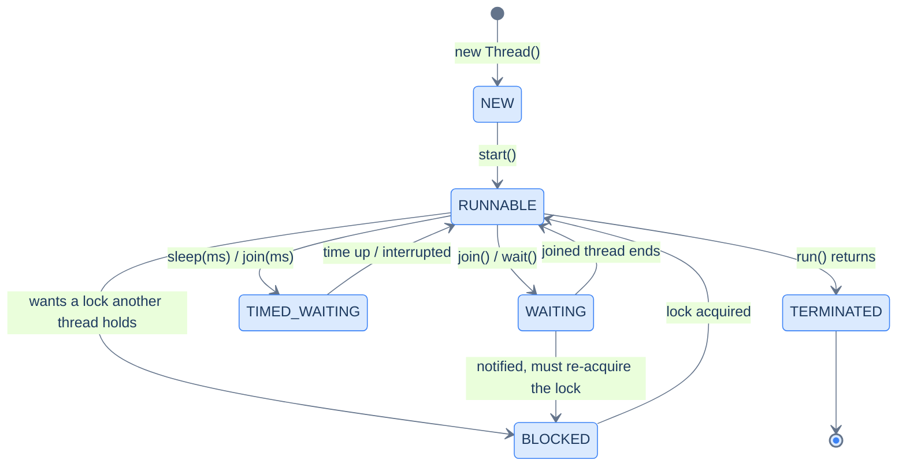
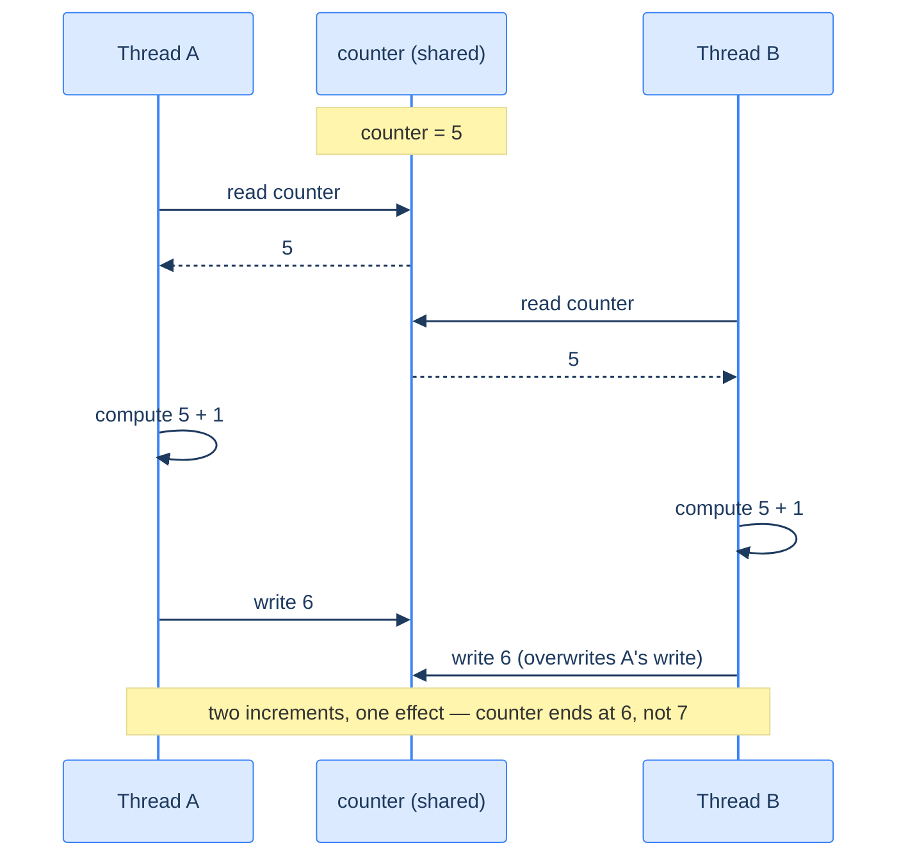
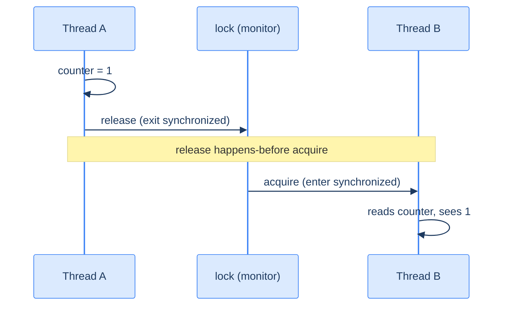

# Concurrency: the Basics — Threads and Shared State

A **thread** is an independent path of execution. With several, your program does things *at the same time*: on a machine with several cores, truly in parallel. That is power and peril.

- The moment two threads touch the same mutable data without coordination, you get a **race condition**. Operations interleave, updates clobber each other, and one thread may not even *see* another's writes.
- These bugs are silent and nondeterministic. They often pass every test, then fail in production.
- The fix is coordination. **`synchronized`** lets only one thread at a time run a critical section (**mutual exclusion**). Through the **Java Memory Model's** happens-before rule, it also makes one thread's writes visible to the next.

This lesson is the foundation. [Coordination between threads](/synapse/programming-languages/java/advanced/concurrency-coordination) (waiting, several locks, the synchronizers) comes next, then the [higher-level tools](/synapse/programming-languages/java/advanced/concurrency-high-level-and-virtual-threads) and [the memory model in depth](/synapse/programming-languages/java/advanced/the-java-memory-model-and-performance).

<div style="border-left:4px solid #195045;background:rgba(25,80,69,0.08);padding:0.6rem 1rem;border-radius:0 0.5rem 0.5rem 0;margin:1.25rem 0">

💡 **The core idea.**

- A **thread** runs code concurrently, truly in parallel on multiple cores.
- Sharing mutable state without coordination produces a **race condition** — silent and nondeterministic.
- **`synchronized`** gives mutual exclusion *and*, via **happens-before**, visibility of one thread's writes to another.

</div>

This connects [shared references](/synapse/programming-languages/java/classes-and-objects/references-equality-and-the-object-model), [lambdas as `Runnable`s](/synapse/programming-languages/java/robust-oop/nested-and-anonymous-classes-and-lambdas), and the [parallel-stream race](/synapse/programming-languages/java/advanced/functional-java-and-streams) from the last lesson. Thread scheduling is nondeterministic, so some outputs below vary per run. They are **labeled illustrative**, and each shows one real captured run.

**You'll be able to:** start a thread and wait for it, and predict what `run()` does instead of `start()`; name a thread's state from what it is doing, and trace its lifecycle; explain why an unsynchronized `counter++` from several threads loses updates; fix the race with `synchronized` on one shared lock, and predict what happens with a lock per thread; name the happens-before edges that make one thread's write visible to another.

<div style="border-left:4px solid #15448e;background:rgba(21,68,142,0.08);padding:0.6rem 1rem;border-radius:0 0.5rem 0.5rem 0;margin:1.25rem 0">

📘 **How to read the Intuition boxes.** Each one is built in three moves:

1. **The mechanism** — what the compiler and the JVM *do*.
2. **A concrete bite** — a specific, runnable failure (often a real compiler error), shown so the trap is visible.
3. **The earned rule** — the decision heuristic, now justified rather than asserted, plus its cost.

</div>

---

## Table of contents

1. [Threads and `Runnable`](#1-threads-and-runnable)
2. [The six thread states](#2-the-six-thread-states)
3. [Race conditions](#3-race-conditions)
4. [`synchronized`](#4-synchronized)
5. [The Java Memory Model and happens-before](#5-the-java-memory-model-and-happens-before)
6. [Mental-model summary](#6-mental-model-summary)
7. [Gotcha checklist](#7-gotcha-checklist)
8. [Check yourself](#-check-yourself)
9. [Sources](#-sources)

---

## 1. Threads and `Runnable`

Before the API, the thing itself. Your program runs inside a **process**: the operating system (OS) gives it a private memory space and at least one **thread**.

- A thread is the unit the OS *schedules*. It is a call stack plus a saved position in the code.
- The OS can pause and resume a thread at any moment, without asking. That is **preemptive** scheduling.
- The stack's default size depends on the platform. The `java` docs list 1024 KB for Linux/x64 and 2048 KB for macOS/Aarch64 <abbr title="The java command, JDK 21 documentation, -Xss">[1]</abbr>.
- A Java `Thread` created with `new Thread(…)` is a **platform thread**, "typically mapped 1:1 to kernel threads scheduled by the operating system" <abbr title="Java SE 21 API, java.lang.Thread, &quot;Platform threads&quot;">[2]</abbr>.

So two Java threads on two cores run at the same instant. Everything in this lesson follows from one fact. The JVM's heap "is shared among all Java Virtual Machine threads", while each thread has "a private Java Virtual Machine stack" <abbr title="The Java Virtual Machine Specification, Java SE 21, §2.5.2 and §2.5.3">[3]</abbr>. Separate stacks, shared objects.

You can watch the layering: one process id, several thread ids.

```java run
public class Main {
    public static void main(String[] args) throws InterruptedException {
        System.out.println("main   -> pid=" + ProcessHandle.current().pid()
                + " threadId=" + Thread.currentThread().threadId());
        Thread t = new Thread(() -> System.out.println("worker -> pid=" + ProcessHandle.current().pid()
                + " threadId=" + Thread.currentThread().threadId()), "worker-1");
        t.start();
        t.join();
    }
}
```

**Output** *(illustrative — the pid and thread ids vary per run; this is one real run):*
```
main   -> pid=82858 threadId=1
worker -> pid=82858 threadId=20
```

**Analysis.** Same `pid`, different `threadId`s. Both threads live inside one process, so they see the same heap: the same objects, the same `static` fields.

The worker is not a copy of your program. It is a second path of execution *through the same memory*. That shared heap makes passing data between threads free, and *changing* shared data dangerous.

Now the API. A `Thread` runs a `Runnable`, a functional interface, so a lambda fits. `start()` launches it alongside the caller; `join()` waits for it to finish.

`main` declares `throws InterruptedException` because `join()` can throw that checked exception. It is thrown if another thread *interrupts* the waiting thread, a polite request to stop <abbr title="Java SE 21 API, java.lang.Thread.join() and interrupt()">[2]</abbr>. §2 shows one.

```java run
public class Main {
    public static void main(String[] args) throws InterruptedException {
        Runnable task = () -> System.out.println("worker thread: " + Thread.currentThread().getName());
        Thread t = new Thread(task, "worker-1");
        t.start();
        t.join();
        System.out.println("main thread: " + Thread.currentThread().getName());
    }
}
```

**Output:**
```
worker thread: worker-1
main thread: main
```

**Analysis.** `t.start()` ran `task` on a new thread named `worker-1`. `t.join()` made `main` wait until it finished, so the two lines printed in a fixed order. Without `join`, `main` could print first, or the lines could come in either order.

**Intuition.**
*Mechanism.* `start()` asks the JVM to schedule a new thread that runs the `Runnable`'s `run()`. The scheduler decides when each thread runs, and interleaves them however it likes. So *order between threads is not guaranteed* unless you coordinate, for example with `join`.

*Concrete bite.* `start()` and `run()` are different methods. `t.run()` is an ordinary method call on the *current* thread: no new thread, no concurrency.

```java run
public class Main {
    public static void main(String[] args) {
        Runnable task = () -> System.out.println("running on: " + Thread.currentThread().getName());
        Thread t = new Thread(task, "worker-1");
        t.run();
        System.out.println("after run(), state = " + t.getState());
    }
}
```

**Output:**
```
running on: main
after run(), state = NEW
```

The task ran on `main`, and the `Thread` object is still `NEW`: it never started. The code "works", sequentially, and hides the mistake until concurrency was the point.

*Non-example: starting a thread twice.* "A thread can be started at most once" <abbr title="Java SE 21 API, java.lang.Thread.start()">[2]</abbr>. A finished thread cannot be restarted:

```java run
public class Main {
    public static void main(String[] args) throws InterruptedException {
        Thread t = new Thread(() -> System.out.println("worker ran"));
        t.start();
        t.join();
        t.start();
    }
}
```

**Output** *(prints `worker ran`, then a thrown exception):*
```
worker ran
Exception in thread "main" java.lang.IllegalThreadStateException
```

To run the task again, create a new `Thread`.

<div style="border-left:4px solid #195045;background:rgba(25,80,69,0.08);padding:0.6rem 1rem;border-radius:0 0.5rem 0.5rem 0;margin:1.25rem 0">

💡 **Earned rule.** Create threads with a `Runnable` and `start()` them once; use `join()` to wait for them.

The cost is that you now own coordination: without it, order and visibility between threads are undefined. The benefit is genuine parallelism. In practice you will rarely manage raw `Thread`s: the [executors](/synapse/programming-languages/java/advanced/concurrency-high-level-and-virtual-threads) do it better. The model here underlies all of them.

</div>

---

## 2. The six thread states

A thread is always in exactly one of six states, the constants of the enum `Thread.State` <abbr title="Java SE 21 API, java.lang.Thread.State">[4]</abbr>:

| State | The thread is… |
|---|---|
| `NEW` | created, not yet started |
| `RUNNABLE` | running, or ready to run when the scheduler picks it |
| `BLOCKED` | waiting to acquire a lock, to enter a `synchronized` block or method (§4) |
| `WAITING` | waiting with no time limit, for example inside `join()` |
| `TIMED_WAITING` | waiting with a time limit, for example inside `Thread.sleep(ms)` |
| `TERMINATED` | finished: `run()` returned or threw |



`Thread.sleep(ms)` pauses the current thread for that many milliseconds. `wait()` and its notification are the subject of the [next lesson](/synapse/programming-languages/java/advanced/concurrency-coordination). A woken `wait()` goes to `BLOCKED`, not `RUNNABLE`, because it must re-acquire the lock first <abbr title="Java SE 21 API, java.lang.Thread.State.BLOCKED">[4]</abbr>.

`t.getState()` reports a thread's state. The program below puts one thread in each state and prints it. Each `while` loop waits until the other thread has reached the state; `Thread.onSpinWait()` is a hint that the loop is only waiting.

```java run
public class Main {
    static final Object lock = new Object();

    public static void main(String[] args) throws InterruptedException {
        Thread sleeper = new Thread(() -> {
            try {
                Thread.sleep(60_000);
            } catch (InterruptedException e) {
                System.out.println("sleeper interrupted");
            }
        });
        System.out.println("before start:     " + sleeper.getState());
        sleeper.start();
        while (sleeper.getState() != Thread.State.TIMED_WAITING) Thread.onSpinWait();
        System.out.println("while sleeping:   " + sleeper.getState());
        System.out.println("main itself:      " + Thread.currentThread().getState());

        Thread blocked = new Thread(() -> { synchronized (lock) { } });
        Thread joiner = new Thread(() -> {
            try { sleeper.join(); } catch (InterruptedException e) { }
        });
        synchronized (lock) {
            blocked.start();
            while (blocked.getState() != Thread.State.BLOCKED) Thread.onSpinWait();
            System.out.println("waiting for lock: " + blocked.getState());
        }
        joiner.start();
        while (joiner.getState() != Thread.State.WAITING) Thread.onSpinWait();
        System.out.println("inside join():    " + joiner.getState());

        sleeper.interrupt();
        sleeper.join();
        joiner.join();
        blocked.join();
        System.out.println("after it ends:    " + sleeper.getState());
    }
}
```

**Output:**
```
before start:     NEW
while sleeping:   TIMED_WAITING
main itself:      RUNNABLE
waiting for lock: BLOCKED
inside join():    WAITING
sleeper interrupted
after it ends:    TERMINATED
```

**Analysis.** Each line is one state:

- `sleeper` was `NEW` until `start()`, then `TIMED_WAITING` inside a 60-second `sleep`.
- `main` asked about itself while running, so it saw `RUNNABLE`.
- `blocked` tried to enter `synchronized (lock)` while `main` held that lock, so it was `BLOCKED`.
- `joiner` sat in `sleeper.join()`, which has no time limit: `WAITING`.
- `sleeper.interrupt()` cut the sleep short: `sleep` threw `InterruptedException`, the catch printed its line, and `run()` returned. After that, `sleeper` was `TERMINATED`.

<div style="border-left:4px solid #195045;background:rgba(25,80,69,0.08);padding:0.6rem 1rem;border-radius:0 0.5rem 0.5rem 0;margin:1.25rem 0">

💡 **Earned rule.** When a program hangs, ask each thread's state. `BLOCKED` means it waits for a lock someone holds; `WAITING` means it waits for another thread to act.

The cost: a state is a snapshot, and it may change the moment you read it. That is why the program above waits in a loop for each state instead of reading it once. The benefit is a precise vocabulary for "stuck", which the next lesson's deadlocks need.

</div>

---

## 3. Race conditions

When several threads update the same shared variable without coordination, their operations interleave and updates are lost. Here four threads each increment a shared `counter` 100,000 times. The correct total is 400,000.

```java run
public class Main {
    static int counter = 0;
    public static void main(String[] args) throws InterruptedException {
        Thread[] threads = new Thread[4];
        for (int i = 0; i < 4; i++) {
            threads[i] = new Thread(() -> {
                for (int j = 0; j < 100000; j++) counter++;
            });
            threads[i].start();
        }
        for (Thread t : threads) t.join();
        System.out.println(counter);
    }
}
```

**Output** *(illustrative — the value is wrong and **changes every run**; four runs on JDK 21 printed `121926`, `117413`, `109262`, `111800`):*
```
121926
```

Here is one lost update, frame by frame. The run above produced collisions like it hundreds of thousands of times:



**Analysis.** The result is far below 400,000, and it differs each run. The culprit is that `counter++` is *not atomic*. It is three steps: read `counter`, add one, write it back.

- The diagram traces one collision. Both threads read `5` before either writes, both compute `6`, and B's write lands on top of A's.
- The scheduler can pause a thread *between any two of those steps*, which is what preemptive scheduling from §1 means.
- Across 400,000 increments, most were lost. Nothing threw; the program "succeeded" and printed a wrong number.

**Intuition.**
*Mechanism.* `counter++` is a read-modify-write. With no coordination, the steps of different threads interleave in any order. One thread's write is overwritten by another that read the old value: a **lost update**. The same lack of coordination allows a **stale read**, where a thread does not see another's recent write at all (§5).

*Concrete bite.* The varying, sub-400,000 outputs are the race made visible. It is the [parallel-stream data race](/synapse/programming-languages/java/advanced/functional-java-and-streams) from the last lesson, now in raw threads. It is also why "it passed in testing" means little for concurrent code. A race may appear one run in a thousand, then constantly under production load.

<div style="border-left:4px solid #195045;background:rgba(25,80,69,0.08);padding:0.6rem 1rem;border-radius:0 0.5rem 0.5rem 0;margin:1.25rem 0">

💡 **Earned rule.** Treat *any* unsynchronized access to shared mutable state from several threads as a bug, even if it seems to work.

The cost is pessimism about shared state. The benefit is avoiding the hardest category of bug, nondeterministic corruption that evades tests, by coordinating access. The next section does that.

</div>

---

## 4. `synchronized`

`synchronized` makes a method or block a **critical section**: only one thread can hold its lock and execute it at a time. Wrapping the increment in a `synchronized` method serializes the updates, and the race disappears.

```java run
public class Main {
    static int counter = 0;
    static synchronized void increment() { counter++; }

    public static void main(String[] args) throws InterruptedException {
        Thread[] threads = new Thread[4];
        for (int i = 0; i < 4; i++) {
            threads[i] = new Thread(() -> {
                for (int j = 0; j < 100000; j++) increment();
            });
            threads[i].start();
        }
        for (Thread t : threads) t.join();
        System.out.println(counter);
    }
}
```

**Output:**
```
400000
```

**Analysis.** Now the total is **always** exactly 400,000, run after run. `synchronized` lets only one thread execute `increment()` at a time, so each read-modify-write completes before the next begins. No two threads interleave inside it, and no update is lost. One keyword turned random wrong answers into a correct, deterministic result.

**Intuition.**
*Mechanism.* "Each object in Java is associated with a monitor, which a thread can lock or unlock. Only one thread at a time may hold a lock on a monitor" <abbr title="The Java Language Specification, Java SE 21, §17.1">[5]</abbr>. A monitor is also called an object's intrinsic **lock**.

- A `synchronized` method locks a monitor on entry and unlocks it on exit. A `static` method uses the monitor of its class's `Class` object; an instance method uses `this` <abbr title="The Java Language Specification, Java SE 21, §8.4.3.6">[6]</abbr>.
- A `synchronized (obj) { … }` **block** locks the monitor of the object you name <abbr title="The Java Language Specification, Java SE 21, §14.19">[7]</abbr>.
- A second thread that tries to lock a held monitor is `BLOCKED` (§2) until the monitor is free.

The block form, with one shared lock object, is as correct as the method:

```java run
public class Main {
    static int counter = 0;
    static final Object lock = new Object();

    public static void main(String[] args) throws InterruptedException {
        Thread[] threads = new Thread[4];
        for (int i = 0; i < 4; i++) {
            threads[i] = new Thread(() -> {
                for (int j = 0; j < 100000; j++) {
                    synchronized (lock) { counter++; }
                }
            });
            threads[i].start();
        }
        for (Thread t : threads) t.join();
        System.out.println(counter);
    }
}
```

**Output:**
```
400000
```

*Concrete bite: a lock per thread.* `synchronized` only excludes threads that lock the *same* monitor. Give each thread its own lock object, and each thread only ever excludes itself:

```java run
// ⚠️ ANTI-PATTERN — each thread locks its own object, so nothing is excluded.  Do not copy it.
public class Main {
    static int counter = 0;

    public static void main(String[] args) throws InterruptedException {
        Thread[] threads = new Thread[4];
        for (int i = 0; i < 4; i++) {
            Object myLock = new Object();
            threads[i] = new Thread(() -> {
                for (int j = 0; j < 100000; j++) {
                    synchronized (myLock) { counter++; }
                }
            });
            threads[i].start();
        }
        for (Thread t : threads) t.join();
        System.out.println(counter);
        System.out.println("violation: four locks guard one counter, so updates are still lost");
    }
}
```

**Output** *(illustrative — the count changes every run; three runs on JDK 21 printed `192345`, `224750`, `192609`):*
```
192345
violation: four locks guard one counter, so updates are still lost
```

The code *looks* synchronized, and still loses updates. Locking is a discipline that every access must follow, on one consistent lock. One unguarded write, or one wrong lock, reopens the race.

<div style="border-left:4px solid #195045;background:rgba(25,80,69,0.08);padding:0.6rem 1rem;border-radius:0 0.5rem 0.5rem 0;margin:1.25rem 0">

💡 **Earned rule.** Guard every read and write of shared mutable state with synchronization on a *consistent* lock: a `synchronized` method or block, or the [higher-level tools](/synapse/programming-languages/java/advanced/concurrency-high-level-and-virtual-threads).

The cost is contention and less parallelism, because threads queue at the lock. Holding several locks carelessly also risks deadlock, the subject of the next lesson. The benefit is correctness: atomic critical sections instead of silent corruption.

</div>

---

## 5. The Java Memory Model and happens-before

`synchronized` did two jobs: mutual exclusion *and* **visibility**. The **Java Memory Model** (JMM) defines when one thread's writes are guaranteed visible to another, through the **happens-before** relation <abbr title="The Java Language Specification, Java SE 21, §17.4.5">[8]</abbr>. Without such a relationship, a thread may read an older value. With one, it is guaranteed to see the other's writes.



**Analysis.** The diagram is the rule that makes §4 correct beyond mutual exclusion.

- Thread A *unlocks* a monitor, and Thread B later *locks the same monitor*.
- "An unlock on a monitor happens-before every subsequent lock on that monitor" <abbr title="The Java Language Specification, Java SE 21, §17.4.5">[8]</abbr>.
- So every write A made before unlocking is visible to B after locking.

That is why each `increment()` sees the running total: the lock both serializes the updates *and* publishes them. Without a happens-before edge, as in the §3 race, the JMM allows B to read an older value of `counter`.

**Intuition.**
*Mechanism.* The JMM lets compilers and processors reorder and cache memory operations for speed, so a write by one thread is not automatically visible to another. Happens-before edges are the guarantees. The four this book uses most are in JLS §17.4.5 <abbr title="The Java Language Specification, Java SE 21, §17.4.5">[8]</abbr>:

1. An unlock of a monitor happens-before every later lock of that monitor.
2. A write to a `volatile` field happens-before every later read of that field.
3. A call to `start()` happens-before any action in the started thread.
4. Every action in a thread happens-before another thread returns from `join()` on it.

No edge, no guarantee.

*Concrete bite.* This is why every program in this lesson reads `counter` only after `join()`. Edge 4 makes all four threads' writes visible to `main`.

It is also why a shared flag without `volatile` or a lock can loop forever:

- One thread sets `stop = true`, but the reader, with no edge, may keep reading `false`.
- The bug is not atomicity (a `boolean` write is atomic); it is *visibility*.

[The memory-model lesson](/synapse/programming-languages/java/advanced/the-java-memory-model-and-performance) runs that bug and fixes it with `volatile`.

<div style="border-left:4px solid #195045;background:rgba(25,80,69,0.08);padding:0.6rem 1rem;border-radius:0 0.5rem 0.5rem 0;margin:1.25rem 0">

💡 **Earned rule.** Establish a happens-before relationship for *every* piece of state shared between threads: `synchronized`, `volatile`, `start`/`join`, or the `java.util.concurrent` tools. It prevents lost updates, and it also guarantees visibility.

The cost is that you must think in happens-before edges rather than "the variable has a value". The benefit is that your reads see the writes you depend on, instead of an older value.

</div>

---

## 6. Mental-model summary

| Principle | Consequence |
|---|---|
| A platform thread maps to an OS thread: own stack, shared heap, paused at any moment | Data passes between threads for free — and changes collide unless coordinated |
| `start()` runs a `Runnable` concurrently; `join()` waits for it | Order between threads is undefined without coordination; `run()` is a plain call; a thread starts at most once |
| A thread is in one of six states: `NEW`, `RUNNABLE`, `BLOCKED`, `WAITING`, `TIMED_WAITING`, `TERMINATED` | `BLOCKED` waits for a lock; `WAITING` waits for another thread |
| Shared mutable state without coordination races | `counter++` (read-modify-write) loses updates — silent, nondeterministic |
| `synchronized` serializes a critical section on one monitor | Only threads locking the *same* monitor exclude each other |
| The JMM's happens-before defines visibility between threads | Unlock→lock, `volatile` write→read, `start`, `join` publish writes |
| No happens-before edge → a thread may read an older value | A shared flag without `volatile` or a lock can loop forever |

## 7. Gotcha checklist

<div style="border-left:4px solid #da5233;background:rgba(218,82,51,0.08);padding:0.6rem 1rem;border-radius:0 0.5rem 0.5rem 0;margin:1.25rem 0">

| Symptom | Likely cause | Fix |
|---|---|---|
| A concurrent counter or total is wrong, and varies per run | a race on shared state | guard every update with `synchronized` on one lock (or an atomic) |
| The task ran on `main`; the thread is still `NEW` | you called `run()`, not `start()` | call `start()` |
| `IllegalThreadStateException` from `start()` | the thread was already started | create a new `Thread` for each run |
| `synchronized` "didn't help" | threads lock *different* monitors, or one access is unsynchronized | use one lock object for every access |
| `unreported exception InterruptedException` at `join()` or `sleep()` | both throw a checked exception | declare `throws InterruptedException`, or catch it |
| A thread is stuck `BLOCKED` | another thread holds the lock it needs | find the holder; keep critical sections short |
| A thread does not see another's update (loops forever) | no happens-before edge: a visibility bug | make the field `volatile`, or read and write it under one lock |
| It works in tests, fails under load | races are nondeterministic | reason about happens-before; do not rely on tests alone |
| An assertion on thread ids or output order fails | ids and interleavings vary per run | assert order only after a coordination point such as `join` |

</div>

---

## ✅ Check yourself

One check per objective. Answer before you open anything.

```quiz
{"prompt": "Thread t = new Thread(() -> System.out.println(Thread.currentThread().getName()), \"w\"); t.run(); — what does it print?", "options": ["w", "main", "Nothing: the thread was never started"], "answer": "main"}
```

```quiz
{"prompt": "Thread B tries to enter synchronized (lock) while thread A holds lock. What does B.getState() report?", "options": ["WAITING", "RUNNABLE", "BLOCKED"], "answer": "BLOCKED"}
```

```quiz
{"prompt": "Four threads each run counter++ 100,000 times on a shared static int, with no synchronization. What is printed after joining them all?", "options": ["Always 400000", "A number that is usually below 400000 and changes between runs", "It throws ConcurrentModificationException"], "answer": "A number that is usually below 400000 and changes between runs"}
```

```quiz
{"prompt": "Each of the four threads does synchronized (new Object()) { counter++; } in its loop. Is the count correct?", "options": ["No: each lock is different, so no thread excludes another", "Yes: every increment is inside synchronized", "Yes, but it runs slower"], "answer": "No: each lock is different, so no thread excludes another"}
```

<details>
<summary>The 🧪 box below: two threads, a million increments each; <code>start()</code> vs <code>run()</code>; and why a <code>running</code> flag should be <code>volatile</code>.</summary>

1. Two threads each doing an unsynchronized `counter += 1` a million times *can* print `2000000`, if no two read-modify-writes happen to interleave. It is unlikely, because with a million chances the collision from §3 happens often. The §3 runs lost most of 400,000 updates.
2. `t.start()` prints the new thread's name; `t.run()` prints `main`, as the §1 fence showed.
3. A `boolean` write is atomic, but atomicity is not the problem. Without a happens-before edge, the polling thread may never see the write. A `volatile` write happens-before every later read of that field (edge 2 in §5), so the reader sees `false` promptly.

</details>

---

## 📚 Sources

1. The `java` command, JDK 21 documentation, `-Xss` ("The default value depends on the platform") — <https://docs.oracle.com/en/java/javase/21/docs/specs/man/java.html>
2. `java.lang.Thread`, Java SE 21 API ("Platform threads"; `start()`: "A thread can be started at most once"; `join()`, `interrupt()`) — <https://docs.oracle.com/en/java/javase/21/docs/api/java.base/java/lang/Thread.html>
3. *The Java Virtual Machine Specification, Java SE 21*, §2.5.2 "Java Virtual Machine Stacks" and §2.5.3 "Heap" — <https://docs.oracle.com/javase/specs/jvms/se21/html/jvms-2.html#jvms-2.5.3>
4. `java.lang.Thread.State`, Java SE 21 API — <https://docs.oracle.com/en/java/javase/21/docs/api/java.base/java/lang/Thread.State.html>
5. *The Java Language Specification, Java SE 21*, §17.1 "Synchronization" — <https://docs.oracle.com/javase/specs/jls/se21/html/jls-17.html#jls-17.1>
6. *The Java Language Specification, Java SE 21*, §8.4.3.6 "`synchronized` Methods" — <https://docs.oracle.com/javase/specs/jls/se21/html/jls-8.html#jls-8.4.3.6>
7. *The Java Language Specification, Java SE 21*, §14.19 "The `synchronized` Statement" — <https://docs.oracle.com/javase/specs/jls/se21/html/jls-14.html#jls-14.19>
8. *The Java Language Specification, Java SE 21*, §17.4.5 "Happens-before Order" — <https://docs.oracle.com/javase/specs/jls/se21/html/jls-17.html#jls-17.4.5>

---

<div style="border-left:4px solid #6d28d9;background:rgba(109,40,217,0.08);padding:0.6rem 1rem;border-radius:0 0.5rem 0.5rem 0;margin:1.25rem 0">

🧪 **Predict, then check.**

1. Predict whether two threads each doing `counter += 1` a million times, unsynchronized, can ever print exactly `2000000`, and why it usually won't.
2. Predict the difference between `t.start()` and `t.run()` for a task that prints the current thread's name.
3. Explain in terms of happens-before why a `boolean running` flag set by one thread and polled by another should be `volatile`, even though a boolean write is atomic.

</div>

## Your Turn

Before you move on, check your understanding with the coach — explain the idea, apply it, weigh the trade-offs, then defend your reasoning.

<div class="concept-coach"></div>
