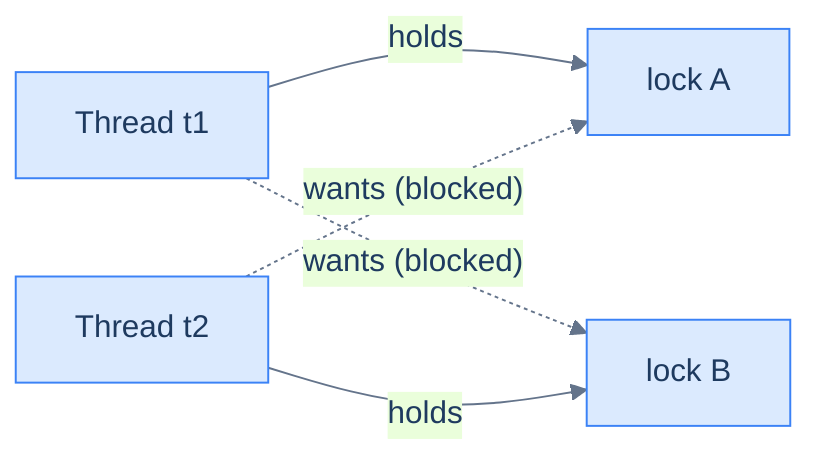

# Concurrency: Coordination — Waiting, Multiple Locks & Synchronizers

[The last lesson](/synapse/programming-languages/java/advanced/concurrency-the-basics) solved *exclusion*: `synchronized` keeps two threads out of the same critical section at once. Most real concurrent programs need more: threads that **wait for each other**.

- A consumer must wait until a producer has made something.
- A coordinator must wait until all workers finish.
- A pool must make requests wait until a connection is free.

The thesis: **coordination means waiting until some condition on shared state becomes true**. Everything in this lesson (`wait`/`notify`, `Condition`, latches, semaphores, blocking queues) is that one idea at rising levels of packaging. Learn the raw form first, and the library forms stop being magic. Learn the failure mode of holding *two* locks, deadlock, and you will see why the library forms exist.

<div style="border-left:4px solid #195045;background:rgba(25,80,69,0.08);padding:0.6rem 1rem;border-radius:0 0.5rem 0.5rem 0;margin:1.25rem 0">

💡 **The core idea.**

- Coordination = **wait until a condition on shared state becomes true**.
- `wait`/`notify`, `Condition`, latches, semaphores, blocking queues are that one idea, packaged at rising levels.
- Learn the raw form and the library forms stop being magic.
- Holding *two* locks brings **deadlock** — which is why the library forms exist.

</div>

This builds directly on [threads, races, and `synchronized`](/synapse/programming-languages/java/advanced/concurrency-the-basics). It sets up the [executors and virtual threads](/synapse/programming-languages/java/advanced/concurrency-high-level-and-virtual-threads) of the next lesson, which are built from these primitives.

Thread scheduling is nondeterministic, so several outputs below vary per run. They are **labeled illustrative**, and each shows one real captured run. The deadlock in §2 never finishes, so its output is a captured run too.

**You'll be able to:** write a guarded block with `while`, `wait()` and `notifyAll()`, and predict what an `if` guard does with two consumers; name the four conditions of a deadlock, and break one with lock ordering or a timed `tryLock`; release a `ReentrantLock` in `finally`, and predict what an exception does to a lock released without it; pick a latch, a semaphore, a barrier or a blocking queue for a coordination shape, and predict each one's lifecycle.

<div style="border-left:4px solid #15448e;background:rgba(21,68,142,0.08);padding:0.6rem 1rem;border-radius:0 0.5rem 0.5rem 0;margin:1.25rem 0">

📘 **How to read the Intuition boxes.** Each one is built in three moves:

1. **The mechanism** — what the compiler and the JVM *do*.
2. **A concrete bite** — a specific, runnable failure (often a real compiler error), shown so the trap is visible.
3. **The earned rule** — the decision heuristic, now justified rather than asserted, plus its cost.

</div>

---

## Table of contents

1. [Waiting for a condition: `wait`, `notify`, and guarded blocks](#1-waiting-for-a-condition-wait-notify-and-guarded-blocks)
2. [Deadlock: the price of multiple locks](#2-deadlock-the-price-of-multiple-locks)
3. [`ReentrantLock`: a lock as an object](#3-reentrantlock-a-lock-as-an-object)
4. [Synchronizers: `CountDownLatch`, `Semaphore`, `CyclicBarrier`](#4-synchronizers-countdownlatch-semaphore-cyclicbarrier)
5. [`BlockingQueue`: coordination you don't have to write](#5-blockingqueue-coordination-you-dont-have-to-write)
6. [Mental-model summary](#6-mental-model-summary)
7. [Gotcha checklist](#7-gotcha-checklist)
8. [Check yourself](#-check-yourself)
9. [Sources](#-sources)

---

## 1. Waiting for a condition: `wait`, `notify`, and guarded blocks

Suppose a producer thread puts items into a bounded buffer, and a consumer takes them out. The producer must wait *while the buffer is full*; the consumer must wait *while it is empty*.

`synchronized` alone cannot do this. A thread stuck inside a critical section, waiting for the buffer to change, would hold the lock forever. No other thread could get in to change it.

The monitor from the last lesson has a built-in answer <abbr title="The Java Language Specification, Java SE 21, §17.2">[1]</abbr>:

- Every object has a **wait set**, beside its monitor.
- `wait()` releases the lock and puts the thread to sleep in that wait set.
- `notifyAll()` wakes every thread sleeping there, so each can re-check its condition.

The canonical shape checks the condition in a `while` loop and calls `wait()` while it is false. It is called a **guarded block**.

```java run
public class Main {
    static class BoundedBuffer {
        private final java.util.ArrayDeque<Integer> items = new java.util.ArrayDeque<>();
        private final int capacity;
        BoundedBuffer(int capacity) { this.capacity = capacity; }

        synchronized void put(int item) throws InterruptedException {
            while (items.size() == capacity) {
                System.out.println("    producer waits (buffer full: " + items + ")");
                wait();                       // releases THIS buffer's lock, sleeps
            }
            items.addLast(item);
            System.out.println("put " + item + "   buffer=" + items);
            notifyAll();                      // wake anyone waiting for an item
        }

        synchronized int take() throws InterruptedException {
            while (items.isEmpty()) {
                System.out.println("    consumer waits (buffer empty)");
                wait();
            }
            int item = items.removeFirst();
            System.out.println("        take " + item + "  buffer=" + items);
            notifyAll();                      // wake anyone waiting for space
            return item;
        }
    }

    public static void main(String[] args) throws InterruptedException {
        BoundedBuffer buf = new BoundedBuffer(2);
        Thread producer = new Thread(() -> {
            try { for (int i = 1; i <= 5; i++) buf.put(i); }
            catch (InterruptedException e) { Thread.currentThread().interrupt(); }
        });
        Thread consumer = new Thread(() -> {
            try { for (int i = 1; i <= 5; i++) { Thread.sleep(50); buf.take(); } }
            catch (InterruptedException e) { Thread.currentThread().interrupt(); }
        });
        producer.start(); consumer.start();
        producer.join(); consumer.join();
    }
}
```

**Output** *(illustrative — the interleaving varies per run; this is one real run):*
```
put 1   buffer=[1]
put 2   buffer=[1, 2]
    producer waits (buffer full: [1, 2])
        take 1  buffer=[2]
put 3   buffer=[2, 3]
    producer waits (buffer full: [2, 3])
        take 2  buffer=[3]
put 4   buffer=[3, 4]
    producer waits (buffer full: [3, 4])
        take 3  buffer=[4]
put 5   buffer=[4, 5]
        take 4  buffer=[5]
        take 5  buffer=[]
```

**Analysis.** The fast producer fills the two-slot buffer, prints "producer waits", and sleeps *inside* `put`. Yet the consumer still gets into `take`, because `wait()` released the buffer's lock on the way down.

- Each `take` calls `notifyAll()`. The producer wakes, re-checks `items.size() == capacity` (now false), and continues.
- The buffer never exceeds its capacity. No thread spins burning CPU: waiting threads are parked until notified.
- Both methods synchronize on the *same* object, the buffer. Its lock is both the mutual-exclusion guard *and* the place where waiters sleep.

**Intuition.**
*Mechanism.* Every monitor has two rooms. The **entry queue** holds threads `BLOCKED` trying to acquire the lock. The **wait set** holds threads that held the lock and called `wait()`.

- `wait()` releases the lock and moves the thread to the wait set, in one step.
- `notifyAll()` moves everyone in the wait set back toward the lock. They re-acquire it one at a time, and, because of the `while` loop, re-check the condition before going on.

*Concrete bite.* Two classic mistakes. First, calling `wait()` without holding the monitor fails at once:

```java run
public class Main {
    public static void main(String[] args) throws InterruptedException {
        Object lock = new Object();
        lock.wait();   // not inside synchronized (lock) — we don't own the monitor
    }
}
```

**Output** *(a thrown exception):*
```
Exception in thread "main" java.lang.IllegalMonitorStateException: current thread is not owner
```

Second, and far worse because it *usually* works: guarding with `if` instead of `while`. A woken thread re-acquires the lock *later*, after other threads may have run. Another consumer may have emptied the buffer again. The API also allows **spurious wakeups**: "A thread can wake up without being notified, interrupted, or timing out" <abbr title="Java SE 21 API, java.lang.Object.wait(long, int)">[2]</abbr>.

The program below makes the `if` bug happen on every run. Two consumers wait on an empty queue, and `main` puts in *one* item. A `static synchronized` method locks the `Main.class` monitor, so the waiting and notifying happen on `Main.class`.

```java run
// ⚠️ ANTI-PATTERN — the guard is an if, so a woken consumer never re-checks.  Do not copy it.
import java.util.ArrayDeque;

public class Main {
    static final ArrayDeque<Integer> items = new ArrayDeque<>();

    static synchronized int take() throws InterruptedException {
        if (items.isEmpty()) {
            Main.class.wait();
        }
        int item = items.removeFirst();
        System.out.println("took " + item);
        return item;
    }

    static synchronized void put(int item) {
        items.addLast(item);
        Main.class.notifyAll();
    }

    public static void main(String[] args) throws InterruptedException {
        Runnable consumer = () -> {
            try {
                take();
            } catch (Exception e) {
                System.out.println("a consumer failed: " + e);
            }
        };
        Thread c1 = new Thread(consumer);
        Thread c2 = new Thread(consumer);
        c1.start();
        c2.start();
        while (c1.getState() != Thread.State.WAITING || c2.getState() != Thread.State.WAITING) {
            Thread.onSpinWait();
        }
        put(1);
        c1.join();
        c2.join();
        System.out.println("violation: one item, two woken consumers, and the if did not re-check");
    }
}
```

**Output:**
```
took 1
a consumer failed: java.util.NoSuchElementException
violation: one item, two woken consumers, and the if did not re-check
```

`notifyAll()` woke both consumers. The first took the item. The second got the lock next, skipped the check, and called `removeFirst()` on an empty queue. Change `if` to `while`, and the second consumer re-checks and goes back to waiting:

```java run
import java.util.ArrayDeque;

public class Main {
    static final ArrayDeque<Integer> items = new ArrayDeque<>();

    static synchronized int take() throws InterruptedException {
        while (items.isEmpty()) {
            Main.class.wait();
        }
        int item = items.removeFirst();
        System.out.println("took " + item);
        return item;
    }

    static synchronized void put(int item) {
        items.addLast(item);
        Main.class.notifyAll();
    }

    public static void main(String[] args) throws InterruptedException {
        Runnable consumer = () -> {
            try {
                take();
            } catch (Exception e) {
                System.out.println("a consumer failed: " + e);
            }
        };
        Thread c1 = new Thread(consumer);
        Thread c2 = new Thread(consumer);
        c1.start();
        c2.start();
        while (c1.getState() != Thread.State.WAITING || c2.getState() != Thread.State.WAITING) {
            Thread.onSpinWait();
        }
        put(1);
        while (c1.isAlive() && c2.isAlive()) Thread.onSpinWait();
        System.out.println("one consumer took the item; the other went back to waiting");
        put(2);
        c1.join();
        c2.join();
    }
}
```

**Output:**
```
took 1
one consumer took the item; the other went back to waiting
took 2
```

<div style="border-left:4px solid #195045;background:rgba(25,80,69,0.08);padding:0.6rem 1rem;border-radius:0 0.5rem 0.5rem 0;margin:1.25rem 0">

💡 **Earned rule.** The guarded-block idiom is fixed: `synchronized` + `while (!condition) wait();` + `notifyAll()` after every state change that could make someone's condition true.

The cost: it is verbose and easy to get subtly wrong (`if` vs `while`, `notify` vs `notifyAll`). Every waiter also wakes to re-check, even when the change does not concern it. That is why the rest of this lesson exists.

</div>

---

## 2. Deadlock: the price of multiple locks

One lock serializes. Two locks *held at the same time* can **deadlock**: thread 1 holds lock A and wants B, while thread 2 holds B and wants A. Neither can proceed, and neither will ever release. The program hangs forever, with no exception and no error.

This program deadlocks on every run we tried. If you press Run, it prints two lines and never finishes, so the sandbox stops it at its time limit.

```java
// expects-hang: a deadlock — each thread waits forever for the lock the other holds
public class Main {
    static final Object lockA = new Object();
    static final Object lockB = new Object();

    public static void main(String[] args) {
        new Thread(() -> {
            synchronized (lockA) {
                System.out.println("t1: holds A, wants B");
                pause();
                synchronized (lockB) { System.out.println("t1: got both"); }
            }
        }, "t1").start();

        new Thread(() -> {
            synchronized (lockB) {                      // opposite order!
                System.out.println("t2: holds B, wants A");
                pause();
                synchronized (lockA) { System.out.println("t2: got both"); }
            }
        }, "t2").start();
    }

    static void pause() { try { Thread.sleep(100); } catch (InterruptedException e) {} }
}
```

**Output** *(real captured run — the program printed two lines and then hung; we killed it after 3 seconds. Neither "got both" line will ever print):*
```
t1: holds A, wants B
t2: holds B, wants A
```

While it hung, we pointed the JDK's `jstack` tool at the process <abbr title="The jstack command, JDK 21 documentation">[3]</abbr>. `jstack` prints every thread's stack, and it finds the cycle:

```
Found one Java-level deadlock:
=============================
"t1":
  waiting to lock monitor 0x00000077190d0b60 (object 0x00000071b8c14ba0, a java.lang.Object),
  which is held by "t2"

"t2":
  waiting to lock monitor 0x00000077190d0d20 (object 0x00000071b8c14b90, a java.lang.Object),
  which is held by "t1"
```



**Analysis.** The diagram is the whole disease. The "holds" and "wants" edges form a **cycle**, and a cycle of threads, each waiting for a lock the next one holds, can never make progress. A deadlock needs four conditions at once <abbr title="Coffman, Elphick and Shoshani, &quot;System Deadlocks&quot;, ACM Computing Surveys 3(2), 1971">[4]</abbr>:

1. **Mutual exclusion:** a lock has one holder at a time.
2. **Hold and wait:** a thread keeps one lock while it waits for another.
3. **No preemption:** a lock cannot be taken away from its holder.
4. **Circular wait:** the cycle in the diagram.

Breaking *any one* prevents deadlock. The two practical breaks are **order** (both threads take A before B, so no cycle can form) and **timeout** (give up waiting and release what you hold; §3 shows it). Note what the output *doesn't* show: no exception, no stack trace. A deadlocked server stops answering.

**Intuition.**
*Mechanism.* Each `synchronized (x)` blocks until `x`'s monitor is free, while *keeping* every monitor already held. The scheduler has no insight into your intent. It parks t1 on B's entry queue and t2 on A's.

A parked thread releases nothing, so the cycle is permanent. The JVM can *detect* the cycle after the fact (that is `jstack`), but will not break it.

*Concrete bite.* The window is timing-dependent. Remove the two `pause()` calls, and the program *usually* completes, because one thread grabs both locks before the other starts. Without the pauses, 28 of 30 runs on JDK 21 completed and 2 hung. With them, 10 of 10 hung.

That is what makes deadlock the cruelest concurrency bug: it passes tests for months, then freezes production the day load reshuffles the timing.

<div style="border-left:4px solid #195045;background:rgba(25,80,69,0.08);padding:0.6rem 1rem;border-radius:0 0.5rem 0.5rem 0;margin:1.25rem 0">

💡 **Earned rule.** Establish a global **lock ordering**: a fixed rank for every lock, acquired in rank order by all threads, everywhere. Or never hold two locks at once.

The cost: ordering is an invisible convention that no compiler enforces, so you must document it and defend it in review. That discipline is why experienced designs let a thread hold at most one lock.

</div>

---

## 3. `ReentrantLock`: a lock as an object

`synchronized` is a statement: you cannot ask it "try to lock, but give up after 50 ms". **`java.util.concurrent.locks.ReentrantLock`** is the same mutual-exclusion idea as an object, with a richer API <abbr title="Java SE 21 API, java.util.concurrent.locks.ReentrantLock">[5]</abbr>:

- `lock()` and `unlock()`;
- `tryLock()`, with an optional timeout;
- a fairness option;
- `newCondition()`, for separate wait sets.

The price of the power: *you* must release it, always, in `finally`. Here is §2's deadlock defused, with the same locks, the same opposite order and the same 100 ms overlap. A timed `tryLock` breaks hold-and-wait:

```java run
import java.util.concurrent.TimeUnit;
import java.util.concurrent.locks.ReentrantLock;

public class Main {
    static final ReentrantLock lockA = new ReentrantLock();
    static final ReentrantLock lockB = new ReentrantLock();

    static void acquireBoth(String name, ReentrantLock first, ReentrantLock second)
            throws InterruptedException {
        while (true) {
            first.lock();
            try {
                Thread.sleep(100);                       // same timing that deadlocked §2
                if (second.tryLock(50, TimeUnit.MILLISECONDS)) {
                    try { System.out.println(name + ": got both locks, working"); return; }
                    finally { second.unlock(); }
                }
                System.out.println(name + ": couldn't get the second lock, backing off");
            } finally { first.unlock(); }
            Thread.sleep((long) (Math.random() * 50));   // jittered retry
        }
    }

    public static void main(String[] args) throws InterruptedException {
        Thread t1 = new Thread(() -> { try { acquireBoth("t1", lockA, lockB); } catch (InterruptedException e) {} });
        Thread t2 = new Thread(() -> { try { acquireBoth("t2", lockB, lockA); } catch (InterruptedException e) {} });
        t1.start(); t2.start(); t1.join(); t2.join();
        System.out.println("both finished — no deadlock");
    }
}
```

**Output** *(illustrative — the number of back-offs varies per run; this is one real run):*
```
t1: couldn't get the second lock, backing off
t2: couldn't get the second lock, backing off
t1: couldn't get the second lock, backing off
t2: got both locks, working
t1: got both locks, working
both finished — no deadlock
```

**Analysis.** Both threads hit the §2 collision: each holds its first lock and wants the other's. This time `tryLock(50 ms)` *fails instead of parking forever*.

- Each thread releases what it holds ("backing off"), which breaks hold-and-wait.
- It sleeps a random beat, so the two do not collide the same way again, and retries.
- Within a few rounds one thread gets both, finishes, and the other goes through.

The `try`/`finally` shape is not optional style. `synchronized` releases its monitor on *any* exit, normal or by an exception <abbr title="The Java Language Specification, Java SE 21, §14.19">[6]</abbr>. `ReentrantLock` does not.

**Intuition.**
*Mechanism.* **Reentrant** means the holding thread may acquire the lock again, as with nested `synchronized` on one object. `tryLock(timeout)` parks the thread with a deadline, and returns `false` when it expires. `newCondition()` gives you `await`/`signal`/`signalAll`: §1's wait set as a named object. A lock can have several, such as one for "not full" and one for "not empty", so you wake only the threads whose condition changed.

*Concrete bite: `unlock()` outside `finally`.* An exception between `lock()` and `unlock()` skips the unlock. The lock then outlives the thread that took it:

```java run
// ⚠️ ANTI-PATTERN — unlock() is not in a finally, so an exception skips it.  Do not copy it.
import java.util.concurrent.locks.ReentrantLock;

public class Main {
    static final ReentrantLock lock = new ReentrantLock();

    static void update(int value) {
        lock.lock();
        if (value < 0) throw new IllegalArgumentException("negative: " + value);
        lock.unlock();
    }

    public static void main(String[] args) throws InterruptedException {
        Thread worker = new Thread(() -> {
            try {
                update(-1);
            } catch (IllegalArgumentException e) {
                System.out.println("worker caught: " + e.getMessage());
            }
        });
        worker.start();
        worker.join();
        System.out.println("worker state: " + worker.getState());
        System.out.println("lock still held: " + lock.isLocked());
        System.out.println("main can lock it: " + lock.tryLock());
        System.out.println("violation: the lock outlived the thread that took it");
    }
}
```

**Output:**
```
worker caught: negative: -1
worker state: TERMINATED
lock still held: true
main can lock it: false
violation: the lock outlived the thread that took it
```

The worker is `TERMINATED`, and the lock is still held. Every later `lock()` would wait forever. The same scenario, with the `Lock` API's own `try`/`finally` shape <abbr title="Java SE 21 API, java.util.concurrent.locks.Lock">[7]</abbr>:

```java run
import java.util.concurrent.locks.ReentrantLock;

public class Main {
    static final ReentrantLock lock = new ReentrantLock();

    static void update(int value) {
        lock.lock();
        try {
            if (value < 0) throw new IllegalArgumentException("negative: " + value);
        } finally {
            lock.unlock();
        }
    }

    public static void main(String[] args) throws InterruptedException {
        Thread worker = new Thread(() -> {
            try {
                update(-1);
            } catch (IllegalArgumentException e) {
                System.out.println("worker caught: " + e.getMessage());
            }
        });
        worker.start();
        worker.join();
        System.out.println("worker state: " + worker.getState());
        System.out.println("lock still held: " + lock.isLocked());
        System.out.println("main can lock it: " + lock.tryLock());
    }
}
```

**Output:**
```
worker caught: negative: -1
worker state: TERMINATED
lock still held: false
main can lock it: true
```

*Edge: the back-off needs its jitter.* The back-off loop above can **livelock** without the random sleep. Two threads in perfect step could acquire, fail and release forever: busy, never progressing. The random delay is load-bearing, not decoration.

**Readers can share.** Many structures are read far more often than written, and two readers cannot corrupt each other. A `ReadWriteLock` holds a pair of locks: "The read lock may be held simultaneously by multiple reader threads, so long as there are no writers. The write lock is exclusive" <abbr title="Java SE 21 API, java.util.concurrent.locks.ReadWriteLock">[8]</abbr>.

```java run
import java.util.concurrent.locks.ReentrantReadWriteLock;

public class Main {
    public static void main(String[] args) throws InterruptedException {
        ReentrantReadWriteLock rw = new ReentrantReadWriteLock();
        rw.readLock().lock();
        System.out.println("main holds the read lock");

        Thread other = new Thread(() -> {
            boolean read = rw.readLock().tryLock();
            System.out.println("another reader gets in: " + read);
            if (read) rw.readLock().unlock();
            System.out.println("a writer gets in:       " + rw.writeLock().tryLock());
        });
        other.start();
        other.join();

        rw.readLock().unlock();
        System.out.println("after main unlocks, a writer gets in: " + rw.writeLock().tryLock());
    }
}
```

**Output:**
```
main holds the read lock
another reader gets in: true
a writer gets in:       false
after main unlocks, a writer gets in: true
```

<div style="border-left:4px solid #195045;background:rgba(25,80,69,0.08);padding:0.6rem 1rem;border-radius:0 0.5rem 0.5rem 0;margin:1.25rem 0">

💡 **Earned rule.** Reach for `ReentrantLock` when you need what `synchronized` cannot do: timed or interruptible acquisition, fairness, several conditions per lock. Reach for `ReentrantReadWriteLock` when reads far outnumber writes. Otherwise prefer `synchronized`: it is shorter, and it cannot leak an unreleased lock.

The cost of the explicit lock is the discipline: every `lock()` needs a `finally { unlock(); }`, forever.

</div>

---

## 4. Synchronizers: `CountDownLatch`, `Semaphore`, `CyclicBarrier`

Most coordination needs are a handful of recurring shapes. `java.util.concurrent` ships them pre-built and pre-debugged. A **`CountDownLatch`** is a one-shot gate: threads `await()` until the count reaches zero. Two of them give the classic "start together, wait for all to finish" harness:

```java run
import java.util.concurrent.CountDownLatch;

public class Main {
    public static void main(String[] args) throws InterruptedException {
        int workers = 3;
        CountDownLatch start = new CountDownLatch(1);
        CountDownLatch done  = new CountDownLatch(workers);

        for (int i = 1; i <= workers; i++) {
            int id = i;
            new Thread(() -> {
                try {
                    start.await();                      // block until the starting gun
                    System.out.println("worker " + id + " running");
                    done.countDown();
                } catch (InterruptedException e) { Thread.currentThread().interrupt(); }
            }).start();
        }
        System.out.println("main: workers created, none has started");
        start.countDown();                              // fire the gun — all three go
        done.await();                                   // wait for all of them
        System.out.println("main: all workers done");
    }
}
```

**Output** *(illustrative — worker order varies per run; the first and last lines are guaranteed):*
```
main: workers created, none has started
worker 1 running
worker 3 running
worker 2 running
main: all workers done
```

A **`Semaphore`** bounds *how many* threads may be inside a region at once. It holds N permits: `acquire()` takes one, blocking if none are left, and `release()` returns one. Six threads, three permits, and the program *proves* no more than three were ever inside:

```java run
import java.util.concurrent.Semaphore;
import java.util.concurrent.atomic.AtomicInteger;

public class Main {
    public static void main(String[] args) throws InterruptedException {
        Semaphore permits = new Semaphore(3);           // e.g. 3 database connections
        AtomicInteger inside = new AtomicInteger();
        AtomicInteger maxSeen = new AtomicInteger();

        Thread[] threads = new Thread[6];
        for (int i = 0; i < 6; i++) {
            threads[i] = new Thread(() -> {
                try {
                    permits.acquire();                  // blocks if all 3 are taken
                    int now = inside.incrementAndGet();
                    maxSeen.accumulateAndGet(now, Math::max);
                    Thread.sleep(100);                  // hold the "connection"
                    inside.decrementAndGet();
                    permits.release();
                } catch (InterruptedException e) { Thread.currentThread().interrupt(); }
            });
            threads[i].start();
        }
        for (Thread t : threads) t.join();
        System.out.println("6 threads ran; max inside at once: " + maxSeen.get());
    }
}
```

**Output:**
```
6 threads ran; max inside at once: 3
```

**Analysis.** Two synchronizers, two shapes:

- The latch demo splits coordination from work. All three workers were *created* and parked at once on `start.await()`. Nothing ran until main fired the gun, and `done.await()` held main until every worker checked out.
- In the semaphore demo, six threads raced for three permits. The high-water mark `maxSeen` came out exactly 3, every run: the bound is enforced, not probable.

The third synchronizer, **`CyclicBarrier`**, is a reusable meeting point for a *fixed team*. Each of N threads calls `await()` at the end of a phase. When all N have arrived, an optional **barrier action** runs once, all N are released together, and the barrier resets <abbr title="Java SE 21 API, java.util.concurrent.CyclicBarrier">[9]</abbr>. It suits iterative simulations, where round k+1 may start only when every thread has finished round k:

```java run
import java.util.concurrent.BrokenBarrierException;
import java.util.concurrent.CyclicBarrier;

public class Main {
    public static void main(String[] args) throws InterruptedException {
        int[] round = {0};
        CyclicBarrier barrier = new CyclicBarrier(3,
            () -> System.out.println("all 3 arrived: round " + (++round[0]) + " done"));

        Thread[] team = new Thread[3];
        for (int i = 0; i < 3; i++) {
            team[i] = new Thread(() -> {
                try {
                    for (int r = 0; r < 2; r++) {
                        barrier.await();
                    }
                } catch (InterruptedException | BrokenBarrierException e) {
                    System.out.println("barrier failed: " + e);
                }
            });
            team[i].start();
        }
        for (Thread t : team) t.join();
        System.out.println("the same barrier served 2 rounds");
    }
}
```

**Output:**
```
all 3 arrived: round 1 done
all 3 arrived: round 2 done
the same barrier served 2 rounds
```

**Intuition.**
*Mechanism.* All three are §1's pattern (state + lock + wait-until-condition), packaged with the loops and notifications written for you:

- A latch's condition is `count == 0`, and it never resets.
- A semaphore's condition is `permits > 0`, restored by `release()`.
- A barrier's condition is "all N have arrived", after which it resets.

*Concrete bite.* Pick by lifecycle, not surface similarity. Both traps below are in the API docs, and both run without any error:

- A latch is "a one-shot phenomenon -- the count cannot be reset" <abbr title="Java SE 21 API, java.util.concurrent.CountDownLatch">[10]</abbr>. Once it hits zero, `await()` returns at once, forever. Reuse it for round two, and round two does not wait at all.
- A semaphore has no owner: "There is no requirement that a thread that releases a permit must have acquired that permit" <abbr title="Java SE 21 API, java.util.concurrent.Semaphore.release()">[11]</abbr>. Release on a path that never acquired, and you have minted a permit.

```java run
import java.util.concurrent.CountDownLatch;
import java.util.concurrent.Semaphore;

public class Main {
    public static void main(String[] args) throws InterruptedException {
        Semaphore permits = new Semaphore(3);
        permits.acquire();
        permits.release();
        permits.release();
        System.out.println("permits after one acquire and two releases: " + permits.availablePermits());

        CountDownLatch latch = new CountDownLatch(1);
        latch.countDown();
        latch.await();
        System.out.println("round 1 passed the latch");
        latch.await();
        System.out.println("round 2 passed at once: the count is " + latch.getCount());
    }
}
```

**Output:**
```
permits after one acquire and two releases: 4
round 1 passed the latch
round 2 passed at once: the count is 0
```

The semaphore now allows 4, not 3, and it never complained. Needing a gate to work a second time is the signal you wanted a barrier.

<div style="border-left:4px solid #195045;background:rgba(25,80,69,0.08);padding:0.6rem 1rem;border-radius:0 0.5rem 0.5rem 0;margin:1.25rem 0">

💡 **Earned rule.** Before writing a guarded block, check the shelf:

- waiting for N completions is a latch;
- bounding concurrent access is a semaphore;
- a fixed team meeting between phases is a barrier.

The cost is a vocabulary to learn and lifecycle rules to respect (one-shot vs reusable, ownerless permits). It is far cheaper than debugging a hand-rolled `wait`/`notify` under load.

</div>

---

## 5. `BlockingQueue`: coordination you don't have to write

Look back at §1: forty lines of careful monitor discipline for a bounded producer/consumer buffer. That pattern is so central that the library ships it whole. A **`BlockingQueue`** is a thread-safe queue where `put()` blocks while it is full and `take()` blocks while it is empty <abbr title="Java SE 21 API, java.util.concurrent.BlockingQueue">[12]</abbr>. Here is §1, done by the library:

```java run
import java.util.concurrent.ArrayBlockingQueue;
import java.util.concurrent.BlockingQueue;

public class Main {
    static final int POISON = -1;

    public static void main(String[] args) throws InterruptedException {
        BlockingQueue<Integer> queue = new ArrayBlockingQueue<>(2);

        Thread producer = new Thread(() -> {
            try {
                for (int i = 1; i <= 5; i++) {
                    queue.put(i);                       // blocks while the queue is full
                    System.out.println("produced " + i);
                }
                queue.put(POISON);                      // "no more items"
            } catch (InterruptedException e) { Thread.currentThread().interrupt(); }
        });

        Thread consumer = new Thread(() -> {
            try {
                while (true) {
                    int item = queue.take();            // blocks while the queue is empty
                    if (item == POISON) break;
                    Thread.sleep(50);                   // consume slower than we produce
                    System.out.println("        consumed " + item);
                }
                System.out.println("consumer: poison pill — shutting down");
            } catch (InterruptedException e) { Thread.currentThread().interrupt(); }
        });

        producer.start(); consumer.start();
        producer.join(); consumer.join();
    }
}
```

**Output** *(illustrative — the interleaving varies per run; this is one real run):*
```
produced 1
produced 2
produced 3
        consumed 1
produced 4
        consumed 2
produced 5
        consumed 3
        consumed 4
        consumed 5
consumer: poison pill — shutting down
```

```d2
direction: right

p1: "producer 1" {
  shape: oval
}
p2: "producer 2" {
  shape: oval
}
queue: "ArrayBlockingQueue\n(bounded: capacity 2)" {
  shape: rectangle
}
c1: "consumer 1" {
  shape: oval
}
c2: "consumer 2" {
  shape: oval
}

p1 -> queue: "put() — blocks when full"
p2 -> queue
queue -> c1: "take() — blocks when empty"
queue -> c2

```

**Analysis.** All of §1's machinery (the `while`/`wait` guards, the `notifyAll` calls, the capacity checks) is inside `put` and `take`.

- The slow consumer applies **backpressure** through the bounded capacity. At most two items wait in the queue; then the producer blocks. Memory cannot balloon, however fast production is.
- The **poison pill** is a sentinel value enqueued after the last real item. It rides the same channel as the data, so the consumer drains everything already produced, *then* stops. There is no separate "please stop" flag to synchronize.
- One pill stops one `take()` loop, so enqueue one pill per consumer.

The diagram is the shape to remember: the queue is the *only* shared state, and the library owns it.

**Intuition.**
*Mechanism.* In OpenJDK 21, `ArrayBlockingQueue` is a fixed ring buffer guarded by one `ReentrantLock` with two `Condition`s, `notEmpty` and `notFull` <abbr title="OpenJDK 21 source, java/util/concurrent/ArrayBlockingQueue.java">[13]</abbr>. That is §3's tools arranged as §1's design, waking only the side whose condition changed. Two relatives keep the same contract with different trade-offs <abbr title="Java SE 21 API, java.util.concurrent.LinkedBlockingQueue and SynchronousQueue">[12]</abbr>:

- `LinkedBlockingQueue` is optionally bounded. Its source uses separate locks for the head and the tail, so a producer and a consumer do not contend.
- `SynchronousQueue` has no capacity: "each insert operation must wait for a corresponding remove operation by another thread". It is a direct hand-off.

*Concrete bite.* The tempting shortcut is a plain `ArrayDeque` guarded by `synchronized`. Then *empty* and *full* become your problem again. `poll()` returns `null`, and you are back to busy-polling in a sleep loop, or back to hand-written `wait`/`notify`. The blocking in `BlockingQueue` is not a convenience feature; it *is* the coordination.

<div style="border-left:4px solid #195045;background:rgba(25,80,69,0.08);padding:0.6rem 1rem;border-radius:0 0.5rem 0.5rem 0;margin:1.25rem 0">

💡 **Earned rule.** Design concurrent programs as **stages connected by blocking queues**. Each thread owns its data, and ownership *transfers* through the queue, rather than threads sharing structures under locks. Reach for raw `wait`/`notify` only when no shelf tool fits.

The cost: a queue per stage adds hand-off latency and a capacity to tune. Too small throttles; too large hides problems and hoards memory. Shutdown also needs a protocol: pills, or the interruption that the [executors of the next lesson](/synapse/programming-languages/java/advanced/concurrency-high-level-and-virtual-threads) give you.

</div>

---

## 6. Mental-model summary

| Principle | Consequence |
|---|---|
| Coordination = "wait until a condition on shared state is true" | One idea under `wait`/`notify`, `Condition`, latches, semaphores, queues |
| `wait()` releases the monitor and sleeps; `notifyAll()` wakes the wait set to re-check | Guarded block: `synchronized` + `while (!cond) wait();` — always `while`, never `if` |
| Two locks + opposite acquisition order = cycle = deadlock | No exception, only silence; prevent with global lock ordering (or don't hold two) |
| A deadlock needs all four Coffman conditions | Break one: order the locks, or time out and release |
| `ReentrantLock` makes the lock an object: `tryLock(timeout)`, interruptible, several `Condition`s | Timed acquisition breaks hold-and-wait; the price is manual `finally { unlock(); }` |
| A `ReadWriteLock` shares the read lock, never the write lock | Readers run together; a writer waits for all readers to leave |
| Latch = one-shot countdown gate; semaphore = N ownerless permits; barrier = reusable team rendezvous | Check the shelf before writing a guarded block; respect each one's lifecycle |
| `BlockingQueue` packages the §1 pattern: `put` blocks when full, `take` when empty | Stages + queues + transferred ownership beat shared structures + locks |

## 7. Gotcha checklist

<div style="border-left:4px solid #da5233;background:rgba(218,82,51,0.08);padding:0.6rem 1rem;border-radius:0 0.5rem 0.5rem 0;margin:1.25rem 0">

| Symptom | Likely cause | Fix |
|---|---|---|
| `IllegalMonitorStateException: current thread is not owner` | `wait`/`notify` called without holding that object's monitor | call both inside `synchronized` on the same object |
| A woken thread finds its condition false, e.g. `NoSuchElementException` | the guard is an `if` | use `while`: wakeups are shared, late, and occasionally spurious |
| A thread waits forever after `notify()` | the one woken thread was not the one whose condition changed | use `notifyAll()` unless every waiter is interchangeable |
| The program stops, with no exception and no output | a deadlock | `jstack <pid>` shows the cycle; fix the lock ordering |
| A `ReentrantLock` is never released; later `lock()` calls hang | a return or exception skipped `unlock()` | `lock(); try { … } finally { unlock(); }` |
| Two threads back off and retry forever | livelock: they retry in step | add a random delay before the retry |
| A latch "stopped working" the second time | latches are one-shot | a `CyclicBarrier` for a reusable phase gate |
| A semaphore lets in more threads than its permits | `release()` on a path that never acquired | release only after a successful `acquire()` |
| With several consumers, some never shut down | one poison pill stops one consumer | enqueue one pill per consumer, or use executor shutdown |

</div>

---

## ✅ Check yourself

One check per objective. Answer before you open anything.

```quiz
{"prompt": "Two consumers wait with if (items.isEmpty()) wait(); and then take the first item. A producer adds one item and calls notifyAll(). What happens?", "options": ["One consumer takes the item; the other goes back to waiting", "One takes the item; the other calls removeFirst() on an empty queue and fails", "Neither wakes, because notifyAll() wakes only one"], "answer": "One takes the item; the other calls removeFirst() on an empty queue and fails"}
```

```quiz
{"prompt": "Thread t1 locks A, then B. Thread t2 locks B, then A. Which change removes the deadlock?", "options": ["Make t2 lock A, then B, like t1", "Make both methods synchronized", "Add Thread.sleep between the two locks"], "answer": "Make t2 lock A, then B, like t1"}
```

```quiz
{"prompt": "A worker calls lock.lock(), then throws before lock.unlock(), which is not in a finally. The worker thread ends. What does lock.tryLock() return in main afterwards?", "options": ["true: the lock is released when its thread ends", "It throws IllegalMonitorStateException", "false: the lock is still held"], "answer": "false: the lock is still held"}
```

```quiz
{"prompt": "Three worker threads must all finish round 1 before any starts round 2, for 10 rounds. Which tool fits?", "options": ["A CountDownLatch", "A CyclicBarrier", "A Semaphore with 3 permits"], "answer": "A CyclicBarrier"}
```

<details>
<summary>The 🧪 box below: <code>if</code> with two consumers; a lucky run of §2; a semaphore released twice.</summary>

1. With `if`, the line that throws is `items.removeFirst()` in `take`. Both consumers wait on an empty buffer; one item arrives, and `notifyAll()` wakes both. The first to re-acquire the lock takes the item. The second skips the check and calls `removeFirst()` on an empty `ArrayDeque`: `NoSuchElementException`, as the §1 anti-pattern shows.
2. Yes: without the `pause()` calls, 28 of 30 runs completed. The luck removes **circular wait**. One thread took both locks before the other took any, so no cycle formed.
3. `maxSeen` can reach 4: a second `release()` adds a fourth permit. The `Semaphore` does not object, because a permit has no owner. The §4 fence prints `permits after one acquire and two releases: 4`.

</details>

---

## 📚 Sources

1. *The Java Language Specification, Java SE 21*, §17.2 "Wait Sets and Notification" ("Every object, in addition to having an associated monitor, has an associated wait set") — <https://docs.oracle.com/javase/specs/jls/se21/html/jls-17.html#jls-17.2>
2. `java.lang.Object.wait`, Java SE 21 API (spurious wakeups; `IllegalMonitorStateException`) — <https://docs.oracle.com/en/java/javase/21/docs/api/java.base/java/lang/Object.html#wait(long,int)>
3. The `jstack` command, JDK 21 documentation — <https://docs.oracle.com/en/java/javase/21/docs/specs/man/jstack.html>
4. E. G. Coffman, M. J. Elphick and A. Shoshani, "System Deadlocks", *ACM Computing Surveys* 3(2), 67–78, 1971 — <https://doi.org/10.1145/356586.356588>
5. `java.util.concurrent.locks.ReentrantLock`, Java SE 21 API — <https://docs.oracle.com/en/java/javase/21/docs/api/java.base/java/util/concurrent/locks/ReentrantLock.html>
6. *The Java Language Specification, Java SE 21*, §14.19 "The `synchronized` Statement" (the monitor is unlocked whether the body completes normally or abruptly) — <https://docs.oracle.com/javase/specs/jls/se21/html/jls-14.html#jls-14.19>
7. `java.util.concurrent.locks.Lock`, Java SE 21 API (the `lock(); try { … } finally { unlock(); }` idiom) — <https://docs.oracle.com/en/java/javase/21/docs/api/java.base/java/util/concurrent/locks/Lock.html>
8. `java.util.concurrent.locks.ReadWriteLock`, Java SE 21 API — <https://docs.oracle.com/en/java/javase/21/docs/api/java.base/java/util/concurrent/locks/ReadWriteLock.html>
9. `java.util.concurrent.CyclicBarrier`, Java SE 21 API ("cyclic because it can be re-used after the waiting threads are released") — <https://docs.oracle.com/en/java/javase/21/docs/api/java.base/java/util/concurrent/CyclicBarrier.html>
10. `java.util.concurrent.CountDownLatch`, Java SE 21 API ("a one-shot phenomenon") — <https://docs.oracle.com/en/java/javase/21/docs/api/java.base/java/util/concurrent/CountDownLatch.html>
11. `java.util.concurrent.Semaphore.release()`, Java SE 21 API — <https://docs.oracle.com/en/java/javase/21/docs/api/java.base/java/util/concurrent/Semaphore.html#release()>
12. `java.util.concurrent.BlockingQueue`, `LinkedBlockingQueue` and `SynchronousQueue`, Java SE 21 API — <https://docs.oracle.com/en/java/javase/21/docs/api/java.base/java/util/concurrent/BlockingQueue.html>
13. OpenJDK 21 source, `ArrayBlockingQueue.java` (one `ReentrantLock`, `Condition`s `notEmpty` and `notFull`) — <https://github.com/openjdk/jdk21u/blob/master/src/java.base/share/classes/java/util/concurrent/ArrayBlockingQueue.java>

---

<div style="border-left:4px solid #6d28d9;background:rgba(109,40,217,0.08);padding:0.6rem 1rem;border-radius:0 0.5rem 0.5rem 0;margin:1.25rem 0">

🧪 **Predict, then check.**

1. Predict what §1's buffer does if both `wait()` calls used `if` instead of `while`, with *two* consumer threads. Which line can now throw, and under what wakeup order?
2. Predict whether §2's program can complete normally on a lucky run, and which of the four deadlock conditions the luck removes.
3. Predict `maxSeen` in the semaphore demo if one thread's code path called `release()` twice, and whether the `Semaphore` would object.

</div>

## Your Turn

Before you move on, check your understanding with the coach — explain the idea, apply it, weigh the trade-offs, then defend your reasoning.

<div class="concept-coach"></div>
