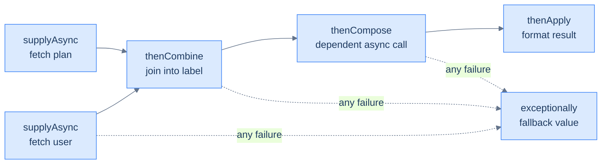

# Concurrency: High-Level & Virtual Threads

The last two lessons showed the raw material: [threads, races, and `synchronized`](/synapse/programming-languages/java/advanced/concurrency-the-basics), then [waiting, several locks, and the synchronizers](/synapse/programming-languages/java/advanced/concurrency-coordination). They are correct, but low-level and error-prone: manual lifecycle, manual locking, a real deadlock. The `java.util.concurrent` library packages those primitives, so you mostly stop writing them:

- An **`ExecutorService`** manages a pool of threads that you *submit* tasks to. It hands back a **`Future`** for each result.
- **Atomics** such as `AtomicInteger` fix the counter race without a lock.
- **`CompletableFuture`** composes asynchronous steps into pipelines.
- **Concurrent collections** such as `ConcurrentHashMap` are safe to share.

The headline JDK 21 feature, **virtual threads**, changes the economics. A virtual thread is so cheap that blocking one costs almost nothing, so you can have *millions*. You write simple blocking code and get massive scalability.

<div style="border-left:4px solid #195045;background:rgba(25,80,69,0.08);padding:0.6rem 1rem;border-radius:0 0.5rem 0.5rem 0;margin:1.25rem 0">

💡 **The core idea.**

- `java.util.concurrent` packages the raw primitives so you stop writing them.
- An **`ExecutorService`** runs a thread pool returning a **`Future`**; **atomics** fix races lock-free.
- **`CompletableFuture`** composes async steps; concurrent collections are safe to share.
- **Virtual threads** (JDK 21) make blocking nearly free — run *millions*.

</div>

This is the deep pass of [concurrency basics](/synapse/programming-languages/java/advanced/concurrency-the-basics), using [lambdas](/synapse/programming-languages/java/robust-oop/nested-and-anonymous-classes-and-lambdas) as tasks. Every output below was produced by compiling and running the code. Timings are illustrative and vary per machine.

**You'll be able to:** submit a `Callable` and a `Runnable` to an executor, and predict what each `Future` holds and what `get()` throws when a task fails; shut an executor down and wait for it to finish; fix a shared counter with an atomic, and explain why `set(get() + 1)` still races; compose asynchronous steps with `thenCombine`, `thenCompose` and `exceptionally`, and pick `thenCompose` over `thenApply`; predict when virtual threads help, and when they do not (CPU-bound work, a pinned carrier).

<div style="border-left:4px solid #15448e;background:rgba(21,68,142,0.08);padding:0.6rem 1rem;border-radius:0 0.5rem 0.5rem 0;margin:1.25rem 0">

📘 **How to read the Intuition boxes.** Each one is built in three moves:

1. **The mechanism** — what the compiler and the JVM *do*.
2. **A concrete bite** — a specific, runnable failure (often a real compiler error), shown so the trap is visible.
3. **The earned rule** — the decision heuristic, now justified rather than asserted, plus its cost.

</div>

---

## Table of contents

1. [`ExecutorService` and `Future`](#1-executorservice-and-future)
2. [Atomics and concurrent collections](#2-atomics-and-concurrent-collections)
3. [`CompletableFuture`](#3-completablefuture)
4. [Virtual threads](#4-virtual-threads)
5. [Mental-model summary](#5-mental-model-summary)
6. [Gotcha checklist](#6-gotcha-checklist)
7. [Check yourself](#-check-yourself)
8. [Sources](#-sources)

---

## 1. `ExecutorService` and `Future`

Instead of creating `Thread`s by hand, you **submit** tasks to an `ExecutorService`, a managed thread pool. Each `submit` returns a `Future`: a handle to a result that may not exist yet. `get()` blocks until it does <abbr title="Java SE 21 API, java.util.concurrent.ExecutorService and Future">[1]</abbr>.

```java run
import java.util.concurrent.*;

public class Main {
    public static void main(String[] args) throws Exception {
        ExecutorService pool = Executors.newFixedThreadPool(2);
        Future<Integer> f1 = pool.submit(() -> 6 * 7);
        Future<Integer> f2 = pool.submit(() -> 100 + 1);
        System.out.println(f1.get());
        System.out.println(f2.get());
        pool.shutdown();
    }
}
```

**Output:**
```
42
101
```

```d2
direction: right

submit: "submit(task)" {
  shape: oval
}
queue: "task queue" {
  shape: rectangle
}
pool: "thread pool" {
  w1: "worker 1" { shape: rectangle }
  w2: "worker 2" { shape: rectangle }
}
result: "Future.get()\nreturns the result" {
  shape: rectangle
}

submit -> queue: "enqueue"
queue -> pool.w1: "dequeue + run"
queue -> pool.w2: "dequeue + run"
pool.w1 -> result: "completes"
```

**Analysis.** Two tasks (lambdas returning a value) were submitted to a pool of two threads. Each `Future.get()` returned its task's result (`42`, `101`).

- We never created or started a `Thread`: the pool owns the threads and reuses them across tasks.
- The diagram shows the model: tasks queue up, idle workers pull and run them, and the `Future` is how you retrieve each result.
- `shutdown()` lets the pool finish and stop. Without it, the pool's threads keep the JVM alive.

**Two kinds of task.** A lambda that returns a value is a **`Callable<V>`**, whose one method is `V call() throws Exception`. A lambda that returns nothing is a `Runnable`. The API puts the difference in one sentence: "A `Runnable`, however, does not return a result and cannot throw a checked exception" <abbr title="Java SE 21 API, java.util.concurrent.Callable">[2]</abbr>. So `submit(runnable)` gives a `Future<?>` whose `get()` returns `null`:

```java run
import java.util.concurrent.Callable;
import java.util.concurrent.ExecutorService;
import java.util.concurrent.Executors;
import java.util.concurrent.Future;

public class Main {
    public static void main(String[] args) throws Exception {
        Callable<Integer> answer = () -> {
            Thread.sleep(10);
            return 42;
        };
        Runnable greet = () -> System.out.println("runnable ran");
        try (ExecutorService pool = Executors.newFixedThreadPool(2)) {
            Future<Integer> f1 = pool.submit(answer);
            Future<?> f2 = pool.submit(greet);
            Object nothing = f2.get();
            System.out.println("runnable's future holds: " + nothing);
            System.out.println("callable returned: " + f1.get());
        }
    }
}
```

**Output:**
```
runnable ran
runnable's future holds: null
callable returned: 42
```

The `Callable` called `Thread.sleep`, which throws the checked `InterruptedException`, with no `try`: `call()` is declared `throws Exception`. The same body as a `Runnable` does not compile, because `run()` declares no checked exception:

```java run
public class Main {
    public static void main(String[] args) {
        Runnable r = () -> {
            Thread.sleep(10);
            System.out.println("slept");
        };
        r.run();
    }
}
```

**Compiler error:**
```
Main.java:4: error: unreported exception InterruptedException; must be caught or declared to be thrown
            Thread.sleep(10);
                        ^
1 error
```

**Intuition.**
*Mechanism.* An `ExecutorService` holds a queue and a set of worker threads that loop, pulling tasks. `submit` enqueues a task and returns a `Future`. A worker runs the task and stores the result in the `Future`, and `get()` blocks to retrieve it. Thread *creation* (expensive) is separated from task *submission* (cheap).

*Concrete bite.* A task's exception is not lost. The `Future` captures it, and `get()` re-throws it wrapped in an `ExecutionException`:

```java run
import java.util.concurrent.*;

public class Main {
    public static void main(String[] args) throws Exception {
        ExecutorService pool = Executors.newFixedThreadPool(1);
        try {
            Future<Integer> f = pool.submit(() -> 10 / 0);
            System.out.println(f.get());
        } finally {
            pool.shutdown();   // without this, the idle worker keeps the JVM alive after get() throws
        }
    }
}
```

**Output** *(a thrown exception):*
```
Exception in thread "main" java.util.concurrent.ExecutionException: java.lang.ArithmeticException: / by zero
```

The task threw `ArithmeticException` on its worker thread. The `Future` stored it, and `get()` re-threw it wrapped in `ExecutionException`; call `getCause()` for the original. A raw `Thread` has no caller to hand an exception to: its uncaught exception is printed, and the thread ends. A pool delivers it to whoever awaits the result.

Shutdown has three distinct methods, and production code uses all three:

- `shutdown()` stops *intake*, but lets queued tasks finish.
- `shutdownNow()` also interrupts running tasks, and returns the never-started ones.
- `awaitTermination(timeout)` is how the caller *waits* for the wind-down.

Neither `shutdown()` nor `shutdownNow()` waits by itself <abbr title="Java SE 21 API, java.util.concurrent.ExecutorService">[1]</abbr>:

```java run
import java.util.concurrent.*;

public class Main {
    public static void main(String[] args) throws InterruptedException {
        ExecutorService pool = Executors.newFixedThreadPool(2);
        for (int i = 1; i <= 4; i++) {
            int id = i;
            pool.submit(() -> {
                try { Thread.sleep(200); } catch (InterruptedException e) { return; }
                System.out.println("task " + id + " done");
            });
        }
        pool.shutdown();                     // stop accepting; queued tasks still run
        System.out.println("shutdown called: isShutdown=" + pool.isShutdown()
                + " isTerminated=" + pool.isTerminated());
        boolean finished = pool.awaitTermination(2, TimeUnit.SECONDS);
        System.out.println("awaitTermination returned " + finished
                + ": isTerminated=" + pool.isTerminated());
    }
}
```

**Output** *(illustrative — task completion order varies; this is one real run):*
```
shutdown called: isShutdown=true isTerminated=false
task 2 done
task 1 done
task 3 done
task 4 done
awaitTermination returned true: isTerminated=true
```

`isShutdown` flipped at once: intake closed. `isTerminated` stayed `false` while the four queued tasks drained through two workers. Only after `awaitTermination` saw the last task finish did it become `true`. The graceful-shutdown idiom is this sequence: `shutdown()`, `awaitTermination(deadline)`, and `shutdownNow()` only if the deadline passes.

Since Java 19 an `ExecutorService` is also `AutoCloseable`. Its `close()` "invokes `shutdown()` and waits for tasks to complete" <abbr title="Java SE 21 API, java.util.concurrent.ExecutorService.close() (since 19)">[1]</abbr>, so a `try`-with-resources block does the whole idiom for you. The `Callable` example above used it.

<div style="border-left:4px solid #195045;background:rgba(25,80,69,0.08);padding:0.6rem 1rem;border-radius:0 0.5rem 0.5rem 0;margin:1.25rem 0">

💡 **Earned rule.** Use an `ExecutorService` instead of raw `Thread`s. Submit tasks, collect results through `Future`, and shut down deliberately: `shutdown()` → `awaitTermination` → `shutdownNow()`, or `try`-with-resources. Size a fixed pool near the core count for CPU-bound work. For work that mostly *blocks*, do not tune a bigger pool: use §4's virtual threads.

The cost is owning the lifecycle and unwrapping `ExecutionException`. The benefit is pooled, reusable threads, queued tasks, and exceptions that reach the caller instead of disappearing.

</div>

---

## 2. Atomics and concurrent collections

The [counter race](/synapse/programming-languages/java/advanced/concurrency-the-basics) has a fix without a lock: `AtomicInteger`. Its `incrementAndGet()` performs the read-modify-write as one indivisible operation. Four threads incrementing it land on the correct total, with no `synchronized`.

```java run
import java.util.concurrent.atomic.AtomicInteger;

public class Main {
    static AtomicInteger counter = new AtomicInteger(0);
    public static void main(String[] args) throws InterruptedException {
        Thread[] threads = new Thread[4];
        for (int i = 0; i < 4; i++) {
            threads[i] = new Thread(() -> {
                for (int j = 0; j < 100000; j++) counter.incrementAndGet();
            });
            threads[i].start();
        }
        for (Thread t : threads) t.join();
        System.out.println(counter.get());
    }
}
```

**Output:**
```
400000
```

**Analysis.** Always exactly 400,000: the same workload that gave random, too-small totals with a plain `int++` in [the basics lesson](/synapse/programming-languages/java/advanced/concurrency-the-basics). `incrementAndGet()` is atomic, so no two threads interleave inside it, and no update is lost. No thread blocks, either: the package is "a small toolkit of classes that support lock-free thread-safe programming on single variables" <abbr title="Java SE 21 API, java.util.concurrent.atomic package summary">[3]</abbr>.

**Intuition.**
*Mechanism.* An `AtomicInteger` holds a value that it updates with the processor's atomic instructions. Each operation is all-or-nothing. Each also has the memory effects of a `volatile` read or write <abbr title="Java SE 21 API, java.util.concurrent.atomic.AtomicInteger">[4]</abbr>, so it is both atomic *and* visible, without a lock.

*Concrete bite.* Atomicity is per *operation*. `get()` is atomic and `set()` is atomic, but the pair `counter.set(counter.get() + 1)` is not. Another thread can change the value between the `get` and the `set`:

```java run
// ⚠️ ANTI-PATTERN — get() and set() are each atomic, but the pair is not.  Do not copy it.
import java.util.concurrent.atomic.AtomicInteger;

public class Main {
    static AtomicInteger counter = new AtomicInteger(0);

    public static void main(String[] args) throws InterruptedException {
        Thread[] threads = new Thread[4];
        for (int i = 0; i < 4; i++) {
            threads[i] = new Thread(() -> {
                for (int j = 0; j < 100000; j++) counter.set(counter.get() + 1);
            });
            threads[i].start();
        }
        for (Thread t : threads) t.join();
        System.out.println(counter.get());
        System.out.println("violation: a read and a write, each atomic, are still a race together");
    }
}
```

**Output** *(illustrative — the count changes every run; three runs on JDK 21 printed `175034`, `175992`, `208319`):*
```
175034
violation: a read and a write, each atomic, are still a race together
```

For a compound update, use one atomic method that does the whole thing:

- `compareAndSet(expected, next)` sets the new value only if the current value is still `expected`, and returns whether it did.
- `updateAndGet(f)` applies a function atomically, retrying if another thread got in first.

```java run
import java.util.concurrent.atomic.AtomicInteger;

public class Main {
    public static void main(String[] args) {
        AtomicInteger stock = new AtomicInteger(5);
        System.out.println(stock.compareAndSet(5, 4) + " -> " + stock.get());
        System.out.println(stock.compareAndSet(5, 3) + " -> " + stock.get());
        System.out.println(stock.updateAndGet(n -> n * 10));
    }
}
```

**Output:**
```
true -> 4
false -> 4
40
```

The second `compareAndSet` failed: it expected `5`, but the value was `4`. It changed nothing and said so.

The same applies to collections. The `HashMap` docs require that a map changed by several threads "must be synchronized externally" <abbr title="Java SE 21 API, java.util.HashMap">[5]</abbr>. **`ConcurrentHashMap`** is the safe replacement, with atomic compound operations such as `merge` and `computeIfAbsent` <abbr title="Java SE 21 API, java.util.concurrent.ConcurrentHashMap">[6]</abbr>. Four threads counting words into one map:

```java run
import java.util.Map;
import java.util.TreeMap;
import java.util.concurrent.ConcurrentHashMap;

public class Main {
    public static void main(String[] args) throws InterruptedException {
        ConcurrentHashMap<String, Integer> counts = new ConcurrentHashMap<>();
        String[] words = {"red", "blue", "red", "green", "red", "blue"};
        Thread[] threads = new Thread[4];
        for (int i = 0; i < 4; i++) {
            threads[i] = new Thread(() -> {
                for (int j = 0; j < 10000; j++) {
                    for (String w : words) counts.merge(w, 1, Integer::sum);
                }
            });
            threads[i].start();
        }
        for (Thread t : threads) t.join();
        Map<String, Integer> sorted = new TreeMap<>(counts);
        System.out.println(sorted);
    }
}
```

**Output:**
```
{blue=80000, green=40000, red=120000}
```

Each `merge` reads the old count and writes the new one as one atomic step. `red` appears 3 times in `words`, so 4 threads × 10,000 rounds × 3 gives exactly `120000`.

<div style="border-left:4px solid #195045;background:rgba(25,80,69,0.08);padding:0.6rem 1rem;border-radius:0 0.5rem 0.5rem 0;margin:1.25rem 0">

💡 **Earned rule.** Use atomics (`AtomicInteger`, `AtomicLong`, `AtomicReference`) for single shared values, and concurrent collections (`ConcurrentHashMap`) for shared maps. Keep `synchronized` for critical sections of several steps.

The cost is that atomics make only *individual* operations atomic. Compound logic needs `compareAndSet`, `updateAndGet`, `merge`, or a lock. The benefit is correctness without blocking, for the common case of one shared counter or reference.

</div>

---

## 3. `CompletableFuture`

A plain `Future` only lets you *block* for a result. **`CompletableFuture`** lets you *compose* asynchronous work. You describe a pipeline of steps (`supplyAsync` → `thenApply` → …) that run as each predecessor completes, without blocking until the end.

```java run
import java.util.concurrent.CompletableFuture;

public class Main {
    public static void main(String[] args) throws Exception {
        CompletableFuture<Integer> future = CompletableFuture
            .supplyAsync(() -> 21)
            .thenApply(n -> n * 2);
        System.out.println(future.get());
    }
}
```

**Output:**
```
42
```

**Analysis.** `supplyAsync(() -> 21)` ran a task on a pool, the `ForkJoinPool.commonPool()` unless you pass an executor <abbr title="Java SE 21 API, java.util.concurrent.CompletableFuture.supplyAsync(Supplier)">[7]</abbr>, and produced `21`. `thenApply(n -> n * 2)` scheduled a *follow-up* that runs when the first completes, giving `42`. The pipeline reads like a [stream](/synapse/programming-languages/java/advanced/functional-java-and-streams), but over *asynchronous* values. Each stage is a callback wired to its predecessor's completion, so nothing blocks until the final `get()`.

The real power appears when the pipeline branches and rejoins:

- `thenCombine` **joins two independent** async results.
- `thenCompose` **chains a dependent** async call. The next call needs the previous result and returns a `CompletableFuture` itself, which `thenCompose` flattens instead of nesting.
- `exceptionally` catches a failure anywhere upstream and substitutes a fallback.

Here is a full composition, running:

```java run
import java.util.concurrent.CompletableFuture;

public class Main {
    static CompletableFuture<String> fetchUser(int id) {
        return CompletableFuture.supplyAsync(() -> "user-" + id);
    }
    static CompletableFuture<Integer> fetchScore(String label) {
        return CompletableFuture.supplyAsync(() -> label.length() * 10);
    }

    public static void main(String[] args) throws Exception {
        CompletableFuture<String> name = fetchUser(7);
        CompletableFuture<String> plan = CompletableFuture.supplyAsync(() -> "premium");

        CompletableFuture<String> pipeline = name
            .thenCombine(plan, (n, p) -> n + " (" + p + ")")      // join two independent results
            .thenCompose(label -> fetchScore(label)               // chain a dependent async call
                .thenApply(score -> label + " -> score " + score))
            .exceptionally(e -> "fallback: " + e.getCause().getMessage());

        System.out.println(pipeline.get());
    }
}
```

**Output:**
```
user-7 (premium) -> score 160
```



**Analysis.** The two `supplyAsync` calls started *concurrently*; neither waited for the other.

- `thenCombine` fired only when both were ready.
- `thenCompose` then launched the score lookup that *needed* the combined label: `"user-7 (premium)"`, 16 characters, gives 160.
- The diagram is the dependency graph the executor drives. Work advances edge by edge as results arrive, and no thread sits blocked between stages.

When a stage fails, the error takes the dotted path instead:

```java run
import java.util.concurrent.CompletableFuture;

public class Main {
    public static void main(String[] args) throws Exception {
        CompletableFuture<String> pipeline = CompletableFuture
            .<String>supplyAsync(() -> { throw new IllegalStateException("service down"); })
            .thenApply(s -> s + "!")            // skipped — there is no value to transform
            .exceptionally(e -> "fallback: " + e.getCause().getMessage());

        System.out.println(pipeline.get());
    }
}
```

**Output:**
```
fallback: service down
```

The `thenApply` stage never ran. A failed stage completes the future *exceptionally*, later value stages are skipped, and the exception travels down the chain until `exceptionally` turns it back into a value. The handler receives it wrapped in a `CompletionException`, which is why the code calls `getCause()`. Without the handler, the exception would surface at `get()`, wrapped in `ExecutionException`, as in §1.

**Intuition.**
*Mechanism.* A `CompletableFuture` stands for a value that will be ready later, plus a graph of continuations. `thenApply`, `thenCompose` and `thenCombine` register callbacks that fire on completion. You build a dependency graph that the executor drives, instead of blocking thread by thread. Failures travel the same graph as values: every stage completes either *normally* or *exceptionally*.

*Concrete bite.* The classic type error: `thenApply` where you meant `thenCompose`. When the function you apply returns a `CompletableFuture` itself, `thenApply` wraps it again, giving a future *of a future*:

```java run
import java.util.concurrent.CompletableFuture;

public class Main {
    static CompletableFuture<Integer> fetchScore(String label) {
        return CompletableFuture.supplyAsync(() -> label.length() * 10);
    }

    public static void main(String[] args) throws Exception {
        CompletableFuture<CompletableFuture<Integer>> nested = CompletableFuture.supplyAsync(() -> "user-7")
            .thenApply(label -> fetchScore(label));
        CompletableFuture<Integer> flat = CompletableFuture.supplyAsync(() -> "user-7")
            .thenCompose(label -> fetchScore(label));
        System.out.println("thenApply:   " + nested.get().getClass().getSimpleName());
        System.out.println("thenCompose: " + flat.get());
    }
}
```

**Output:**
```
thenApply:   CompletableFuture
thenCompose: 60
```

`nested.get()` returned another future, not a number. Declare the result as `CompletableFuture<Integer>` and use `thenApply`, and javac refuses:

```java run
import java.util.concurrent.CompletableFuture;

public class Main {
    static CompletableFuture<Integer> fetchScore(String label) {
        return CompletableFuture.supplyAsync(() -> label.length() * 10);
    }

    public static void main(String[] args) throws Exception {
        CompletableFuture<Integer> score = CompletableFuture.supplyAsync(() -> "user-7")
            .thenApply(label -> fetchScore(label));
        System.out.println(score.get());
    }
}
```

**Compiler error:**
```
Main.java:10: error: incompatible types: inference variable U has incompatible bounds
            .thenApply(label -> fetchScore(label));
                      ^
    equality constraints: Integer
    lower bounds: CompletableFuture<Integer>
```

It is the same map-vs-flatMap distinction as [`map` and `flatMap` on streams](/synapse/programming-languages/java/advanced/functional-java-and-streams).

<div style="border-left:4px solid #195045;background:rgba(25,80,69,0.08);padding:0.6rem 1rem;border-radius:0 0.5rem 0.5rem 0;margin:1.25rem 0">

💡 **Earned rule.** Use `CompletableFuture` to compose several asynchronous operations (call services, combine results) without blocking between them. A plain `Future.get()` is fine for a single result you need at once. Use `thenCompose` whenever the next step returns a future.

The cost is a richer API and careful exception handling (`exceptionally`, `handle`). The benefit is non-blocking pipelines that scale far better than a thread blocked at each step.

</div>

---

## 4. Virtual threads

A platform thread maps to an OS thread, with a large stack: 1024 KB or 2048 KB by default, depending on the platform ([the basics lesson](/synapse/programming-languages/java/advanced/concurrency-the-basics) lists them). So you can have thousands, not millions.

A **virtual thread**, final in JDK 21 <abbr title="JEP 444: Virtual Threads (JDK 21)">[8]</abbr>, is scheduled by the JVM onto a small pool of OS threads, its **carriers**. It *unmounts* from its carrier when it blocks, so blocking is nearly free, and you can run **millions**. Here 10,000 virtual threads each sleep 10 ms:

```java run
import java.util.concurrent.*;
import java.util.concurrent.atomic.AtomicInteger;

public class Main {
    public static void main(String[] args) throws InterruptedException {
        AtomicInteger done = new AtomicInteger(0);
        try (var executor = Executors.newVirtualThreadPerTaskExecutor()) {
            for (int i = 0; i < 10000; i++) {
                executor.submit(() -> {
                    try { Thread.sleep(10); } catch (InterruptedException e) {}
                    done.incrementAndGet();
                });
            }
        }
        System.out.println("completed: " + done.get());
    }
}
```

**Output** *(completed near-instantly — on JDK 21 the whole process, JVM start-up included, took 0.48–0.50 s):*
```
completed: 10000
```

**Analysis.** Ten thousand threads, each blocking for 10 ms, all finished, and the whole program took a fraction of a second.

- Virtual threads make the blocking `Thread.sleep` cheap. Each unmounts from its carrier while sleeping, so a handful of OS threads serve all 10,000.
- `newVirtualThreadPerTaskExecutor()` gives each task its own virtual thread, and the `try`-with-resources `close()` waits for them all.
- With platform threads, the same work needs 10,000 OS threads, or a pool that runs them in batches.

The batches cost real time. The same 10,000 sleeps, timed inside the program, on virtual threads and on a pool of 100 platform threads:

```java run
import java.util.concurrent.*;
import java.util.concurrent.atomic.AtomicInteger;

public class Main {
    static long run(ExecutorService ex) {
        AtomicInteger done = new AtomicInteger();
        long t0 = System.nanoTime();
        try (ex) {
            for (int i = 0; i < 10000; i++) ex.submit(() -> {
                try { Thread.sleep(10); } catch (InterruptedException e) {}
                done.incrementAndGet();
            });
        }
        return (System.nanoTime() - t0) / 1_000_000;
    }
    public static void main(String[] args) {
        System.out.println("virtual:        " + run(Executors.newVirtualThreadPerTaskExecutor()) + " ms");
        System.out.println("100 platform:   " + run(Executors.newFixedThreadPool(100)) + " ms");
    }
}
```

**Output** *(illustrative — timings vary per machine; three runs on a 10-core machine printed 64/1390, 61/1369 and 64/1388 ms):*
```
virtual:        64 ms
100 platform:   1390 ms
```

100 platform threads run the sleeps in batches of 100: 100 batches × 10 ms is at least 1 second. The virtual threads all slept at once.

A virtual thread is still a `Thread`. `Thread.ofVirtual()` builds one, and `isVirtual()` tells them apart. One difference bites: "Virtual threads are daemon threads" <abbr title="Java SE 21 API, java.lang.Thread, &quot;Virtual threads&quot;">[9]</abbr>, so they do not keep the JVM alive. Always `join` them, or close their executor:

```java run
public class Main {
    public static void main(String[] args) throws InterruptedException {
        Thread vt = Thread.ofVirtual().name("vt-1").unstarted(() ->
            System.out.println("inside: isVirtual=" + Thread.currentThread().isVirtual()));
        Thread pt = new Thread(() -> {});
        System.out.println("vt-1: isVirtual=" + vt.isVirtual() + " isDaemon=" + vt.isDaemon());
        System.out.println("platform: isVirtual=" + pt.isVirtual() + " isDaemon=" + pt.isDaemon());
        vt.start();
        vt.join();
    }
}
```

**Output:**
```
vt-1: isVirtual=true isDaemon=true
platform: isVirtual=false isDaemon=false
inside: isVirtual=true
```

The unmounting has one important exception on Java 21: **pinning**. A virtual thread is pinned to its carrier "when it executes code inside a `synchronized` block or method" <abbr title="JEP 444: Virtual Threads, &quot;Pinning&quot;">[8]</abbr>. If it blocks while pinned, it holds its carrier OS thread for the whole wait, and quietly costs you the scalability you came for.

The JVM tells you where, if you pass the flag `-Djdk.tracePinnedThreads=full`. The sandbox cannot pass JVM flags, so this block does not run here:

```java
// requires: the JVM flag -Djdk.tracePinnedThreads=full for the trace — without it, only "done" prints
public class Main {
    static final Object lock = new Object();

    public static void main(String[] args) throws InterruptedException {
        Thread vt = Thread.ofVirtual().name("vt-1").start(() -> {
            synchronized (lock) {               // holding a monitor...
                try { Thread.sleep(100); }      // ...while blocking: pins the carrier
                catch (InterruptedException e) {}
            }
        });
        vt.join();
        System.out.println("done");
    }
}
```

**Output** *(real captured run on JDK 21, `java -Djdk.tracePinnedThreads=full -cp . Main`):*
```
VirtualThread[#20,vt-1]/runnable@ForkJoinPool-1-worker-1 reason:MONITOR
    java.base/java.lang.VirtualThread$VThreadContinuation.onPinned(VirtualThread.java:199)
    java.base/jdk.internal.vm.Continuation.onPinned0(Continuation.java:393)
    java.base/java.lang.VirtualThread.parkNanos(VirtualThread.java:635)
    java.base/java.lang.VirtualThread.sleepNanos(VirtualThread.java:807)
    java.base/java.lang.Thread.sleep(Thread.java:507)
    Main.lambda$main$0(Main.java:8) <== monitors:1
    java.base/java.lang.VirtualThread.run(VirtualThread.java:329)
done
```

The `reason:MONITOR` line is the JVM reporting the pin. `<== monitors:1` points at the frame holding one monitor: line 8, the `Thread.sleep` inside `synchronized`. Without the flag, the program prints only `done`.

The fixes: keep blocking calls out of `synchronized` sections, or guard them with a `ReentrantLock` from the [coordination lesson](/synapse/programming-languages/java/advanced/concurrency-coordination), under which virtual threads *can* unmount. This is a cost of Java 21. JDK 24 reimplemented monitors so that `synchronized` no longer pins in most cases <abbr title="JEP 491: Synchronize Virtual Threads without Pinning (JDK 24)">[10]</abbr>. Until you run there, treat a monitor plus blocking as a pin.

**Intuition.**
*Mechanism.* A virtual thread runs on a carrier OS thread only while executing. The moment it blocks (I/O, `sleep`, a lock), the JVM *unmounts* it and frees the carrier for another virtual thread. Blocking parks a cheap object, not an expensive OS thread, so memory, not the OS, limits the thread count. A native frame, or on Java 21 a held monitor, prevents the unmount.

*Concrete bite.* Virtual threads speed up **I/O-bound** and blocking workloads, where each thread spends most of its time waiting. They do not speed up **CPU-bound** ones: a million threads doing pure computation still share the same few cores. The pinning trace above is the second bite. A library that blocks inside `synchronized` can silently turn your million-thread design back into a handful of pinned carriers.

<div style="border-left:4px solid #195045;background:rgba(25,80,69,0.08);padding:0.6rem 1rem;border-radius:0 0.5rem 0.5rem 0;margin:1.25rem 0">

💡 **Earned rule.** Use virtual threads (one per task, through `newVirtualThreadPerTaskExecutor`) for high-concurrency *blocking* workloads: servers handling thousands of requests, fan-out I/O. Write simple blocking code instead of callback chains.

The cost: they do not help CPU-bound work, and on Java 21 blocking inside a monitor pins the carrier (check with `-Djdk.tracePinnedThreads`). The benefit is large: thread-per-request blocking code that scales to millions of concurrent tasks on a handful of cores.

</div>

One outlook, because you will meet it in code review: **structured concurrency**. `StructuredTaskScope` is a *preview* API in Java 21 <abbr title="JEP 453: Structured Concurrency (Preview) (JDK 21)">[11]</abbr>. It needs `--enable-preview`, so this block has no working Run button here. A scope owns its forked subtasks the way a `try` block owns a resource:

```java
// requires: --enable-preview (a preview API in Java 21), and fetchUser/fetchScore from your code
try (var scope = new StructuredTaskScope.ShutdownOnFailure()) {
    var user  = scope.fork(() -> fetchUser());     // both run concurrently,
    var score = scope.fork(() -> fetchScore());    // on virtual threads
    scope.join().throwIfFailed();                  // wait; propagate any failure
    System.out.println(user.get() + ": " + score.get());
}
```

If either subtask fails, the scope cancels the other, and the error surfaces at `join()`. Concurrent work starts together, ends together, and cannot leak a runaway thread. The shape is worth recognizing before the API is final.

---

## 5. Mental-model summary

| Principle | Consequence |
|---|---|
| An `ExecutorService` pools threads; `submit` returns a `Future` | Reuse threads, queue tasks, retrieve results; `get()` re-throws task exceptions wrapped in `ExecutionException` |
| A `Callable` returns a value and may throw checked exceptions; a `Runnable` does neither | `submit(runnable).get()` is `null`; `Thread.sleep` in a `Runnable` needs a `try` |
| Executor shutdown is three methods: `shutdown` / `awaitTermination` / `shutdownNow` | Close intake, wait with a deadline, then escalate; `close()` does the first two |
| `AtomicInteger` makes a single update atomic, without a lock | Fixes the counter race; `set(get() + 1)` still races; use `compareAndSet`/`updateAndGet` |
| `ConcurrentHashMap` is the shared map; `merge` is one atomic step | A shared `HashMap` must be synchronized externally |
| `CompletableFuture` composes async steps without blocking | `thenCompose` for a step that returns a future; `thenApply` nests it |
| A virtual thread unmounts when it blocks | Blocking is cheap — run millions; ideal for I/O-bound concurrency |
| Virtual threads are daemon threads | `join` them or close their executor, or the JVM may exit first |
| On Java 21, blocking inside `synchronized` pins the carrier | Use `ReentrantLock` around blocking calls; trace pins with `-Djdk.tracePinnedThreads` |
| Virtual threads don't speed CPU-bound work | They scale *waiting*, not computation; cores still bound throughput |

## 6. Gotcha checklist

<div style="border-left:4px solid #da5233;background:rgba(218,82,51,0.08);padding:0.6rem 1rem;border-radius:0 0.5rem 0.5rem 0;margin:1.25rem 0">

| Symptom | Likely cause | Fix |
|---|---|---|
| The program won't exit after submitting tasks | the executor was never shut down; its threads keep the JVM alive | `shutdown()`, or `try`-with-resources |
| A submitted task's exception "disappeared" | it is stored in the `Future` | `get()` throws `ExecutionException`; unwrap with `getCause()` |
| `unreported exception InterruptedException` inside a task lambda | the lambda is a `Runnable`, which cannot throw checked exceptions | return a value so it is a `Callable`, or catch the exception |
| An atomic counter is still wrong | two atomic calls combined (`set(get() + 1)`) | `incrementAndGet`, `updateAndGet`, `compareAndSet`, or a lock |
| A shared `HashMap` corrupted under threads | `HashMap` is not thread-safe | `ConcurrentHashMap`, with `merge`/`computeIfAbsent` |
| `thenApply` gave a `CompletableFuture<CompletableFuture<…>>`, or `inference variable U has incompatible bounds` | the function itself returns a future | `thenCompose` |
| Virtual threads didn't speed up CPU-bound work | they scale blocking, not computation | a fixed pool sized to the cores |
| Virtual threads scaled worse than promised | something blocks inside `synchronized` and pins its carrier (Java 21) | find it with `-Djdk.tracePinnedThreads=full`; use `ReentrantLock`, or move the blocking call out |
| A virtual thread's output never appears | virtual threads are daemons; the JVM exited first | `join()` it, or close its executor |

</div>

---

## ✅ Check yourself

One check per objective. Answer before you open anything.

```quiz
{"prompt": "pool.submit(() -> System.out.println(\"hi\")) returns a Future. What does its get() return after the task runs?", "options": ["\"hi\"", "null", "It does not compile: a Runnable has no result"], "answer": "null"}
```

```quiz
{"prompt": "An executor's shutdown() has returned, and the queued tasks are still running. What does isTerminated() report now?", "options": ["false: shutdown() only closes intake; it does not wait", "true: shutdown() waits for the tasks", "It throws IllegalStateException"], "answer": "false: shutdown() only closes intake; it does not wait"}
```

```quiz
{"prompt": "Four threads each run counter.set(counter.get() + 1) 100,000 times on one AtomicInteger. What is printed?", "options": ["Always 400000, because AtomicInteger is thread-safe", "A number usually below 400000, different each run", "It does not compile"], "answer": "A number usually below 400000, different each run"}
```

```quiz
{"prompt": "fetchScore(label) returns CompletableFuture<Integer>. Which call gives a CompletableFuture<Integer> from a CompletableFuture<String>?", "options": ["thenApply(label -> fetchScore(label))", "thenCombine(label -> fetchScore(label))", "thenCompose(label -> fetchScore(label))"], "answer": "thenCompose(label -> fetchScore(label))"}
```

```quiz
{"prompt": "10,000 virtual threads each compute a large prime, with no blocking, on an 8-core machine. Compared with a pool of 8 platform threads, the virtual threads are…", "options": ["about 1,000 times faster", "no faster: the work is CPU-bound, and there are still 8 cores", "slower, because every virtual thread is pinned"], "answer": "no faster: the work is CPU-bound, and there are still 8 cores"}
```

<details>
<summary>The 🧪 box below: two <code>Future</code>s; 5 threads on an <code>AtomicInteger</code>; 100,000 sleeping virtual threads.</summary>

```java run
import java.util.concurrent.ExecutorService;
import java.util.concurrent.Executors;
import java.util.concurrent.atomic.AtomicInteger;

public class Main {
    public static void main(String[] args) throws Exception {
        try (ExecutorService pool = Executors.newFixedThreadPool(2)) {
            System.out.println(pool.submit(() -> "a".repeat(3)).get());
            System.out.println(pool.submit(() -> 2 + 2).get());
        }
        AtomicInteger counter = new AtomicInteger();
        Thread[] threads = new Thread[5];
        for (int i = 0; i < 5; i++) {
            threads[i] = new Thread(() -> {
                for (int j = 0; j < 100000; j++) counter.incrementAndGet();
            });
            threads[i].start();
        }
        for (Thread t : threads) t.join();
        System.out.println(counter.get());
    }
}
```

**Output:**
```
aaa
4
500000
```

- The two tasks return `aaa` and `4`.
- `incrementAndGet()` is one atomic read-modify-write, so no update is lost: exactly `500000`.
- 100,000 virtual threads each sleeping 100 ms finished in 728–735 ms in three runs on JDK 21, not 100,000 × 100 ms. Each unmounts while it sleeps, so all the sleeps overlap on a few carriers. The rest of the time is creating and scheduling 100,000 threads. 100,000 platform threads would each need an OS thread with its own large stack.

</details>

---

## 📚 Sources

1. `java.util.concurrent.ExecutorService` and `Future`, Java SE 21 API (`shutdown`, `shutdownNow`, `awaitTermination`; `close()` since 19) — <https://docs.oracle.com/en/java/javase/21/docs/api/java.base/java/util/concurrent/ExecutorService.html>
2. `java.util.concurrent.Callable`, Java SE 21 API — <https://docs.oracle.com/en/java/javase/21/docs/api/java.base/java/util/concurrent/Callable.html>
3. `java.util.concurrent.atomic` package summary, Java SE 21 API — <https://docs.oracle.com/en/java/javase/21/docs/api/java.base/java/util/concurrent/atomic/package-summary.html>
4. `java.util.concurrent.atomic.AtomicInteger`, Java SE 21 API (memory effects as `VarHandle.getVolatile`/`setVolatile`; `compareAndSet`; `updateAndGet`) — <https://docs.oracle.com/en/java/javase/21/docs/api/java.base/java/util/concurrent/atomic/AtomicInteger.html>
5. `java.util.HashMap`, Java SE 21 API ("it must be synchronized externally") — <https://docs.oracle.com/en/java/javase/21/docs/api/java.base/java/util/HashMap.html>
6. `java.util.concurrent.ConcurrentHashMap`, Java SE 21 API — <https://docs.oracle.com/en/java/javase/21/docs/api/java.base/java/util/concurrent/ConcurrentHashMap.html>
7. `java.util.concurrent.CompletableFuture`, Java SE 21 API (`supplyAsync` runs in `ForkJoinPool.commonPool()`) — <https://docs.oracle.com/en/java/javase/21/docs/api/java.base/java/util/concurrent/CompletableFuture.html>
8. JEP 444: Virtual Threads (JDK 21; "Pinning"; `jdk.tracePinnedThreads`) — <https://openjdk.org/jeps/444>
9. `java.lang.Thread`, Java SE 21 API ("Virtual threads are daemon threads") — <https://docs.oracle.com/en/java/javase/21/docs/api/java.base/java/lang/Thread.html>
10. JEP 491: Synchronize Virtual Threads without Pinning (JDK 24) — <https://openjdk.org/jeps/491>
11. JEP 453: Structured Concurrency (Preview) (JDK 21) — <https://openjdk.org/jeps/453>

---

<div style="border-left:4px solid #6d28d9;background:rgba(109,40,217,0.08);padding:0.6rem 1rem;border-radius:0 0.5rem 0.5rem 0;margin:1.25rem 0">

🧪 **Predict, then check.**

1. Predict the two lines printed by submitting `() -> "a".repeat(3)` and `() -> 2 + 2` to a pool and printing each `Future.get()`.
2. Predict whether `AtomicInteger` incremented 100,000 times by 5 threads prints exactly `500000`, and why.
3. Explain why 100,000 virtual threads each doing `Thread.sleep(100)` finish in under a second, not 100,000 × 100 ms, while 100,000 platform threads could not, in terms of mounting and unmounting.

</div>

## Your Turn

Before you move on, check your understanding with the coach — explain the idea, apply it, weigh the trade-offs, then defend your reasoning.

<div class="concept-coach"></div>
