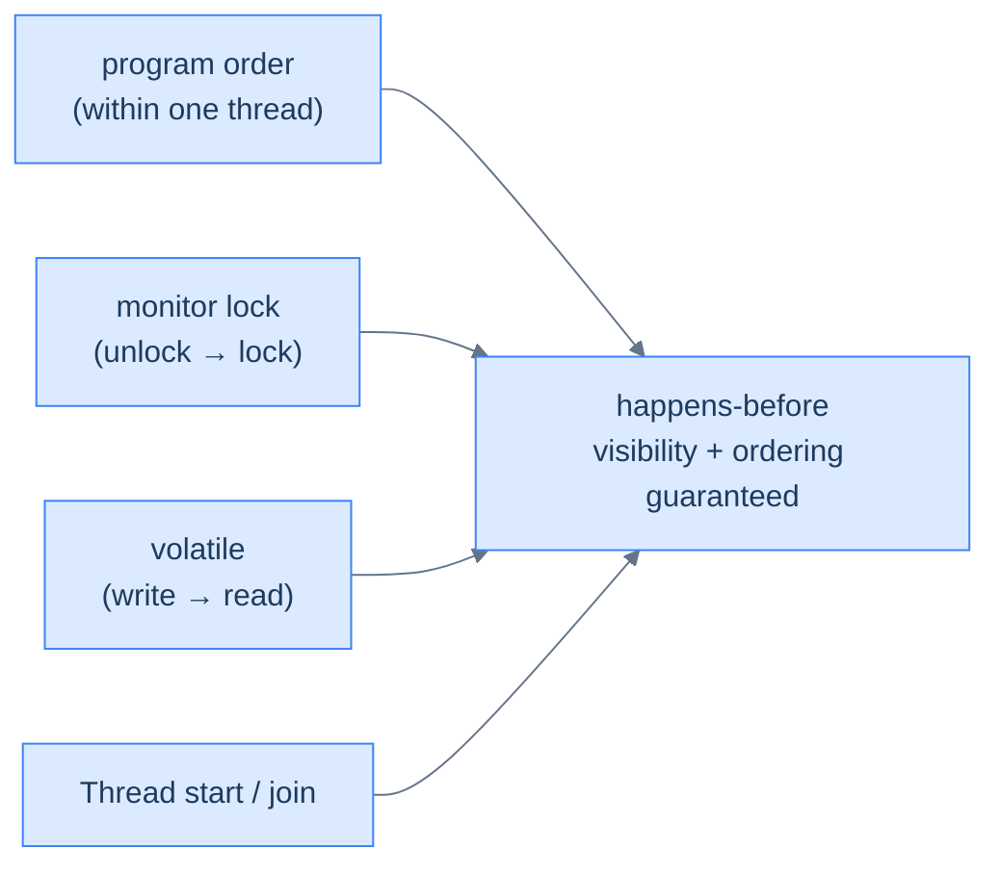

# The Java Memory Model & Performance — Visibility and Speed

Two advanced realities shape correct, fast Java.

- **The Java Memory Model** (JMM). Compilers and processors reorder and cache memory operations for speed, so a write by one thread is *not* automatically visible to another. **`volatile`** guarantees visibility, but *not* atomicity. **Happens-before** is the precise set of rules that decide when writes are seen. It is the foundation under [`synchronized`](/synapse/programming-languages/java/advanced/concurrency-the-basics) and [atomics](/synapse/programming-languages/java/advanced/concurrency-high-level-and-virtual-threads).
- **Performance.** The JVM does not run your bytecode the same way forever. It **interprets** it at first, then **JIT-compiles** hot methods to optimized native code. A **garbage collector** reclaims unused objects in short pauses. You can watch both happen with diagnostic flags.

Understanding visibility keeps concurrent code *correct*; understanding the JIT and GC keeps it *fast*.

<div style="border-left:4px solid #195045;background:rgba(25,80,69,0.08);padding:0.6rem 1rem;border-radius:0 0.5rem 0.5rem 0;margin:1.25rem 0">

💡 **The core idea.**

- **`volatile`** guarantees visibility across threads — but **not** atomicity.
- **happens-before** is the rule set that decides when one thread's writes are seen.
- For speed, the JVM **interprets then JIT-compiles** hot methods to native code.
- A **garbage collector** reclaims unused objects in short pauses.

</div>

This is the deep pass of [happens-before](/synapse/programming-languages/java/advanced/concurrency-the-basics). Every output below was produced by running the code. The JIT and GC logs are real captured runs with JVM flags the sandbox cannot pass, **labeled illustrative** because their exact lines and timings vary per run and machine.

**You'll be able to:** predict whether a thread sees a flag change with and without `volatile`, and explain why a `volatile` counter still loses updates; trace the happens-before edge that makes a plain write visible through a `volatile` flag; pick a safe way to publish an object (`final` fields, `volatile`, a lock, the holder idiom), and explain why double-checked locking needs `volatile`; read a `-XX:+PrintCompilation` line and explain why a benchmark must warm up; read a `-Xlog:gc` line, and explain why a reachable object leaks.

<div style="border-left:4px solid #15448e;background:rgba(21,68,142,0.08);padding:0.6rem 1rem;border-radius:0 0.5rem 0.5rem 0;margin:1.25rem 0">

📘 **How to read the Intuition boxes.** Each one is built in three moves:

1. **The mechanism** — what the compiler and the JVM *do*.
2. **A concrete bite** — a specific, runnable failure (often a real compiler error), shown so the trap is visible.
3. **The earned rule** — the decision heuristic, now justified rather than asserted, plus its cost.

</div>

---

## Table of contents

1. [`volatile`: visibility, not atomicity](#1-volatile-visibility-not-atomicity)
2. [happens-before, in depth](#2-happens-before-in-depth)
3. [Safe publication: reordering, `final`, and double-checked locking](#3-safe-publication-reordering-final-and-double-checked-locking)
4. [JIT compilation](#4-jit-compilation)
5. [Garbage collection and tuning](#5-garbage-collection-and-tuning)
6. [Mental-model summary](#6-mental-model-summary)
7. [Gotcha checklist](#7-gotcha-checklist)
8. [Check yourself](#-check-yourself)
9. [Sources](#-sources)

---

## 1. `volatile`: visibility, not atomicity

A field may be declared `volatile`, "in which case the Java Memory Model ensures that all threads see a consistent value for the variable" <abbr title="The Java Language Specification, Java SE 21, §8.3.1.4">[1]</abbr>. A write to it is *visible* to every later read by other threads. That fixes the "a thread never sees the flag change" bug. Here a worker spins until `main` flips a `volatile` flag, and it stops.

```java run
public class Main {
    static volatile boolean running = true;
    public static void main(String[] args) throws InterruptedException {
        Thread worker = new Thread(() -> {
            long count = 0;
            while (running) count++;
            System.out.println("worker saw running=false and stopped");
        });
        worker.start();
        Thread.sleep(100);
        running = false;
        worker.join();
        System.out.println("done");
    }
}
```

**Output:**
```
worker saw running=false and stopped
done
```

**Analysis.** The worker loops on `running`. After 100 ms `main` sets `running = false`, the worker *sees* it, exits its loop, and the program ends. The `volatile` write happens-before every later read of the field, so the worker's next read returns `false`.

Without `volatile`, the worker may read `true` forever, and the program hangs. That is not hypothetical: delete the one keyword and it *does*. If you press Run, it prints nothing and never finishes, so the sandbox stops it at its time limit.

```java
// expects-hang: without volatile, the worker may never see running = false
public class Main {
    static boolean running = true;   // volatile removed — nothing else changed
    public static void main(String[] args) throws InterruptedException {
        Thread worker = new Thread(() -> {
            long count = 0;
            while (running) count++;
            System.out.println("worker saw running=false and stopped");
        });
        worker.start();
        Thread.sleep(100);
        running = false;
        worker.join();
        System.out.println("done");
    }
}
```

**Output** *(real captured run on Java 21):*
```
(no output at all — the worker was still spinning 5 seconds after main set
 running = false; we killed the process. Neither println was ever reached.)
```

The JLS describes this exact bug, for a loop on a non-`volatile` field. The compiler "is free to read the field this.done" a single time, "and reuse the cached value in each execution of the loop" <abbr title="The Java Language Specification, Java SE 21, §17.3">[2]</abbr>.

The worker's loop becomes `if (running) while (true) count++;`. That is a legal transformation of code that never said another thread would touch the field. The write from `main` happens; the worker never looks again.

**Intuition.**
*Mechanism.* A `volatile` write happens-before every later read of that field <abbr title="The Java Language Specification, Java SE 21, §17.4.5">[3]</abbr>. So a reader after the write is guaranteed to see it, and everything written before it. The JIT may not keep the field in a register, or reorder other memory operations across it, in any way that would break that guarantee.

*Concrete bite.* `volatile` gives visibility but **not** atomicity. A `volatile` counter's `++` still races:

```java run
public class Main {
    static volatile int counter = 0;
    public static void main(String[] args) throws InterruptedException {
        Thread[] threads = new Thread[4];
        for (int i = 0; i < 4; i++) {
            threads[i] = new Thread(() -> { for (int j = 0; j < 100000; j++) counter++; });
            threads[i].start();
        }
        for (Thread t : threads) t.join();
        System.out.println(counter);
    }
}
```

**Output** *(illustrative — wrong and varying; three runs on JDK 21 printed `157875`, `137145`, `135861`):*
```
157875
```

Even though `counter` is `volatile`, `counter++` is still read-modify-write. `volatile` makes each *access* visible; it does not make the *three* steps atomic. So updates are still lost, as without `volatile`. Visibility is not atomicity: for an atomic counter you need `AtomicInteger` or a lock.

<div style="border-left:4px solid #195045;background:rgba(25,80,69,0.08);padding:0.6rem 1rem;border-radius:0 0.5rem 0.5rem 0;margin:1.25rem 0">

💡 **Earned rule.** Use `volatile` for a single flag or reference that one thread writes and others read: a stop signal, a published configuration. Use atomics or locks when you need *atomic* updates.

The cost of confusing the two is the bug above, a `volatile` counter that still races. The benefit, used correctly, is cheap visibility without a lock, for the common publish-a-value pattern.

</div>

---

## 2. happens-before, in depth

**Happens-before** is the JMM's guarantee: if action A happens-before action B, then A's writes are visible to B. Without such an edge, there is *no* guarantee: B may see an older value. A few rules establish these edges <abbr title="The Java Language Specification, Java SE 21, §17.4.5">[3]</abbr>:



**Analysis.** The four common sources of happens-before edges:

- **Program order:** "If x and y are actions of the same thread and x comes before y in program order, then hb(x, y)."
- **Monitor lock:** an unlock happens-before every later lock of the same monitor. That is why [`synchronized`](/synapse/programming-languages/java/advanced/concurrency-the-basics) publishes writes.
- **`volatile`:** a write happens-before every later read of that field (§1).
- **Start and join:** `Thread.start()` happens-before the started thread's actions, and a thread's actions happen-before another thread returns from `join()` on it.

Each is a bridge across which writes are guaranteed visible.

**Intuition.**
*Mechanism.* Happens-before is *transitive*: "If hb(x, y) and hb(y, z), then hb(x, z)" <abbr title="The Java Language Specification, Java SE 21, §17.4.5">[3]</abbr>. So a writer can set several plain fields and then write one `volatile` flag. A reader that sees the flag also sees those fields:

1. Program order: `data = 42` happens-before `ready = true` in the writer.
2. `volatile`: the write `ready = true` happens-before the reader's read that sees `true`.
3. Program order: that read happens-before the reader's read of `data`.

Chain the three, and `data = 42` happens-before the reader's read of `data`:

```java run
public class Main {
    static int data;                     // a plain field
    static String label;                 // another plain field
    static volatile boolean ready;       // the one volatile flag

    public static void main(String[] args) throws InterruptedException {
        Thread reader = new Thread(() -> {
            while (!ready) Thread.onSpinWait();
            System.out.println("reader sees data=" + data + " label=" + label);
        });
        reader.start();
        data = 42;
        label = "answer";
        ready = true;                    // publishes both plain writes above
        reader.join();
    }
}
```

**Output:**
```
reader sees data=42 label=answer
```

This output is guaranteed, not lucky. The flag's edge carries the earlier writes with it. That is the "safe publication" idiom §3 develops.

*Concrete bite.* The relation is the *only* guarantee. Two threads with no edge between them can see each other's writes in any order, or not at all. "It seemed to work" means nothing; correctness needs an actual happens-before edge. That is why every access to shared state needs `synchronized`, `volatile`, or a `java.util.concurrent` tool.

<div style="border-left:4px solid #195045;background:rgba(25,80,69,0.08);padding:0.6rem 1rem;border-radius:0 0.5rem 0.5rem 0;margin:1.25rem 0">

💡 **Earned rule.** Reason about concurrent correctness in happens-before edges, not in timing. For every shared read, name the write it must see, and the edge that guarantees it.

The cost is a more formal mental model. The benefit is the only sound way to know concurrent code is correct. It also explains *why* the synchronization tools work, instead of treating them as magic.

</div>

---

## 3. Safe publication: reordering, `final`, and double-checked locking

§2's rules have a surprising consequence: **a constructor is not a fence.** Consider one thread building an object and handing it to another through a plain field:

```text
// Thread A                          // Thread B
config = new Config("prod", 42);     if (config != null) {
                                         use(config.name);   // can see null!
                                     }
```

Inside `new Config(...)` there are several writes: the fields, then the reference `config` itself.

- Within Thread A, program order makes that sequence look fixed. But program order is an edge *inside one thread only*.
- Thread B reads `config` through a plain field, so there is **no happens-before edge at all** between A's writes and B's reads.
- So the JMM permits B to see the reference *before* the field writes. B can observe a non-null `config` whose `name` is still `null`: a half-built object.

This one is told, not shown. The reorder is allowed, but it depends on the JIT and the processor catching the window, so no demo captures it reliably. That is precisely what makes it dangerous. The fixes below run.

Publishing an object so that its fields travel with the reference is called **safe publication**. There are three tools, plus one the class loader gives you:

1. **`final` fields.** The JLS guarantees them. A thread that sees the reference only after the object "has been completely initialized is guaranteed to see the correctly initialized values for that object's final fields" <abbr title="The Java Language Specification, Java SE 21, §17.5">[4]</abbr>. The object counts as initialized "when its constructor finishes". So the constructor must not let `this` escape to another thread before it ends.
2. **A `volatile` reference.** The `volatile` write of the reference happens-before the `volatile` read. By §2's transitivity, it carries every earlier write, the fields included.
3. **A lock.** Publish and consume under the same monitor; the unlock→lock edge carries the writes.

This is the deepest reason [records](/synapse/programming-languages/java/core-libraries/enums-and-records) are safe to hand between threads. A record's component fields are "private, final, and non-static" <abbr title="The Java Language Specification, Java SE 21, §8.10.3">[5]</abbr>. The guarantee also covers objects reached through those `final` fields, as they were when the constructor finished <abbr title="The Java Language Specification, Java SE 21, §17.5">[4]</abbr>. It does not cover changes made *after* construction: a record holding a mutable `ArrayList` is only shallowly immutable.

The classic place these tools collide is the **lazily initialized singleton**. The infamous *double-checked locking* pattern (check, lock, check again, construct) is broken when written with a plain field: the unlocked first check can observe the half-built object. With `volatile`, the pattern is correct, and here it is running:

```java run
public class Main {
    static class Config {
        final String value;
        Config() {
            value = "loaded";
            System.out.println("Config constructed once, by " + Thread.currentThread().getName());
        }
    }

    private static volatile Config instance;

    static Config getInstance() {
        Config local = instance;              // one volatile read
        if (local == null) {                  // fast path: already published
            synchronized (Main.class) {
                local = instance;
                if (local == null) {          // re-check under the lock
                    local = new Config();
                    instance = local;         // volatile write publishes safely
                }
            }
        }
        return local;
    }

    public static void main(String[] args) throws InterruptedException {
        Thread[] threads = new Thread[4];
        for (int i = 0; i < 4; i++) {
            threads[i] = new Thread(() -> System.out.println(
                Thread.currentThread().getName() + " got " + getInstance().value));
            threads[i].start();
        }
        for (Thread t : threads) t.join();
    }
}
```

**Output** *(illustrative — thread order varies; the "constructed once" line appears exactly once, every run):*
```
Config constructed once, by Thread-0
Thread-2 got loaded
Thread-0 got loaded
Thread-3 got loaded
Thread-1 got loaded
```

**Analysis.** Four threads raced into `getInstance()`, and exactly one constructed the `Config`. The lock plus the *second* check guarantee that. The `volatile` write published it, so the other threads' *unlocked* fast-path reads still saw a fully built object. Remove `volatile`, and the fast path becomes the unsafe publication above: rare, timing-dependent, catastrophic.

**The holder idiom** gets the same laziness and safety from the class loader, with no `volatile` and no lock. A class is initialized "immediately before" its first use, such as the first read of one of its `static` fields <abbr title="The Java Language Specification, Java SE 21, §12.4.1">[6]</abbr>. The JVM synchronizes that initialization, so exactly one thread runs it <abbr title="The Java Language Specification, Java SE 21, §12.4.2">[7]</abbr>:

```java run
public class Main {
    static class Config {
        final String value = "loaded";
        Config() { System.out.println("Config constructed"); }
    }

    private static class Holder {
        static final Config INSTANCE = new Config();
    }

    static Config getInstance() {
        return Holder.INSTANCE;
    }

    public static void main(String[] args) throws InterruptedException {
        System.out.println("main started; nothing constructed yet");
        Thread[] threads = new Thread[4];
        for (int i = 0; i < 4; i++) {
            threads[i] = new Thread(() -> getInstance());
            threads[i].start();
        }
        for (Thread t : threads) t.join();
        System.out.println("all four got " + getInstance().value);
    }
}
```

**Output:**
```
main started; nothing constructed yet
Config constructed
all four got loaded
```

`Holder` was not initialized when `Main` started, so nothing was constructed. The first `getInstance()` triggered it, once, however many threads raced there.

**Intuition.**
*Mechanism.* The JIT and processor may make the reference write visible before the field writes, unless something forbids it. `final` fields add a guarantee at constructor exit; `volatile` adds a write→read edge; a monitor adds unlock→lock; class initialization adds its own lock. All are §2's rules aimed at one moment: the instant an object becomes reachable by another thread.

*Concrete bite.* The bug's signature is its rarity. Unsafe publication can run clean for months on one JVM and processor, then produce impossible-looking `NullPointerException`s on another, with a different memory model or different JIT decisions. Testing on your machine cannot catch it; only reasoning about edges can.

<div style="border-left:4px solid #195045;background:rgba(25,80,69,0.08);padding:0.6rem 1rem;border-radius:0 0.5rem 0.5rem 0;margin:1.25rem 0">

💡 **Earned rule.** Publish objects through `final` fields, a `volatile` reference, a lock, class initialization, or a concurrent collection. Never publish through a plain field that another thread reads without a lock. Prefer immutable (`final`-field) objects, and the holder idiom over hand-rolled double-checked locking.

The cost is one more thing to check whenever a reference leaves a constructor or crosses threads. The benefit: no thread, anywhere, can observe your object half-built.

</div>

---

## 4. JIT compilation

The JVM runs bytecode by **interpreting** it at first. Methods that run often ("hot") are then **JIT-compiled**: compiled into optimized native code while the program runs. By default the JVM uses a "Tiered compiler, using both C1 and C2" <abbr title="HotSpot Virtual Machine Garbage Collection Tuning Guide, Release 21, &quot;Ergonomics&quot;">[8]</abbr>: C1 compiles quickly, and C2 optimizes fully. This program makes `fib` hot:

```java run
public class Main {
    static int fib(int n) {
        return n < 2 ? n : fib(n - 1) + fib(n - 2);
    }

    public static void main(String[] args) {
        System.out.println("fib(30) = " + fib(30));
    }
}
```

**Output:**
```
fib(30) = 832040
```

The flag `-XX:+PrintCompilation` prints "a message to the console every time a method is compiled" <abbr title="The java command, JDK 21 documentation, -XX:+PrintCompilation">[9]</abbr>. The sandbox cannot pass JVM flags, so this is a terminal run, filtered to the lines about `Main`:

```
$ java -XX:+PrintCompilation Main | grep -E "Main::|fib\(30\)"
18    5       3       Main::fib (23 bytes)
18    6       4       Main::fib (23 bytes)
18    5       3       Main::fib (23 bytes)   made not entrant
fib(30) = 832040
```

**Output** *(illustrative — real captured run on JDK 21; the timestamps and ids vary every run):*
```
18    5       3       Main::fib (23 bytes)
18    6       4       Main::fib (23 bytes)
18    5       3       Main::fib (23 bytes)   made not entrant
```

**Analysis.** Each line is a compilation event: a timestamp in milliseconds, a compile id, a **tier**, and the method with its bytecode size.

- In HotSpot's source, tier 3 is "C1, invocation & backedge counters + mdo" (C1 with full profiling), and tier 4 is C2 <abbr title="OpenJDK 21 source, src/hotspot/share/compiler/compilerDefinitions.hpp, enum CompLevel">[10]</abbr>.
- `fib` was compiled at tier 3 first. Once it proved *very* hot, it was recompiled at tier 4.
- The tier-3 version was then "made not entrant": retired in favour of the faster one.

This is why Java *warms up*. The same code runs faster after the JIT has compiled and optimized its hot paths.

**Intuition.**
*Mechanism.* While interpreting, the JVM counts calls and records branch behaviour. It then compiles hot methods, with inlining, loop optimizations and speculative optimizations based on that profile. If an assumption later fails, it *deoptimizes*: back to the interpreter, then a recompile.

*Concrete bite.* This makes naive timing lie. The first calls to a method run interpreted and slow; later calls run optimized and fast. Timing a method once measures interpretation, not steady-state performance. So you warm up (run it many times) before measuring, and a real benchmark uses a harness such as JMH <abbr title="OpenJDK Code Tools: JMH, the Java Microbenchmark Harness">[11]</abbr>.

<div style="border-left:4px solid #195045;background:rgba(25,80,69,0.08);padding:0.6rem 1rem;border-radius:0 0.5rem 0.5rem 0;margin:1.25rem 0">

💡 **Earned rule.** Trust the JIT to optimize hot code, and warm up before measuring performance. Do not hand-optimize cold paths the JIT will never compile, or micro-optimize from un-warmed timings.

The cost is that performance is dynamic, and hard to predict from source alone. The benefit is that idiomatic, readable code usually runs fast once hot: the JIT rewards clarity over premature cleverness.

</div>

---

## 5. Garbage collection and tuning

Java manages memory automatically. A **garbage collector** reclaims objects that are no longer **reachable**, so you never `free` memory. "A reachable object is any object that can be accessed in any potential continuing computation from any live thread" <abbr title="The Java Language Specification, Java SE 21, §12.6.1">[13]</abbr>. The [object-model lesson](/synapse/programming-languages/java/classes-and-objects/references-equality-and-the-object-model) shows when an object becomes unreachable.

Modern collectors are **generational**. They rely on "the weak generational hypothesis, which states that most objects survive for only a short period of time" <abbr title="HotSpot Virtual Machine Garbage Collection Tuning Guide, Release 21, &quot;Garbage Collector Implementation&quot;">[12]</abbr>. So the GC scans a small "young" region often and cheaply. This program allocates 2000 MB of short-lived 1 MB arrays:

```java run
public class Main {
    public static void main(String[] args) {
        long total = 0;
        for (int i = 0; i < 2000; i++) {
            byte[] garbage = new byte[1024 * 1024];   // 1 MB, unreachable after this iteration
            total += garbage.length;
        }
        System.out.println("allocated " + total / (1024 * 1024) + " MB of garbage");
    }
}
```

**Output:**
```
allocated 2000 MB of garbage
```

Watch the collector with `-Xlog:gc`, again a terminal run:

```
$ java -Xlog:gc Main
[0.005s][info][gc] Using G1
[0.020s][info][gc] GC(0) Pause Young (Normal) (G1 Evacuation Pause) 24M->1M(516M) 0.677ms
[0.036s][info][gc] GC(1) Pause Young (Normal) (G1 Evacuation Pause) 300M->1M(516M) 0.530ms
[0.040s][info][gc] GC(2) Pause Young (Normal) (G1 Evacuation Pause) 300M->1M(516M) 0.455ms
...
allocated 2000 MB of garbage
```

**Output** *(illustrative excerpt — real captured run on JDK 21, a 10-core machine; counts, sizes and pause times vary per run):*
```
[0.036s][info][gc] GC(1) Pause Young (Normal) (G1 Evacuation Pause) 300M->1M(516M) 0.530ms
```

**Analysis.** The program allocated 2000 MB, but each array was garbage at once, so the GC reclaimed them in many tiny pauses. Read one line:

- **G1** ran a **Young** collection.
- It shrank the heap's used space from `300M` to `1M`: almost all of it was garbage.
- The heap was `516M` in total, and the pause took **0.530 ms**.

The heap never grew toward 2 GB, because the collector kept recycling the same space.

G1 is the default only "on server-class machines, Serial Collector otherwise". A machine is server-class when the JVM "detects two or more processors and physical memory larger than or equal to 1792 MB" <abbr title="HotSpot Virtual Machine Garbage Collection Tuning Guide, Release 21, &quot;Ergonomics&quot;">[8]</abbr>. Tell the same JVM it has one processor, and it picks Serial:

```
$ java -Xlog:gc -XX:ActiveProcessorCount=1 Main
[0.004s][info][gc] Using Serial
[0.027s][info][gc] GC(0) Pause Young (Allocation Failure) 136M->1M(494M) 0.572ms
```

**Intuition.**
*Mechanism.* The heap is split into generations. New objects go in the young generation, which fills and is collected quickly; survivors are promoted to the old generation. Most objects die young, so young collections touch little live data and are fast. `-Xmx` and `-Xms` size the heap; flags such as `-XX:+UseZGC` select another collector, tuned for low pause times.

*Concrete bite.* Automatic GC does not mean "no memory bugs". A **memory leak** in Java is unintended *reachability*. Objects you forgot to remove from a `static` collection or cache stay reachable, so the GC cannot reclaim them, and the heap grows until `OutOfMemoryError`. This program needs a small heap, `-Xmx64m`, to fail quickly, so it is a terminal run:

```java run
// requires: the JVM flag -Xmx64m, so the leak fills a small heap in a moment
import java.util.ArrayList;
import java.util.List;

public class Main {
    static final List<byte[]> cache = new ArrayList<>();   // lives as long as the class

    public static void main(String[] args) {
        try {
            while (true) cache.add(new byte[64 * 1024]);     // every array stays reachable
        } catch (OutOfMemoryError e) {
            int mb = cache.size() / 16;
            cache.clear();                                   // drop the references: now it is garbage
            System.out.println("OutOfMemoryError: " + e.getMessage() + ", after caching about " + mb + " MB");
        }
    }
}
```

**Output** *(real captured run on JDK 21, `java -Xmx64m Main`; three runs printed the same line):*
```
OutOfMemoryError: Java heap space, after caching about 58 MB
```

Compare it with the §5 garbage program: that one allocated 2000 MB and never ran out, because nothing kept its arrays. This one kept every array in `cache`, and ran out after about 58 MB of a 64 MB heap. The GC frees the *unreachable*; a live reference defeats it.

<div style="border-left:4px solid #195045;background:rgba(25,80,69,0.08);padding:0.6rem 1rem;border-radius:0 0.5rem 0.5rem 0;margin:1.25rem 0">

💡 **Earned rule.** Let the GC manage memory, and tune only when profiling shows a problem. Size the heap (`-Xmx`), and pick a collector for your latency and throughput goals. Use the JDK's profiling tools (JDK Flight Recorder, `jcmd`) to find real allocation and pause hot spots.

The cost of premature GC tuning is wasted effort on a system that is usually fine by default. The benefit of knowing the model: when a leak or a pause problem *does* appear, you can read the logs and fix the cause.

</div>

---

## 6. Mental-model summary

| Principle | Consequence |
|---|---|
| `volatile` guarantees visibility, not atomicity | A `volatile` flag is seen across threads; a `volatile` counter's `++` still races |
| Without an edge, the JIT may read a field once and reuse it | A loop on a plain flag can spin forever (JLS §17.3) |
| happens-before edges (program order, lock, volatile, start/join) decide visibility | No edge → no guarantee; the relation is transitive, so one `volatile` flag publishes earlier plain writes |
| A constructor is not a fence — plain-field publication can expose a half-built object | Publish via `final` fields, a `volatile` reference, a lock, or class initialization |
| Double-checked locking is broken without `volatile` | The unlocked fast path needs the volatile edge; the holder idiom is simpler still |
| The JVM interprets, then JIT-compiles hot methods (tiers 3 and 4) | Code warms up — measure steady state, not the first cold calls |
| A generational GC reclaims young garbage in short pauses | Most objects die young; G1 on server-class machines, Serial otherwise |
| GC frees the unreachable; reachable objects leak | A forgotten reference in a `static` collection grows the heap to `OutOfMemoryError` |

## 7. Gotcha checklist

<div style="border-left:4px solid #da5233;background:rgba(218,82,51,0.08);padding:0.6rem 1rem;border-radius:0 0.5rem 0.5rem 0;margin:1.25rem 0">

| Symptom | Likely cause | Fix |
|---|---|---|
| A thread never sees a flag change (spins forever) | the field is not `volatile`, and no lock guards it | make it `volatile` |
| A `volatile` counter is still wrong | `volatile` is not atomic | `AtomicInteger`, or `synchronized` around `++` |
| Concurrent code "works", but you can't say why | there is no happens-before edge | add `synchronized`, `volatile` or a `java.util.concurrent` tool, and name the edge |
| An impossible-looking `NullPointerException` on a freshly constructed object | unsafe publication through a plain field | `final` fields, a `volatile` reference, or publish under a lock |
| A hand-rolled lazy singleton misbehaves under load | double-checked locking without `volatile` | add `volatile`, or use the holder idiom |
| A micro-benchmark shows wildly different times | the JIT had not warmed up | warm up, or use JMH |
| A GC log says `Using Serial` where you expected G1 | the JVM saw fewer than 2 processors or less than 1792 MB of memory | select a collector explicitly, e.g. `-XX:+UseG1GC` |
| The heap grows until `OutOfMemoryError: Java heap space` | a leak by reachability: a `static` cache you never clear | drop the references, or bound the cache |

</div>

---

## ✅ Check yourself

One check per objective. Answer before you open anything.

```quiz
{"prompt": "static boolean running = true; a worker loops while (running) count++; main sets running = false after 100 ms. With no volatile and no lock, what can happen?", "options": ["The worker always stops within 100 ms", "The worker may never stop: the JIT may read running once and reuse the value", "It does not compile"], "answer": "The worker may never stop: the JIT may read running once and reuse the value"}
```

```quiz
{"prompt": "A writer sets the plain field data = 42, then the volatile field ready = true. A reader reads ready as true, then reads data. What must it see?", "options": ["0 or 42: data is not volatile", "42: the volatile edge and program order chain together", "Only 0, because data was never published"], "answer": "42: the volatile edge and program order chain together"}
```

```quiz
{"prompt": "Double-checked locking with a plain (non-volatile) instance field. What can a thread on the unlocked fast path see?", "options": ["Always null or a complete object", "A non-null reference to an object whose fields are not yet visible", "A ClassCastException"], "answer": "A non-null reference to an object whose fields are not yet visible"}
```

```quiz
{"prompt": "In a -XX:+PrintCompilation log, a method appears at tier 3, then at tier 4, then the tier-3 line says made not entrant. What happened?", "options": ["It was compiled by C1 with profiling, recompiled by C2, and the C1 version was retired", "It failed to compile twice", "It was interpreted, then removed from the class"], "answer": "It was compiled by C1 with profiling, recompiled by C2, and the C1 version was retired"}
```

```quiz
{"prompt": "A program adds every request object to a static List and never removes them. Under load, what happens eventually?", "options": ["The GC frees the old requests, because they are no longer used", "OutOfMemoryError: Java heap space — the list keeps them reachable", "The JIT removes the list"], "answer": "OutOfMemoryError: Java heap space — the list keeps them reachable"}
```

<details>
<summary>The 🧪 box below: a <code>volatile</code> counter; plain fields and a <code>volatile</code> <code>ready</code>; records; 10 calls vs 10 million.</summary>

1. No. `volatile` makes each read and write visible, but `counter++` is still three steps. The §1 runs printed `157875`, `137145` and `135861`, not `400000`.
2. Program order puts each plain write before `ready = true` in the writer. The `volatile` write happens-before the read that sees `true`. Program order puts that read before the reader's field reads. Transitivity chains the three, as the §2 fence shows.
3. A `record` uses **`final` fields**: its component fields are `private final`. Once the constructor finishes, any thread that sees the reference sees the component values, with no synchronization. Mutable objects inside it are covered only as they were at construction.
4. In a run on JDK 21, a method called 10 times never appeared: it never got hot, so it stayed interpreted. A method called 10 million times appeared at tier 3, then tier 4. A benchmark that does not warm up measures the interpreter and C1, not the C2 code that runs in production.

</details>

---

## 📚 Sources

1. *The Java Language Specification, Java SE 21*, §8.3.1.4 "`volatile` Fields" — <https://docs.oracle.com/javase/specs/jls/se21/html/jls-8.html#jls-8.3.1.4>
2. *The Java Language Specification, Java SE 21*, §17.3 "Sleep and Yield" (the `this.done` loop the compiler may read once) — <https://docs.oracle.com/javase/specs/jls/se21/html/jls-17.html#jls-17.3>
3. *The Java Language Specification, Java SE 21*, §17.4.5 "Happens-before Order" — <https://docs.oracle.com/javase/specs/jls/se21/html/jls-17.html#jls-17.4.5>
4. *The Java Language Specification, Java SE 21*, §17.5 "`final` Field Semantics" — <https://docs.oracle.com/javase/specs/jls/se21/html/jls-17.html#jls-17.5>
5. *The Java Language Specification, Java SE 21*, §8.10.3 "Record Members" ("A component field is private, final, and non-static") — <https://docs.oracle.com/javase/specs/jls/se21/html/jls-8.html#jls-8.10.3>
6. *The Java Language Specification, Java SE 21*, §12.4.1 "When Initialization Occurs" — <https://docs.oracle.com/javase/specs/jls/se21/html/jls-12.html#jls-12.4.1>
7. *The Java Language Specification, Java SE 21*, §12.4.2 "Detailed Initialization Procedure" — <https://docs.oracle.com/javase/specs/jls/se21/html/jls-12.html#jls-12.4.2>
8. *HotSpot Virtual Machine Garbage Collection Tuning Guide*, Release 21, "Ergonomics" (G1 on server-class machines, Serial otherwise; "Tiered compiler, using both C1 and C2") — <https://docs.oracle.com/en/java/javase/21/gctuning/ergonomics1.html>
9. The `java` command, JDK 21 documentation (`-XX:+PrintCompilation`, `-Xlog`) — <https://docs.oracle.com/en/java/javase/21/docs/specs/man/java.html>
10. OpenJDK 21 source, `src/hotspot/share/compiler/compilerDefinitions.hpp` (`enum CompLevel`) — <https://github.com/openjdk/jdk21u/blob/master/src/hotspot/share/compiler/compilerDefinitions.hpp>
11. OpenJDK Code Tools, JMH (Java Microbenchmark Harness) — <https://github.com/openjdk/jmh>
12. *HotSpot Virtual Machine Garbage Collection Tuning Guide*, Release 21, "Garbage Collector Implementation" (the weak generational hypothesis) — <https://docs.oracle.com/en/java/javase/21/gctuning/garbage-collector-implementation1.html>
13. *The Java Language Specification, Java SE 21*, §12.6.1 "Implementing Finalization" (the definition of a reachable object) — <https://docs.oracle.com/javase/specs/jls/se21/html/jls-12.html#jls-12.6.1>

---

<div style="border-left:4px solid #6d28d9;background:rgba(109,40,217,0.08);padding:0.6rem 1rem;border-radius:0 0.5rem 0.5rem 0;margin:1.25rem 0">

🧪 **Predict, then check.**

1. Predict whether making a shared `int counter` `volatile` is enough for four threads to increment it to exactly the right total, and why.
2. Explain in terms of happens-before why writing several plain fields and then setting a `volatile` `ready = true` lets a reader that sees `ready == true` also see those fields.
3. Predict which of §3's publication tools a `record` uses, and why that makes records safe to hand between threads with no synchronization at all.
4. Predict what `-XX:+PrintCompilation` shows about a method called 10 times versus 10 million times, and why a benchmark must warm up.

</div>

## Your Turn

Before you move on, check your understanding with the coach — explain the idea, apply it, weigh the trade-offs, then defend your reasoning.

<div class="concept-coach"></div>
